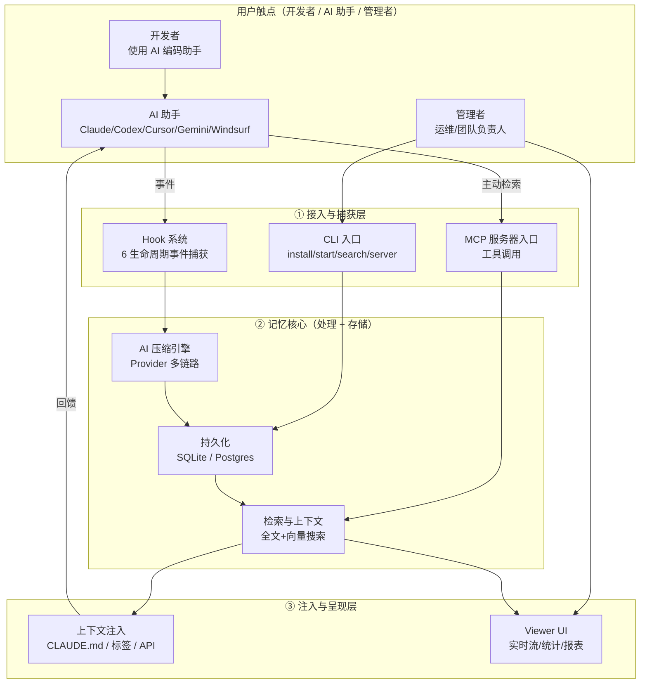
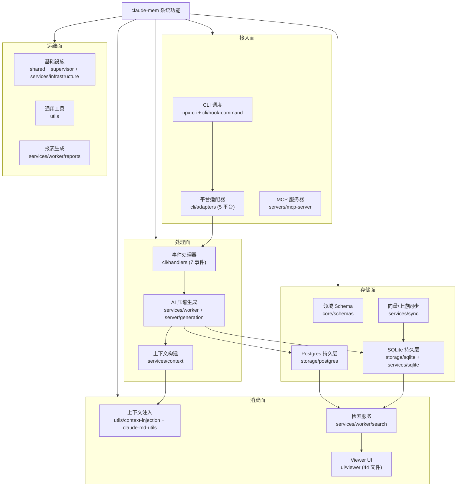
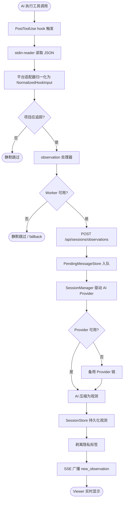
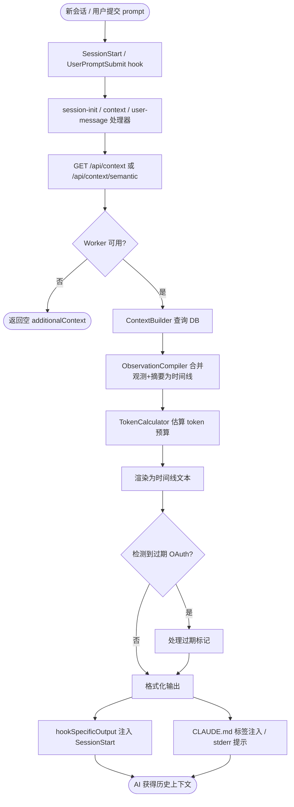
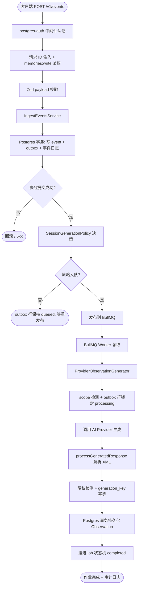
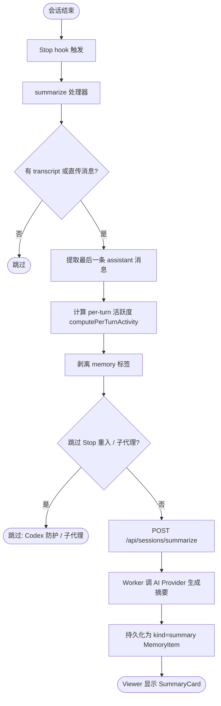
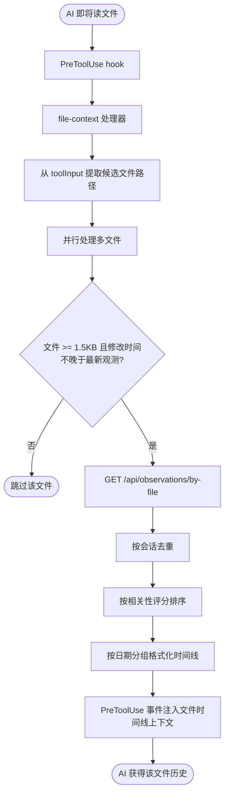
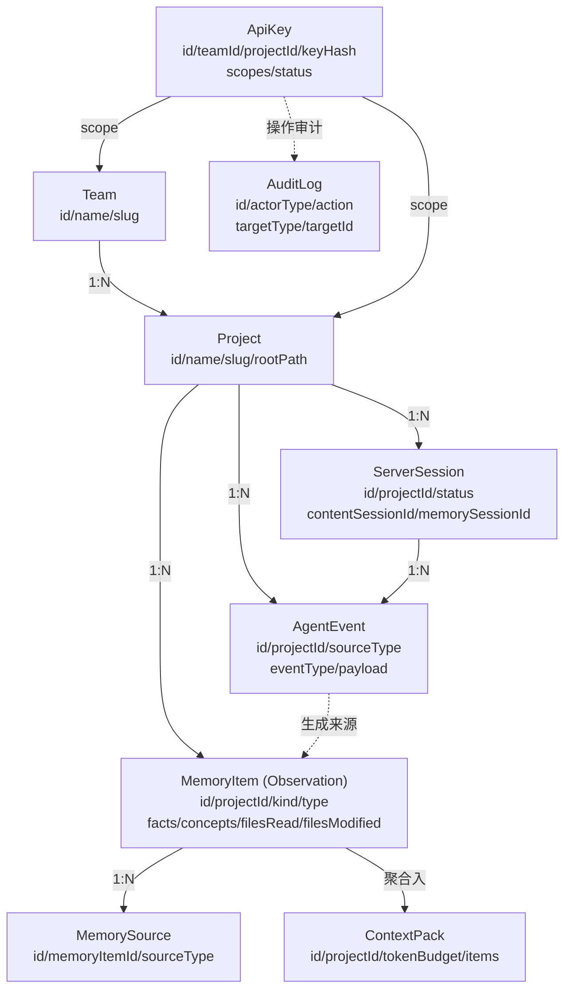

# A-系统需求文档

> 本文档由 code-to-doc 技能基于文件级逆向分析汇总生成（v2 重生成）。
> 生成日期：2026-07-24 ｜ 素材：360 份文件级需求文档 + 12 份模块汇总 ｜ 项目：claude-mem
> 图方案：Mermaid 内嵌。本版与 v1 同源（均提炼自 doc/* 下文件级文档与模块汇总），仅重构组织顺序与表达，事实可经模块汇总下钻到文件级文档与代码 `路径:行号`。

---

## 1. 引言

claude-mem 是一个为 AI 编程助手提供跨会话持久记忆的 Claude Code 插件。它通过 6 个生命周期 Hook 捕获工具调用与用户行为，用 Claude Agent SDK（及 Gemini/OpenRouter/Qwen 等 Provider）将原始事件压缩为"观测（Observation）"，并在未来的会话中把相关上下文注入回去，从而让 AI 助手"记住"过往工作。系统同时提供本地 Worker（单机单用户，SQLite）与 Server Beta（多租户云端，Postgres + BullMQ）两种运行时，以及一个浏览器端 Viewer UI 与一个 MCP 服务器入口。本文档从需求视角描述系统应当具备的功能、业务流程、接口与约束。

### 1.1 编写目的与读者

本文档面向 claude-mem 的维护者、二次开发者与架构评审人员，描述系统"做什么"。每个功能需求带模块汇总来源标注，可经模块汇总继续下钻到文件级文档与代码行号。配套文档为 `B-系统设计文档-v2.md`（描述"怎么实现"）。

### 1.2 项目背景

- claude-mem 以 Claude Code 插件形式分发，同时通过 `npx claude-mem` 提供 CLI 安装/运维入口。
- 系统支持多平台 AI 编码助手的事件接入：Claude Code、Codex、Cursor、Gemini CLI、Windsurf（cli 模块适配器层逐一映射）。
- 系统设计了开源核心 + Pro 功能的分离架构：本地 Worker 的全部 HTTP API 端点保持开放，Pro 功能（增强 UI 等）通过外接同一组端点扩展而非替换（依据 `CLAUDE.md` 项目说明，非代码证实）。

### 1.3 术语与缩略语

| 术语 | 含义 |
|------|------|
| Observation（观测） | AI 压缩或用户手动创建的记忆单元，记忆系统的核心数据模型 |
| Worker | 本地单用户运行时的 HTTP 服务进程（Express，默认端口 `37700 + uid%100`） |
| Server Beta | 多租户云端运行时（Postgres + BullMQ + Redis） |
| Hook | Claude Code 等平台的生命周期事件（SessionStart/PreToolUse/PostToolUse/Stop 等） |
| Provider | AI 生成 Provider（Claude/Gemini/OpenRouter/Qwen） |
| ContextPack | 携带 token 预算的上下文注入包，MemoryItem 的上层容器 |
| MCP | Model Context Protocol，claude-mem 既作为 MCP 服务器对外暴露工具 |
| SSE | Server-Sent Events，Viewer UI 的实时数据推送通道 |
| Outbox Pattern | Server Beta 中"先写 Postgres 再发 BullMQ"的最终一致性模式 |

### 1.4 参考资料

- 文件级文档镜像树：`doc/src/<源文件相对路径>.md`（360 份）
- 模块汇总：`doc/src/<模块>/_模块汇总.md`（12 份，本文档的直接素材）
- 配套设计文档：`doc/B-系统设计文档-v2.md`
- 旧版本：`doc/A-系统需求文档.md`（v1，本版另存为 v2 并保留）

> 素材来源：本章总述基于全部 12 份模块汇总的"模块职责总述"综合；术语表汇总自 [core/_模块汇总.md](src/core/_模块汇总.md)（实体定义）、[services/_模块汇总.md](src/services/_模块汇总.md)（Worker/Provider/端口）、[server/_模块汇总.md](src/server/_模块汇总.md)（Server Beta/Outbox/BullMQ）、[servers/_模块汇总.md](src/servers/_模块汇总.md)（MCP）、[ui/viewer/_模块汇总.md](src/ui/viewer/_模块汇总.md)（SSE/Viewer）。

---

## 2. 系统总体描述

### 2.1 产品定位

claude-mem 面向使用 AI 编程助手的开发者与团队，解决"AI 助手缺乏跨会话记忆"的问题。它做三件事：① 在 AI 编码过程中**捕获**工具调用、用户提示、文件编辑等事件；② 用 AI **压缩**这些事件为结构化观测（事实/叙述/概念/涉及文件），并持久化；③ 在后续会话中按项目/文件/语义**注入**相关上下文，让 AI 基于过往工作继续。产品同时提供可视化 Viewer（实时流、统计、报表）与 MCP 工具集，供人或 AI 主动检索记忆。

### 2.2 产品架构图

下图从用户视角展示 claude-mem 的产品能力分块与面向角色。系统对终端用户（开发者）以"无感记忆"形态工作（Hook 自动捕获与注入），对运维/管理者以 Viewer UI 与 CLI 形态工作，对 AI 自身以 MCP 工具形态工作。

该图表达了三条主链路：捕获链（AI→Hook→压缩→存储）、注入链（存储→检索→注入→回馈 AI）、管理链（CLI/Viewer→存储与呈现）。Server Beta 是记忆核心在多租户场景下的平行实现（与本地 Worker 同构不同引擎）。

### 2.3 用户与角色

系统采用单机单用户模型为基线（本地 Worker 模式下，Worker 进程用户即为数据产生者，见 [shared/_模块汇总.md](src/shared/_模块汇总.md) os-user 备注）。在 Server Beta 模式下引入多租户角色体系（见 [core/_模块汇总.md](src/core/_模块汇总.md) Team/TeamMember 与 [server/_模块汇总.md](src/server/_模块汇总.md) 认证）：

| 角色 | 来源证据 | 能力 |
|------|---------|------|
| owner | `core/schemas/team.ts` TeamRole 枚举 | 团队所有者（最高权限） |
| admin | 同上 | 团队管理员 |
| member | 同上 | 团队成员 |
| viewer | 同上 | 只读成员 |
| user / api_key / system | `core/schemas/auth.ts` AuditActorType 枚举 | 审计日志的操作者类型 |

Viewer UI 在 server 模式下有管理员认证门控（admin token，见 [ui/viewer/_模块汇总.md](src/ui/viewer/_模块汇总.md) useAuth/LoginPage），client/standalone 模式无认证。

### 2.4 运行环境

| 维度 | 本地 Worker 模式 | Server Beta 模式 | 证据 |
|------|-----------------|-----------------|------|
| 运行时 | Bun（自动安装） | Node.js / Bun | [shared/_模块汇总.md](src/shared/_模块汇总.md) worker-utils |
| 数据库 | SQLite（`bun:sqlite`，`~/.claude-mem/claude-mem.db`） | PostgreSQL（`pg` Pool） | [storage/_模块汇总.md](src/storage/_模块汇总.md) |
| 队列/消息 | 进程内 PendingMessageStore（SQLite 表） | BullMQ + Redis/Valkey | [services/_模块汇总.md](src/services/_模块汇总.md)、[server/_模块汇总.md](src/server/_模块汇总.md) |
| 向量检索 | ChromaDB（MCP 连接） | （Server 侧用 Postgres tsvector + GIN） | [services/_模块汇总.md](src/services/_模块汇总.md) sync/ChromaSync |
| HTTP | Express，默认 `127.0.0.1:37700+uid%100` | Express，默认 `127.0.0.1:37877+uid%100` | 同上 |
| OAuth/凭证 | macOS Keychain / Win Credential Manager / Linux libsecret | API Key（`cmem_` 前缀，SHA-256 哈希） | [shared/_模块汇总.md](src/shared/_模块汇总.md) oauth-token、[server/_模块汇总.md](src/server/_模块汇总.md) api-key-service |
| 依赖管理 | Node.js + npm | 同左 + Postgres + Redis | 项目 `package.json`（散件） |

### 2.5 设计与实现约束

- **多引擎数据层**：SQLite（本地）与 Postgres（Server Beta）在领域概念对齐但实现各异，租户隔离、状态机、全文搜索方案各不相同（[storage/_模块汇总.md](src/storage/_模块汇总.md) §5.2 存储差异对照）。
- **Server Beta 与本地 Worker 架构解耦**：Server Beta 的 generation/middleware/services 子模块明确声明不得从 `src/services/worker/*` 导入（Phase 隔离约束，见 [server/_模块汇总.md](src/server/_模块汇总.md) §6.1）。
- **物理外键**：SQLite Schema 大量使用物理外键（CASCADE/SET NULL），与"禁用物理外键"的通用规范存在冲突；Postgres 版仅在 projects→teams 使用物理外键，多数靠应用层断言（[storage/_模块汇总.md](src/storage/_模块汇总.md) §6.2，以代码为准）。
- **退出码策略**：Hook/Worker 错误以 exit 0 退出以防 Windows Terminal 标签页堆积，阻断错误用 exit 2（见 [shared/_模块汇总.md](src/shared/_模块汇总.md) hook-constants `HOOK_EXIT_CODES`）。
- **隐私标签**：`<private>` 标签内容在 hook 层剥离，不入库（[utils/_模块汇总.md](src/utils/_模块汇总.md) tag-stripping）。

> 素材来源：[shared/_模块汇总.md](src/shared/_模块汇总.md)、[storage/_模块汇总.md](src/storage/_模块汇总.md)、[server/_模块汇总.md](src/server/_模块汇总.md)、[utils/_模块汇总.md](src/utils/_模块汇总.md)。

---

## 3. 系统功能需求

下图给出系统功能结构树。claude-mem 的功能模块按"接入 → 处理 → 存储 → 消费 → 运维"五大面组织，每个面下含若干模块（模块汇总对应）。Server Beta 作为平行运行时，其模块（server/）与本地模块（services/ + storage/sqlite）在功能上对应但在引擎上不同。

下文按模块自上而下展开功能需求（SR 编号）。每个模块的需求表合并自对应模块汇总的 FR 清单，优先级一列中标注为"推断"的表示模块汇总未显式分级。

### 3.1 CLI 调度与 Hook 入口（cli / npx-cli）

**模块总述**：cli 模块是前端入口层，接收各 AI 编码助手平台通过 hook 系统传入的 JSON 数据，完成输入标准化（适配器）、业务逻辑分发（处理器）与输出格式化。npx-cli 是 `npx claude-mem` 命令行入口，调度 14 种命令。cli/adapters 是统一事件接入边界（Claude Code 专用 mapper，与服务层适配器区分）。

| 编号 | 需求描述 | 优先级 | 来源 FR/文件级文档 |
|------|---------|--------|-------------------|
| SR-CLI-01 | 系统应当流式读取 stdin JSON（不等 EOF，30 秒安全超时） | 高 | FR-STDIN-01~06 / stdin-reader.ts |
| SR-CLI-02 | 系统应当编排完整 hook 管线（读→适配→处理→格式化→输出→退出），并按 HookResult.exitCode 退出 | 高 | FR-HC-01~11 / hook-command.ts |
| SR-CLI-03 | 系统应当为 Claude Code 平台在 context 事件生成符合协议的 no-op 结果，并抑制管线期间 stderr | 高 | FR-HC-09, FR-HC-10 |
| SR-CLI-04 | 系统应当将 5 个平台（Claude Code/Codex/Cursor/Gemini CLI/Windsurf）的异构输入归一化为统一 NormalizedHookInput | 高 | FR-CCADP/CXADP/CUADP/GCADP/WSADP-* / adapters/ |
| SR-CLI-05 | 系统应当为 7 种事件类型（context/session-init/observation/summarize/file-context/file-edit/user-message）路由到对应处理器 | 高 | FR-HDLIDX-01~03 / handlers/index.ts |
| SR-CLI-06 | 系统应当在适配器拒绝、transcript 缺失、Worker 连接失败时非阻断处理，其他错误阻断处理 | 高 | FR-HC-05~08 |
| SR-CLI-07 | 系统应当提供 `npx claude-mem` 的 14 种命令路由（install/uninstall/start/stop/search/server/worker/adopt/cleanup 等） | 高 | FR-CLI-01~18 / npx-cli/index.ts |
| SR-CLI-08 | 系统应当在 CLI 启动时按终端能力播放品牌 ASCII 动画横幅（非 TTY/CI/NO_COLOR 时禁用） | 低（推断） | FR-BAN-01~07 / banner.ts |
| SR-CLI-09 | 系统应当提供 CLAUDE.md 自动生成与清理（扫描 git 跟踪文件夹、注入观测时间线、原子写入） | 中 | FR-CMD-01~11 / claude-md-commands.ts |

**业务规则**：
- 平台标识在 `hook-command.ts` 中统一注入，但 Windsurf 适配器在 normalizeInput 内部自写 `platform='windsurf'`（不一致，未证实是否有意，见 cli 汇总备注 1）。
- `claude-md-commands.ts` 直接用 `bun:sqlite` 而非 SessionStore，绕过标准数据访问层（推断因 SessionStore 缺少按文件路径模糊查询，见 cli 汇总备注 3）。

> 素材来源：[cli/_模块汇总.md](src/cli/_模块汇总.md)、[npx-cli/_模块汇总.md](src/npx-cli/_模块汇总.md)。

### 3.2 AI 压缩与上下文生成（services）

**模块总述**：services 是核心服务层，承担本地 HTTP Worker 服务（Express + AI Provider + 后台调度）、持久化（SQLite + Schema 迁移 + FTS5 全文搜索）与外部集成（Chroma 向量同步、Transcript 监听、IDE 安装器）。以 `worker-service.ts`（1673 行）为编排中枢。

| 编号 | 需求描述 | 优先级 | 来源 FR/文件级文档 |
|------|---------|--------|-------------------|
| SR-SVC-01 | 系统应当启动 Worker 进程并监听端口，拒绝重复实例（PID + 端口双重检查） | 高 | FR-Lifecycle-01~04 / worker-service.ts |
| SR-SVC-02 | 系统应当按顺序后台初始化：模式加载→迁移→报告调度→DB→搜索→Transcript→Chroma→MCP | 高 | FR-Lifecycle-03 |
| SR-SVC-03 | 系统应当按优先级选择 AI Provider（Qwen > OpenRouter > Gemini > Claude），不可恢复错误时触发备用链 | 高 | FR-Session-01~05 |
| SR-SVC-04 | 系统应当通过 SSE 广播处理状态与队列变化 | 中 | FR-SSE-01 |
| SR-SVC-05 | 系统应当解析并分发 CLI 命令（start/stop/restart/status/hook/generate/clean/server-* 等） | 高 | FR-CLI-01 |
| SR-SVC-06 | 系统应当生成项目上下文文本（查询 DB→渲染时间线→拼接输出），支持多项目 | 高 | FR-GEN-01, FR-MULTI-01 / context/ContextBuilder.ts |
| SR-SVC-07 | 系统应当估算单条观测的 token 数（字符数/4）并据此管理 token 预算 | 中 | FR-TokenCalc-01 / context/TokenCalculator.ts |
| SR-SVC-08 | 系统应当提供搜索编排（SQLite + ChromaDB + 混合策略 + 过滤 + 分页 + 排序） | 高 | FR-Search / worker/search/ |
| SR-SVC-09 | 系统应当提供知识语料库管理（CorpusBuilder/CorpusStore/KnowledgeAgent） | 中（推断） | FR-Knowledge / worker/knowledge/ |
| SR-SVC-10 | 系统应当提供定时报告生成与调度（日报/周报） | 中 | FR-Report / worker/reports/ |
| SR-SVC-11 | 系统应当监听 Claude Code 的 JSONL transcript 文件变化并解析处理 | 高 | FR-Watch, FR-Process / transcripts/ |
| SR-SVC-12 | 系统应当提供进程管理、健康监控、优雅关闭、worktree 领养等基础设施 | 高 | FR-ProcessMgr, FR-HealthMon, FR-GracefulShutdown, FR-Worktree / infrastructure/ |
| SR-SVC-13 | 系统应当提供各 IDE 的 hooks 安装器（Cursor/Gemini CLI/Windsurf/Codex/OpenCode/OpenClaw） | 高 | FR-Install / integrations/ |
| SR-SVC-14 | 系统应当支持 Server Beta 云端运行时选择（本地 Worker vs Server Beta） | 中 | FR-RuntimeSelector / hooks/runtime-selector.ts |

**业务规则**：
- 双迁移体系并存：Database.ts 的 DatabaseManager + MigrationRunner 与 SessionStore 内部迁移并存，两套同时运行（services 汇总备注 2）。
- Provider 选择优先级不一致：主链 Qwen > OpenRouter > Gemini > Claude，备用链 Gemini > OpenRouter > 放弃（services 汇总备注 5）。
- Server Beta 集成深度不均：observation/session-init/summarize 处理器支持，file-edit/file-context 未集成（services 汇总备注 6 / cli 汇总备注 5）。

> 素材来源：[services/_模块汇总.md](src/services/_模块汇总.md)。

### 3.3 Server Beta 多租户云端服务（server）

**模块总述**：server 是"多租户云端记忆服务"后端，从 HTTP 路由、认证鉴权、事件摄入、AI 观测生成到持久化全链路。刻意与本地 worker-service 解耦，以 Postgres 为权威数据源、BullMQ 为传输层，通过 Outbox Pattern 保证最终一致性。

| 编号 | 需求描述 | 优先级 | 来源 FR/文件级文档 |
|------|---------|--------|-------------------|
| SR-SRV-01 | 系统应当创建/验证/吊销 API Key（`cmem_` 前缀，SHA-256 哈希存储，绑定 user_label/scope） | 高 | FR-AKSV-01~06 / auth/api-key-service.ts |
| SR-SRV-02 | 系统应当对 `/v1` 路由注入请求 ID 中间件，并对写/读操作分别建立 memories:write / memories:read 鉴权 | 高 | FR-INFRA-01~02 / routes/v1/ServerV1PostgresRoutes |
| SR-SRV-03 | 系统应当支持单条与批量事件摄入（1-500 条原子插入），支持 `?generate=false` 跳过生成、`?wait=true` 同步等待（30s 超时） | 高 | FR-EVT-01~04 |
| SR-SRV-04 | 系统应当按 ID/项目/团队查询事件、作业、会话，支持状态过滤与分页 | 高 | FR-EVTQRY-01~02, FR-JOB-01~06, FR-SES-01~03 |
| SR-SRV-05 | 系统应当通过 BullMQ Worker 编排端到端观测生成（Zod 校验→scope 检测→outbox 锁定→加载→调 Provider→路由→持久化→审计） | 高 | FR-PROC-01, FR-LCK-01, FR-GEN-01 / generation/ProviderObservationGenerator.ts |
| SR-SRV-06 | 系统应当将 AI 返回的 XML 解析为 Observation 批量持久化（Postgres 事务），检测隐私内容并跳过，generation_key UNIQUE 保证幂等 | 高 | FR-PGR-01, FR-PRV-01, FR-IDM-01 / generation/processGeneratedResponse.ts |
| SR-SRV-07 | 系统应当通过 Outbox Pattern（先写 Postgres outbox 再发 BullMQ）保证事件写入与队列发布的最终一致性 | 高 | FR-outbox-01~12 / jobs/outbox.ts |
| SR-SRV-08 | 系统应当支持三种生成调度策略（per-event/debounce/end-of-session），防抖窗口默认 5000ms | 高 | FR-policy-01~10 / runtime/SessionGenerationPolicy.ts |
| SR-SRV-09 | 系统应当对 HTTP 错误分类为 6 种标准化类别（配额耗尽/429/401-403/400-404/5xx/网络），解析 Retry-After 头 | 高 | FR-ERRCLS-01~08 / generation/providers/shared/error-classification.ts |
| SR-SRV-10 | 系统应当对失败作业采用指数退避重试（5s 基数，10min 上限） | 中 | FR-RND-01 |
| SR-SRV-11 | 系统应当暴露 V1 REST API（16+ 端点）、MCP 协议表面（6 工具 + 2 资源 + 1 prompt）与 CLI 管理工具 | 高 | routes/v1/, mcp/, runtime/ServerBetaService.ts |
| SR-SRV-12 | 系统应当支持 daemon 模式、独立 generation worker 进程（无 HTTP）和容器化水平扩展 | 中 | FR-CLI-01, FR-WRK-01 / runtime/ServerBetaService.ts |
| SR-SRV-13 | 系统应当提供遗留兼容端点（`/api/sessions/observations`、`/api/sessions/summarize`），将旧载荷转换为 agent_event 格式 | 中 | FR-compat-01~10, FR-COMPAT-01~08 / compat/ |

**业务规则**：
- Server Beta 架构刻意与本地 worker SessionStore 解耦：processGeneratedResponse "NEVER touches worker SessionStore tables, NEVER assumes a Claude Code transcript shape"（server 汇总 §6.1）。
- error-classification.ts 为 server-beta 本地副本，不得从 `src/services/worker/*` 导入（Phase 5 反模式防护）。
- 批量摄入使用 `queue as never` 类型断言（推断 EventQueueLike 与 DebounceableEventQueue 签名结构兼容，server 汇总 §6.2）。
- BullMqObservationQueueEngine 的 `attempts: 1000000` 极值让 BullMQ 内置重试"永不真正耗尽"，实际重试由 markGenerationFailed 管理。

> 素材来源：[server/_模块汇总.md](src/server/_模块汇总.md)。

### 3.4 领域 Schema（core）

**模块总述**：core/schemas 是领域模型 Schema 层，以 Zod Schema 定义全部核心实体（Project、ServerSession、AgentEvent、MemoryItem、MemorySource、ContextPack、ApiKey、AuditLog、Team、TeamMember）及创建专用输入 Schema，推导对应 TypeScript 类型。

| 编号 | 需求描述 | 优先级 | 来源 FR |
|------|---------|--------|---------|
| SR-CORE-01 | 系统应当定义 AgentEvent Schema（含 sourceType 限定为 hook/worker/provider/server/api 五种枚举）及 CreateAgentEvent | 高 | FR-AE-01~04 |
| SR-CORE-02 | 系统应当定义 ApiKey（status: active/revoked）、AuditLog（actorType: user/api_key/system）及创建 Schema | 高 | FR-AUTH-01~07 |
| SR-CORE-03 | 系统应当定义 MemoryItem（kind: observation/summary/prompt/manual；含 facts/concepts/filesRead/filesModified）及 MemorySource 溯源 | 高 | FR-MI-01~07 |
| SR-CORE-04 | 系统应当定义 ContextPack（携带 tokenBudget、items 为 MemoryItem[]） | 高 | FR-CP-01~02 |
| SR-CORE-05 | 系统应当定义 Project、ServerSession（status: active/completed/failed）、Team/TeamMember（role: owner/admin/member/viewer） | 高 | FR-PROJ-01~03, FR-SESS-01~04, FR-TEAM-01~06 |
| SR-CORE-06 | 系统应当通过 barrel index.ts 统一导出全部 52 个公开符号（Schema + 推导类型） | 高 | FR-BARREL-01 |

> 素材来源：[core/_模块汇总.md](src/core/_模块汇总.md)。

### 3.5 持久化层（storage）

**模块总述**：storage 是双引擎持久化层。SQLite 子模块服务本地单用户模式（9 业务表 + FTS5 虚拟表），PostgreSQL 子模块服务 Server Beta 多租户模式（12 表 + 迁移表）。通过 Repository 模式封装 SQL 细节。

| 编号 | 需求描述 | 优先级 | 来源 FR |
|------|---------|--------|---------|
| SR-STOR-01 | SQLite：系统应当惰性创建 9 张业务表 + 17 索引 + 2 部分唯一索引 + FTS5 虚拟表 + 5 BEFORE 触发器 + 3 AFTER FTS 同步触发器 | 高 | FR-schema-* / sqlite/schema.ts |
| SR-STOR-02 | SQLite：系统应当提供 Project/Team/ServerSession/AgentEvent/MemoryItem/Auth 全套 Repository CRUD，MemoryItem 支持 FTS5 全文搜索（NFKC + 短语匹配） | 高 | FR-proj/team/ss/ae/mem/auth-* |
| SR-STOR-03 | PostgreSQL：系统应当启动时 bootstrap 自动创建 12 表及索引（事务内，CREATE TABLE IF NOT EXISTS 幂等） | 高 | FR-SCHEMA-01~04 / postgres/schema.ts |
| SR-STOR-04 | PostgreSQL：系统应当提供连接池（max/idleTimeout/ssl）+ 单例 + 事务包装器（BEGIN→fn→COMMIT/ROLLBACK）+ 健康检查（SELECT 1） | 高 | FR-pool-* / postgres/pool.ts |
| SR-STOR-05 | PostgreSQL：系统应当实现全面的 project × team 双重租户隔离，所有写操作前置归属断言 | 高 | FR-util-project-01, FR-OBS-03 等 |
| SR-STOR-06 | PostgreSQL：系统应当用 SHA-256 确定性哈希生成幂等键（会话/观察/生成任务） | 高 | FR-util-hash-01, FR-pss-create-01 |
| SR-STOR-07 | PostgreSQL：系统应当为 generation_jobs 实现有限状态机（queued/processing/completed/failed/cancelled），SQL + 代码双重保证合法转换 | 高 | FR-JOB-03~05 / postgres/generation-jobs.ts |
| SR-STOR-08 | PostgreSQL：系统应当用 GENERATED ALWAYS tsvector STORED 列 + GIN 索引 + websearch_to_tsquery 做全文检索 | 高 | FR-OBS-05 |

**业务规则（跨引擎差异，详见 storage 汇总 §5.2/§6）**：
- Postgres 版 ApiKey 无 name/prefix/status/last_used 字段，无 revoke/markUsed 方法（推断两版本处于不同演进阶段）。
- SQLite 大量使用物理外键（CASCADE/SET NULL），与通用规范冲突；Postgres 多数靠应用层 assertProjectOwnership 断言。

> 素材来源：[storage/_模块汇总.md](src/storage/_模块汇总.md)。

### 3.6 基础设施（shared / supervisor）

**模块总述**：shared 是底层公共桩（路径/配置/凭证隔离/进程生命周期/身份/项目准入/工具函数），被全系统依赖。supervisor 是 Worker 的进程监管器（PID 文件防多实例、子进程注册跟踪、两阶段信号级联关停、定期健康检查）。

| 编号 | 需求描述 | 优先级 | 来源 FR |
|------|---------|--------|---------|
| SR-INFRA-01 | 系统应当从环境变量/settings.json/默认值三级解析数据目录（`CLAUDE_MEM_DATA_DIR` → settings → `~/.claude-mem`） | 高 | FR-paths-01~03 / paths.ts |
| SR-INFRA-02 | 系统应当从 `.env` 加载 API 凭证（6 种密钥，权限 0o600），并为子进程构建隔离环境（排除敏感变量、注入新鲜 OAuth token） | 高 | FR-envmgr-01~08 / EnvManager.ts |
| SR-INFRA-03 | 系统应当从 OS 密钥链（macOS Keychain/Win Credential Manager/Linux libsecret）读取 OAuth token，支持 JWT exp 解析与过期标记文件 | 高 | FR-oauth-01~10 / oauth-token.ts |
| SR-INFRA-04 | 系统应当确保 Worker 运行（健康检查→版本匹配→回收旧版本→懒启动→等待端口→等待就绪），连续失败达阈值时阻断（exit 2） | 高 | FR-workerutils-07~13 / worker-utils.ts |
| SR-INFRA-05 | 系统应当解析并缓存用户标签（settings → OS 用户名 → 'unknown'），原子写入 settings.json | 中 | FR-userlabel-01~07 / user-label.ts |
| SR-INFRA-06 | 系统应当判断项目是否追踪（内部进程标记/观察者会话目录/用户排除列表过滤） | 高 | FR-trackproj-01~05 / should-track-project.ts |
| SR-INFRA-07 | 系统应当发现并验证 Claude CLI（settings `CLAUDE_CODE_PATH` → PATH → which/where，`--version` 验证） | 高 | FR-findexec-01~06 / find-claude-executable.ts |
| SR-INFRA-08 | 系统应当通过 Supervisor 单例管理进程监管（PID 文件校验四态：missing/alive/stale/invalid，幂等启停） | 高 | FR-SUP-01~09 / supervisor/index.ts |
| SR-INFRA-09 | 系统应当对 SDK 子进程实现并发控制（waitForSlot 硬上限 10，槽位等待队列） | 高 | FR-PR-09 / supervisor/process-registry.ts |
| SR-INFRA-10 | 系统应当以两阶段信号策略级联关停子进程（SIGTERM 等 5s → SIGKILL 等 1s），Windows 用 tree-kill/taskkill fallback | 高 | FR-SHUT-01~07 / supervisor/shutdown.ts |
| SR-INFRA-11 | 系统应当清洗子进程环境变量（过滤 CLAUDECODE_/CLAUDE_CODE_ 前缀、内部变量、代理变量，保留 AWS/Bedrock/Vertex 白名单） | 高 | FR-ENV-01~05 / supervisor/env-sanitizer.ts |
| SR-INFRA-12 | 系统应当通过 PID 启动 token（Linux /proc/stat 第 19 字段、macOS/BSD ps）防止 PID 复用 | 中 | FR-PR-02~03 |

> 素材来源：[shared/_模块汇总.md](src/shared/_模块汇总.md)、[supervisor/_模块汇总.md](src/supervisor/_模块汇总.md)。

### 3.7 MCP 服务器与外部接入（servers / adapters）

**模块总述**：servers 是 claude-mem 作为 MCP 服务器的主入口（stdio 传输），向 Claude Code 暴露全部工具集，承载 worker/server-beta 双运行时路由。adapters 是统一事件接入边界（Claude Code hook payload → CreateAgentEvent，generic-rest 提供示例模板）。

| 编号 | 需求描述 | 优先级 | 来源 FR |
|------|---------|--------|---------|
| SR-MCP-01 | 系统应当通过 stdio 传输层启动 MCP 服务器并注册工具列表与调用处理器，拦截 console.log 保护协议不受 stdout 污染 | 高 | FR-MCPServer-01~02 |
| SR-MCP-02 | 系统应当在 worker 模式提供 search/timeline/get_observations 工具（调用本地 Worker API），在 server-beta 模式提供 observation_* 工具（直连远端 REST） | 高 | FR-MCPServer-04~11 |
| SR-MCP-03 | 系统应当提供 AST 代码搜索工具组（smart_search/smart_unfold/smart_outline，基于 tree-sitter） | 中 | FR-MCPServer-13~15 |
| SR-MCP-04 | 系统应当提供知识语料库工具组（build_corpus/list_corpora/prime_corpus/query_corpus/rebuild_corpus/reprime_corpus） | 中 | FR-MCPServer-16 |
| SR-MCP-05 | 系统应当提供 memory_add/memory_search/memory_context 兼容别名（委托 observation_*） | 中 | FR-MCPServer-12 |
| SR-MCP-06 | 系统应当在启动后尝试自动连接或启动 Worker，检测父进程死亡时自动退出防孤儿，检查 marketplace 目录就绪 | 高 | FR-MCPServer-17~19 |
| SR-MCP-07 | 系统应当将 Claude Code 的 session.init/observation.created/session.summary payload 映射为统一 CreateAgentEvent（标准化 platformSource，兼容 tool_use_id/toolUseId 双命名） | 高 | FR-MAP-01~07 / adapters/claude-code/mapper.ts |
| SR-MCP-08 | 系统应当在 stdin 关闭/stdio 错误/SIGTERM/SIGINT 时清理并以 exit 0 退出 | 高 | FR-MCPServer-20 |

> 素材来源：[servers/_模块汇总.md](src/servers/_模块汇总.md)、[adapters/_模块汇总.md](src/adapters/_模块汇总.md)。

### 3.8 Viewer UI（ui/viewer）

**模块总述**：Viewer UI 是浏览器端管理界面，React SPA 部署为 Worker HTTP 内嵌的 `viewer.html`。通过 SSE 实时流展示观察/总结/提示词，提供运行配置可视化编辑与实时预览，支撑统计分析、报表管理与项目批量运维。44 个源文件按 Hook/组件/常量/工具四层组织。

| 编号 | 需求描述 | 优先级 | 来源 FR |
|------|---------|--------|---------|
| SR-UI-01 | 系统应当通过 SSE（EventSource）实时推送 new_observation/new_summary/new_prompt/processing_status 等事件，断开 3s 自动重连 | 高 | FR-Connect-01~FR-Processing-01 / useSSE.ts |
| SR-UI-02 | 系统应当将 SSE 实时数据与分页历史数据合并去重（id + content_hash 双键），支持项目/日期/用户三维筛选 | 高 | FR-DataMerge-01, FR-FilterProject/Date/User-01 / App.tsx |
| SR-UI-03 | 系统应当提供三视图模式（prompts/all/stats），持久化到 localStorage，首屏全失败时按 1s/3s/8s 自动重试 | 高 | FR-App-01, FR-Retry-01 |
| SR-UI-04 | 系统应当渲染 ObservationCard/SummaryCard/PromptCard 三类卡片（事实/叙述互斥、四章节过滤、复制/删除） | 高 | FR-OC/SC/PC-* |
| SR-UI-05 | 系统应当提供项目侧边栏（列表/排序/筛选/多用户分组/多选管理/批量删除/拖拽缩放） | 高 | FR-List/Stats/Group/Select/Del/Resize-* / ProjectSidebar.tsx |
| SR-UI-06 | 系统应当提供设置模态框（双栏布局、Provider 条件表单）与终端预览（ANSI→HTML、DOMPurify 清洗） | 高 | FR-Modal-*, FR-TP-* |
| SR-UI-07 | 系统应当提供统计分析页（六档时间范围、SVG 柱状图、汇总卡片、日报/周报管理、26 周历史网格） | 中 | FR-Scope/Chart/Summary/Daily/Weekly/History-* / StatsPage.tsx |
| SR-UI-08 | 系统应当在 server 模式强制认证门控（admin token，429 冷却、账户锁定、LoginPage） | 高 | FR-UA-*, FR-LP-* / useAuth.ts, LoginPage.tsx |
| SR-UI-09 | 系统应当提供国际化（en/zh 130+ 键，三级回退）与主题（浅/深/跟随系统）切换 | 中 | FR-Translate-*, FR-UT-* / i18n.ts, useTheme.ts |
| SR-UI-10 | 系统应当提供日志抽屉（自动/手动刷新、级别/组件过滤、会话对齐、清空、着色、高度可调） | 中 | FR-Toggle~Color-* / LogsModal.tsx |

> 素材来源：[ui/viewer/_模块汇总.md](src/ui/viewer/_模块汇总.md)。

### 3.9 通用工具（utils）

**模块总述**：utils 是横切关注点工具集：日志、隐私标签剥离、项目路径识别、CLAUDE.md/AGENTS.md 上下文注入、Cursor IDE 集成、JSON 安全读写、Git worktree 检测。

| 编号 | 需求描述 | 优先级 | 来源 FR |
|------|---------|--------|---------|
| SR-UTIL-01 | 系统应当提供统一日志单例（5 级别，结构化行，按日期分文件，降级到 stderr）与约定式方法（dataIn/out、success/failure、timing） | 高 | FR-Level/Format/File/Conv-* / logger.ts |
| SR-UTIL-02 | 系统应当剥离 6 类 XML 标签（private/claude-mem-context/system_instruction 等）及内容，返回剥离结果与计数，超 100 条 WARN | 高 | FR-Strip-01~09 / tag-stripping.ts |
| SR-UTIL-03 | 系统应当构建 ProjectContext（主项目/父项目/完整列表，含 worktree 检测），缓存归一化项目标识 | 高 | FR-Name-01~10 / project-name.ts |
| SR-UTIL-04 | 系统应当将上下文用 `<claude-mem-context>` 标签包裹后注入 CLAUDE.md（标签存在则替换、不存在则追加/创建） | 高 | FR-Inject-01~05 / context-injection.ts |
| SR-UTIL-05 | 系统应当批量更新文件夹级 CLAUDE.md（按文件列表定位子目录、跳过根目录与排除目录、每目录限 50 条、避免覆盖活跃文件） | 中 | FR-UPDATE-01~05, FR-TARGET/TAG/WRITE/FORMAT-* / claude-md-utils.ts |
| SR-UTIL-06 | 系统应当将记忆上下文写入 AGENTS.md（拒绝写 .git 目录、原子写入） | 中 | FR-AgentsMd-01~06 / agents-md-utils.ts |
| SR-UTIL-07 | 系统应当提供 Cursor IDE 集成（项目注册表、rules 文件、MCP 配置注入/移除） | 中 | FR-Reg/Context/Mcp-* / cursor-utils.ts |
| SR-UTIL-08 | 系统应当检测 Git worktree（区分 .git 目录与 .git 指针文件，解析 gitdir 路径） | 中 | FR-Worktree-01~07 / worktree.ts |
| SR-UTIL-09 | 系统应当按 glob 模式列表判断项目是否排除（完整路径 + basename 双匹配，Windows 反斜杠归一） | 高 | FR-Filter-01~07 / project-filter.ts |

> 素材来源：[utils/_模块汇总.md](src/utils/_模块汇总.md)。

---

## 4. 核心业务流程

claude-mem 的核心业务可归纳为五条端到端主干流程，识别依据是它们各自贯穿多个模块并形成完整的价值闭环：① 观测捕获与生成（最核心，Hook→压缩→存储）；② 上下文注入（存储→检索→回馈 AI）；③ Server Beta 事件摄入与异步生成（多租户版的主干）；④ 会话摘要生成（Stop hook 触发）；⑤ 文件级上下文注入（PreToolUse 触发）。下文逐一展开。

### 4.1 观测捕获与生成流程（本地 Worker）

**流程总述**：当 AI 助手执行工具调用后，PostToolUse hook 被触发，cli 层将事件归一化并交由 observation 处理器发送给 Worker，Worker 入队后由 AI Provider 异步压缩为结构化观测并持久化，最后通过 SSE 推送给 Viewer。

**步骤与规则**：
- 项目追踪准入由 `should-track-project` 判断（内部进程标记/观察者会话目录/排除列表，SR-INFRA-06）。
- Worker 不可用时 observation 处理器静默跳过（FR-OBS-08）；Server Beta 模式可回退到 Worker（FR-OBS-06）。
- Provider 不可恢复错误触发备用链 Gemini→OpenRouter→放弃（FR-Session-05）。
- 隐私标签在入库前剥离（SR-UTIL-02）。

> 素材来源：[cli/_模块汇总.md](src/cli/_模块汇总.md) handlers/observation、[services/_模块汇总.md](src/services/_模块汇总.md) worker/SessionManager + sqlite/SessionStore。

### 4.2 上下文注入流程（SessionStart / UserPromptSubmit）

**流程总述**：新会话开始或用户提交 prompt 时，hook 层向 Worker 请求项目上下文，Worker 查询历史观测并渲染为时间线文本，经格式化后通过 hookSpecificOutput 或 CLAUDE.md 标签注入回 AI。

**异常分支**：session-init 跳过无 sessionId、不追踪项目、内部协议 payload、私有会话语义注入（FR-SI-02~07）；Server Beta 模式下 session-init 不执行语义注入（云端尚无 context endpoint，cli 汇总备注 5）。

> 素材来源：[cli/_模块汇总.md](src/cli/_模块汇总.md) handlers/context+session-init+user-message、[services/_模块汇总.md](src/services/_模块汇总.md) context/。

### 4.3 Server Beta 事件摄入与异步生成流程

**流程总述**：Server Beta 模式下，客户端 POST 事件到 `/v1/events`，经认证与 Zod 校验后，在 Postgres 事务中原子写入 event + outbox + 事件日志，事务提交后按策略决定是否发布到 BullMQ；BullMQ Worker 异步领取作业，调用 AI Provider 生成观测，事务内持久化并推进作业状态机。

**步骤与规则**：
- Outbox Pattern：先写 Postgres outbox 行再发 BullMQ，BullMQ 发布失败不回滚事务（FR-ingest-07）；启动时 reconcileOnStartup 重新发布 queued/processing 残留作业（FR-outbox-06）。
- 幂等：jobId 由 kind + SHA-256 确定性生成（FR-JOBID-01），不含冒号（BullMQ 分隔符冲突防护，FR-JOBID-02）；observation 的 generation_key UNIQUE 保证幂等（FR-IDM-01）。
- 策略：per-event 立即入队 / debounce 防抖窗口（默认 5000ms，"先删再加"替换）/ end-of-session 跳过入队由 reconcile 兜底（FR-policy-01~10）。
- 错误分类决定是否重试（FR-ERR-01），失败作业指数退避（5s→25s→125s…上限 10min，FR-RND-01）。

> 素材来源：[server/_模块汇总.md](src/server/_模块汇总.md) routes/v1 + services/IngestEventsService + generation/ + jobs/outbox + runtime/SessionGenerationPolicy。

### 4.4 会话摘要生成流程（Stop hook）

**流程总述**：会话结束时 Stop hook 触发，summarize 处理器从 transcript 提取最后一条助手消息与 per-turn 活跃度，发送给 Worker；Worker 调 AI 生成会话摘要并持久化为 kind=summary 的 MemoryItem。

> 素材来源：[cli/_模块汇总.md](src/cli/_模块汇总.md) handlers/summarize、[shared/_模块汇总.md](src/shared/_模块汇总.md) transcript-parser（extractLastAssistantEntry/computePerTurnActivity）。

### 4.5 文件级上下文注入流程（PreToolUse）

**流程总述**：AI 即将读取文件时，PreToolUse hook 触发 file-context 处理器，从 toolInput 提取候选文件路径，向 Worker 查询这些文件的历史观测，按相关性评分排序后以时间线形式注入，帮助 AI 了解该文件的过往操作。

> 素材来源：[cli/_模块汇总.md](src/cli/_模块汇总.md) handlers/file-context。

---

## 5. 外部接口需求

### 5.1 用户界面

Viewer UI（`viewer.html`，由 Worker HTTP 服务内嵌），入口为 Worker 端口根路径。页面清单：实时信息流（ObservationCard/SummaryCard/PromptCard）、统计分析页（StatsPage）、项目侧边栏（ProjectSidebar）、设置模态框（ContextSettingsModal）、日志抽屉（LogsModal）、登录页（LoginPage，仅 server 模式）。详见 [ui/viewer/_模块汇总.md](src/ui/viewer/_模块汇总.md)。

### 5.2 API 接口

系统对外暴露三套 API 表面：

**本地 Worker HTTP API（约 18 路由组，详见 [services/_模块汇总.md](src/services/_模块汇总.md) §4）**：

| 路由组 | 典型路径 | 用途 |
|--------|---------|------|
| Viewer/Session/Data/Report/DailyReport/Settings/Logs/Memory | `/api/<group>/*` | Viewer 与数据管理 |
| ServerV1/Search/Corpus/Chroma/Admin/SyncStatus | 同上 | 搜索/语料/同步/管理 |
| Users/Auth/Sync | `/api/users`, `/api/auth/*`, `/api/sync/ingest` | 仅 Server 模式 |

**Server Beta V1 REST API（详见 [server/_模块汇总.md](src/server/_模块汇总.md) §4.1）**：

| 方法 | 路径 | 用途 |
|------|------|------|
| POST | `/v1/events`, `/v1/events/batch` | 事件摄入 |
| GET | `/v1/events/:id`, `/v1/events/:id/observations` | 事件查询 |
| GET/POST | `/v1/jobs`, `/v1/jobs/:id`, `/v1/jobs/:id/retry\|cancel` | 作业管理 |
| POST | `/v1/sessions/start`, `/v1/sessions/:id/end` | 会话管理 |
| POST | `/v1/memories`, `/v1/search`, `/v1/context` | 记忆/搜索/上下文 |
| POST | `/api/sessions/observations`, `/api/sessions/summarize` | 遗留兼容 |

**MCP 协议表面（详见 [servers/_模块汇总.md](src/servers/_模块汇总.md) + [server/_模块汇总.md](src/server/_模块汇总.md) §4.2）**：

| 类别 | 名称 |
|------|------|
| Tool | search, timeline, get_observations, observation_add/record_event/search/context/generation_status, memory_add/search/context（别名）, smart_search/unfold/outline, build/list/prime/query/rebuild/reprime_corpus |
| Resource | claude-mem://server/projects, claude-mem://server/memories/recent |
| Prompt | record_decision |

### 5.3 第三方系统接口

系统外呼的外部服务（详见各汇总"外部依赖"）：

| 服务 | 用途 | 证据 |
|------|------|------|
| Anthropic Messages API | Claude Provider 调用（`x-api-key`） | [server/_模块汇总.md](src/server/_模块汇总.md) §5.4 |
| Google Gemini API | Gemini Provider 调用（URL query key） | 同上 |
| OpenRouter API | OpenRouter Provider 调用（`Authorization: Bearer`） | 同上 |
| Qwen / DashScope | Qwen Provider（本地 Worker 主链首选） | [services/_模块汇总.md](src/services/_模块汇总.md) |
| ChromaDB（MCP） | 本地向量同步 | [services/_模块汇总.md](src/services/_模块汇总.md) sync/ |
| GitHub API | Viewer 显示仓库 Star 数 | [ui/viewer/_模块汇总.md](src/ui/viewer/_模块汇总.md) §5.3 |
| OS 密钥链 | OAuth token 读取 | [shared/_模块汇总.md](src/shared/_模块汇总.md) oauth-token |

### 5.4 数据库与中间件接口

| 设施 | 引擎 | 用途 |
|------|------|------|
| SQLite | `bun:sqlite`（本地） | 业务数据持久化 + FTS5 全文索引 |
| PostgreSQL | `pg` Pool（Server Beta） | 多租户业务数据 + GIN tsvector 全文索引 |
| Redis/Valkey | BullMQ 传输（Server Beta） | 任务队列 + 活跃会话注册表 |
| 文件系统 | Node fs / Bun | transcript JSONL、CLAUDE.md/AGENTS.md、日志、配置 |

> 素材来源：[storage/_模块汇总.md](src/storage/_模块汇总.md)、[server/_模块汇总.md](src/server/_模块汇总.md) §5、[shared/_模块汇总.md](src/shared/_模块汇总.md) §5。

---

## 6. 非功能需求

仅列代码可证实项；无证据维度标注"未在代码中证实"。

### 6.1 性能

- **SQLite 调优**：PRAGMA WAL 模式 + 内存临时存储 + 256MB mmap + 10K 页缓存（FR-CREATE-01 / services sqlite/Database.ts）。
- **连接池**：Postgres 支持配置 max/idleTimeout/ssl，进程级单例（FR-pool-* / postgres/pool.ts）。
- **冷启动退避**：Worker spawn 后最多 6 次指数退避等待端口可用（初始 500ms，FR-workerutils-09）。
- **token 估算**：字符数/4 的粗略模型，仅用于 UI 展示与预算管理，非精确计费（utils 汇总备注 6.10/6.11）。

### 6.2 安全

- **凭证存储**：API Key 以 SHA-256 哈希存储（FR-AKSV-01 / server auth）；`.env` 文件权限 0o600（FR-envmgr-02）。
- **环境隔离**：子进程环境清洗，阻塞 5 个敏感变量，过滤代理变量与 CLAUDECODE_ 前缀（FR-envmgr-06, FR-ENV-01~05）。
- **OAuth 防泄漏**：spawn 时注入新鲜 OAuth token，过期写标记、自定义网关时不注入（解决 #2215/#2375，FR-envmgr-04~05）。
- **租户隔离**：Server Beta 全面 project × team 双重隔离 + 归属断言（SR-STOR-05）。
- **认证门控**：Viewer server 模式 admin token + 429 冷却 + 账户锁定（SR-UI-08）；API Key scope 校验（memories:write/read）。
- **XSS 防护**：TerminalPreview 用 DOMPurify 清洗 ANSI→HTML 输出（[ui/viewer/_模块汇总.md](src/ui/viewer/_模块汇总.md) §5.3）。
- **路径安全**：claude-md-commands 防路径逃逸（FR-CMD-04）；Cursor sessionId 防路径遍历（FR-CUADP-05）；AGENTS.md 拒绝写 .git 目录（FR-AgentsMd-03）。
- **隐私标签**：`<private>` 内容在 hook 层剥离，不入库；AI 生成时检测隐私内容并跳过（FR-PRV-01）。

### 6.3 可靠性

- **最终一致性**：Server Beta Outbox Pattern 保证事件写入与队列发布一致（SR-SRV-07）。
- **幂等性**：确定性 jobId（kind + SHA-256）、generation_key UNIQUE、ON CONFLICT upsert（SR-SRV-07, SR-STOR-06）。
- **重试与错误分类**：6 种标准化错误类别决定重试，指数退避（SR-SRV-09/10）。
- **优雅关闭**：两阶段信号级联关停子进程（SR-INFRA-10）；Worker 关闭依次停止监听器（FR-Lifecycle-04）。
- **孤儿防护**：MCP 服务器检测父进程死亡自动退出（FR-MCPServer-18）。
- **健康检查**：Worker readiness/health 端点（FR-workerutils-04~05）；Supervisor 30s 定时清理僵尸注册（FR-HC-02）；Postgres SELECT 1（FR-pool-health-01）；BullMQ 健康状态（FR-QRY-01）。
- **容错启用**：plugin-state 任何异常视为启用（shared 汇总备注 19）。

### 6.4 可维护性

- **结构化日志**：5 级别 + 关联 ID（correlationId/sessionId）+ 按日期分文件（SR-UTIL-01）。
- **配置外置**：settings.json 约束 85 个字段，环境变量优先，BOM/嵌套→扁平/DASHSCOPE 迁移（FR-settings-05~09）。
- **Schema 版本化**：SQLite v33 / Postgres v1，迁移记录表防重复升级（SR-STOR-03）。
- **已知技术债**（如实记录，非需求）：SessionStore.ts 3632 行承载 43 迁移 + 60+ 方法（services 汇总备注 1）；双迁移体系并存（services 汇总备注 2）；postgres-auth 与 auth.ts 辅助函数重复（server 汇总 §6.2）。

> 素材来源：[shared/_模块汇总.md](src/shared/_模块汇总.md)、[storage/_模块汇总.md](src/storage/_模块汇总.md)、[server/_模块汇总.md](src/server/_模块汇总.md)、[services/_模块汇总.md](src/services/_模块汇总.md)、[utils/_模块汇总.md](src/utils/_模块汇总.md)、[ui/viewer/_模块汇总.md](src/ui/viewer/_模块汇总.md)。

---

## 7. 数据需求

系统核心数据实体围绕"项目 → 会话 → 事件 → 观测/记忆"的聚合层次组织。下图给出纵向 ER 概览（细节物理模型见 B §5）。

实体说明与关键字段见 [core/_模块汇总.md](src/core/_模块汇总.md) §5。本地 SQLite 9 表与 Server Beta Postgres 12 表的物理结构差异见 [storage/_模块汇总.md](src/storage/_模块汇总.md) §5.1/§5.2。

---

## 8. 第三方依赖清单

| 组件 | 版本 | 用途 | 引入方式 | 证据 |
|------|------|------|---------|------|
| Bun | 最新（自动安装） | 全平台运行时 | 外部 | CLAUDE.md / shared worker-utils |
| uv | 最新（自动安装） | 为 Chroma 提供 Python | 外部 | CLAUDE.md |
| zod | （package.json） | Schema 校验 | npm | core/schemas 全部 |
| Express | （package.json） | HTTP 服务器 | npm | services/server, server/runtime |
| `bun:sqlite` | Bun 内置 | SQLite 驱动 | 内置 | storage/sqlite, services/sqlite |
| `pg` | （package.json） | PostgreSQL 驱动 | npm | storage/postgres |
| BullMQ | （package.json） | 任务队列 | npm | server/jobs, server/queue |
| Redis/Valkey | 外部服务 | BullMQ 传输 | 外部 | server/queue/redis-config |
| `@modelcontextprotocol/sdk` | （package.json） | MCP Client/Server | npm | services/worker-service, servers/mcp-server |
| shell-quote | （package.json） | Shell 命令解析 | npm | cli/adapters/codex-file-context |
| tree-sitter | （package.json） | AST 代码解析 | npm | servers/mcp-server smart_* |
| picocolors | （package.json） | 终端彩色 | npm | npx-cli/index.ts |
| ansi-to-html / dompurify | （package.json） | ANSI 转 HTML / XSS 清洗 | npm | ui/viewer/TerminalPreview |
| React 18 | （package.json） | Viewer UI 框架 | npm | ui/viewer |

> 注：精确版本号需查阅根 `package.json`（散件，未在本批模块汇总范围内）。Bun/uv 的"最新版本"策略见 CLAUDE.md Daily Maintenance。

---

## 9. 配置方法

系统配置以 `~/.claude-mem/settings.json`（或 `$CLAUDE_MEM_DATA_DIR/settings.json`）为中心，环境变量优先级最高。下表按功能域分组列关键配置项（敏感项只列键名）。

### 9.1 路径与端口

| 配置项 | 默认值 | 作用 | 所在文件 |
|--------|--------|------|---------|
| `CLAUDE_MEM_DATA_DIR` | `~/.claude-mem` | 数据目录覆盖 | paths.ts |
| `CLAUDE_MEM_WORKER_PORT` | `37700 + uid%100` | Worker 端口 | SettingsDefaultsManager.ts |
| `CLAUDE_MEM_SERVER_PORT` | `37877 + uid%100` | Server Beta HTTP 端口 | server/runtime |
| `CLAUDE_MEM_SERVER_BIND_HOST` / `CLAUDE_MEM_SERVER_HOST` | `127.0.0.1` | 绑定地址（非回环触发警告） | services/worker-service |
| `CLAUDE_CONFIG_DIR` | `~/.claude` | Claude 配置目录 | paths.ts |
| `CLAUDE_MEM_ENV_FILE` | `$DATA_DIR/.env` | 凭证文件路径 | EnvManager.ts |

### 9.2 AI Provider 与模型

| 配置项 | 作用 | 所在文件 |
|--------|------|---------|
| `CLAUDE_MEM_REPORT_PROVIDER` / `CLAUDE_MEM_REPORT_MODEL` | 本地 Worker AI Provider/模型选择 | SettingsDefaultsManager.ts |
| `ANTHROPIC_API_KEY` / `CLAUDE_MEM_ANTHROPIC_API_KEY` | Claude API Key | server, shared/EnvManager |
| `CLAUDE_MEM_REPORT_QWEN_API_KEY` | Qwen/DashScope Key（DASHSCOPE_API_KEY 迁移目标） | SettingsDefaultsManager.ts |
| `CLAUDE_MEM_SERVER_PROVIDER` / `CLAUDE_MEM_SERVER_MODEL` | Server Beta AI Provider/模型 | server/runtime |
| `CLAUDE_CODE_PATH` | Claude CLI 路径 | find-claude-executable.ts |

### 9.3 Server Beta 运行时

| 配置项 | 默认值 | 作用 | 所在文件 |
|--------|--------|------|---------|
| `CLAUDE_MEM_SERVER_DATABASE_URL` | — | Postgres 连接串 | postgres/config.ts |
| `CLAUDE_MEM_REDIS_URL` | — | Redis 连接串 | queue/redis-config.ts |
| `CLAUDE_MEM_QUEUE_ENGINE` | `sqlite` | 队列引擎（sqlite/bullmq） | queue/redis-config.ts |
| `CLAUDE_MEM_AUTH_MODE` | `api-key` | 认证模式 | server/runtime |
| `CLAUDE_MEM_SERVER_SESSION_POLICY` | `per-event` | 生成调度策略 | runtime/SessionGenerationPolicy.ts |
| `CLAUDE_MEM_SERVER_SESSION_DEBOUNCE_MS` | `5000` | 防抖窗口 | 同上 |
| `CLAUDE_MEM_GENERATION_DISABLED` | — | 禁用生成 | server/runtime |
| `CLAUDE_MEM_ALLOW_LOCAL_DEV_BYPASS` | — | 允许本地开发绕过认证 | middleware/postgres-auth.ts |

### 9.4 上下文注入与日志

| 配置项 | 默认值 | 作用 | 所在文件 |
|--------|--------|------|---------|
| `CLAUDE_MEM_CONTEXT_OBSERVATIONS` | `50` | 每目录时间线条数上限 | claude-md-utils.ts |
| `CLAUDE_MEM_FOLDER_USE_LOCAL_MD` | — | 写 CLAUDE.local.md 而非 CLAUDE.md | claude-md-utils.ts |
| `CLAUDE_MEM_FOLDER_MD_EXCLUDE` | — | 排除目录列表（JSON 数组） | claude-md-utils.ts |
| `CLAUDE_MEM_EXCLUDED_PROJECTS` | — | 项目排除模式（逗号分隔 glob） | project-filter.ts |
| `CLAUDE_MEM_LOG_LEVEL` | `INFO` | 日志级别 | logger.ts |
| `CLAUDE_MEM_USER_LABEL` | — | 显式用户标签 | user-label.ts |

### 9.5 超时与运行时

| 配置项 | 默认值 | 作用 | 所在文件 |
|--------|--------|------|---------|
| `CLAUDE_MEM_HEALTH_TIMEOUT_MS` | — | 健康检查超时 | worker-utils.ts |
| `CLAUDE_MEM_API_TIMEOUT_MS` | `30000` | API 请求超时 | worker-utils.ts |
| `CLAUDE_MEM_HOOK_READINESS_TIMEOUT_MS` | — | Hook 就绪等待超时 | worker-utils.ts |
| `CLAUDE_MEM_RUNTIME` | worker（默认）/ `server-beta` | MCP 服务器运行时选择 | servers/mcp-server.ts |
| `CLAUDE_MEM_NO_BANNER` / `NO_COLOR` | — | 禁用 CLI banner | npx-cli/banner.ts |

> 素材来源：[shared/_模块汇总.md](src/shared/_模块汇总.md) §5.2、[server/_模块汇总.md](src/server/_模块汇总.md) §5.6、[utils/_模块汇总.md](src/utils/_模块汇总.md) §5.2。

---

## 10. 需求追溯矩阵

下表保证每条系统需求可下钻到模块汇总与文件级文档（受篇幅所限，每模块列代表性条目；完整映射见各 §3 模块需求表的"来源 FR/文件级文档"列）。

| SR 编号 | 对应模块 FR（代表性） | 模块汇总 | 文件级文档 |
|---------|---------------------|---------|-----------|
| SR-CLI-02 | FR-HC-01~11 | [cli/_模块汇总.md](src/cli/_模块汇总.md) | cli/hook-command.ts.md |
| SR-CLI-04 | FR-CCADP/CXADP/CUADP/GCADP/WSADP-* | 同上 | cli/adapters/*.ts.md |
| SR-SVC-03 | FR-Session-01~05 | [services/_模块汇总.md](src/services/_模块汇总.md) | services/worker-service.ts.md |
| SR-SVC-06 | FR-GEN-01, FR-MULTI-01 | 同上 | services/context/ContextBuilder.ts.md |
| SR-SRV-05 | FR-PROC-01, FR-LCK-01, FR-GEN-01 | [server/_模块汇总.md](src/server/_模块汇总.md) | server/generation/ProviderObservationGenerator.ts.md |
| SR-SRV-07 | FR-outbox-01~12 | 同上 | server/jobs/outbox.ts.md |
| SR-CORE-03 | FR-MI-01~07 | [core/_模块汇总.md](src/core/_模块汇总.md) | core/schemas/memory-item.ts.md |
| SR-STOR-02 | FR-proj/team/ss/ae/mem/auth-* | [storage/_模块汇总.md](src/storage/_模块汇总.md) | storage/sqlite/*.ts.md |
| SR-STOR-07 | FR-JOB-03~05 | 同上 | storage/postgres/generation-jobs.ts.md |
| SR-INFRA-04 | FR-workerutils-07~13 | [shared/_模块汇总.md](src/shared/_模块汇总.md) | shared/worker-utils.ts.md |
| SR-INFRA-10 | FR-SHUT-01~07 | [supervisor/_模块汇总.md](src/supervisor/_模块汇总.md) | supervisor/shutdown.ts.md |
| SR-MCP-02 | FR-MCPServer-04~11 | [servers/_模块汇总.md](src/servers/_模块汇总.md) | servers/mcp-server.ts.md |
| SR-UI-01 | FR-Connect-01~FR-Processing-01 | [ui/viewer/_模块汇总.md](src/ui/viewer/_模块汇总.md) | ui/viewer/hooks/useSSE.ts.md |
| SR-UTIL-02 | FR-Strip-01~09 | [utils/_模块汇总.md](src/utils/_模块汇总.md) | utils/tag-stripping.ts.md |

**追溯链闭合**：本文档 SR → 模块汇总 FR → 文件级文档（带 `路径:行号` 证据）→ 代码。所有"未证实/推断"标注在各模块汇总 §6 存疑与备注中逐条保留，本文档引用时原样标注"推断"。

---

> 本文档为 v2 重生成版，基于 doc/* 下 360 份文件级文档 + 12 份模块汇总提炼，与 v1 同源同事实。配套设计文档见 `B-系统设计文档-v2.md`。
