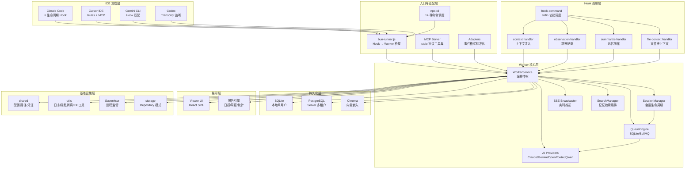
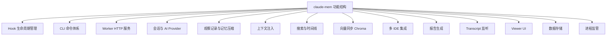
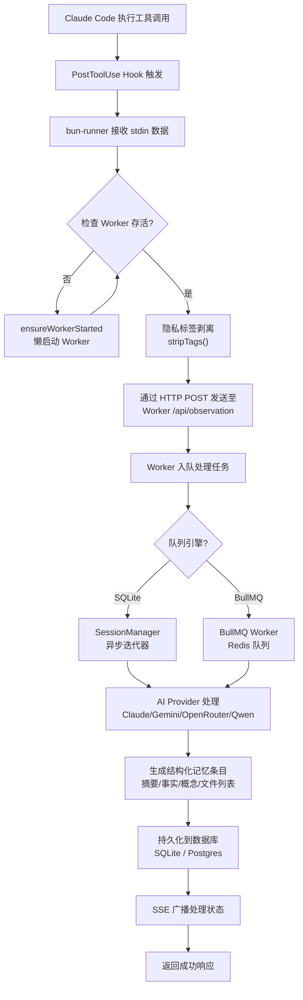
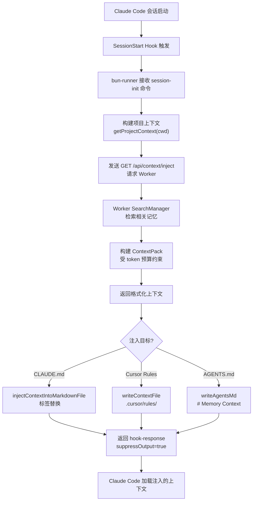
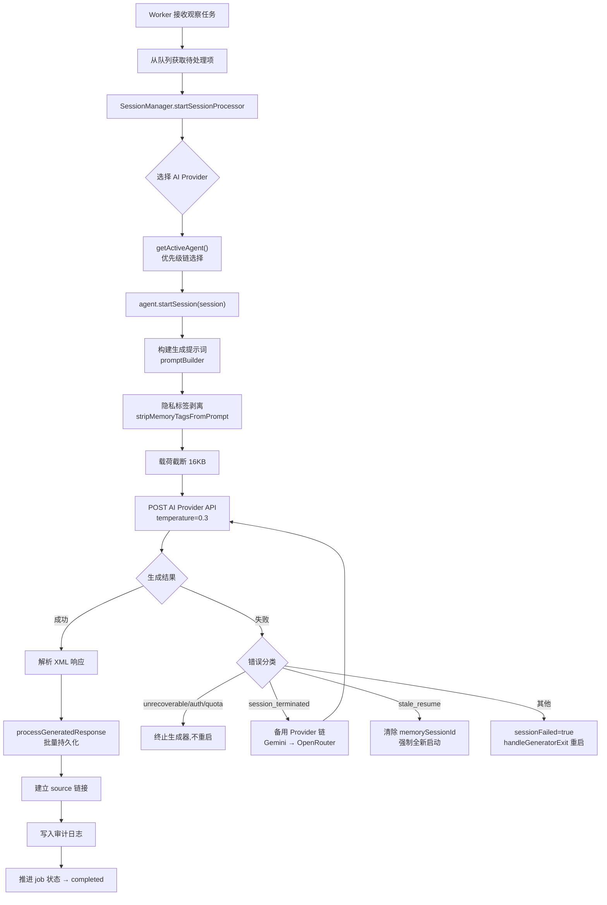
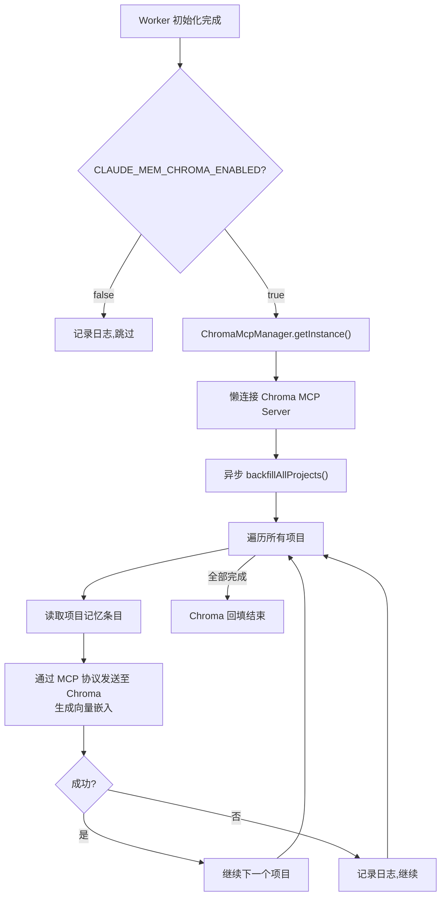

# A-系统需求文档

> 本文档由 code-to-doc 技能基于文件级逆向分析汇总生成。
> 生成日期：2026-07-23 ｜ 素材：360 份文件级需求文档 ｜ 项目：claude-mem

## 1. 引言

### 1.1 编写目的与读者

本文档基于 claude-mem 项目源码的逆向工程分析，系统性地描述该项目的全部功能需求、业务流程、外部接口及非功能约束。主要读者包括：产品经理（理解系统边界与功能范围）、架构师（评估技术选型与模块依赖）、开发工程师（实施具体模块）、测试工程师（编写测试用例）以及运维工程师（了解部署与配置要求）。

### 1.2 项目背景

claude-mem 是一款 Claude Code 插件，为 AI 编程助手提供跨会话持久记忆能力。系统通过 Hook 机制捕获 Claude Code 的每次工具调用和用户交互，利用 AI Provider 将原始观测数据压缩为结构化记忆条目，并在后续会话启动时自动注入相关上下文，使 Claude Code 能够"记住"过往工作成果、决策理由和项目知识。

系统同时支持本地单用户模式（Client）和多租户云端模式（Server Beta），前者以 SQLite 为存储引擎运行在用户本地，后者以 PostgreSQL + BullMQ 为后端支持水平扩展。

### 1.3 术语与缩略语

| 术语 | 定义 |
|------|------|
| Worker | claude-mem 的核心后台进程，承载 HTTP 服务、AI 会话、数据持久化 |
| Hook | Claude Code 插件生命周期回调点，claude-mem 在此注入观察与注入逻辑 |
| Provider | AI 模型提供方（Claude / Gemini / OpenRouter / Qwen） |
| Session | 一次 Claude Code 交互会话，对应一组记忆条目的聚合 |
| Observation | AI 压缩后的结构化记忆条目，含摘要、事实、概念等字段 |
| Context Pack | 注入到新会话中的记忆条目集合，受 token 预算约束 |
| Chroma | 向量数据库，用于语义搜索和跨项目记忆检索 |
| MCP | Model Context Protocol，Claude Code 的工具调用协议 |
| SSE | Server-Sent Events，服务端实时推送协议 |
| SyncAgent | 将本地数据同步到上游 Server 的代理组件 |
| Outbox Pattern | 先写数据库再发消息队列，保证最终一致性 |
| PID | Process ID，进程标识符 |
| FTS | Full-Text Search，全文搜索 |
| Bun | JavaScript/TypeScript 运行时，用于 Worker 进程执行 |

### 1.4 参考资料

| 资料 | 路径 |
|------|------|
| 项目 CLAUDE.md | `/Users/johnson/wks/ai/plugins/claude-mem/CLAUDE.md` |
| worker-service 核心文档 | `doc/src/services/worker-service.ts.md` |
| npx-cli 模块汇总 | `doc/src/npx-cli/_模块汇总.md` |
| shared 模块汇总 | `doc/src/shared/_shared模块汇总.md` |
| storage 模块汇总 | `doc/src/storage/_模块汇总.md` |
| ui/viewer 模块汇总 | `doc/src/ui/viewer/_模块汇总.md` |
| server 模块汇总 | `doc/src/server/_模块汇总.md` |
| utils 模块汇总 | `doc/src/utils/_utils汇总.md` |
| supervisor 模块汇总 | `doc/src/supervisor/_模块汇总.md` |
| adapters 模块汇总 | `doc/src/adapters/_模块汇总.md` |
| core/schemas 模块汇总 | `doc/src/core/_模块汇总.md` |
| servers 模块汇总 | `doc/src/servers/_模块汇总.md` |

## 2. 系统总体描述

### 2.1 产品定位

claude-mem 定位为 AI 编程助手的记忆增强层，嵌入 Claude Code（及 Cursor、Gemini CLI、Codex 等 IDE）的 Hook 生命周期中，提供：

- **自动观测**：捕获每次工具调用、文件读写、代码编辑等操作
- **AI 压缩**：将原始操作日志压缩为结构化记忆（摘要、事实、概念）
- **上下文注入**：在会话启动时将相关历史记忆注入 CLAUDE.md / Cursor Rules / AGENTS.md
- **搜索与检索**：支持关键词搜索、时间线浏览、向量语义搜索
- **报告与统计**：日报/周报生成、多维度统计分析

### 2.2 产品架构图



上图展示了 claude-mem 的分层架构。IDE 层通过 Hook 机制与系统交互；入口层负责命令调度和协议适配；Worker 核心层是系统的编排中枢，管理会话、AI Provider、队列和搜索；Hook 处理层负责具体的数据采集、压缩和注入逻辑；存储层采用双引擎架构满足不同部署场景；展示层提供浏览器端管理界面；基础设施层为全系统提供配置管理、日志记录、进程监管等横切能力。

### 2.3 用户与角色

| 角色 | 描述 | 使用场景 |
|------|------|---------|
| 终端开发者 | 使用 Claude Code 进行日常开发的工程师 | 自动享受记忆增强，无需额外操作 |
| 高级用户 | 通过 CLI 命令管理记忆搜索、配置变更 | `npx claude-mem search`、`npx claude-mem start` 等 |
| 管理员 | 管理 Server Beta 多租户部署 | API Key 管理、Sync 配置、审计查询 |
| AI Provider | Claude / Gemini / OpenRouter / Qwen | 被 Worker 调用执行记忆压缩与摘要生成 |

### 2.4 运行环境

| 维度 | 要求 |
|------|------|
| 操作系统 | macOS、Linux、Windows（跨平台） |
| 运行时 | Node.js + Bun（Bun 自动安装） |
| Python | uv（自动安装，用于 Chroma） |
| 数据库 | SQLite（本地模式）/ PostgreSQL（Server 模式） |
| 消息队列 | BullMQ + Redis（Server 模式可选） |
| 向量数据库 | Chroma（可选，通过 MCP 连接） |
| 浏览器 | 现代浏览器（Viewer UI，React SPA） |

### 2.5 设计与实现约束

- **Bun 运行时**：Worker 进程必须在 Bun 下运行以支持 `bun:sqlite`
- **单端口架构**：Worker 在单端口上承载全部 HTTP 路由（Viewer、API、MCP 自检等）
- **默认绑定 127.0.0.1**：Client 模式防止意外暴露到局域网
- **退出码策略**：Hook 和 Worker 错误统一使用 exit(0)，避免终端标签页累积
- **无物理外键约定**：Postgres 模式下多数关系通过应用层断言控制，不依赖物理外键
- **隐私标签机制**：`<private>` 标签内容在 Hook 层剥离，不进入数据库

## 3. 系统功能需求

以下按模块划分描述系统全部功能需求，每个需求以 `SR-<模块>-NN` 格式编号。



### 3.1 Hook 生命周期管理

claude-mem 通过 6 个 Hook 生命周期阶段嵌入 Claude Code：

| 编号 | 需求描述 | 优先级 |
|------|---------|--------|
| SR-HOOK-01 | 系统应当在 Setup 阶段执行版本检查（version-check.js），比对插件版本与 Worker 版本 | P1 |
| SR-HOOK-02 | 系统应当在 SessionStart 阶段初始化会话，向 Worker 发送 context 请求获取上下文并注入 CLAUDE.md | P1 |
| SR-HOOK-03 | 系统应当在 UserPromptSubmit 阶段记录用户提示词，经隐私标签剥离后发送至 Worker | P2 |
| SR-HOOK-04 | 系统应当在 PreToolUse(Read) 阶段捕获文件读取操作，更新文件夹级 CLAUDE.md 的文件上下文 | P2 |
| SR-HOOK-05 | 系统应当在 PostToolUse 阶段捕获工具调用结果，经标签剥离和格式化后作为观察记录发送至 Worker | P1 |
| SR-HOOK-06 | 系统应当在 Stop 阶段触发会话总结，请求 AI Provider 生成摘要并存储 | P1 |
| SR-HOOK-07 | 系统应当通过 stdin 协议（hook-command.ts）从 Claude Code 接收结构化 Hook 数据并路由到对应处理器 | P1 |
| SR-HOOK-08 | 系统应当支持通过 hook-response.ts 返回结构化响应给 Claude Code，控制行为（如抑制输出） | P2 |
| SR-HOOK-09 | 所有 Hook 应当使用 EXIT 0 表示成功或优雅关闭，EXIT 1 表示非阻塞错误，EXIT 2 表示阻塞错误 | P1 |

### 3.2 CLI 命令体系（npx-cli）

| 编号 | 需求描述 | 优先级 |
|------|---------|--------|
| SR-CLI-01 | 系统应当通过 `npx claude-mem` 命令入口调度 14 种子命令（install/uninstall/start/stop/search 等） | P1 |
| SR-CLI-02 | 系统应当在 CLI 启动时播放 ASCII 动画品牌横幅（192 帧，4 阶段序列），非 TTY/CI 环境自动禁用 | P3 |
| SR-CLI-03 | 系统应当路由 install 命令，支持 --ide/--provider/--model/--no-auto-start 参数 | P1 |
| SR-CLI-04 | 系统应当路由 update/upgrade 命令执行插件更新，route repair 命令执行修复 | P1 |
| SR-CLI-05 | 系统应当路由 uninstall/remove 命令执行插件卸载 | P1 |
| SR-CLI-06 | 系统应当路由 start/stop/restart/status 命令管理 Worker 生命周期 | P1 |
| SR-CLI-07 | 系统应当路由 search 命令执行记忆搜索 | P1 |
| SR-CLI-08 | 系统应当路由 server 命令进入 Server Beta 管理模式 | P2 |
| SR-CLI-09 | 系统应当路由 transcript watch 命令监听 transcript 文件 | P2 |
| SR-CLI-10 | 系统应当路由 generate/clean 命令管理 CLAUDE.md 生成与清理 | P2 |
| SR-CLI-11 | 系统应当路由 adopt 命令领养已合并的 Git worktree | P3 |
| SR-CLI-12 | 系统应当拒绝未知命令并打印帮助引用后 exit(1) | P1 |
| SR-CLI-13 | 系统应当将 `-` 开头的非 help/version flag 自动视为 install 命令参数 | P2 |
| SR-CLI-14 | 系统应当解析 --provider flag 并校验合法值（claude/gemini/openrouter） | P1 |

### 3.3 Worker HTTP 服务

| 编号 | 需求描述 | 优先级 |
|------|---------|--------|
| SR-WORKER-01 | 系统应当启动 Worker 进程并监听用户端口（默认 37700 + uid % 100），支持守护进程模式 | P1 |
| SR-WORKER-02 | 系统应当在启动前通过 PID 文件存活检查 + 端口占用双重校验拒绝重复实例 | P1 |
| SR-WORKER-03 | 系统应当在数据库初始化未完成时对 /api 和 /v1 路径返回 503，排除 health/readiness/version/chroma-status | P1 |
| SR-WORKER-04 | 系统应当注册 15+ 路由组，覆盖 Viewer、Session、Data、Report、Settings、Logs、Memory、Search、Chroma、Admin、Sync 等路径空间 | P1 |
| SR-WORKER-05 | 系统应当在 Server 模式下对所有路由前置 serverApiGate 鉴权中间件（默认拒绝策略） | P1 |
| SR-WORKER-06 | 系统应当通过 SSE 广播处理状态变更（isProcessing / queueDepth） | P2 |
| SR-WORKER-07 | 系统应当在后台初始化阶段按顺序执行：模式加载 → 迁移 → 报告调度 → DB 初始化 → 孤儿清扫 → 搜索注册 → Transcript 监听 → Chroma 回填 → MCP 自检 | P1 |
| SR-WORKER-08 | 系统应当在关闭时依次停止：settings watcher、transcript watcher、报告调度器，然后执行优雅关闭 | P1 |
| SR-WORKER-09 | 系统应当支持 Server API Key 的 create/list/revoke CLI 子命令 | P2 |
| SR-WORKER-10 | 系统应当支持 Sync Keys 的 create/list/revoke CLI 子命令，Key 绑定 sync:push scope 和用户标签 | P2 |
| SR-WORKER-11 | 系统应当在初始化完成后执行 MCP Server loopback 自检（60 秒超时） | P3 |

### 3.4 会话与 AI Provider 管理

| 编号 | 需求描述 | 优先级 |
|------|---------|--------|
| SR-SESSION-01 | 系统应当支持 4 种 AI Provider：Claude（SDK）、Gemini、OpenRouter、Qwen | P1 |
| SR-SESSION-02 | 系统应当按优先级链选择活跃 Provider：Qwen（selected）> OpenRouter（selected）> Gemini（selected）> Qwen（available）> Claude | P1 |
| SR-SESSION-03 | 系统应当启动会话处理器驱动 AI Provider 执行会话生成，通过 AbortController 支持取消 | P1 |
| SR-SESSION-04 | 系统应当对不可恢复错误（unrecoverable/auth_invalid/quota_exhausted）终止生成器且不重启 | P1 |
| SR-SESSION-05 | 系统应当对 SQLite 外键约束失败直接判定为不可恢复 | P1 |
| SR-SESSION-06 | 系统应当对会话终止错误触发备用 Provider 链（Gemini → OpenRouter → 放弃并清理） | P2 |
| SR-SESSION-07 | 系统应当检测过时恢复失败（aborted by user / No conversation found）并清除 memorySessionId 强制全新启动 | P2 |
| SR-SESSION-08 | 系统应当在启动时将所有 status=processing 的 pending_messages 重置为 pending（孤儿清扫） | P1 |
| SR-SESSION-09 | 系统应当通过 SessionManager 管理会话队列，支持 SQLite 引擎和 BullMQ 引擎双模式 | P1 |
| SR-SESSION-10 | 系统应当记录 lastAiInteraction 状态（时间戳、成功/失败、Provider 名称、错误消息） | P2 |

### 3.5 观察记录与记忆压缩

| 编号 | 需求描述 | 优先级 |
|------|---------|--------|
| SR-OBS-01 | 系统应当捕获 PostToolUse 阶段的工具调用数据（工具名称、输入、输出），经隐私标签剥离后发送至 Worker | P1 |
| SR-OBS-02 | 系统应当将原始观察数据通过 AI Provider 压缩为结构化记忆条目（含摘要、事实、概念、文件列表等） | P1 |
| SR-OBS-03 | 系统应当支持多种记忆类型：observation（观察）、summary（摘要）、prompt（提示词）、manual（手动） | P1 |
| SR-OBS-04 | 系统应当在 Stop 阶段触发会话总结，生成 kind=summary 的记忆条目 | P1 |
| SR-OBS-05 | 系统应当支持通过 CLI 或 MCP 工具手动添加记忆条目 | P2 |
| SR-OBS-06 | 系统应当在压缩前对每个事件执行隐私标签剥离，全部为私有时返回合成跳过响应 | P1 |
| SR-OBS-07 | 系统应当将载荷文本截断至 16KB 上限以防止超 token | P2 |
| SR-OBS-08 | 系统应当支持 Mode 配置驱动观测输出 XML Schema（失败时回退到 4 种预定义类型） | P2 |
| SR-OBS-09 | 系统应当在 Server Beta 模式下通过 BullMQ 异步处理生成任务，支持 outbox 模式保证最终一致性 | P2 |
| SR-OBS-10 | 系统应当支持生成任务的重试策略（指数退避，5s 基数，10min 上限） | P2 |

### 3.6 上下文注入

| 编号 | 需求描述 | 优先级 |
|------|---------|--------|
| SR-CTX-01 | 系统应当在 SessionStart 阶段通过 Worker API 获取项目相关记忆上下文 | P1 |
| SR-CTX-02 | 系统应当将上下文内容用 `<claude-mem-context>` 标签包裹后注入项目根目录 CLAUDE.md | P1 |
| SR-CTX-03 | 系统应当支持注入到 CLAUDE.local.md（通过 `CLAUDE_MEM_FOLDER_USE_LOCAL_MD` 配置） | P2 |
| SR-CTX-04 | 系统应当在目标文件已包含 context 标签时仅替换标签内内容，保留标签外用户内容 | P1 |
| SR-CTX-05 | 系统应当将上下文注入到 Cursor 的 `.cursor/rules/claude-mem-context.mdc` 文件 | P2 |
| SR-CTX-06 | 系统应当将上下文写入 AGENTS.md（`# Memory Context` 标题包裹） | P2 |
| SR-CTX-07 | 系统应当在文件读取（PreToolUse Read）后批量更新相关子目录的 CLAUDE.md，跳过排除目录和根目录 | P2 |
| SR-CTX-08 | 系统应当限制每个目录的时间线观测条数（默认 50） | P2 |
| SR-CTX-09 | 系统应当采用原子写入策略（先临时文件再 rename），失败时记录错误日志 | P1 |

### 3.7 搜索与时间线

| 编号 | 需求描述 | 优先级 |
|------|---------|--------|
| SR-SEARCH-01 | 系统应当提供记忆搜索能力，支持按关键词全文搜索 | P1 |
| SR-SEARCH-02 | 系统应当提供时间线浏览，按日期分组展示记忆条目 | P1 |
| SR-SEARCH-03 | 系统应当通过 MCP `search` 工具暴露搜索能力给 Claude Code | P1 |
| SR-SEARCH-04 | 系统应当通过 MCP `timeline` 工具暴露时间线能力给 Claude Code | P1 |
| SR-SEARCH-05 | 系统应当通过 MCP `get_observations` 工具支持批量获取观察详情 | P2 |
| SR-SEARCH-06 | 系统应当通过 CLI `npx claude-mem search` 提供命令行搜索 | P1 |
| SR-SEARCH-07 | 系统应当在 Server Beta 模式下支持 PostgreSQL GIN tsvector 索引全文搜索 | P2 |
| SR-SEARCH-08 | 系统应当提供 `smart_search` / `smart_unfold` / `smart_outline` AST 代码搜索工具（基于 tree-sitter） | P2 |
| SR-SEARCH-09 | 系统应当提供知识语料库工具组（build/list/prime/query/rebuild/reprime corpus） | P2 |

### 3.8 向量同步（Chroma）

| 编号 | 需求描述 | 优先级 |
|------|---------|--------|
| SR-CHROMA-01 | 系统应当根据 `CLAUDE_MEM_CHROMA_ENABLED` 环境变量决定是否启用 Chroma 向量嵌入 | P2 |
| SR-CHROMA-02 | 系统应当在初始化完成后异步执行全项目 Chroma 回填 | P2 |
| SR-CHROMA-03 | 系统应当通过 ChromaMcpManager 以 MCP 协议连接 Chroma 服务 | P2 |
| SR-CHROMA-04 | 系统应当在 Chroma 不可用时静默降级，不影响核心功能 | P2 |
| SR-CHROMA-05 | 系统应当提供 /chroma/* 路由组用于 Chroma 状态查询和管理 | P3 |

### 3.9 多 IDE 集成

| 编号 | 需求描述 | 优先级 |
|------|---------|--------|
| SR-IDE-01 | 系统应当支持 Claude Code 作为主要宿主 IDE，通过 6 个 Hook 阶段集成 | P1 |
| SR-IDE-02 | 系统应当支持 Cursor IDE，通过 Rules 文件和 MCP 配置集成 | P2 |
| SR-IDE-03 | 系统应当支持 Gemini CLI，通过 Hook 适配器集成 | P2 |
| SR-IDE-04 | 系统应当支持 Codex，通过 Transcript 监听集成 | P2 |
| SR-IDE-05 | 系统应当支持 Windsurf IDE | P3 |
| SR-IDE-06 | 系统应当维护 Cursor 项目注册表，支持注册/注销项目 | P2 |
| SR-IDE-07 | 系统应当通过 Adapters 层将不同平台的事件数据标准化为统一的 CreateAgentEvent schema | P1 |

### 3.10 报告生成

| 编号 | 需求描述 | 优先级 |
|------|---------|--------|
| SR-REPORT-01 | 系统应当在后台初始化时启动报告调度器（ReportScheduler） | P2 |
| SR-REPORT-02 | 系统应当支持日报和周报自动生成 | P2 |
| SR-REPORT-03 | 系统应当通过 /api/reports/* 和 /api/daily-reports/* 路由组暴露报告 API | P2 |
| SR-REPORT-04 | 系统应当在报告调度器失败时不阻塞其他初始化步骤 | P2 |

### 3.11 Transcript 监听

| 编号 | 需求描述 | 优先级 |
|------|---------|--------|
| SR-TRANSCRIPT-01 | 系统应当根据配置决定是否启动 Transcript 监听器 | P2 |
| SR-TRANSCRIPT-02 | 系统应当支持 `npx claude-mem transcript watch` 命令独立监听 | P2 |
| SR-TRANSCRIPT-03 | 系统应当过滤 Codex 原生 hook 已覆盖的 watch 避免重复 | P2 |
| SR-TRANSCRIPT-04 | 系统应当兼容 Gemini 格式（单 JSON）和 JSONL 格式两种 transcript 解析 | P2 |
| SR-TRANSCRIPT-05 | 系统应当在监听启动失败时静默降级 | P3 |

### 3.12 Viewer UI

| 编号 | 需求描述 | 优先级 |
|------|---------|--------|
| SR-VIEWER-01 | 系统应当提供 React SPA 浏览器端管理界面，内嵌为 viewer.html | P1 |
| SR-VIEWER-02 | 系统应当通过 SSE 实时流展示 AI 编码活动的观察记录、会话总结和用户提示词 | P1 |
| SR-VIEWER-03 | 系统应当提供运行配置（模型/Provider/上下文参数）的可视化编辑与实时预览 | P2 |
| SR-VIEWER-04 | 系统应当提供统计分析页面，支持多粒度图表展示 | P2 |
| SR-VIEWER-05 | 系统应当支持多语言（i18n）和多主题（亮/暗）切换 | P3 |
| SR-VIEWER-06 | 系统应当在 Server 模式下提供登录页面和 API Key 认证 | P2 |
| SR-VIEWER-07 | 系统应当支持项目侧边栏、作用域选择器、日期过滤等交互组件 | P2 |
| SR-VIEWER-08 | 系统应当使用 ErrorBoundary 包裹应用，捕获渲染异常后切换到错误状态 | P1 |
| SR-VIEWER-09 | 系统应当支持同步状态徽章显示 SyncAgent 工作状态 | P2 |

### 3.13 数据存储（SQLite + Postgres 双模式）

| 编号 | 需求描述 | 优先级 |
|------|---------|--------|
| SR-STORE-01 | 系统应当在本地模式下使用 SQLite（bun:sqlite）作为存储引擎 | P1 |
| SR-STORE-02 | 系统应当在 Server Beta 模式下使用 PostgreSQL 作为权威数据源 | P1 |
| SR-STORE-03 | SQLite 模式应当创建 9 张业务表 + FTS5 全文搜索虚拟表 + 5 个数据完整性触发器 + 17 个索引 | P1 |
| SR-STORE-04 | PostgreSQL 模式应当创建 12 张表 + 迁移记录表，支持事务内 DDL 幂等 | P1 |
| SR-STORE-05 | 系统应当通过 Repository 模式封装 SQL 细节，向上层暴露领域模型 | P1 |
| SR-STORE-06 | SQLite 模式应当使用 FTS5（porter unicode61 分词）+ 触发器自动同步实现全文搜索 | P1 |
| SR-STORE-07 | PostgreSQL 模式应当使用 GENERATED ALWAYS tsvector STORED 列 + GIN 索引 + websearch_to_tsquery 实现全文搜索 | P2 |
| SR-STORE-08 | SQLite 模式应当使用 Zod Schema 双重验证（输入 + 输出）保障数据完整性 | P1 |
| SR-STORE-09 | PostgreSQL 模式应当使用全面的项目 x 团队双重租户隔离，所有写操作前置归属断言 | P1 |
| SR-STORE-10 | PostgreSQL 模式应当使用 SHA-256 确定性哈希幂等键保证会话、观察、生成任务的幂等写入 | P2 |
| SR-STORE-11 | 系统应当使用 Schema 版本管理（SQLite v33，Postgres v1 + 迁移表） | P1 |
| SR-STORE-12 | PostgreSQL 模式应当支持 generation_jobs 有限状态机（queued/processing/completed/failed/cancelled），SQL + 代码双重保证 | P2 |

### 3.14 进程监管

| 编号 | 需求描述 | 优先级 |
|------|---------|--------|
| SR-SUPER-01 | 系统应当通过 Supervisor 单例管理进程全生命周期，支持 PID 文件防多实例 | P1 |
| SR-SUPER-02 | 系统应当注册和跟踪所有衍生子进程，支持按 sessionId 查询和批量终止 | P1 |
| SR-SUPER-03 | 系统应当以两阶段信号策略（SIGTERM 5 秒 → SIGKILL 1 秒）执行级联关停 | P1 |
| SR-SUPER-04 | 系统应当启动定期健康检查（30 秒间隔），自动清理已死亡进程注册记录 | P2 |
| SR-SUPER-05 | 系统应当在 spawn 子进程时清洗环境变量（过滤 CLAUDECODE_ 前缀、代理变量、保留白名单） | P1 |
| SR-SUPER-06 | 系统应当支持 SDK 进程并发控制（waitForSlot，硬上限 10） | P2 |
| SR-SUPER-07 | 系统应当在 spawn 新 SDK 进程前杀掉同 session 旧进程 | P2 |
| SR-SUPER-08 | 系统应当配置 SIGTERM/SIGINT 信号处理器，关停时幂等防重入 | P1 |

## 4. 核心业务流程

### 4.1 会话记忆处理流程



### 4.2 上下文注入流程



### 4.3 观察记录压缩流程



### 4.4 向量同步流程



## 5. 外部接口需求

### 5.1 用户界面（Viewer）

Viewer 是基于 React 18 的单页应用，部署为 Worker 内嵌的 `viewer.html`，通过浏览器访问 `http://127.0.0.1:<worker-port>`。

主要界面组件包括：

| 组件 | 功能 |
|------|------|
| Feed 主视图 | SSE 实时流展示观察记录（ObservationCard）、会话总结（SummaryCard）、用户提示词（PromptCard） |
| Header 顶栏 | 项目切换、作用域选择器、日期过滤、搜索、同步状态徽章、主题/语言切换、用户选择器 |
| ContextSettingsModal | 运行配置编辑（模型、Provider、上下文参数、搜索模式） |
| StatsPage 统计页 | 多维度图表展示（工作时长、工具使用、项目活跃度等） |
| LogsModal 日志弹窗 | 查看系统日志 |
| LoginPage 登录页 | Server 模式下的 API Key 认证 |
| ProjectSidebar 项目侧栏 | 项目列表与切换 |

### 5.2 API 接口（端点汇总表）

以下列出 Worker HTTP 服务的全部路由组及典型端点：

| 路由组 | 路径前缀 | 模式可见性 | 主要功能 |
|--------|---------|-----------|---------|
| ViewerRoutes | `/api/viewer/*` | 全模式 | Viewer UI 数据 |
| SessionRoutes | `/api/sessions/*` | 全模式 | 会话 CRUD |
| DataRoutes | `/api/data/*` | 全模式 | 数据查询（Server 需鉴权） |
| SearchRoutes | 搜索端点 | 全模式 | 记忆搜索 |
| ReportRoutes | `/api/reports/*` | 全模式 | 报告管理 |
| DailyReportRoutes | `/api/daily-reports/*` | 全模式 | 日报管理 |
| SettingsRoutes | `/api/settings/*` | 全模式 | 配置读写 |
| LogsRoutes | `/api/logs/*` | 全模式 | 日志查询 |
| MemoryRoutes | `/api/memory/*` | 全模式 | 记忆条目 CRUD |
| ServerV1Routes | `/v1/*` | 全模式 | V1 规范 API |
| ChromaRoutes | `/chroma/*` | 全模式 | Chroma 状态与管理 |
| AdminRoutes | `/api/admin/*` | 全模式 | 管理操作（重启等） |
| SyncStatusRoutes | `/api/sync/status` | 全模式 | 同步状态查询 |
| CorpusRoutes | `/api/corpus/*` | 全模式 | 语料库 CRUD |
| UsersRoutes | `/api/users/*` | 仅 Server | 用户管理 |
| AuthRoutes | `/api/auth/*` | 仅 Server | 认证端点 |
| SyncRoutes | `/api/sync/ingest` | 仅 Server | 同步入箱 |
| BetterAuthRoutes | `/api/auth/*splat` | 全模式 | Better Auth 委托 |

Server Beta 额外端点：

| 路径 | 方法 | 功能 |
|------|------|------|
| `/v1/events` | POST | 批量事件提交（1-500 条） |
| `/v1/memories` | POST | 手动插入观测 |
| `/v1/search` | GET | GIN 全文搜索 |
| `/v1/context` | GET | 上下文打包 |
| `/v1/jobs` | GET | 生成作业列表 |
| `/v1/jobs/:id` | GET/POST | 作业详情/重试/取消 |
| `/healthz` | GET | 健康检查（无需认证） |
| `/v1/info` | GET | 服务器信息 |

### 5.3 第三方系统接口

#### AI Provider 接口

| Provider | 协议 | 用途 |
|----------|------|------|
| Anthropic Claude | Anthropic Messages API (HTTPS) | 记忆压缩、会话总结 |
| Google Gemini | Gemini API (HTTPS) | 备用/主力 Provider |
| OpenRouter | OpenRouter API (HTTPS) | 备用 Provider |
| Qwen | DashScope API (HTTPS) | 高可用 Provider |

认证方式：API Key 通过 settings.json 配置或 `.env` 文件存储（权限 0o600），支持 OAuth token（从系统密钥链读取）。

#### Chroma MCP 接口

- 协议：MCP stdio 传输
- 用途：向量嵌入生成与语义搜索
- 连接方式：通过 ChromaMcpManager 启动 StdioClientTransport

#### BullMQ / Redis 接口

- 协议：Redis 协议
- 用途：Server Beta 模式的任务队列
- 配置：通过 `CLAUDE_MEM_QUEUE_ENGINE=bullmq` 启用

### 5.4 数据库接口

#### SQLite（本地模式）

- 驱动：`bun:sqlite`
- 路径：`~/.claude-mem/claude-mem.db`
- 特性：同步 API、FTS5 全文搜索、BEFORE 触发器

#### PostgreSQL（Server Beta 模式）

- 驱动：`pg` (npm)
- 连接方式：连接池（单例 + 事务包装器）
- 配置：`CLAUDE_MEM_SERVER_DATABASE_URL` 环境变量
- 特性：jsonb 类型、GIN 索引、tsvector 全文搜索、SHA-256 幂等键

## 6. 非功能需求

### 6.1 性能

| 需求项 | 描述 |
|--------|------|
| SR-PERF-01 | Worker API 默认超时 30 秒（可配置 `CLAUDE_MEM_API_TIMEOUT_MS`） |
| SR-PERF-02 | 健康检查默认超时 5 秒（可配置 `CLAUDE_MEM_HEALTH_TIMEOUT_MS`） |
| SR-PERF-03 | Hook 就绪等待采用指数退避策略（初始 500ms，最多 6 次，上限约 15.5 秒） |
| SR-PERF-04 | Windows 平台超时自动乘以 1.5 倍系数 |
| SR-PERF-05 | BullMQ 任务重试采用指数退避（5s 基数，10min 上限） |
| SR-PERF-06 | Worker 冷启动使用版本匹配检测，避免不必要的重启 |
| SR-PERF-07 | SyncAgent 配置参数安全边界约束（intervalMs ≥ 5000，batchSize ≥ 1） |

### 6.2 安全

| 需求项 | 描述 |
|--------|------|
| SR-SEC-01 | `<private>` 标签内容在 Hook 层剥离，不进入数据库和 AI Provider |
| SR-SEC-02 | API Key 使用 SHA-256 哈希存储，原始密钥不落盘（`cmem_` 前缀） |
| SR-SEC-03 | Server 模式使用 serverApiGate 中间件实现默认拒绝策略 |
| SR-SEC-04 | Bearer Token 认证，支持 API Key 验证（哈希匹配、状态检查、过期检查、scope 校验） |
| SR-SEC-05 | OAuth token 从系统密钥链读取（macOS Keychain / Windows Credential Manager / Linux libsecret），过期标记文件权限 0o600 |
| SR-SEC-06 | 子进程环境变量清洗：过滤 CLAUDECODE_ 前缀变量、代理变量、敏感变量，保留白名单（含 AWS 凭证和 Bedrock/Vertex 配置） |
| SR-SEC-07 | `.env` 文件权限 0o600 |
| SR-SEC-08 | 审计日志记录所有关键操作（API Key 创建/吊销、生成任务执行等） |
| SR-SEC-09 | Server Beta 模式通过 local-dev 检测允许 loopback 请求绕过认证 |

### 6.3 可靠性

| 需求项 | 描述 |
|--------|------|
| SR-REL-01 | 优雅关闭按顺序停止：settings watcher → transcript watcher → 报告调度 → HTTP Server → SessionManager → MCP Client → DB → Chroma |
| SR-REL-02 | PID 文件 + 端口占用双重防多实例保护，PID 存活通过 Linux /procstarttime token 防复用 |
| SR-REL-03 | 启动时孤儿清扫：将所有 status=processing 的 pending_messages 重置为 pending |
| SR-REL-04 | 未处理异常策略：unhandledRejection 仅记录日志；uncaughtException 仅记录日志且不退出 |
| SR-REL-05 | 端口冲突降级：EADDRINUSE 时检查端口上已有健康服务则静默退出 |
| SR-REL-06 | Server Beta 使用 Outbox Pattern 保证事件写入与队列发布的最终一致性 |
| SR-REL-07 | PostgreSQL 生成任务使用幂等键（generation_key）防止重复执行 |
| SR-REL-08 | 关停信号处理幂等防重入（shutdownInitiated 标志 + stopPromise 并发保护） |
| SR-REL-09 | MCP Server 检测父进程死亡（30 秒心跳），防止孤儿进程 |
| SR-REL-10 | 数据库初始化屏障（initializationCompleteFlag）防止未就绪时接受请求 |

### 6.4 可维护性

| 需求项 | 描述 |
|--------|------|
| SR-MNT-01 | 统一结构化日志（logger 单例）：`[时间戳] [级别] [组件] [关联ID] 消息 {context} data` |
| SR-MNT-02 | 日志级别 5 级：DEBUG < INFO < WARN < ERROR < SILENT |
| SR-MNT-03 | 日志按日期分文件存储：`~/.claude-mem/logs/claude-mem-YYYY-MM-DD.log` |
| SR-MNT-04 | 配置集中管理：settings.json（~/.claude-mem/settings.json），约 85 个配置项 |
| SR-MNT-05 | Schema 版本管理：SQLite v33 / Postgres v1 + 迁移记录表 |
| SR-MNT-06 | Zod Schema 作为领域模型校验层，从 Schema 推导 TypeScript 类型 |
| SR-MNT-07 | 双引擎存储层通过 Repository 模式统一数据访问接口 |
| SR-MNT-08 | 环境变量优先级链：环境变量 > settings.json > 默认值 |
| SR-MNT-09 | 支持 UTF-8 BOM 处理和嵌套→扁平 schema 自动迁移 |
| SR-MNT-10 | 支持 .env 文件管理 API 凭证，自动迁移旧键名 |

## 7. 数据需求

### 7.1 核心实体

| 实体 | 说明 | 关键字段 |
|------|------|---------|
| Project | 顶层聚合根，代表一个 AI 编程项目 | id, name, slug, rootPath |
| ServerSession | 会话生命周期管理 | id, projectId, status, contentSessionId, memorySessionId |
| AgentEvent | Agent 执行事件记录 | id, projectId, sourceType, eventType, payload |
| MemoryItem | 记忆系统核心数据模型 | id, projectId, kind, type, facts, concepts, filesRead, filesModified |
| MemorySource | 记忆条目溯源信息 | id, memoryItemId, sourceType, sourceUri |
| ContextPack | 上下文注入容器 | projectId, tokenBudget, items(MemoryItem[]) |
| ApiKey | API 密钥管理 | id, keyHash, scopes, status, expiresAtEpoch |
| AuditLog | 操作审计轨迹 | actorType, action, targetType, targetId |
| Team | 多租户团队实体 | id, name, slug |
| TeamMember | 团队成员关联 | teamId, userId, role |
| GenerationJob | 生成任务（Server Beta） | id, kind, status, attempts |
| Observation | 观察记录（Server Beta） | id, projectId, teamId, content, generation_key |

### 7.2 枚举类型

| 枚举 | 值域 |
|------|------|
| MemoryItemKind | observation, summary, prompt, manual |
| MemorySourceType | observation, session_summary, user_prompt, manual, import |
| ServerSessionStatus | active, completed, failed |
| ApiKeyStatus | active, revoked |
| AuditActorType | user, api_key, system |
| AgentEventSourceType | hook, worker, provider, server, api |
| TeamRole | owner, admin, member, viewer |
| GenerationJobStatus | queued, processing, completed, failed, cancelled |

### 7.3 数据库表对照

| SQLite（本地） | PostgreSQL（Server Beta） | 说明 |
|----------------|--------------------------|------|
| projects | projects | 项目信息 |
| teams | teams | 团队信息 |
| team_members | team_members | 团队成员 |
| server_sessions | server_sessions | 会话管理 |
| agent_events | agent_events | Agent 事件 |
| memory_items | — | 记忆条目（Server 用 observations） |
| memory_sources | observation_sources | 记忆/观察来源 |
| api_keys | api_keys | API 密钥 |
| audit_log | audit_log | 审计日志 |
| memory_items_fts | — | FTS5 全文搜索（SQLite 专有） |
| — | observation_generation_jobs | 生成任务（Postgres 专有） |
| — | observation_generation_job_events | 任务事件日志（Postgres 专有） |
| — | server_beta_schema_migrations | 迁移记录（Postgres 专有） |

## 8. 第三方依赖清单

| 依赖 | 用途 | 必要性 |
|------|------|--------|
| Bun | Worker 进程运行时、bun:sqlite | 必需（自动安装） |
| Node.js | Hook 入口脚本、npx-cli | 必需 |
| uv (Python) | Chroma 向量嵌入服务 | 可选（自动安装） |
| `@modelcontextprotocol/sdk` | MCP Client/Server 协议 | 必需 |
| `zod` | Schema 校验与类型推导 | 必需 |
| `pg` (npm) | PostgreSQL 连接池 | Server Beta |
| `bullmq` (npm) | 任务队列 | Server Beta（可选） |
| `redis` (npm) | BullMQ 依赖 | Server Beta（可选） |
| `express` | HTTP 服务器框架 | 必需 |
| `react` / `react-dom` | Viewer UI 前端框架 | 必需 |
| `picocolors` | CLI 彩色输出 | 必需 |
| `ffmpeg` (CLI) | banner 帧生成（构建时） | 构建时 |
| `tree-kill` (npm) | Windows 进程树终止 | Windows（可选） |

## 9. 配置方法

### 9.1 配置文件

主配置文件：`~/.claude-mem/settings.json`（约 85 个配置项），首次运行自动创建。

配置优先级：环境变量 > settings.json > 默认值（SettingsDefaultsManager）

### 9.2 关键环境变量

| 变量 | 默认值 | 说明 |
|------|--------|------|
| `CLAUDE_MEM_DATA_DIR` | `~/.claude-mem` | 数据目录 |
| `CLAUDE_MEM_WORKER_PORT` | `37700 + uid % 100` | Worker 监听端口 |
| `CLAUDE_MEM_SERVER_BIND_HOST` | `127.0.0.1` | 绑定地址 |
| `CLAUDE_MEM_RUNTIME` | — | 运行时选择（server-beta） |
| `CLAUDE_MEM_CHROMA_ENABLED` | true | Chroma 向量搜索 |
| `CLAUDE_MEM_TRANSCRIPTS_ENABLED` | true | Transcript 监听 |
| `CLAUDE_MEM_LOG_LEVEL` | INFO | 日志级别 |
| `CLAUDE_MEM_QUEUE_ENGINE` | sqlite | 队列引擎（sqlite/bullmq） |
| `CLAUDE_MEM_SERVER_DATABASE_URL` | — | PostgreSQL 连接串 |
| `CLAUDE_MEM_SYNC_ACCESS_TOKEN` | — | 同步访问令牌 |
| `CLAUDE_MEM_EXCLUDED_PROJECTS` | — | 排除项目列表（逗号分隔） |
| `CLAUDE_MEM_FOLDER_USE_LOCAL_MD` | false | 使用 CLAUDE.local.md |
| `CLAUDE_MEM_CONTEXT_OBSERVATIONS` | 50 | 每目录观测条数上限 |
| `CLAUDE_MEM_NO_BANNER` | false | 禁用 CLI 横幅动画 |
| `CLAUDE_CONFIG_DIR` | `~/.claude` | Claude 配置目录 |
| `CLAUDE_MEM_ENV_FILE` | `$DATA_DIR/.env` | API 凭证文件路径 |

### 9.3 凭证管理

API 凭证存储于 `$DATA_DIR/.env`（权限 0o600），支持 6 种 API 密钥：

- `ANTHROPIC_API_KEY`（Claude）
- `GEMINI_API_KEY`（Gemini）
- `OPENROUTER_API_KEY`（OpenRouter）
- `DASHSCOPE_API_KEY`（Qwen）
- `CLAUDE_MEM_REPORT_QWEN_API_KEY`（报告专用 Qwen）
- 自动迁移旧键名（如 DASHSCOPE_API_KEY → CLAUDE_MEM_REPORT_QWEN_API_KEY）

OAuth token 从系统密钥链读取，60 秒宽限窗口判断过期状态。

### 9.4 多账户支持

通过环境变量实现多实例隔离：

```bash
export CLAUDE_MEM_DATA_DIR="$HOME/.claude-mem-work"  # 独立数据目录
export CLAUDE_MEM_WORKER_PORT=37800                   # 独立端口
```

所有路径和端口从这两个变量派生，实现多账户并行运行。

## 10. 需求追溯矩阵

| 需求编号 | 对应模块/源文件 | 关键证据 |
|---------|---------------|---------|
| SR-HOOK-01~09 | hooks/hook-response.ts, cli/hook-command.ts | 6 个 Hook 阶段定义 |
| SR-CLI-01~14 | npx-cli/index.ts, npx-cli/banner.ts | 14 种命令路由 + 横幅播放 |
| SR-WORKER-01~11 | services/worker-service.ts | 1673 行核心文件 |
| SR-SESSION-01~10 | services/worker-service.ts, workers/*Provider.ts | Provider 选择优先级链 |
| SR-OBS-01~10 | cli/handlers/observation.ts, server/generation/* | 观察捕获与 AI 压缩 |
| SR-CTX-01~09 | utils/context-injection.ts, utils/claude-md-utils.ts, utils/agents-md-utils.ts | 多目标上下文注入 |
| SR-SEARCH-01~09 | workers/SearchManager.ts, servers/mcp-server.ts | 搜索 + MCP 工具 |
| SR-CHROMA-01~05 | services/sync/ChromaMcpManager.ts, services/sync/ChromaSync.ts | 向量同步 |
| SR-IDE-01~07 | cli/adapters/*, utils/cursor-utils.ts | 5 种 IDE 适配器 |
| SR-REPORT-01~04 | workers/reports/ReportScheduler.ts | 报告调度 |
| SR-TRANSCRIPT-01~05 | services/transcripts/* | Transcript 监听 |
| SR-VIEWER-01~09 | ui/viewer/（44 个源文件） | React SPA |
| SR-STORE-01~12 | storage/sqlite/*, storage/postgres/* | 双引擎存储 |
| SR-SUPER-01~08 | supervisor/*（5 个源文件） | 进程监管 |
| SR-PERF-01~07 | shared/hook-constants.ts, shared/worker-utils.ts | 超时/重试配置 |
| SR-SEC-01~09 | server/auth/*, server/middleware/*, shared/EnvManager.ts | 安全机制 |
| SR-REL-01~10 | supervisor/shutdown.ts, services/infrastructure/* | 可靠性机制 |
| SR-MNT-01~10 | utils/logger.ts, shared/SettingsDefaultsManager.ts | 可维护性 |
