# B-系统设计文档

> 本文档由 code-to-doc 技能基于文件级逆向分析汇总生成。
> 生成日期：2026-07-23 ｜ 素材：356 份文件级需求文档 ｜ 配套：A-系统需求文档

## 1. 设计总述

### 1.1 设计目标与原则

claude-mem 的设计目标是构建一个嵌入 Claude Code（及 Cursor、Gemini CLI、Codex 等 IDE）Hook 生命周期的持久记忆增强层。系统通过捕获每次工具调用与用户交互，利用 AI Provider 将原始观测数据压缩为结构化记忆条目，并在后续会话启动时自动注入相关上下文，使 AI 编程助手具备跨会话记忆能力。

设计遵循以下核心原则：

| 原则 | 说明 | 对应需求 |
|------|------|---------|
| **Hook 原生集成** | 系统以 Claude Code 插件形态运行，通过 6 个生命周期 Hook 嵌入，用户无需额外操作即可获得记忆增强 | SR-HOOK-01~09 |
| **双模式部署** | 本地 Client 模式（SQLite）与云端 Server Beta 模式（PostgreSQL + BullMQ）共享领域模型，通过 Repository 模式统一数据访问 | SR-STORE-01~12 |
| **AI 驱动压缩** | 原始操作日志经多 Provider（Claude/Gemini/OpenRouter/Qwen）AI 压缩为结构化记忆，支持备用 Provider 链保证可用性 | SR-SESSION-01~10 |
| **隐私优先** | `<private>` 标签内容在 Hook 层剥离，不进入数据库和 AI Provider | SR-SEC-01 |
| **优雅降级** | Chroma、Transcript 监听、BullMQ 等可选组件在不可用时静默降级，不影响核心功能 | SR-CHROMA-04, SR-REL-05 |
| **退出码策略** | Hook 和 Worker 错误统一 exit(0)，避免 Windows Terminal 标签页累积 | SR-HOOK-09 |

### 1.2 技术栈总览

| 层次 | 技术 | 版本/说明 | 证据 |
|------|------|----------|------|
| 运行时 | Node.js | Hook 入口脚本、npx-cli | shared/paths.ts, npx-cli/index.ts |
| 运行时 | Bun | Worker 进程运行时，支持 bun:sqlite | worker-service.ts, SettingsDefaultsManager.ts |
| Python | uv（自动安装） | Chroma 向量嵌入服务 | CLAUDE.md |
| HTTP 框架 | Express | Worker HTTP 服务器、Server Beta HTTP | worker-service.ts, ServerBetaService.ts |
| 数据库（本地） | SQLite (bun:sqlite) | 同步 API、FTS5 全文搜索 | storage/sqlite/schema.ts |
| 数据库（云端） | PostgreSQL (pg) | 连接池、jsonb、GIN 索引 | storage/postgres/pool.ts |
| 消息队列 | BullMQ + Redis | Server Beta 任务队列（可选） | server/jobs/ServerJobQueue.ts |
| 向量数据库 | Chroma（MCP 协议） | 语义搜索（可选） | services/sync/ChromaMcpManager.ts |
| 前端框架 | React 18 | Viewer SPA，Concurrent Mode | ui/viewer/index.tsx |
| 协议 | MCP (Model Context Protocol) | Claude Code 工具调用协议 | servers/mcp-server.ts |
| 协议 | SSE (Server-Sent Events) | 实时数据推送 | worker/http/routes/ViewerRoutes |
| Schema 校验 | Zod | 领域模型定义与输入输出验证 | core/schemas/ |
| 构建工具 | Node.js scripts | build-hooks.js 构建产物同步到 plugin/ | CLAUDE.md |
| 跨平台 | tree-kill | Windows 进程树终止 | supervisor/shutdown.ts |

## 2. 系统架构设计

### 2.1 系统架构图

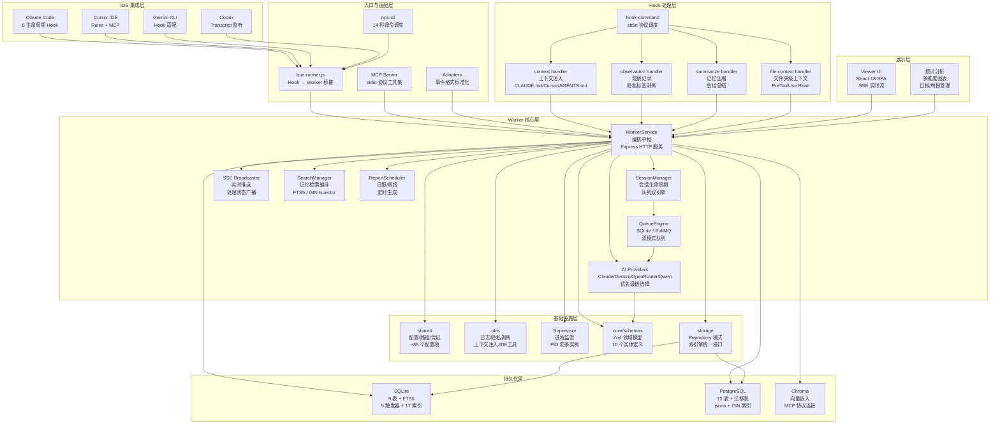

### 2.2 分层与职责

系统采用六层架构，自上而下依次为：

| 层次 | 职责 | 关键模块 | 对应 A 章节需求 |
|------|------|---------|----------------|
| **IDE 集成层** | 承载多种 IDE 的 Hook 接入点，接收用户交互与工具调用事件 | Claude Code Hooks, Cursor Rules, Gemini CLI Adapter, Transcript Watcher | SR-HOOK-01~09, SR-IDE-01~07 |
| **入口与适配层** | 命令调度、协议桥接、事件格式标准化 | npx-cli, bun-runner, hook-command, Adapters, MCP Server | SR-CLI-01~14, SR-IDE-07 |
| **Worker 核心层** | HTTP 服务、会话编排、AI Provider 管理、队列调度、搜索编排 | WorkerService, SessionManager, Providers, QueueEngine, SearchManager, SSE, ReportScheduler | SR-WORKER-01~11, SR-SESSION-01~10, SR-SEARCH-01~09, SR-REPORT-01~04 |
| **Hook 处理层** | 具体的数据采集、压缩和注入逻辑实现 | context, observation, summarize, file-context handlers | SR-OBS-01~10, SR-CTX-01~09 |
| **持久化层** | 双引擎数据存储（SQLite + PostgreSQL），向量嵌入 | SQLite Schema/Repositories, PostgreSQL Schema/Repositories, ChromaSync | SR-STORE-01~12, SR-CHROMA-01~05 |
| **基础设施层** | 配置管理、日志、隐私剥离、进程监管、领域 Schema | shared, utils, supervisor, core/schemas | SR-SEC-01~09, SR-REL-01~10, SR-MNT-01~10, SR-SUPER-01~08 |

### 2.3 关键数据流

系统存在四条核心数据流，与 A 文档 4.1~4.4 一一对应：

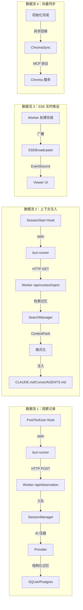

**数据流说明：**

| 流编号 | 起点 | 终点 | 传输方式 | 关键中间件 | 对应 A 需求 |
|--------|------|------|---------|-----------|-----------|
| DF1 | Claude Code PostToolUse | SQLite/PostgreSQL | stdin → HTTP POST → 队列 | 隐私标签剥离、AI Provider 压缩 | SR-OBS-01~10, SR-HOOK-05 |
| DF2 | Claude Code SessionStart | CLAUDE.md/Cursor/AGENTS.md | stdin → HTTP GET → 文件写入 | SearchManager 检索、ContextPack 构建 | SR-CTX-01~09, SR-HOOK-02 |
| DF3 | Worker 处理完成 | Viewer UI | SSE EventSource | SSEBroadcaster 广播 | SR-VIEWER-02, SR-WORKER-06 |
| DF4 | Worker 初始化 | Chroma | MCP stdio | ChromaMcpManager 懒连接 | SR-CHROMA-01~05 |

### 2.4 部署视图

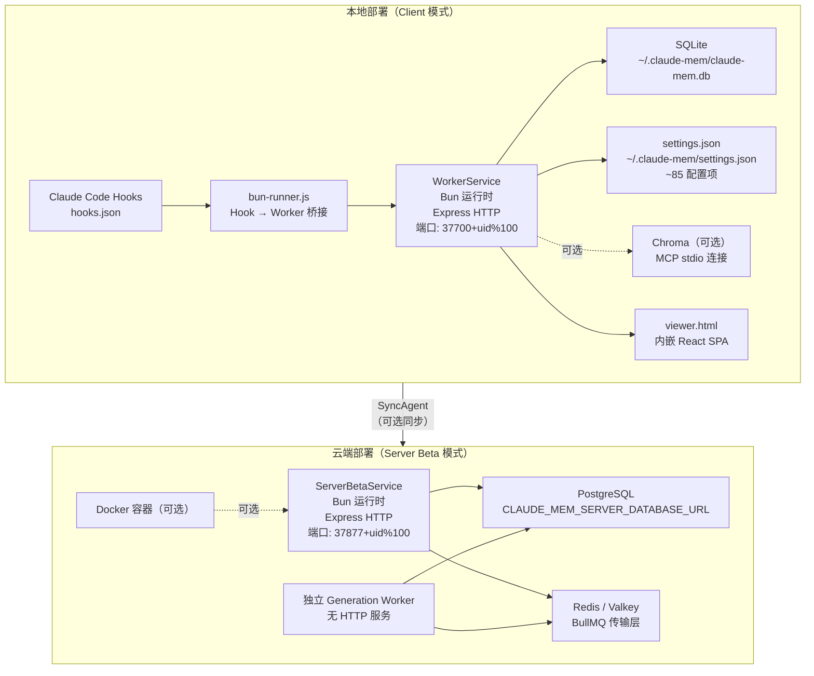

**部署模式对照：**

| 维度 | Client 模式 | Server Beta 模式 |
|------|------------|------------------|
| 数据库 | SQLite (bun:sqlite) | PostgreSQL (pg Pool) |
| 队列引擎 | SQLite QueueEngine | BullMQ + Redis |
| 绑定地址 | 127.0.0.1（防止局域网暴露） | 可配置（支持 0.0.0.0） |
| 鉴权 | 无（单用户） | serverApiGate + API Key Bearer |
| AI 生成 | SessionManager 本地驱动 | BullMQ Worker + Outbox Pattern |
| 租户隔离 | 无（单用户） | project x team 双重隔离 |
| Viewer | 全功能 | 全功能 + 登录页 |
| 路由可见性 | 基础 15 路由组 | + Users/Auth/Sync 路由组 |

## 3. 模块设计

### 3.1 Worker Service 核心模块

WorkerService 是系统的编排中枢，以 Express HTTP 服务器形式运行在用户本地端口上，承载全部 REST API 路由、AI Provider 会话生命周期管理、后台任务调度以及 SyncAgent 启停。

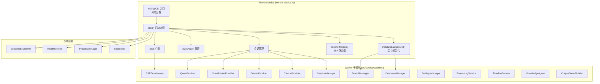

**设计要点：**

| 设计决策 | 方案 | 对应 A 需求 |
|---------|------|-----------|
| 初始化屏障 | `initializationCompleteFlag` 布尔标志（HTTP 中间件快速判断）+ `initializationComplete` Promise（.then() 链式编排）双重机制 | SR-WORKER-03, SR-REL-10 |
| Provider 选择 | 优先级链：Qwen(selected) > OpenRouter(selected) > Gemini(selected) > Qwen(available) > Claude(SDK) | SR-SESSION-02 |
| 错误恢复 | 多层分类：FK 约束最优先拦截 → Provider 分类器 → 模式匹配；会话终止有独立备用链（Gemini → OpenRouter → 放弃） | SR-SESSION-04~07 |
| 路由守卫 | Server 模式 `serverApiGate` 默认拒绝；DB 未就绪时 /api 和 /v1 返回 503（排除 health/readiness/version/chroma-status） | SR-WORKER-03, SR-WORKER-05 |
| 防多实例 | PID 文件存活 + 端口占用双重检查 | SR-WORKER-02 |

### 3.2 CLI 与 Hook 命令模块

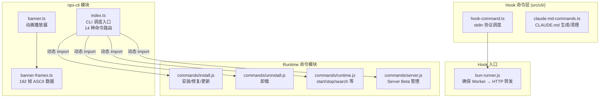

**设计要点：**

| 设计决策 | 方案 | 对应 A 需求 |
|---------|------|-----------|
| 命令路由 | `-` 开头的非 help/version flag 自动视为 install 参数 | SR-CLI-13 |
| 品牌视觉 | 192 帧 ASCII 动画（base64→deflate→帧分隔），非 TTY/CI 自动禁用 | SR-CLI-02 |
| Hook 桥接 | bun-runner 通过 `ensureWorkerStarted()` 确保 Worker 可用后才发送 HTTP 请求 | SR-HOOK-07 |
| Provider 校验 | `--provider` 仅接受 claude/gemini/openrouter | SR-CLI-14 |

### 3.3 AI Provider 与会话管理模块

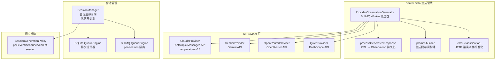

**Provider 选择优先级链设计（对应 SR-SESSION-02）：**

```
1. Qwen (isQwenSelected && isQwenAvailable)
2. OpenRouter (isOpenRouterSelected && isOpenRouterAvailable)
3. Gemini (isGeminiSelected && isGeminiAvailable)
4. Qwen (isQwenAvailable, 不要求 selected) ← 高可用兜底
5. Claude (SDK) ← 终极兜底
```

**错误分类与恢复策略（对应 SR-SESSION-04~07）：**

| 错误类别 | 处理方式 |
|---------|---------|
| FK 约束失败 | 最优先拦截，直接判定 unrecoverable |
| unrecoverable / auth_invalid / quota_exhausted | 终止生成器，不重启 |
| 会话终止模式 | 备用 Provider 链：Gemini → OpenRouter → 放弃并清理 |
| 过时恢复 | 清除 memorySessionId，设置 forceInit=true 强制全新启动 |
| 其他错误 | sessionFailed=true，由 handleGeneratorExit 按策略重启 |

### 3.4 数据存储模块

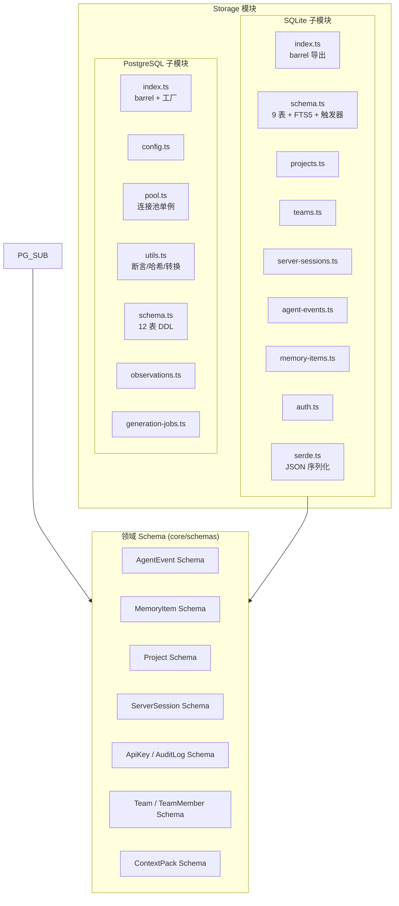

**双引擎设计对照（对应 SR-STORE-01~12）：**

| 维度 | SQLite | PostgreSQL |
|------|--------|-----------|
| 表数量 | 9 张业务表 + 1 FTS5 虚拟表 | 12 张表 + 1 迁移表 |
| 租户隔离 | 无（单用户） | project x team 双重隔离 |
| 全文搜索 | FTS5 (porter unicode61) + 触发器自动同步 | GENERATED tsvector STORED + GIN + websearch_to_tsquery |
| 幂等键 | ON CONFLICT (upsert) | SHA-256 确定性哈希 |
| 状态机 | 简单 status (active/completed/failed) | generation_jobs 有限状态机（5 态），SQL + 代码双重保证 |
| Schema 版本 | v33 | v1 + 迁移记录表 |
| 验证方式 | Zod 双重验证（输入 + 输出） | 类型系统 + Repository 断言 |
| 连接管理 | 同步 bun:sqlite Database | 异步 pg Pool（单例 + 事务包装器） |

### 3.5 搜索与上下文模块

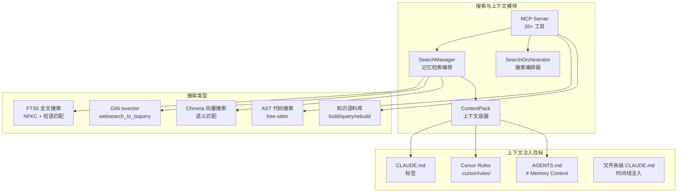

### 3.6 同步与集成模块

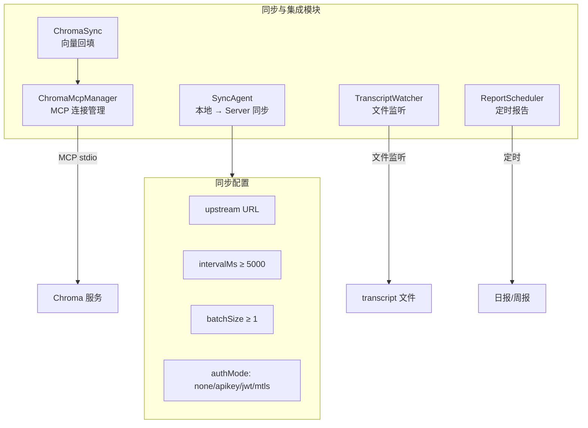

**SyncAgent 安全边界约束（对应 SR-PERF-07）：**

| 参数 | 约束 | 说明 |
|------|------|------|
| intervalMs | ≥ 5000 | 防止过于频繁的轮询 |
| batchSize | ≥ 1 | 保证每次至少同步一条 |
| retryMax | ≥ 0 | 允许关闭重试 |
| authMode | none/apikey/jwt/mtls | 不合法值回退 none |

### 3.7 UI Viewer 模块

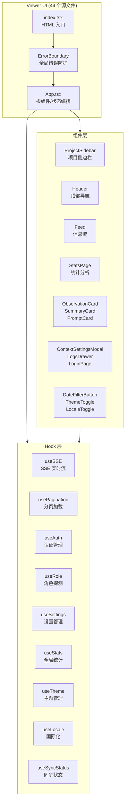

**Viewer 四层架构（对应 SR-VIEWER-01~09）：**

| 层 | 职责 | 关键设计 |
|----|------|---------|
| Hook 层 | 数据获取与状态管理 | useSSE 自动重连（3s 延迟）、usePagination 三类型独立分页 |
| 组件层 | UI 渲染与交互 | Feed 统一三种数据为时间降序列表、IntersectionObserver 无限滚动 |
| 常量层 | API 端点/默认值/时序参数 | 9 个 API 端点常量、30 个设置默认值 |
| 工具层 | 认证/格式化/国际化/去重 | authFetch token 注入、mergeAndDeduplicateByProject id+hash 双键去重 |

### 3.8 共享工具与基础设施模块

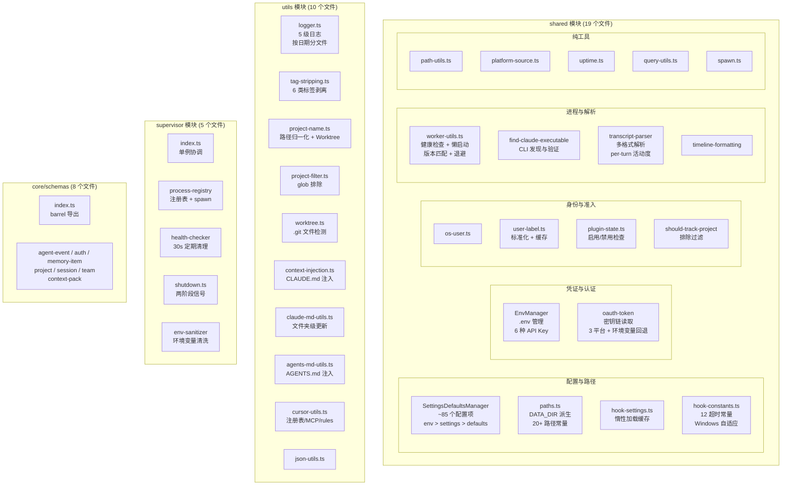

## 4. 核心流程设计

### 4.1 会话记忆处理时序

对应 A 文档 4.1 节（SR-HOOK-05, SR-OBS-01~10, SR-SESSION-01~10）。

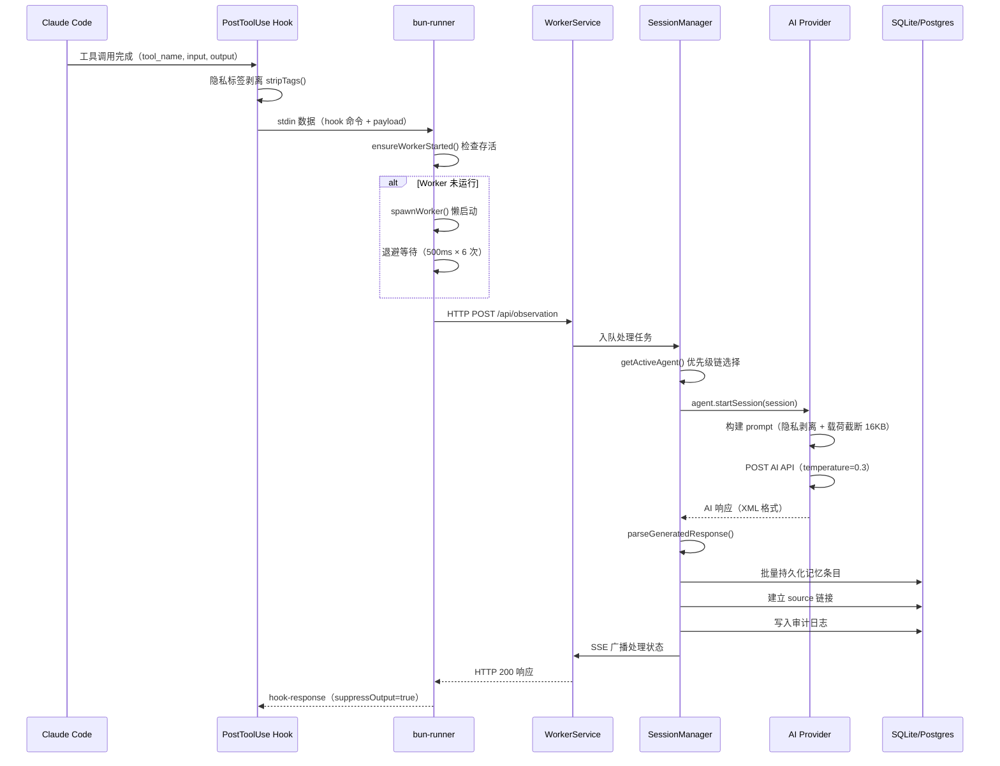

### 4.2 上下文注入时序

对应 A 文档 4.2 节（SR-HOOK-02, SR-CTX-01~09, SR-SEARCH-01~09）。

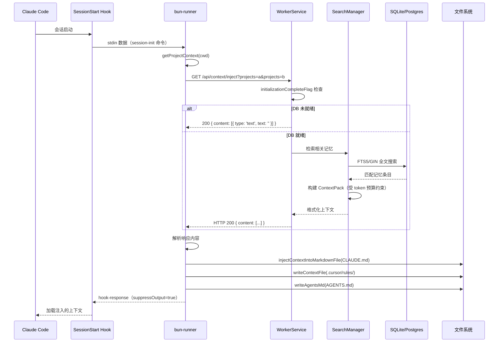

### 4.3 观察记录压缩时序

对应 A 文档 4.3 节（SR-OBS-01~10, SR-SESSION-01~10）。

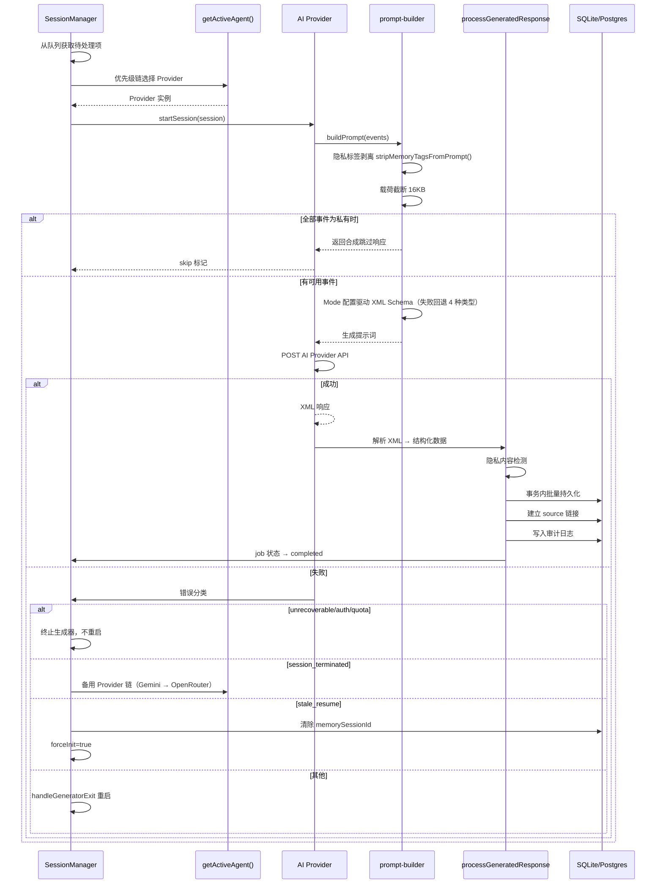

### 4.4 向量同步时序

对应 A 文档 4.4 节（SR-CHROMA-01~05）。

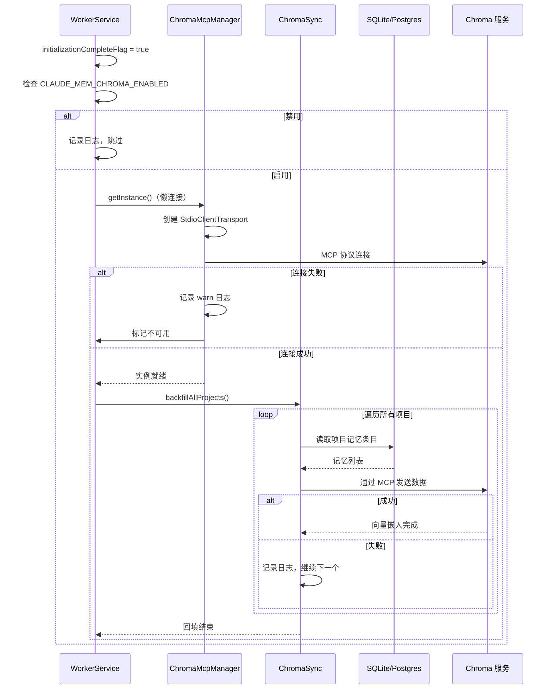

## 5. 数据设计

### 5.1 数据模型（ER 图）

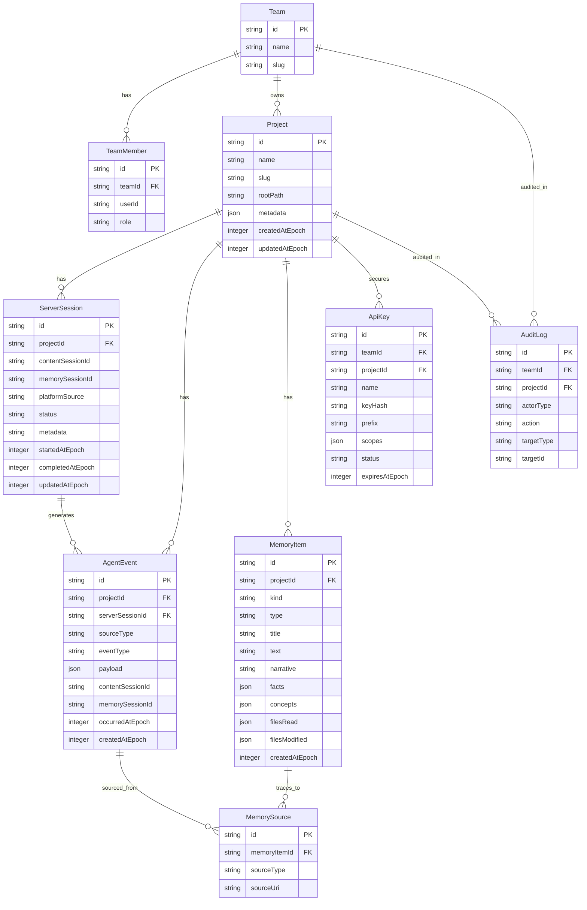

### 5.2 表结构设计

#### SQLite 表结构（对应 SR-STORE-03, SR-STORE-06, SR-STORE-08）

| 表名 | 主要字段 | 索引 | 特殊机制 |
|------|---------|------|---------|
| projects | id, name, slug, rootPath, metadata, timestamps | id (PK), rootPath (UNIQUE PARTIAL) | Zod 双重验证 |
| teams | id, name, slug, metadata, timestamps | id (PK) | Zod 验证 |
| team_members | id, team_id, user_id, role, timestamps | id (PK), team_id+user_id (UNIQUE) | ON CONFLICT 幂等 |
| server_sessions | id, project_id, content_session_id, memory_session_id, platform_source, status, timestamps | id (PK), project_id | status CHECK |
| agent_events | id, project_id, server_session_id, source_type, event_type, payload, timestamps | id (PK), project_id | Zod 验证 |
| memory_items | id, project_id, kind, type, title, text, narrative, facts, concepts, files_read, files_modified, timestamps | id (PK), project_id | Zod 双重验证 |
| memory_sources | id, memory_item_id, source_type, source_uri | id (PK), memory_item_id | legacy 支持 |
| api_keys | id, name, key_hash, prefix, scopes, status, timestamps | id (PK), key_hash (UNIQUE) | SHA-256 存储 |
| audit_log | id, actor_type, target_type, target_id, action, timestamps | id (PK) | 多类型actor |
| memory_items_fts | memory_item_id, content, title, narrative, facts, concepts | FTS5 porter unicode61 | 3 个 AFTER INSERT/UPDATE/DELETE 触发器自动同步 |

**触发器（5 个 BEFORE + 3 个 AFTER）：**

| 触发器 | 类型 | 作用 |
|--------|------|------|
| trg_projects_created_at | BEFORE INSERT | 自动填充 createdAtEpoch |
| trg_projects_updated_at | BEFORE UPDATE | 自动填充 updatedAtEpoch |
| trg_memory_items_created_at | BEFORE INSERT | 自动填充 createdAtEpoch |
| trg_memory_items_updated_at | BEFORE UPDATE | 自动填充 updatedAtEpoch |
| trg_api_keys_created_at | BEFORE INSERT | 自动填充 createdAtEpoch |
| trg_memory_items_fts_insert | AFTER INSERT | 同步 FTS5 |
| trg_memory_items_fts_update | AFTER UPDATE | 同步 FTS5 |
| trg_memory_items_fts_delete | AFTER DELETE | 清理 FTS5 |

#### PostgreSQL 表结构（对应 SR-STORE-04, SR-STORE-07, SR-STORE-09, SR-STORE-10, SR-STORE-12）

| 表名 | 主要字段 | 索引 | 特殊机制 |
|------|---------|------|---------|
| teams | id, name, slug, metadata, timestamps | id (PK) | jsonb metadata |
| projects | id, team_id, name, slug, metadata, timestamps | id (PK), team_id FK | 租户隔离 |
| team_members | team_id, user_id, role, timestamps | team_id+user_id (PK) | ON CONFLICT 幂等 |
| server_sessions | id, project_id, external_session_id, idempotency_key, generation_status, timestamps | id (PK), project_id FK | SHA-256 幂等键 |
| agent_events | id, project_id, server_session_id, source_type, event_type, payload, timestamps | id (PK) | Zod 验证 |
| observations | id, project_id, team_id, content, content_search, generation_key, timestamps | id (PK), generation_key (UNIQUE) | tsvector STORED + GIN |
| observation_sources | id, observation_id, source_type, source_uri, timestamps | id (PK), observation_id FK | 幂等写入（metadata 合并） |
| observation_generation_jobs | id, project_id, team_id, kind, status, attempts, timestamps | id (PK), project_id FK | 有限状态机（5 态） |
| observation_generation_job_events | id, job_id, event_type, message, timestamps | id (PK), job_id FK | INNER JOIN 隔离 |
| api_keys | id, team_id, project_id, name, key_hash, prefix, scopes, status, timestamps | id (PK), key_hash (UNIQUE) | SHA-256 存储 |
| audit_log | id, team_id, project_id, actor_type, actor_id, action, resource_type, resource_id | id (PK) | 多维度审计 |
| server_beta_schema_migrations | version, applied_at | version (PK) | DDL 幂等保证 |

### 5.3 缓存与消息设计

#### 内存缓存

| 缓存 | 所在模块 | 生命周期 | 用途 |
|------|---------|---------|------|
| projectNameCache | utils/project-name.ts | 进程级 | 项目路径归一化结果缓存 |
| projectContextCache | utils/project-name.ts | 进程级 | ProjectContext 缓存 |
| cachedSettings | shared/hook-settings.ts | 进程级 | settings.json 惰性加载缓存 |
| workerPortCache | shared/worker-utils.ts | 进程级 | Worker 端口号缓存 |
| workerHostCache | shared/worker-utils.ts | 进程级 | Worker 主机名缓存 |
| workerAliveOnce | shared/worker-utils.ts | 进程级 | Worker 存活状态单例缓存 |
| userLabelCache | shared/user-label.ts | 进程级 | 用户标签缓存 |
| osUserNameCache | shared/os-user.ts | 进程级 | OS 用户名缓存 |
| logLevelCache | utils/logger.ts | 进程级 | 日志级别缓存 |

#### BullMQ 队列消息（Server Beta）

| 队列名 | Job Kind | 载荷关键字段 |
|--------|----------|------------|
| server_beta_generate_event | event | agentEventId, serverSessionId, projectId, teamId, scope |
| server_beta_generate_event_batch | event-batch | agentEventIds[], serverSessionId, projectId, teamId |
| server_beta_generate_summary | summary | serverSessionId, projectId, teamId |
| server_beta_reindex | reindex | projectId, teamId, scope |

**Job ID 生成策略：** `buildDeterministicJobId(prefix, identifiers)` 使用 `kind + SHA-256(规范 JSON(identifiers))` 生成，不含冒号（BullMQ 分隔符冲突防护）。

## 6. 接口设计

### 6.1 接口设计约定

| 约定 | 说明 | 对应需求 |
|------|------|---------|
| 默认超时 | Worker API 30 秒，健康检查 5 秒 | SR-PERF-01, SR-PERF-02 |
| Windows 适配 | 所有超时自动乘以 1.5 倍系数 | SR-PERF-04 |
| 退出码 | Hook: 0(成功) / 1(非阻塞错误) / 2(阻塞错误)；Worker: 统一 0 | SR-HOOK-09 |
| 初始化屏障 | DB 未就绪时 /api 和 /v1 返回 503（排除 health/readiness/version/chroma-status） | SR-WORKER-03 |
| Server 鉴权 | serverApiGate 默认拒绝策略，Bearer Token 认证 | SR-WORKER-05, SR-SEC-03~04 |
| 请求 ID | X-Request-Id 透传或自动生成（1-64 字符白名单） | server/middleware/request-id.ts |
| 错误响应 | JSON 格式 `{ error, message }` | worker-service.ts 路由守卫 |

### 6.2 对外接口清单

#### Worker HTTP 路由（Client + Server 模式通用）

| 路由组 | 路径前缀 | 主要端点 | 对应需求 |
|--------|---------|---------|---------|
| ViewerRoutes | `/api/viewer/*` | 数据查询 | SR-VIEWER-01~09 |
| SessionRoutes | `/api/sessions/*` | 会话 CRUD | SR-SESSION-01~10 |
| DataRoutes | `/api/data/*` | 数据查询 | SR-WORKER-04 |
| SearchRoutes | 搜索端点 | 记忆搜索 | SR-SEARCH-01~06 |
| ReportRoutes | `/api/reports/*` | 报告管理 | SR-REPORT-01~04 |
| DailyReportRoutes | `/api/daily-reports/*` | 日报管理 | SR-REPORT-02 |
| SettingsRoutes | `/api/settings/*` | 配置读写 | SR-MNT-04~10 |
| LogsRoutes | `/api/logs/*` | 日志查询 | SR-MNT-01~03 |
| MemoryRoutes | `/api/memory/*` | 记忆 CRUD | SR-OBS-05 |
| ServerV1Routes | `/v1/*` | V1 API | SR-WORKER-04 |
| ChromaRoutes | `/chroma/*` | Chroma 管理 | SR-CHROMA-05 |
| AdminRoutes | `/api/admin/*` | 管理操作 | SR-WORKER-04 |
| SyncStatusRoutes | `/api/sync/status` | 同步状态 | SR-WORKER-04 |
| CorpusRoutes | `/api/corpus/*` | 语料库 CRUD | SR-SEARCH-09 |

#### Server Beta 专用路由

| 方法 | 路径 | 认证 | 功能 | 对应需求 |
|------|------|------|------|---------|
| GET | `/healthz` | 无 | 健康检查 | SR-WORKER-04 |
| GET | `/v1/info` | 无 | 服务信息 | SR-WORKER-04 |
| POST | `/v1/events` | write | 单条事件摄入 | SR-WORKER-04 |
| POST | `/v1/events/batch` | write | 批量事件（1-500） | SR-WORKER-04 |
| GET | `/v1/jobs/:id` | read | 作业详情 | SR-WORKER-04 |
| POST | `/v1/jobs/:id/retry` | write | 重试作业 | SR-WORKER-04 |
| POST | `/v1/memories` | write | 手动插入观测 | SR-WORKER-04 |
| POST | `/v1/search` | read | GIN 全文搜索 | SR-WORKER-04 |
| POST | `/v1/context` | read | 上下文打包 | SR-WORKER-04 |
| UsersRoutes | `/api/users/*` | 仅 Server | 用户管理 | SR-WORKER-05 |
| AuthRoutes | `/api/auth/*` | 仅 Server | 认证端点 | SR-WORKER-05 |
| SyncRoutes | `/api/sync/ingest` | 仅 Server | 同步入箱 | SR-WORKER-05 |

#### MCP 工具接口

| 工具名 | 类型 | 运行时 | 功能 | 对应需求 |
|--------|------|--------|------|---------|
| `__IMPORTANT` | 指引 | 全模式 | 3 层搜索工作流 | SR-SEARCH-01~04 |
| `search` | 功能 | worker | 记忆搜索 | SR-SEARCH-01, SR-SEARCH-06 |
| `timeline` | 功能 | worker | 时间线上下文 | SR-SEARCH-02, SR-SEARCH-04 |
| `get_observations` | 功能 | worker | 批量观察获取 | SR-SEARCH-05 |
| `smart_search/unfold/outline` | 功能 | 全模式 | AST 代码搜索 | SR-SEARCH-08 |
| `build/list/prime/query/rebuild/reprime corpus` | 功能 | 全模式 | 语料库管理 | SR-SEARCH-09 |
| `observation_add/search/context` | 功能 | server-beta | 观察 CRUD | SR-WORKER-04 |

#### CLI 命令接口

| 命令 | 功能 | 对应需求 |
|------|------|---------|
| `npx claude-mem install` | 插件安装 | SR-CLI-03 |
| `npx claude-mem start/stop/restart/status` | Worker 生命周期 | SR-CLI-06 |
| `npx claude-mem search` | 记忆搜索 | SR-CLI-07, SR-SEARCH-06 |
| `npx claude-mem server` | Server Beta 管理 | SR-CLI-08 |
| `server api-key create/list/revoke` | API Key 管理 | SR-WORKER-09 |
| `server sync-keys create/list/revoke` | Sync Key 管理 | SR-WORKER-10 |
| `server sync-audit --user` | 同步审计 | SR-WORKER-04 |

### 6.3 关键接口 I/O 详设

#### POST /api/observation（观察记录提交）

| 字段 | 类型 | 必填 | 说明 |
|------|------|------|------|
| tool_name | string | 是 | 工具名称 |
| tool_input | unknown | 否 | 工具输入 |
| tool_response | unknown | 否 | 工具响应 |
| platform_source | string | 否 | 平台来源 |
| cwd | string | 否 | 工作目录 |
| content_session_id | string | 是 | 内容会话 ID |

**响应：** 200 `{ status: 'queued' }` 或错误响应

#### GET /api/context/inject（上下文注入）

| 参数 | 类型 | 说明 |
|------|------|------|
| projects | string[] | 项目 ID 列表（重复键格式） |

**响应：** 200 `{ content: [{ type: 'text', text: '<claude-mem-context>...</claude-mem-context>' }] }`

#### POST /v1/events（Server Beta 事件摄入）

| 字段 | 类型 | 必填 | 说明 |
|------|------|------|------|
| project_id | string | 是 | 项目 ID |
| event_type | string | 是 | 事件类型 |
| payload | object | 是 | 事件载荷 |
| occurred_at_epoch | number | 否 | 发生时间（默认 now） |

**响应：** 200 或 201（含 observation_count, generate_status）

## 7. 配置与环境设计

### 7.1 配置体系

```
环境变量（最高优先级）
    ↓ 覆盖
settings.json (~/.claude-mem/settings.json, ~85 个配置项)
    ↓ 覆盖
SettingsDefaultsManager（代码内默认值）
```

### 7.2 关键配置项

| 配置键/环境变量 | 默认值 | 说明 | 对应需求 |
|---------------|--------|------|---------|
| `CLAUDE_MEM_DATA_DIR` | `~/.claude-mem` | 数据根目录（多账户隔离入口） | SR-MNT-04 |
| `CLAUDE_MEM_WORKER_PORT` | `37700 + uid % 100` | Worker 监听端口 | SR-WORKER-01 |
| `CLAUDE_MEM_SERVER_BIND_HOST` | `127.0.0.1` | 绑定地址 | SR-WORKER-01 |
| `CLAUDE_MEM_RUNTIME` | — | 运行时选择（server-beta） | SR-STORE-02 |
| `CLAUDE_MEM_CHROMA_ENABLED` | `true` | Chroma 向量搜索开关 | SR-CHROMA-01 |
| `CLAUDE_MEM_TRANSCRIPTS_ENABLED` | `true` | Transcript 监听开关 | SR-TRANSCRIPT-01 |
| `CLAUDE_MEM_LOG_LEVEL` | `INFO` | 日志级别（DEBUG/INFO/WARN/ERROR/SILENT） | SR-MNT-02 |
| `CLAUDE_MEM_QUEUE_ENGINE` | `sqlite` | 队列引擎（sqlite/bullmq） | SR-SESSION-09 |
| `CLAUDE_MEM_SERVER_DATABASE_URL` | — | PostgreSQL 连接串 | SR-STORE-02 |
| `CLAUDE_MEM_FOLDER_USE_LOCAL_MD` | `false` | 使用 CLAUDE.local.md | SR-CTX-03 |
| `CLAUDE_MEM_CONTEXT_OBSERVATIONS` | `50` | 每目录观测条数上限 | SR-CTX-08 |
| `CLAUDE_MEM_API_TIMEOUT_MS` | `30000` | Worker API 默认超时 | SR-PERF-01 |

### 7.3 凭证管理设计（对应 SR-SEC-01~09）

```
凭证存储层次：
1. ~/.claude-mem/.env（权限 0o600）
   └─ 6 种 API Key: ANTHROPIC_API_KEY, GEMINI_API_KEY,
      OPENROUTER_API_KEY, DASHSCOPE_API_KEY,
      CLAUDE_MEM_REPORT_QWEN_API_KEY

2. 系统密钥链（OAuth token）
   ├─ macOS: Keychain (security find-generic-password)
   ├─ Windows: Credential Manager (Advapi32.dll CredRead)
   └─ Linux: libsecret (secret-tool lookup)

3. 环境变量回退
   └─ CLAUDE_CODE_OAUTH_TOKEN（CI/headless 环境）

过期检测：expiresAt + 60s 宽限窗口
过期标记：~/.claude-mem/oauth-stale.marker（权限 0o600）
```

### 7.4 多账户隔离设计

所有路径和端口从两个环境变量派生：

```bash
export CLAUDE_MEM_DATA_DIR="$HOME/.claude-mem-work"  # 独立数据目录
export CLAUDE_MEM_WORKER_PORT=37800                   # 独立端口
# 以下全部自动派生：
#   ~/.claude-mem/ → $CLAUDE_MEM_DATA_DIR/
#   claude-mem.db → $DATA_DIR/claude-mem.db
#   settings.json → $DATA_DIR/settings.json
#   .env → $DATA_DIR/.env
#   logs/ → $DATA_DIR/logs/
#   worker.pid → $DATA_DIR/worker.pid
```

## 8. 设计追溯矩阵

| A 需求编号 | B 设计元素 | 设计章节 |
|-----------|-----------|---------|
| SR-HOOK-01~09 | Hook stdin 协议调度 + bun-runner 桥接 + 隐私标签剥离 + 退出码策略 | 3.2, 4.1, 4.2 |
| SR-CLI-01~14 | npx-cli 14 种命令路由 + banner 动画 + 动态 import 延迟加载 | 3.2 |
| SR-WORKER-01~11 | WorkerService Express HTTP + PID 防多实例 + 初始化屏障 + SSE 广播 | 3.1, 3.3 |
| SR-SESSION-01~10 | Provider 优先级链 + 双引擎队列 + 错误分类恢复 + 备用 Provider 链 | 3.3, 4.1, 4.3 |
| SR-OBS-01~10 | observation handler + AI 压缩 pipeline + prompt-builder + XML 解析 | 3.3, 4.1, 4.3 |
| SR-CTX-01~09 | context-injection.ts + claude-md-utils + agents-md-utils + cursor-utils | 3.5, 4.2 |
| SR-SEARCH-01~09 | SearchManager + FTS5/GIN + MCP 工具 + AST 搜索 + 语料库 | 3.5 |
| SR-CHROMA-01~05 | ChromaMcpManager + ChromaSync + MCP stdio + 懒连接 + 静默降级 | 3.6, 4.4 |
| SR-IDE-01~07 | Adapters 标准化 + Cursor utils + Gemini CLI 适配 + Transcript 监听 | 3.2, 3.8 |
| SR-REPORT-01~04 | ReportScheduler + DailyReportRoutes + ReportRoutes | 3.1, 3.7 |
| SR-TRANSCRIPT-01~05 | TranscriptWatcher + transcript-parser（多格式兼容） | 3.6 |
| SR-VIEWER-01~09 | React 18 SPA + useSSE + usePagination + ErrorBoundary + i18n | 3.7 |
| SR-STORE-01~12 | 双引擎 Repository 模式 + Zod Schema + FTS5/GIN + 幂等键 + 状态机 | 3.4, 5.2 |
| SR-SUPER-01~08 | Supervisor 单例 + PID 防复用 + 两阶段信号 + SDK 并发控制 + 环境清洗 | 3.8 |
| SR-PERF-01~07 | 超时常量 + Windows 自适应 + 退避策略 + 版本匹配冷启动 | 3.8, 6.1 |
| SR-SEC-01~09 | tag-stripping + SHA-256 Key + serverApiGate + 环境变量清洗 + .env 0o600 | 3.8, 7.3 |
| SR-REL-01~10 | 优雅关闭顺序 + PID 双重检查 + 孤儿清扫 + MCP 心跳 + 退避等待 | 3.1, 3.8 |
| SR-MNT-01~10 | logger 5 级 + 日期分文件 + settings.json ~85 项 + Schema 版本管理 | 3.8, 7.1 |
