# B-系统设计文档

> 本文档由 code-to-doc 技能基于文件级逆向分析汇总生成（v2 重生成）。
> 生成日期：2026-07-24 ｜ 素材：360 份文件级需求文档 + 12 份模块汇总 ｜ 配套：A-系统需求文档-v2.md
> 图方案：Mermaid 内嵌。本版与 v1 同源（均提炼自 doc/* 下文件级文档与模块汇总），描述系统"如何实现 A"。每个设计元素应能对应 A 的需求编号（SR-）。

---

## 1. 设计总述

claude-mem 的设计围绕"双运行时同构"展开：本地 Worker（单机单用户，SQLite + 进程内队列）与 Server Beta（多租户云端，Postgres + BullMQ + Redis）在领域概念与处理流水线上对齐，但在持久化引擎、租户隔离、队列传输上各有侧重。系统采用严格的分层与解耦纪律——Server Beta 的 generation/middleware/services 子模块被明令禁止依赖本地 worker 的 `src/services/worker/*`（Phase 隔离），两套运行时仅通过"领域 Schema（core）"与"对外接口契约（HTTP/MCP）"间接对齐。本文档自上而下描述架构、模块、流程、数据、接口与配置的设计实现。

### 1.1 设计目标与原则

以下原则从代码风格与分层纪律反推，推断项已标注：

1. **非阻断优先**：Hook 层任何错误以非阻断处理（exit 0 / 静默跳过），绝不阻塞 AI 助手主流程（SR-CLI-06，[cli/_模块汇总.md](src/cli/_模块汇总.md) FR-HC-05~08）。
2. **优雅降级**：Worker 不可用时返回 fallback（FR-workerutils-13）；Provider 不可用走备用链（FR-Session-05）；Banner 解码失败 fail-open（FR-BAN-06）。
3. **最终一致性**：Server Beta 用 Outbox Pattern 替代分布式事务（SR-SRV-07）。
4. **幂等设计**：确定性 jobId / generation_key / ON CONFLICT 三重幂等（SR-SRV-07, SR-STOR-06）。
5. **架构隔离**：Server Beta 与本地 worker 禁止交叉导入（Phase 约束，[server/_模块汇总.md](src/server/_模块汇总.md) §6.1）。
6. **单机单用户基线**：Worker 进程用户即为数据产生者（[shared/_模块汇总.md](src/shared/_模块汇总.md) os-user 备注，推断为简化本地模式的有意设计）。
7. **隐私边界处理**：`<private>` 标签在 hook 层（系统最边缘）剥离，不入库（[utils/_模块汇总.md](src/utils/_模块汇总.md) tag-stripping）。

### 1.2 技术栈总览

| 层次 | 技术 | 证据 |
|------|------|------|
| 运行时 | Bun（全平台，自动安装）/ Node.js | [shared/_模块汇总.md](src/shared/_模块汇总.md) worker-utils FR-workerutils-06 |
| 语言 | TypeScript | 全模块 |
| HTTP 框架 | Express | [services/_模块汇总.md](src/services/_模块汇总.md) server/Server.ts |
| 本地存储 | SQLite（`bun:sqlite`，WAL + mmap） | [storage/_模块汇总.md](src/storage/_模块汇总.md) sqlite/ |
| 云端存储 | PostgreSQL（`pg` Pool） | 同上 postgres/ |
| 队列 | 进程内 PendingMessageStore（本地）/ BullMQ + Redis（Server Beta） | [services/_模块汇总.md](src/services/_模块汇总.md)、[server/_模块汇总.md](src/server/_模块汇总.md) |
| 向量检索 | ChromaDB（MCP） | [services/_模块汇总.md](src/services/_模块汇总.md) sync/ChromaSync |
| Schema 校验 | Zod | [core/_模块汇总.md](src/core/_模块汇总.md) |
| 前端 | React 18 + Vite（SPA） | [ui/viewer/_模块汇总.md](src/ui/viewer/_模块汇总.md) |
| 协议 | MCP（stdio） | [servers/_模块汇总.md](src/servers/_模块汇总.md) |
| 凭证 | OS 密钥链 / `.env`（0o600）/ API Key（SHA-256） | [shared/_模块汇总.md](src/shared/_模块汇总.md)、[server/_模块汇总.md](src/server/_模块汇总.md) |
| 代码解析 | tree-sitter | [servers/_模块汇总.md](src/servers/_模块汇总.md) smart_* |

> 精确版本号需查阅根 `package.json`（散件，未在本批汇总范围）。Bun/uv 每日升级策略见项目 CLAUDE.md。

---

## 2. 系统架构设计

### 2.1 系统架构图

下图以纵向分层展示 claude-mem 的整体架构。接入层接收多平台事件，经 cli 处理层标准化与分发，进入应用层（本地 Worker 或 Server Beta）；应用层向下依赖领域 Schema 与双引擎数据层；数据层旁挂向量同步与文件系统；横切层（shared/utils/supervisor）贯穿全栈。Server Beta 与本地 Worker 在应用层平行，不直接依赖。

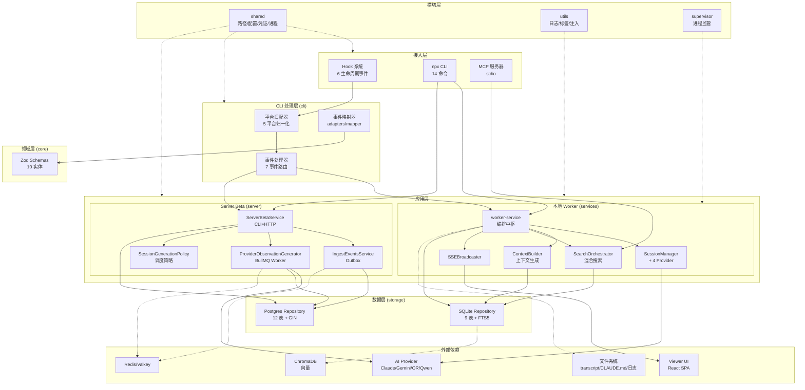

该架构的关键设计决策是：**本地 Worker 与 Server Beta 共享领域 Schema（core）但对数据层与队列实现完全独立**。Server Beta 不复用本地 SessionStore/ActiveSession/WorkerRef，而是以 Postgres 为权威源、BullMQ 为传输层重建了一套对等流水线（[server/_模块汇总.md](src/server/_模块汇总.md) §1）。

### 2.2 分层与职责

| 层 | 职责 | 关键文件 | 层间依赖规则 |
|----|------|---------|-------------|
| 接入层 | 接收外部事件/命令 | hooks.json, npx-cli/index.ts, servers/mcp-server.ts | 仅向下依赖 CLI 处理层 |
| CLI 处理层 | 输入标准化、事件路由、输出格式化 | cli/hook-command.ts, cli/adapters/*, cli/handlers/* | 依赖 shared + 应用层（HTTP 调用） |
| 应用层 | 业务编排、AI 生成、搜索、上下文 | services/worker-service.ts, server/ServerBetaService.ts | 依赖领域层 + 数据层 + 横切层 |
| 领域层 | 实体 Schema 与类型契约 | core/schemas/* | 仅依赖 zod，无内部依赖 |
| 数据层 | 持久化与检索 | storage/sqlite/*, storage/postgres/* | 依赖领域层（Zod 校验）+ 外部 DB |
| 横切层 | 路径/配置/凭证/日志/进程 | shared/*, utils/*, supervisor/* | 被所有层依赖，自身仅依赖底层纯工具 |

**关键依赖约束**：
- Server Beta 的 `services/`、`middleware/`、`generation/` 子模块不得 import `src/services/worker/*`（Phase 5/9 隔离约束，[server/_模块汇总.md](src/server/_模块汇总.md) §6.1）。
- error-classification.ts 在 Server Beta 内有本地副本，禁止从 worker 导入。
- `claude-md-commands.ts` 反向直接用 `bun:sqlite` 绕过 SessionStore（[cli/_模块汇总.md](src/cli/_模块汇总.md) 备注 3，推断因 SessionStore 缺少按文件路径模糊查询）。

### 2.3 关键数据流

下图展示三条关键数据在系统内的流转路径：观测捕获流（写入）、上下文注入流（读出）、Server Beta 异步生成流（队列驱动）。

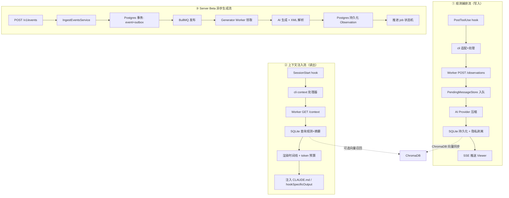

写入流是同步链路（hook→Worker→DB），读出流也是同步链路（hook→Worker→DB→注入），两者共享本地 SQLite。Server Beta 队列流是异步链路（HTTP 立即返回 → 后台 BullMQ Worker 处理），通过 Outbox 保证一致性。ChromaDB 向量同步作为旁路（[services/_模块汇总.md](src/services/_模块汇总.md) sync/ChromaSync）。

### 2.4 部署视图

claude-mem 支持多种部署形态，证据来自构建与运行时配置：

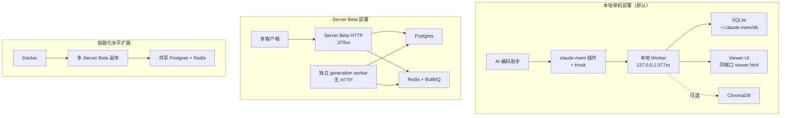

- **本地部署**：Bun 运行 Worker，端口 `37700 + uid%100`，固定 127.0.0.1 绑定（[services/_模块汇总.md](src/services/_模块汇总.md) §5 端口与网络）。
- **Server Beta daemon**：CLI `server start` 以 daemon 模式启动，PID/端口/状态文件落 `~/.claude-mem/`（[server/_模块汇总.md](src/server/_模块汇总.md) §5.5）。
- **独立 worker 进程**：`server worker start` 启动无 HTTP 的 generation worker，通过 `await new Promise<void>(() => {})` 永久阻塞保持 BullMQ Worker 运行（[server/_模块汇总.md](src/server/_模块汇总.md) §6.2 备注）。
- **容器化**：通过 `/.dockerenv` 与 `CLAUDE_MEM_DOCKER` 检测 Docker 环境（FR-factory-04）。
- **多账号隔离**：`CLAUDE_MEM_DATA_DIR` 环境变量派生全部路径，端口 `CLAUDE_MEM_WORKER_PORT` 可固定（项目 CLAUDE.md Multi-account）。

> 素材来源：[services/_模块汇总.md](src/services/_模块汇总.md)、[server/_模块汇总.md](src/server/_模块汇总.md)、[shared/_模块汇总.md](src/shared/_模块汇总.md)。

---

## 3. 模块设计

模块划分依据业务域与职责，按重要性分核心/重要/支撑三档。Server Beta（server/）作为相对独立、规模较大、可自成一体部署的单元，标记为子系统。

### 3.1 CLI 处理模块（核心）

**职责总述**：前端入口层，接收多平台 hook JSON，归一化、路由、格式化输出。采用"适配器-处理器"双层架构。

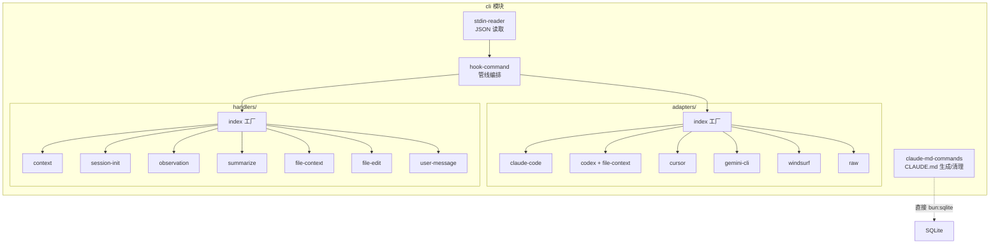

| 组成文件 | 职责 | 文件级文档 |
|---------|------|-----------|
| hook-command.ts | 管线编排器（读→适配→处理→格式化→输出→退出） | cli/hook-command.ts.md |
| adapters/* | 5 平台 + raw 归一化为 NormalizedHookInput | cli/adapters/*.ts.md |
| handlers/* | 7 事件处理器，与 Worker 通信 | cli/handlers/*.ts.md |
| claude-md-commands.ts | CLAUDE.md 自动生成/清理（独立子系统） | cli/claude-md-commands.ts.md |
| npx-cli/index.ts | `npx claude-mem` 14 命令路由 | npx-cli/index.ts.md |

**关键设计决策**：
- 平台标识在 hook-command 统一注入，但 Windsurf 在 normalizeInput 内部自写（不一致，未证实是否有意）。
- HookResult 同时含 `decision`（block/approve，Codex）与 `hookSpecificOutput.permissionDecision`（allow/deny，Claude Code PreToolUse），双决策字段语义相似但作用于不同平台层级。
- 非阻断策略分级：适配器拒绝/transcript 缺失/Worker 失败 = 非阻断；其他错误 = 阻断（FR-HC-05~08）。

> 素材来源：[cli/_模块汇总.md](src/cli/_模块汇总.md)、[npx-cli/_模块汇总.md](src/npx-cli/_模块汇总.md)。

### 3.2 本地 Worker 服务模块（核心）

**职责总述**：本地 HTTP Worker 服务编排中枢，向下管理 18 子目录约 160 文件。以 worker-service.ts（1673 行）为核心。

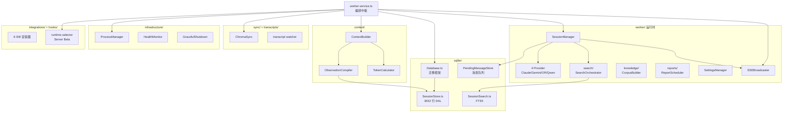

| 子模块 | 职责 | 关键文件 |
|--------|------|---------|
| worker/ | 会话管理、Provider、搜索、知识库、报告、设置 | worker/SessionManager.ts, worker/{Provider}Provider.ts, worker/search/, worker/knowledge/, worker/reports/ |
| sqlite/ | 数据持久层 + 迁移 + FTS5 + 消息队列 | sqlite/Database.ts, sqlite/SessionStore.ts (3632 行), sqlite/SessionSearch.ts, sqlite/PendingMessageStore.ts |
| context/ | 上下文生成（查询→渲染→拼接） | context/ContextBuilder.ts, context/ObservationCompiler.ts, context/TokenCalculator.ts |
| sync/ | Chroma 向量同步 + 上游同步代理 | sync/ChromaSync.ts, sync/SyncAgent.ts |
| transcripts/ | Claude Code JSONL transcript 监听 | transcripts/watcher.ts, transcripts/processor.ts |
| infrastructure/ | 进程管理、健康监控、优雅关闭、worktree 领养 | infrastructure/ProcessManager.ts, infrastructure/GracefulShutdown.ts |
| integrations/ | 6 IDE hooks 安装器 + Telegram 通知 | integrations/*.ts |
| hooks/（services 内） | 运行时选择器（Worker vs Server Beta） | hooks/runtime-selector.ts, hooks/server-beta-client.ts |

**关键设计决策与债务**：
- worker-service.ts 是顶层编排中枢，启动顺序固定：模式→迁移→报告→DB→搜索→Transcript→Chroma→MCP（FR-Lifecycle-03）。
- **双迁移体系并存**：Database.ts 的 DatabaseManager + MigrationRunner 与 SessionStore 内部迁移同时运行（services 汇总备注 2，技术债）。
- **SessionStore 体积问题**：3632 行承载 43 迁移 + 60+ 方法，是技术债集中点（services 汇总备注 1）。
- Provider 选择优先级主链（Qwen>OR>Gemini>Claude）与备用链（Gemini>OR>放弃）不一致；Qwen 可用性检查不要求 isQwenSelected()（推断刻意但缺文档，services 汇总备注 5）。
- MCP loopback 自检：启动后通过 StdioClientTransport 连接自身 MCP Server 做 60s 超时健康检查，失败仅记日志不阻塞（services 汇总备注 10）。

> 素材来源：[services/_模块汇总.md](src/services/_模块汇总.md)。

### 3.3 Server Beta 子系统（核心·子系统）

**职责总述**：多租户云端记忆服务后端，刻意与本地 worker 解耦，Postgres 权威源 + BullMQ 传输 + Outbox 一致性。

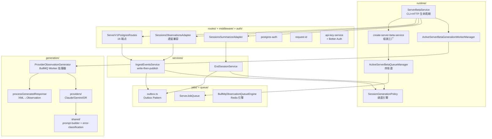

| 子模块 | 职责 | 关键文件 |
|--------|------|---------|
| runtime/ | 服务生命周期、组装工厂、Worker/Queue 管理器、会话仓库、调度策略 | runtime/ServerBetaService.ts, runtime/create-server-beta-service.ts, runtime/SessionGenerationPolicy.ts |
| routes/ + middleware/ + auth/ | V1 REST API、遗留兼容适配器、认证鉴权、请求 ID | routes/v1/ServerV1PostgresRoutes, middleware/postgres-auth, auth/api-key-service, auth/auth (Better Auth) |
| services/ | 事件摄入（write-then-publish）、会话结束 | services/IngestEventsService.ts, services/EndSessionService.ts |
| generation/ | BullMQ Worker 处理器、XML 解析持久化、AI Provider、prompt 构建、错误分类 | generation/ProviderObservationGenerator.ts, generation/processGeneratedResponse.ts, generation/providers/* |
| jobs/ + queue/ | BullMQ 封装、Outbox、队列引擎 | jobs/outbox.ts, jobs/ServerJobQueue.ts, queue/BullMqObservationQueueEngine.ts |
| mcp/ | MCP 协议表面（6 工具 + 2 资源 + 1 prompt） | mcp/register.ts, mcp/tools.ts |

**关键设计决策**：
- **Outbox Pattern**：先写 Postgres outbox 行再发 BullMQ，BullMQ 发布失败不回滚事务，启动时 reconcileOnStartup 重发残留（FR-outbox-01~12）。
- **双车道队列**：event 车道 + summary 车道分离，各注册停滞任务观察器（FR-wkmgr-01~03）。
- **attempts: 1000000**：让 BullMQ 内置重试"永不真正耗尽"，实际重试由 markGenerationFailed 管理（queue 汇总备注 1）。
- **健康端点永不抛异常**：collectQueueLaneMetrics 在实例检查失败时返回空数组（runtime 汇总备注 2）。
- **永久阻塞保持 worker**：runServerBetaGenerationWorker 用 `await new Promise<void>(() => {})` 阻塞主线程（runtime 汇总备注 3）。

> 素材来源：[server/_模块汇总.md](src/server/_模块汇总.md)。

### 3.4 领域 Schema 模块（重要）

**职责总述**：纯 Schema 定义层，以 Zod 定义 10 实体 + 创建 Schema，推导 TS 类型，barrel 统一导出 52 符号。不含业务逻辑或持久化。

模块组成极简：8 文件（7 实体 Schema + 1 barrel），仅 `context-pack.ts` 内部依赖 `memory-item.ts`，其余互相独立，均仅依赖 zod。详见 [core/_模块汇总.md](src/core/_模块汇总.md) §3 结构图。

> 素材来源：[core/_模块汇总.md](src/core/_模块汇总.md)。

### 3.5 持久化模块（核心）

**职责总述**：双引擎持久化层，Repository 模式封装 SQL，向上暴露领域模型。SQLite（本地）与 Postgres（Server Beta）平行独立，无交叉依赖。

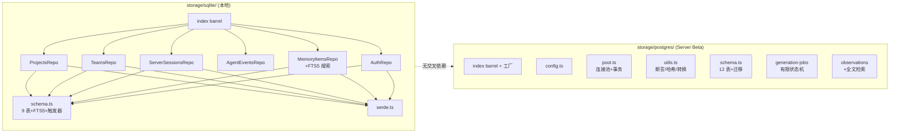

**双引擎差异设计**（详见 [storage/_模块汇总.md](src/storage/_模块汇总.md) §5.2）：

| 维度 | SQLite 设计 | Postgres 设计 |
|------|------------|--------------|
| 租户隔离 | 无（单用户） | project × team 双重 + 归属断言 |
| JSON | TEXT + serde | 原生 jsonb |
| 全文搜索 | FTS5 虚拟表 + 触发器同步 | GENERATED tsvector STORED + GIN + websearch_to_tsquery |
| 幂等 | ON CONFLICT upsert | SHA-256 确定性哈希键 |
| 状态机 | session 简单 status | generation_jobs 五态有限状态机（SQL+代码双保证） |
| 外键 | 大量物理外键（CASCADE/SET NULL） | 仅 projects→teams 物理外键，余应用层断言 |

**关键设计决策与债务**：
- Postgres 版 ApiKey/Projects/Teams/ServerSessions 与 SQLite 版字段不对齐，推断处于不同演进阶段（storage 汇总 §6.1，技术债）。
- SQLite 大量物理外键与"禁用物理外键"规范冲突（以代码为准，storage 汇总 §6.2）。
- generation_jobs 状态机用 SQL CHECK + 代码断言双重保证合法转换（FR-JOB-04~05）。

> 素材来源：[storage/_模块汇总.md](src/storage/_模块汇总.md)。

### 3.6 基础设施模块（重要·含 shared + supervisor + utils）

**职责总述**：横切关注点。shared 是底层公共桩（路径/配置/凭证/进程/身份/准入/工具），supervisor 是进程监管器，utils 是通用工具集（日志/标签/注入/IDE 集成）。

shared 内部按 5 子域分层（详见 [shared/_模块汇总.md](src/shared/_模块汇总.md) §3）：纯工具层（无依赖）→ 配置与路径层 → 身份与准入层 → 凭证与认证层 → 进程与解析层。

| 子模块 | 职责 | 关键设计 |
|--------|------|---------|
| shared/paths + SettingsDefaultsManager | 路径解析三级（env→settings→默认）+ 配置 85 字段 + BOM/嵌套扁平/DASHSCOPE 迁移 | 环境变量优先 |
| shared/EnvManager + oauth-token | 凭证加载（0o600）+ 隔离环境 + OS 密钥链 OAuth | 解决 #2215/#2375 泄漏 |
| shared/worker-utils | Worker 存活保证 + 版本回收 + 冷启动退避 + 失败计数阻断 | 6 次指数退避，达阈值 exit(2) |
| shared/find-claude-executable | Claude CLI 发现与验证 | settings→PATH→which，--version 验证 |
| shared/should-track-project + user-label | 项目准入 + 用户标签解析 | 排除列表 + 原子写入 |
| supervisor/* | PID 文件四态 + 子进程注册 + 两阶段信号关停 + SDK 并发控制 + 环境清洗 | waitForSlot 硬上限 10，PID 复用防护 |
| utils/logger | 5 级别结构化日志 + 关联 ID + 按日期分文件 | 降级 stderr |
| utils/tag-stripping | 6 类 XML 标签剥离 + 计数 | 隐私边界处理 |
| utils/context-injection + claude-md-utils + agents-md-utils | CLAUDE.md/AGENTS.md 上下文注入 | 标签替换 + 原子写入 |
| utils/project-name + worktree + project-filter | 项目标识 + worktree 检测 + glob 排除 | 缓存归一化路径 |

**关键设计决策**：
- worker-utils 的 executeWithWorkerFallback 对 429/5xx 返回 fallback 但对 4xx 返回原始响应，策略不一致（shared 汇总备注 13）。
- transcript-parser 的 FUTURE_SKEW_MS 与 TRANSCRIPT_FUTURE_SKEW_MS 值相同（60000ms）但分立定义，推断有意隔离（shared 汇总备注 21）。
- supervisor 用 PID 启动 token（Linux /proc/stat 第 19 字段）防 PID 复用（FR-PR-02）。
- pgid 被赋值为 pid（process-registry.ts:586），变量名暗示可能有覆盖场景（未证实，supervisor 汇总备注 4）。

> 素材来源：[shared/_模块汇总.md](src/shared/_模块汇总.md)、[supervisor/_模块汇总.md](src/supervisor/_模块汇总.md)、[utils/_模块汇总.md](src/utils/_模块汇总.md)。

### 3.7 MCP 服务器与接入适配模块（重要·含 servers + adapters）

**职责总述**：servers 是 MCP 服务器主入口（stdio），双运行时路由；adapters 是统一事件接入边界（Claude Code hook payload → CreateAgentEvent）。

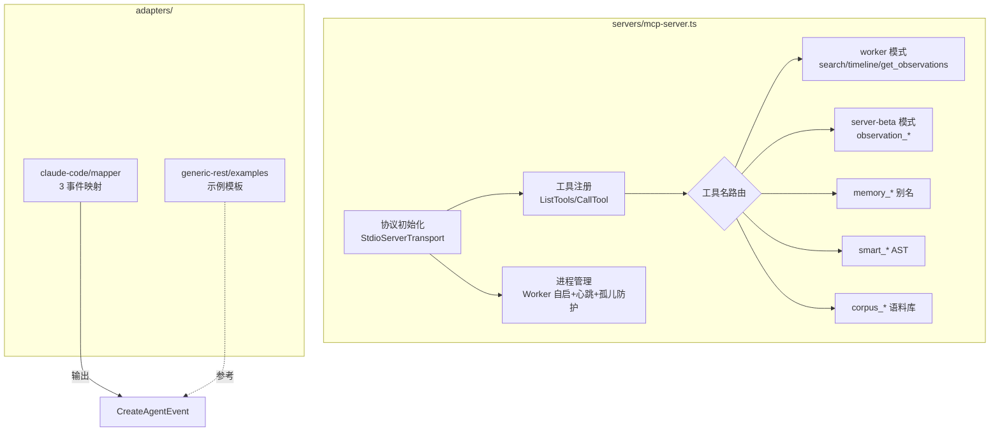

**关键设计决策**：
- `__IMPORTANT` 工具名双下划线前缀，推断为在工具列表排序最前引导 LLM 阅读工作流（未证实）。
- MCP 服务器 console.log 劫持保护协议不受 stdout 污染（FR-MCPServer-02）。
- fatal catch 用 exit(0) 而非 exit(1)，遵循不阻塞宿主终端策略（servers 汇总备注）。
- adapters mapper 兼容 tool_use_id/toolUseId 双命名（命名风格迁移期，未证实）。

> 素材来源：[servers/_模块汇总.md](src/servers/_模块汇总.md)、[adapters/_模块汇总.md](src/adapters/_模块汇总.md)。

### 3.8 Viewer UI 模块（重要）

**职责总述**：React SPA，Worker HTTP 内嵌 viewer.html。SSE 实时流 + 配置编辑 + 统计分析 + 报表管理。44 文件按 Hook/组件/常量/工具四层组织。

模块内部结构详见 [ui/viewer/_模块汇总.md](src/ui/viewer/_模块汇总.md) §3 完整组成图。核心层次：

| 层 | 职责 | 关键组件 |
|----|------|---------|
| 入口 | HTML 渲染 + 错误防护 | index.tsx, ErrorBoundary |
| Hook 层 | 数据获取与状态管理 | useSSE, usePagination, useAuth, useRole, useSettings, useStats, useContextPreview 等 |
| 组件层 | UI 渲染与交互 | App, Header, ProjectSidebar, Feed, StatsPage, ObservationCard/SummaryCard/PromptCard, ContextSettingsModal, LogsModal |
| 常量层 | API 端点/默认值/时序 | constants/api.ts, settings.ts, timing.ts |
| 工具层 | 认证/格式化/国际化/去重 | utils/api.ts, data.ts, i18n.ts, formatters.ts |

**关键设计决策**：
- SSE 重连固定 3s 无指数退避（推断网络长时间不可达时高频重连，ui 汇总 RN-SSE-01）。
- 分页 API 数据不含 user_label，推断服务端通过 userLabel 查询参数过滤（RN-App-02）。
- authFetch 在 localStorage 不可用时静默降级为无认证 fetch（推断删除可能因缺 token 失败，RN-PS-06）。
- 保存状态判断用字符串包含 '✓'/'✗'（推断临时 UI hack，RN-Modal-01）。
- 跨组件通信用 window 自定义事件而非 React Context（推断因 locale 存于 localStorage，RN-Locale-01）。

> 素材来源：[ui/viewer/_模块汇总.md](src/ui/viewer/_模块汇总.md)。

---

## 4. 核心流程设计

与 A §4 的业务一一对应，每业务给出实现要点与时序图。

### 4.1 观测捕获与生成（本地 Worker）

**实现要点**：PostToolUse hook → cli observation 处理器 → Worker POST → PendingMessageStore 入队 → SessionManager 驱动 Provider → 持久化 + 隐私剥离 → SSE 广播。事务边界在 SessionStore 单条写入（基于 memory_session_id + content_hash 去重，FR-OBS-01）。

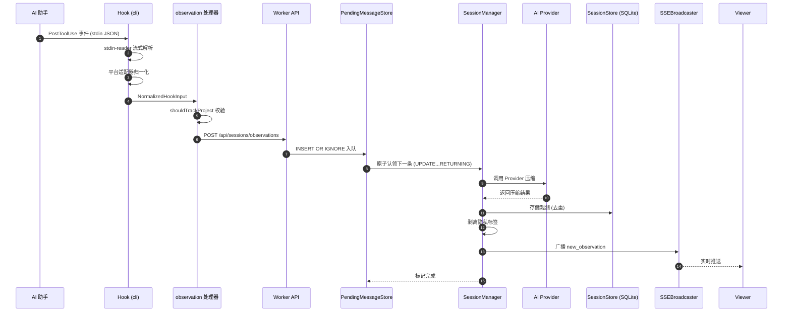

**关键步骤说明**：
- 入参校验：observation 处理器跳过无 toolName、cwd 缺失抛异常、不追踪项目跳过（FR-OBS-02~04）。
- 异常处理：Worker 不可用静默跳过（FR-OBS-08）；Server Beta 模式可回退 Worker（FR-OBS-06）。
- 返回契约：hook 输出 JSON 到 stdout，按 exitCode 退出（非阻断）。

> 素材来源：[cli/_模块汇总.md](src/cli/_模块汇总.md)、[services/_模块汇总.md](src/services/_模块汇总.md)。

### 4.2 上下文注入（SessionStart / UserPromptSubmit）

**实现要点**：context 处理器 → Worker GET /api/context → ContextBuilder 查询 → ObservationCompiler 合并时间线 → TokenCalculator 预算 → 渲染 → 注入。无显式事务（读操作）。

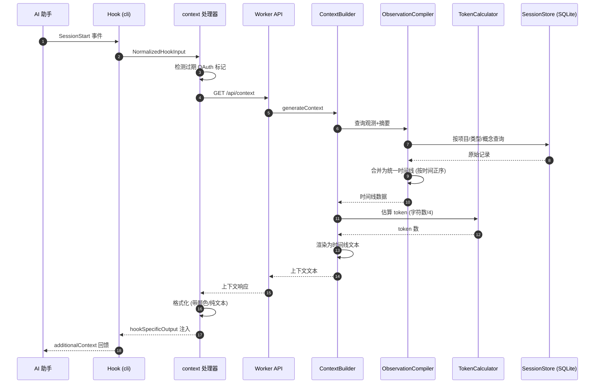

**关键步骤说明**：session-init 跳过私有会话语义注入（FR-SI-07）；Claude Code 平台用带颜色 API 路径（FR-CTX-05）；Server Beta 模式 session-init 不执行语义注入（cli 汇总备注 5）。

> 素材来源：[cli/_模块汇总.md](src/cli/_模块汇总.md)、[services/_模块汇总.md](src/services/_模块汇总.md)。

### 4.3 Server Beta 事件摄入与异步生成

**实现要点**：HTTP 同步链（认证→Zod→Postgres 事务写 event+outbox→按策略发 BullMQ→立即响应）+ BullMQ 异步链（Generator 领取→scope 检测→outbox 锁定→AI 生成→XML 解析→Postgres 事务持久化→状态机推进）。两个事务边界：摄入事务（IngestEventsService）、生成事务（processGeneratedResponse）。

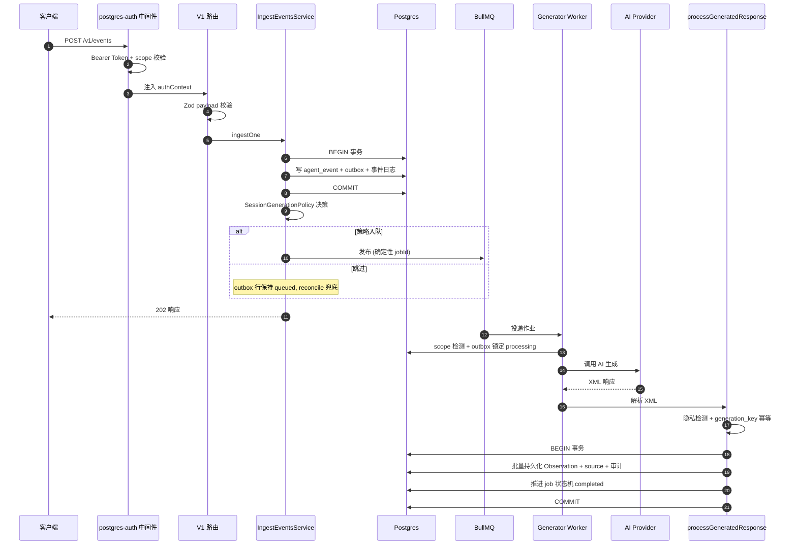

**关键步骤说明**：
- 入参校验：Zod payload 校验失败返回 400（FR-VAL-01）；scope mismatch 检测（FR-SCP-01）；API Key 撤销/过期检查（FR-REV-01）。
- 事务边界：摄入事务原子写 event+outbox+日志（FR-ingest-01）；生成事务内重新加载 job，终态则跳过（FR-TSC-01）。
- 异常处理：错误分类决定重试（FR-ERR-01）；BullMQ 发布失败不回滚事务（FR-ingest-07）；失败 job 标 queued（可重试）或 failed（FR-MGF-01）。
- 幂等：jobId = kind + SHA-256（FR-JOBID-01），不含冒号（FR-JOBID-02）；generation_key UNIQUE（FR-IDM-01）。

> 素材来源：[server/_模块汇总.md](src/server/_模块汇总.md)。

### 4.4 会话摘要生成（Stop hook）

**实现要点**：summarize 处理器 → transcript-parser 提取最后 assistant 消息 + per-turn 活跃度 → 剥离 memory 标签 → Worker POST summarize → AI 生成 → 持久化为 kind=summary MemoryItem。

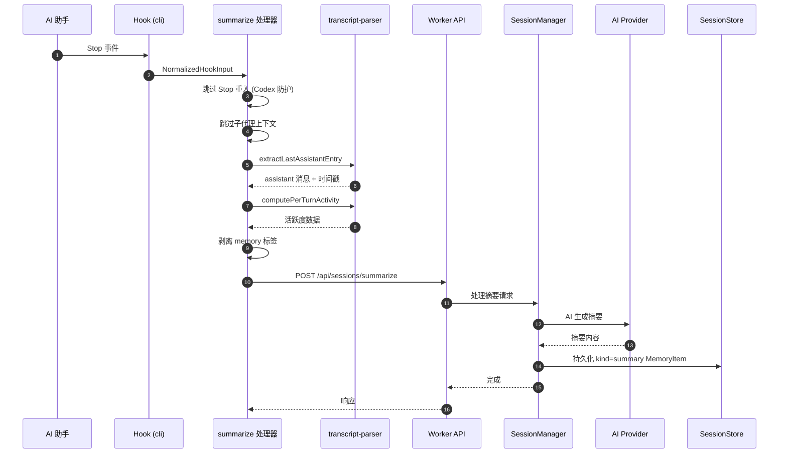

> 素材来源：[cli/_模块汇总.md](src/cli/_模块汇总.md)、[shared/_模块汇总.md](src/shared/_模块汇总.md)。

### 4.5 文件级上下文注入（PreToolUse）

**实现要点**：file-context 处理器 → 从 toolInput 提取候选文件 → 并行查询 Worker → 按会话去重 + 相关性排序 → 按日期分组格式化 → PreToolUse 注入。

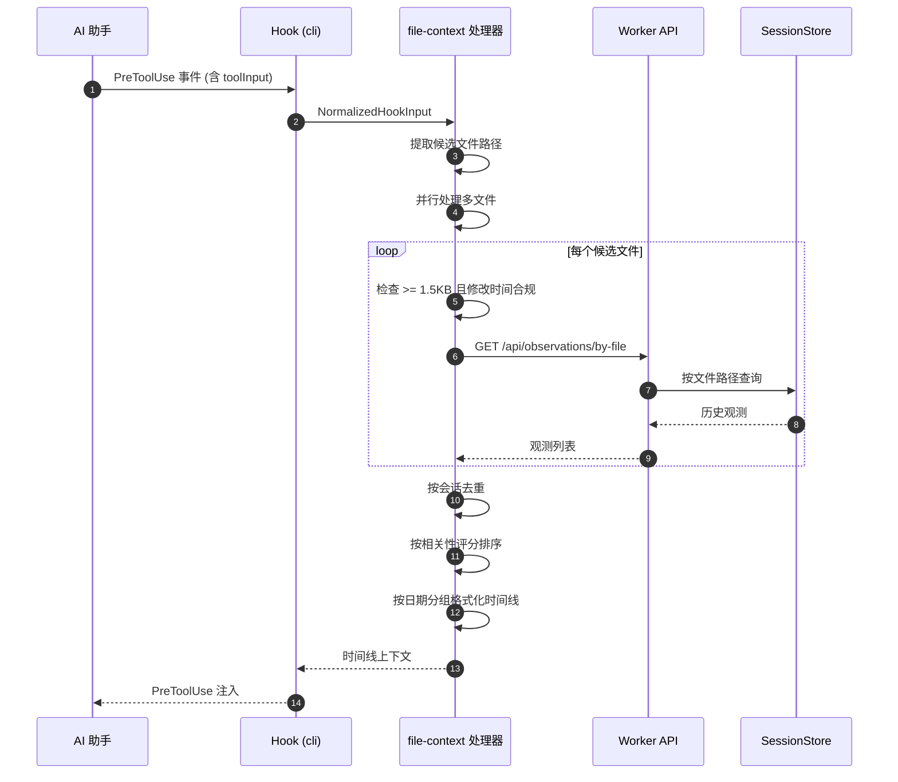

> 素材来源：[cli/_模块汇总.md](src/cli/_模块汇总.md)。

---

## 5. 数据设计

### 5.1 数据模型（ER 图）

核心实体关系（纵向 ER，按聚合层次）。本地 SQLite 与 Server Beta Postgres 在领域概念对齐，物理实现见 §5.2。

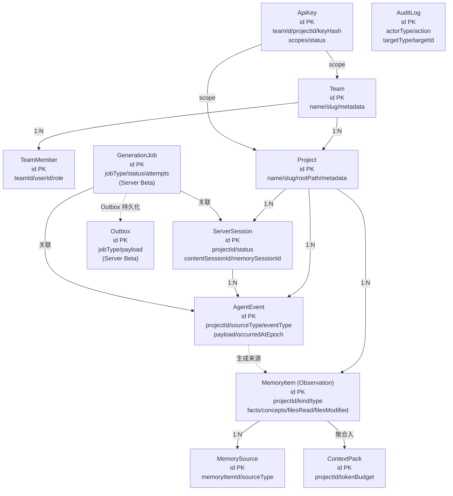

### 5.2 表结构设计

**SQLite 核心表（本地，9 业务表 + FTS5 虚拟表，来源 [storage/_模块汇总.md](src/storage/_模块汇总.md) §5.1）**：

| 表 | 主键 | 核心用途 | 特殊设计 |
|----|------|---------|---------|
| projects | id | 项目 | 物理外键 |
| teams / team_members | id | 团队与成员 | CASCADE |
| server_sessions | id | 服务会话 | status: active/completed/failed |
| agent_events | id | Agent 事件 | sourceType 枚举 |
| memory_items | id | 记忆条目（观测） | kind 枚举 + 数组字段 JSON 序列化 |
| memory_sources | id | 记忆来源 | legacy 追溯 |
| api_keys | id | API Key | status: active/revoked |
| audit_log | id | 审计日志 | actorType 枚举 |
| memory_items_fts | 虚拟表 | FTS5 全文索引 | AFTER 触发器同步 |

**Postgres 核心表（Server Beta，12 表 + 迁移表，来源同上）**：

| 表 | 核心用途 | 特殊设计 |
|----|---------|---------|
| teams / projects / team_members | 多租户基础 | project × team 双重隔离 |
| api_keys | API Key（SHA-256 哈希） | scope jsonb |
| audit_log | 审计 | actorId/resourceType/resourceId（命名与 SQLite 不同） |
| server_sessions | 服务会话 | 幂等 SHA-256 键 + generation 状态机字段 |
| agent_events | Agent 事件 | 租户隔离 |
| observations | 观测持久化 | generation_key UNIQUE 幂等 + tsvector GIN |
| observation_sources | 观察来源 | 多类型归属 |
| observation_generation_jobs | Outbox 行（作业权威） | 五态有限状态机 |
| observation_generation_job_events | 作业事件日志 | INNER JOIN 校验归属 |
| server_beta_schema_migrations | Schema 迁移版本 | v1 |

**本地 Worker 旧表（services/sqlite，见 [services/_模块汇总.md](src/services/_模块汇总.md) §5）**：sdk_sessions / observations / session_summaries / user_prompts / pending_messages / schema_versions / sync_inbox（server-only）/ weekly_reports / daily_reports / observation_feedback + observations_fts + session_summaries_fts。

### 5.3 缓存 / 消息 / 文件存储设计

| 设施 | 设计 | 证据 |
|------|------|------|
| 进程内消息队列 | PendingMessageStore（SQLite 表，INSERT OR IGNORE 幂等 + UPDATE...RETURNING 原子认领） | services/sqlite/PendingMessageStore.ts |
| 分布式队列 | BullMQ 四车道（event/event-batch/summary/reindex）+ Redis 活跃会话注册表 | server/jobs + queue |
| 向量库 | ChromaDB（MCP 懒连接 + 批量回填 + 状态追踪） | services/sync/ChromaSync |
| 内存缓存 | project-name 双缓存（无 TTL/容量限制）、worker-utils 失败计数持久化、user-label 进程缓存 | shared, utils |
| 文件存储 | transcript JSONL（监听）、CLAUDE.md/CLAUDE.local.md/AGENTS.md（注入）、日志（按日期分文件）、.env（0o600） | shared/paths, utils, [shared/_模块汇总.md](src/shared/_模块汇总.md) §5.1 |

> 素材来源：[storage/_模块汇总.md](src/storage/_模块汇总.md)、[services/_模块汇总.md](src/services/_模块汇总.md)、[server/_模块汇总.md](src/server/_模块汇总.md)。

---

## 6. 接口设计

### 6.1 接口设计约定

- **路径风格**：本地 Worker `/api/<group>/*`；Server Beta V1 规范 `/v1/<resource>`；遗留兼容 `/api/sessions/*`；SSE `/stream`（无 /api 前缀，[ui/viewer/_模块汇总.md](src/ui/viewer/_模块汇总.md) RN-API-C-01）。
- **鉴权**：本地 client 模式无认证（loopback）；server 模式 admin token；Server Beta Bearer Token API Key（memories:write/read scope）；Better Auth（`/api/auth/*`）。
- **错误码**：HTTP 标准 + AppError 统一错误处理（services/server/ErrorHandler.ts）；Server Beta 错误分类 6 类决定重试。
- **分页**：usePagination 50 条/页（[ui/viewer/_模块汇总.md](src/ui/viewer/_模块汇总.md)）；Server Beta 作业列表分页。
- **请求追踪**：Server Beta request-id 中间件（X-Request-Id 透传，长度 1-64 白名单字符）。
- **幂等**：Server Beta 确定性 jobId + generation_key；本地 ON CONFLICT upsert。

### 6.2 对外接口清单（代表性，完整见 A §5.2）

**本地 Worker（18 路由组）**：

| 方法 | 路径 | 入参 | 出参 | 异常 | 来源 |
|------|------|------|------|------|------|
| GET | /api/context | projects[], colored? | 时间线文本 | 503 DB 未初始化 | services/http |
| POST | /api/sessions/observations | 观测载荷 | 入队确认 | fallback | 同上 |
| POST | /api/sessions/summarize | 摘要载荷 | 摘要结果 | fallback | 同上 |
| GET | /api/observations/by-file | filePath | 历史观测 | — | 同上 |
| GET | /api/search | query/filters | 搜索结果 | — | worker/search |
| GET | /api/health, /api/readiness | — | ok | — | shared/worker-utils |

**Server Beta V1（16+ 端点，见 [server/_模块汇总.md](src/server/_模块汇总.md) §4.1）**：POST /v1/events(/batch)、GET /v1/events/:id、GET /v1/jobs、POST /v1/jobs/:id/retry|cancel、POST /v1/sessions/start|:id/end、POST /v1/memories|search|context、POST /api/sessions/observations|summarize（兼容）。

### 6.3 关键接口 I/O 详设

**POST /v1/events（Server Beta 单条事件摄入）**：

```json
// 请求
{
  "projectId": "string",
  "sourceType": "hook|api|...",
  "eventType": "string",
  "payload": { /* 任意，最大 16KB 文本截断 */ },
  "occurredAtEpoch": 1760000000000,
  "contentSessionId": "string"
}
// 查询参数: ?generate=false 跳过生成, ?wait=true 同步等待(30s)
// 响应 202
{ "jobId": "string", "status": "queued|processing|completed" }
```

**POST /v1/events/batch（批量，1-500 条原子插入）**：同上结构，数组形式，sourceAdapter 显式 null 保留每条独立标识（[server/_模块汇总.md](src/server/_模块汇总.md) §6.2 备注）。

**CreateAgentEvent（领域 Schema，adapters/mapper 输出，见 [core/_模块汇总.md](src/core/_模块汇总.md)）**：

```typescript
{
  projectId: string,           // 必填
  sourceType: 'hook'|'worker'|'provider'|'server'|'api',  // 必填
  eventType: string,           // 必填
  payload: unknown,            // 可选
  occurredAtEpoch: number,     // 必填（默认 Date.now()）
  contentSessionId?: string,
  memorySessionId?: string | null  // 默认 null
}
```

> 素材来源：[server/_模块汇总.md](src/server/_模块汇总.md)、[services/_模块汇总.md](src/services/_模块汇总.md)、[adapters/_模块汇总.md](src/adapters/_模块汇总.md)、[core/_模块汇总.md](src/core/_模块汇总.md)。

---

## 7. 配置与环境设计

claude-mem 的配置体系以"环境变量 > settings.json > 代码默认值"三级优先级组织，由 `shared/SettingsDefaultsManager` 统一管理（约 85 字段）。环境变量覆盖是核心机制——数据目录、端口、Provider、队列引擎等均可通过环境变量切换，支持多账号隔离（`CLAUDE_MEM_DATA_DIR` 派生全部路径）。

**加载机制设计**（[shared/_模块汇总.md](src/shared/_模块汇总.md) SettingsDefaultsManager）：
- `get(key)` = `process.env[key] ?? DEFAULTS[key]`（环境变量优先）。
- `loadFromFile()`：读取 JSON → 嵌套到扁平迁移 → 与默认值合并 → DASHSCOPE 迁移 → 环境变量覆盖。
- settings.json 不存在时自动创建含默认值；含 BOM 时去 BOM；含 `env` 键时合并迁移为扁平。

**关键配置项对行为的影响**（与 A §9 互补——A 讲"怎么配"，这里讲"配置体系怎么设计的"）：

| 配置域 | 影响的系统行为 | 设计要点 |
|--------|--------------|---------|
| `CLAUDE_MEM_DATA_DIR` | 派生 DB/Chroma/logs/settings/pid 全部路径 | 多账号隔离的单一入口 |
| `CLAUDE_MEM_WORKER_PORT` / `CLAUDE_MEM_SERVER_PORT` | Worker/Server Beta 监听端口 | 默认 `377xx`/`378xx` = `base + uid%100`，防同机多用户冲突 |
| `CLAUDE_MEM_QUEUE_ENGINE` | Server Beta 队列引擎（sqlite/bullmq） | 切换队列实现 |
| `CLAUDE_MEM_SERVER_SESSION_POLICY` | 生成调度策略（per-event/debounce/end-of-session） | 影响入队时机与资源消耗 |
| `CLAUDE_MEM_RUNTIME` | MCP 服务器运行时（worker/server-beta） | 切换下游 API 表面 |
| `CLAUDE_MEM_FOLDER_USE_LOCAL_MD` / `CLAUDE_MEM_FOLDER_MD_EXCLUDE` | 文件夹级 CLAUDE.md 写入目标与排除 | 影响注入范围 |
| `CLAUDE_MEM_EXCLUDED_PROJECTS` | 项目追踪准入 | glob 模式 + basename 双匹配 |

**环境划分**：本地开发（loopback 绕过认证，`CLAUDE_MEM_ALLOW_LOCAL_DEV_BYPASS`）、生产（Server Beta daemon + Postgres + Redis）、容器化（`CLAUDE_MEM_DOCKER` + `/.dockerenv` 检测）。生产环境阻断 Server Beta 启动（FR-factory-03）。

> 素材来源：[shared/_模块汇总.md](src/shared/_模块汇总.md)、[server/_模块汇总.md](src/server/_模块汇总.md) §5.6、[utils/_模块汇总.md](src/utils/_模块汇总.md) §5.2。

---

## 8. 设计追溯矩阵

保证每个设计元素可对应 A 的需求编号与文件级文档。

| 设计元素 | 对应 A 需求 | 模块汇总 | 文件级文档 |
|---------|-----------|---------|-----------|
| hook 管线编排（§3.1） | SR-CLI-02, SR-CLI-06 | [cli/_模块汇总.md](src/cli/_模块汇总.md) | cli/hook-command.ts.md |
| 5 平台适配器（§3.1） | SR-CLI-04 | 同上 | cli/adapters/*.ts.md |
| Worker 编排中枢（§3.2） | SR-SVC-01~05 | [services/_模块汇总.md](src/services/_模块汇总.md) | services/worker-service.ts.md |
| 双迁移体系（§3.2） | SR-SVC-01 | 同上 | services/sqlite/Database.ts.md, SessionStore.ts.md |
| Outbox Pattern（§3.3） | SR-SRV-07 | [server/_模块汇总.md](src/server/_模块汇总.md) | server/jobs/outbox.ts.md |
| 生成状态机（§3.3/§5.2） | SR-SRV-05, SR-STOR-07 | 同上 + [storage/_模块汇总.md](src/storage/_模块汇总.md) | server/generation/*, storage/postgres/generation-jobs.ts.md |
| 领域 Schema barrel（§3.4） | SR-CORE-06 | [core/_模块汇总.md](src/core/_模块汇总.md) | core/schemas/index.ts.md |
| 双引擎 Repository（§3.5） | SR-STOR-02, SR-STOR-05 | [storage/_模块汇总.md](src/storage/_模块汇总.md) | storage/sqlite/*.ts.md, postgres/*.ts.md |
| Worker 存活保证（§3.6） | SR-INFRA-04 | [shared/_模块汇总.md](src/shared/_模块汇总.md) | shared/worker-utils.ts.md |
| 两阶段信号关停（§3.6） | SR-INFRA-10 | [supervisor/_模块汇总.md](src/supervisor/_模块汇总.md) | supervisor/shutdown.ts.md |
| MCP 双运行时路由（§3.7） | SR-MCP-02 | [servers/_模块汇总.md](src/servers/_模块汇总.md) | servers/mcp-server.ts.md |
| SSE 实时流（§3.8） | SR-UI-01 | [ui/viewer/_模块汇总.md](src/ui/viewer/_模块汇总.md) | ui/viewer/hooks/useSSE.ts.md |
| 隐私标签剥离（§3.6） | SR-UTIL-02 | [utils/_模块汇总.md](src/utils/_模块汇总.md) | utils/tag-stripping.ts.md |

**追溯链闭合**：本文档设计元素 → A 的 SR 编号 → 模块汇总 FR → 文件级文档（`路径:行号`）→ 代码。所有"未证实/推断"标注（双迁移体系、Provider 优先级不一致、__IMPORTANT 工具名、pgid 赋值等）在各模块汇总 §6 逐条保留，本文档引用时原样标注"推断"。

**已知技术债清单**（如实记录，非需求未达标）：
1. SessionStore.ts 3632 行单体（services 汇总备注 1）
2. 双迁移体系并存（services 汇总备注 2）
3. postgres-auth 与 auth.ts 辅助函数重复（server 汇总 §6.2）
4. Postgres 版 Repository 字段与 SQLite 版不对齐（storage 汇总 §6.1）
5. SQLite 物理外键与规范冲突（storage 汇总 §6.2）
6. Server Beta 集成深度不均（services/cli 汇总备注）

---

> 本文档为 v2 重生成版，基于 doc/* 下 360 份文件级文档 + 12 份模块汇总提炼，与 v1 同源同事实。配套需求文档见 `A-系统需求文档-v2.md`。
