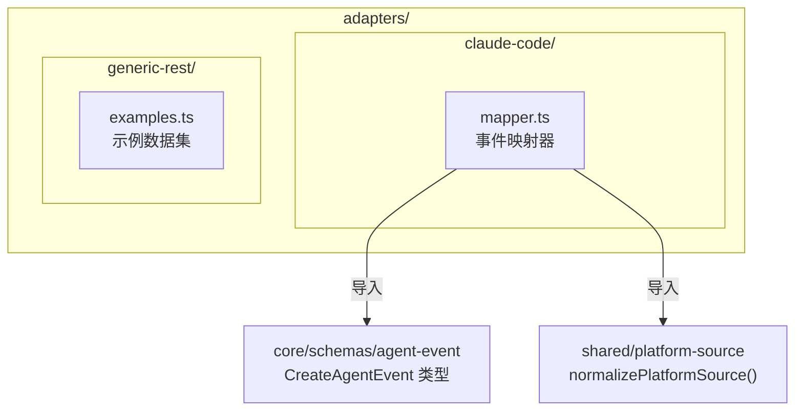

# ADAPTERS 模块汇总

## 1. 模块职责总述

adapters 层是 claude-mem 系统的外部接入边界，负责将不同平台（Claude Code、Generic REST 等）的原始事件数据转换为统一的 `CreateAgentEvent` 内部 schema。该层不包含持久化或业务处理逻辑，仅承担格式适配与数据标准化职责。其下分为 `claude-code` 和 `generic-rest` 两个子模块：前者专司 Claude Code hook 系统的 payload 映射，后者以示例数据集形式为第三方 REST 接入提供 payload 模板参考。

## 2. 功能需求汇总

| 编号 | 需求描述（系统应当…） | 触发条件 / 输入 | 处理规则与输出 | 来源 |
|------|----------------------|----------------|---------------|------|
| FR-MAP-01 | 将 Claude Code 会话初始化 payload 映射为统一的 CreateAgentEvent | 调用 `mapClaudeCodeSessionInitToAgentEvent` | eventType 固定为 `session.init`，sourceType 固定为 `hook`，payload 透传原字段并标准化 platformSource | [mapper.ts.md](claude-code/mapper.ts.md) |
| FR-MAP-02 | 将 Claude Code 观测 payload 映射为统一的 CreateAgentEvent | 调用 `mapClaudeCodeObservationToAgentEvent` | eventType 固定为 `observation.created`，同 FR-MAP-01 通用映射逻辑 | [mapper.ts.md](claude-code/mapper.ts.md) |
| FR-MAP-03 | 将 Claude Code 会话摘要 payload 映射为统一的 CreateAgentEvent | 调用 `mapClaudeCodeSummaryToAgentEvent` | eventType 固定为 `session.summary`，同 FR-MAP-01 通用映射逻辑 | [mapper.ts.md](claude-code/mapper.ts.md) |
| FR-MAP-04 | 在映射过程中标准化 platformSource 字段 | 所有映射函数执行时 | 调用 `normalizePlatformSource()` 对 payload.platformSource 进行规范化处理 | [mapper.ts.md](claude-code/mapper.ts.md) |
| FR-MAP-05 | 兼容 tool_use_id 和 toolUseId 两种命名风格 | payload 同时存在两个字段时 | 优先使用 `toolUseId`，为空时回退到 `tool_use_id`，均为空时设为 null | [mapper.ts.md](claude-code/mapper.ts.md) |
| FR-MAP-06 | occurredAtEpoch 未提供时使用当前时间 | 调用映射函数时未传入 occurredAtEpoch 参数 | 默认值为 `Date.now()` | [mapper.ts.md](claude-code/mapper.ts.md) |
| FR-MAP-07 | memorySessionId 默认设为 null | payload 中 memorySessionId 为 undefined 或 null | 映射结果中 memorySessionId 为 null | [mapper.ts.md](claude-code/mapper.ts.md) |
| FR-EXAMPLE-01 | 导出一组 Codex 平台的观测事件示例数据 | 模块导入时 | 返回包含 projectId、sourceType 为 `api`、eventType 为 `observation.created`、payload 含 tool_name/tool_input/tool_response/platformSource/agentId 等字段的对象 | [examples.ts.md](generic-rest/examples.ts.md) |
| FR-EXAMPLE-02 | 导出一组 OpenCode 平台的观测事件示例数据 | 模块导入时 | 返回与 Codex 示例结构一致但 platformSource 为 `opencode`、tool_name 为 `edit` 的对象 | [examples.ts.md](generic-rest/examples.ts.md) |
| FR-EXAMPLE-03 | 导出一组手动记忆（manual/note）类型的事件示例数据 | 模块导入时 | 返回 kind 为 `manual`、type 为 `note`、含 title/narrative/facts 字段的对象，无 sourceType 和 eventType | [examples.ts.md](generic-rest/examples.ts.md) |

## 3. 模块内部结构

adapters 下设两个平级子模块，彼此独立无交叉引用：

- **claude-code/mapper.ts**：依赖 `core/schemas/agent-event`（目标类型）和 `shared/platform-source`（标准化函数），是 adapters 层中唯一包含业务逻辑的文件。
- **generic-rest/examples.ts**：无外部依赖，纯只读数据定义文件。
- 两个子模块之间不存在调用或依赖关系。

## 4. 对外接口

### claude-code/mapper.ts 导出

| 导出名 | 签名 | 用途 |
|--------|------|------|
| `mapClaudeCodeSessionInitToAgentEvent` | `(projectId, payload, occurredAtEpoch?) => CreateAgentEvent` | 映射 session.init 事件 |
| `mapClaudeCodeObservationToAgentEvent` | `(projectId, payload, occurredAtEpoch?) => CreateAgentEvent` | 映射 observation.created 事件 |
| `mapClaudeCodeSummaryToAgentEvent` | `(projectId, payload, occurredAtEpoch?) => CreateAgentEvent` | 映射 session.summary 事件 |
| `ClaudeCodeBasePayload` | `interface` | 基础 payload 类型定义 |
| `ClaudeCodeObservationPayload` | `interface extends ClaudeCodeBasePayload` | 观测事件扩展 payload 类型定义 |

### generic-rest/examples.ts 导出

| 导出名 | 类型 | 用途 |
|--------|------|------|
| `genericRestEventExamples` | `as const` 对象（含 `codexObservation`、`opencodeObservation`、`customMemory` 三个属性） | 为 Generic REST 适配器提供 JSON payload 模板参考 |

## 5. 数据与外部资源

### 数据结构

**ClaudeCodeBasePayload**（mapper.ts 定义）：

| 字段 | 类型 | 必填 | 说明 |
|------|------|------|------|
| contentSessionId | string | 是 | 内容会话标识 |
| memorySessionId | string \| null | 否 | 记忆会话标识 |
| platformSource | string \| null | 否 | 平台来源 |
| cwd | string | 否 | 工作目录 |
| agentId | string | 否 | 代理标识 |
| agentType | string | 否 | 代理类型 |
| [key: string] | unknown | — | 允许任意扩展字段 |

**ClaudeCodeObservationPayload**（继承 BasePayload）：

| 字段 | 类型 | 必填 | 说明 |
|------|------|------|------|
| tool_name | string | 是 | 工具名称 |
| tool_input | unknown | 否 | 工具输入 |
| tool_response | unknown | 否 | 工具响应 |
| tool_use_id | string | 否 | snake_case 风格工具调用 ID |
| toolUseId | string | 否 | camelCase 风格工具调用 ID |

**genericRestEventExamples**（examples.ts 定义）：包含 `codexObservation`（sourceType=api, eventType=observation.created）、`opencodeObservation`（同结构，platformSource=opencode）、`customMemory`（kind=manual, type=note, 含 title/narrative/facts）三组只读示例对象。

### 外部依赖

- `../../core/schemas/agent-event.js`：提供 `CreateAgentEvent` 目标类型（mapper.ts 依赖）
- `../../shared/platform-source.js`：提供 `normalizePlatformSource()` 函数（mapper.ts 依赖）
- 无数据库、缓存、消息队列或文件系统交互

## 6. 存疑与备注

- `ClaudeCodeBasePayload` 使用 `[key: string]: unknown` 索引签名，允许承载任意额外字段，推断是为了兼容 Claude Code hook 不同版本可能新增的 payload 字段 —— 未在代码中证实
- `ClaudeCodeObservationPayload` 同时声明 `tool_use_id` 和 `toolUseId` 两个字段，说明 Claude Code 内部存在命名风格迁移期 —— 未在代码中证实
- `occurredAtEpoch` 在 examples.ts 中使用固定值 `1760000000000` 作为占位时间戳，实际使用时应替换为真实毫秒级 epoch
- 手动记忆示例（customMemory）缺少 `contentSessionId` 和 `occurredAtEpoch`，推断该类型事件可能通过不同路由注入 —— 未在代码中证实
- projectId 由调用方传入而非从 payload 中获取，说明 project 上下文在 adapter 上层已解析 —— 推断
