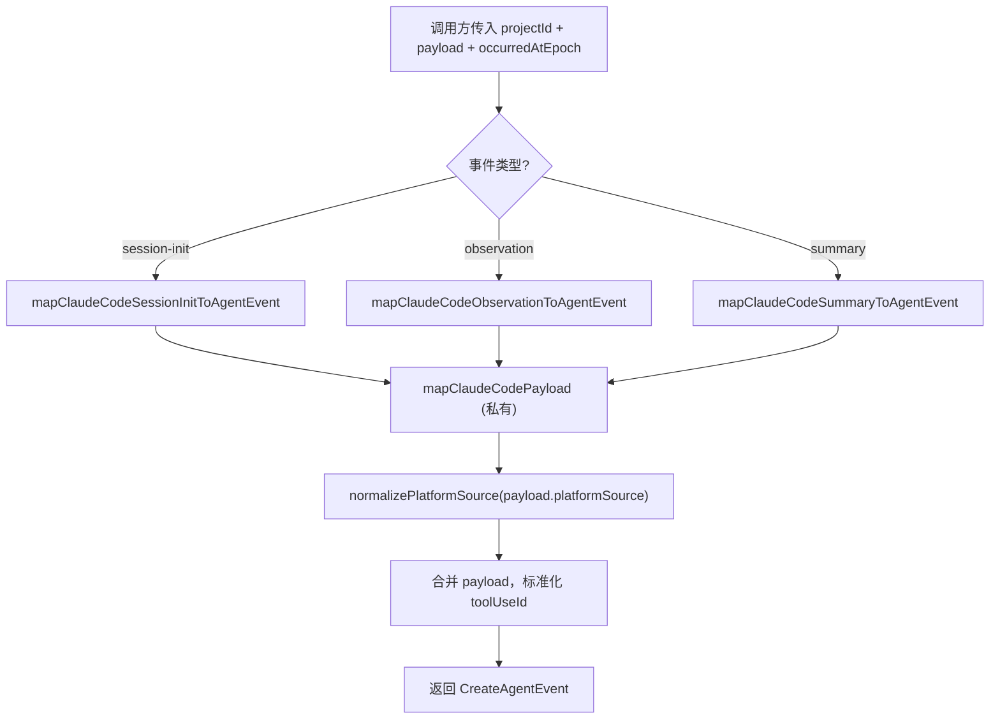

# mapper.ts 需求说明

> 源文件：src/adapters/claude-code/mapper.ts ｜ 类型：源码 ｜ 行数：68 ｜ 所属模块：adapters/claude-code ｜ 分析日期：2026-07-23

## 1. 文件定位总述

本文件是 Claude Code 平台的事件映射器，负责将 Claude Code hook 系统的原始 payload 转换为 claude-mem 统一的 `CreateAgentEvent` schema。它为三种事件类型（session.init、observation.created、session.summary）各提供一个公开映射函数，内部共享一个私有通用映射逻辑。该映射器是 Claude Code adapter 层与核心 schema 之间的桥梁，确保 platformSource 字段经过标准化处理，并兼容 `tool_use_id` 与 `toolUseId` 两种命名风格。

## 2. 功能需求

| 编号 | 需求描述（系统应当…） | 触发条件 / 输入 | 处理规则与输出 | 证据 |
|------|----------------------|----------------|---------------|------|
| FR-MAP-01 | 系统应当将 Claude Code 会话初始化 payload 映射为统一的 CreateAgentEvent | 调用 `mapClaudeCodeSessionInitToAgentEvent` | eventType 固定为 `session.init`，sourceType 固定为 `hook`，payload 透传原字段并标准化 platformSource | `src/adapters/claude-code/mapper.ts:24-30` |
| FR-MAP-02 | 系统应当将 Claude Code 观测 payload 映射为统一的 CreateAgentEvent | 调用 `mapClaudeCodeObservationToAgentEvent` | eventType 固定为 `observation.created`，同 FR-MAP-01 通用映射逻辑 | `src/adapters/claude-code/mapper.ts:32-38` |
| FR-MAP-03 | 系统应当将 Claude Code 会话摘要 payload 映射为统一的 CreateAgentEvent | 调用 `mapClaudeCodeSummaryToAgentEvent` | eventType 固定为 `session.summary`，同 FR-MAP-01 通用映射逻辑 | `src/adapters/claude-code/mapper.ts:40-46` |
| FR-MAP-04 | 系统应当在映射过程中标准化 platformSource 字段 | 所有映射函数执行时 | 调用 `normalizePlatformSource()` 对 payload.platformSource 进行规范化处理 | `src/adapters/claude-code/mapper.ts:54` |
| FR-MAP-05 | 系统应当兼容 tool_use_id 和 toolUseId 两种命名风格 | payload 同时存在两个字段时 | 优先使用 `toolUseId`，为空时回退到 `tool_use_id`，均为空时设为 null | `src/adapters/claude-code/mapper.ts:62` |
| FR-MAP-06 | 系统应当在 occurredAtEpoch 未提供时使用当前时间 | 调用映射函数时未传入 occurredAtEpoch 参数 | 默认值为 `Date.now()` | `src/adapters/claude-code/mapper.ts:27,36,44` |
| FR-MAP-07 | 系统应当将 memorySessionId 默认设为 null | payload 中 memorySessionId 为 undefined 或 null | 映射结果中 memorySessionId 为 null | `src/adapters/claude-code/mapper.ts:65` |

## 3. 业务规则与约束

- sourceType 始终为 `'hook'`，标识事件来源于 Claude Code hook 系统 `src/adapters/claude-code/mapper.ts:57`
- toolUseId 的优先级：`payload.toolUseId ?? payload.tool_use_id ?? null`，说明 camelCase 优先于 snake_case `src/adapters/claude-code/mapper.ts:62`
- projectId 由调用方传入，不在 payload 中获取，说明 project 上下文在 adapter 上层已解析 `src/adapters/claude-code/mapper.ts:49`

## 4. 对外暴露

| 导出名 | 签名 | 用途 |
|--------|------|------|
| `mapClaudeCodeSessionInitToAgentEvent` | `(projectId, payload, occurredAtEpoch?) => CreateAgentEvent` | 映射 session.init 事件 |
| `mapClaudeCodeObservationToAgentEvent` | `(projectId, payload, occurredAtEpoch?) => CreateAgentEvent` | 映射 observation.created 事件 |
| `mapClaudeCodeSummaryToAgentEvent` | `(projectId, payload, occurredAtEpoch?) => CreateAgentEvent` | 映射 session.summary 事件 |
| `ClaudeCodeBasePayload` | `interface` | 基础 payload 类型定义 |
| `ClaudeCodeObservationPayload` | `interface extends ClaudeCodeBasePayload` | 观测事件扩展 payload 类型定义 |

## 5. 依赖关系

- **`../../core/schemas/agent-event.js`**：导入 `CreateAgentEvent` 类型作为映射目标结构 `src/adapters/claude-code/mapper.ts:3`
- **`../../shared/platform-source.js`**：导入 `normalizePlatformSource` 函数用于平台来源标准化 `src/adapters/claude-code/mapper.ts:4`

## 6. 数据结构

```typescript
interface ClaudeCodeBasePayload {
  contentSessionId: string;
  memorySessionId?: string | null;
  platformSource?: string | null;
  cwd?: string;
  agentId?: string;
  agentType?: string;
  [key: string]: unknown;  // 允许任意扩展字段
}

interface ClaudeCodeObservationPayload extends ClaudeCodeBasePayload {
  tool_name: string;
  tool_input?: unknown;
  tool_response?: unknown;
  tool_use_id?: string;
  toolUseId?: string;
}
```

## 7. 复杂逻辑图示



三个公开映射函数均委托给私有函数 `mapClaudeCodePayload`，通过 eventType 参数区分事件类型。

## 8. 逆向备注

- `ClaudeCodeBasePayload` 使用 `[key: string]: unknown` 索引签名，允许承载任意额外字段，推断是为了兼容 Claude Code hook 不同版本可能新增的 payload 字段 `src/adapters/claude-code/mapper.ts:13`
- `ClaudeCodeObservationPayload` 同时声明 `tool_use_id` 和 `toolUseId` 两个字段，说明 Claude Code 内部存在命名风格迁移期 `src/adapters/claude-code/mapper.ts:21-22`
