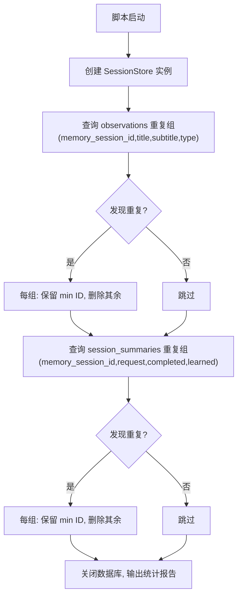

# cleanup-duplicates.ts 需求说明

> 源文件：src/bin/cleanup-duplicates.ts ｜ 类型：脚本 ｜ 行数：91 ｜ 所属模块：bin ｜ 分析日期：2026-07-23

## 1. 文件定位总述

本文件是一个一次性数据库维护脚本，用于清理 SQLite 中 observations 和 session_summaries 两张表的重复记录。它通过按关键字段分组检测重复项，保留每组中 ID 最小的记录（即最早插入的），删除其余副本。该脚本直接操作数据库实例，绕过 Worker HTTP API，属于离线运维工具。

## 2. 功能需求

| 编号 | 需求描述（系统应当…） | 触发条件 / 输入 | 处理规则与输出 | 证据 |
|------|----------------------|----------------|---------------|------|
| FR-CLEAN-01 | 系统应当扫描 observations 表并识别重复记录 | 脚本启动时 | 按 memory_session_id + title + subtitle + type 分组，COUNT > 1 即为重复组 | `src/bin/cleanup-duplicates.ts:12-17` |
| FR-CLEAN-02 | 系统应当对每组重复 observation 保留最小 ID、删除其余 | 检测到重复组时 | 取 min(id) 作为保留目标，构造 DELETE WHERE id IN (...) 删除其余 | `src/bin/cleanup-duplicates.ts:32-42` |
| FR-CLEAN-03 | 系统应当扫描 session_summaries 表并识别重复记录 | observations 清理完成后 | 按 memory_session_id + request + completed + learned 分组，COUNT > 1 即为重复组 | `src/bin/cleanup-duplicates.ts:46-51` |
| FR-CLEAN-04 | 系统应当对每组重复 summary 保留最小 ID、删除其余 | 检测到重复 summary 组时 | 同 FR-CLEAN-02 逻辑 | `src/bin/cleanup-duplicates.ts:65-76` |
| FR-CLEAN-05 | 系统应当输出清理统计报告 | 清理完成后 | 控制台输出删除的 observation 和 summary 数量及总计 | `src/bin/cleanup-duplicates.ts:80-86` |
| FR-CLEAN-06 | 系统应当在完成后关闭数据库连接 | 清理完成后 | 调用 `db.close()` | `src/bin/cleanup-duplicates.ts:78` |

## 3. 业务规则与约束

- observations 重复判定的维度为 `(memory_session_id, title, subtitle, type)` 四字段组合 `src/bin/cleanup-duplicates.ts:13`
- session_summaries 重复判定的维度为 `(memory_session_id, request, completed, learned)` 四字段组合 `src/bin/cleanup-duplicates.ts:47`
- 保留策略始终为"保留最小 ID"，推断最小 ID 对应最早插入的记录 `src/bin/cleanup-duplicates.ts:33-34`
- 删除操作通过直接构造 `DELETE FROM ... WHERE id IN (...)` SQL 实现，未使用参数化，存在 SQL 注入风险（但因 ID 均为 parseInt 后的整数，实际风险可控） `src/bin/cleanup-duplicates.ts:39`

## 4. 对外暴露

| 名称 | 类型 | 用途 |
|------|------|------|
| `main()` | 函数（模块内部） | 脚本入口，通过 `import.meta.url` 守卫条件直接执行 |
| CLI 入口 | 可执行脚本 | `import.meta.url === file://${process.argv[1]}` 时自动运行 `src/bin/cleanup-duplicates.ts:89-91` |

## 5. 依赖关系

- **`../services/sqlite/SessionStore.js`**：导入 `SessionStore` 以获取数据库实例（直接访问内部 `db` 属性） `src/bin/cleanup-duplicates.ts:3`

## 6. 数据结构

不适用——本文件通过直接 SQL 查询操作数据库，未定义额外数据结构。

## 7. 复杂逻辑图示

## 8. 逆向备注

- 脚本直接访问 `db['db'].prepare()` 而非使用 SessionStore 的公开方法，说明 SessionStore 未提供去重接口，此脚本为临时运维性质 `src/bin/cleanup-duplicates.ts:12`
- 推断此脚本在系统早期版本中由于 hook 重复触发导致数据冗余而创建，属于补救措施而非常规功能
