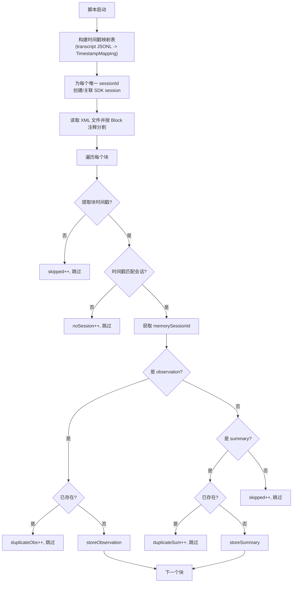

# import-xml-observations.ts 需求说明

> 源文件：src/bin/import-xml-observations.ts ｜ 类型：脚本 ｜ 行数：332 ｜ 所属模块：bin ｜ 分析日期：2026-07-23

## 1. 文件定位总述

本文件是一个数据迁移脚本，用于将旧版 Claude 会话的 XML 格式观测/摘要记录批量导入到 SQLite 数据库中。它通过解析 Claude transcript JSONL 文件构建时间戳到会话的映射表，然后解析 XML 文件中的 observation 和 summary 块，利用时间戳匹配到对应会话后写入数据库。该脚本包含去重逻辑，避免重复导入已存在的记录，并支持空会话的自动创建。脚本路径硬编码了特定用户的 transcript 目录，属于一次性迁移工具。

## 2. 功能需求

| 编号 | 需求描述（系统应当…） | 触发条件 / 输入 | 处理规则与输出 | 证据 |
|------|----------------------|----------------|---------------|------|
| FR-IMPORT-01 | 系统应当扫描 Claude transcript JSONL 文件构建时间戳映射表 | 脚本启动时 | 读取 `~/.claude/projects/-Users-alexnewman-Scripts-claude-mem/` 下所有 .jsonl 文件，按秒精度将时间戳映射到 {sessionId, project} | `src/bin/import-xml-observations.ts:38-87` |
| FR-IMPORT-02 | 系统应当为每个唯一的 contentSessionId 创建或关联 SDK session | 构建映射表后 | 若 sdk_sessions 中已有记录则更新 memory_session_id；若无则创建并设置 memory_session_id 为 `imported-{sessionId}` 前缀 | `src/bin/import-xml-observations.ts:176-208` |
| FR-IMPORT-03 | 系统应当解析 XML 文件中的 observation 块 | 读取 XML 文件时 | 从 `<observation>` 标签中提取 type, title, subtitle, facts, narrative, concepts, files_read, files_modified | `src/bin/import-xml-observations.ts:115-136` |
| FR-IMPORT-04 | 系统应当解析 XML 文件中的 summary 块 | 当块不包含 observation 时 | 从 `<summary>` 标签中提取 request, investigated, learned, completed, next_steps, notes | `src/bin/import-xml-observations.ts:138-157` |
| FR-IMPORT-05 | 系统应当从 XML 注释行提取块时间戳 | 处理每个 XML 块时 | 匹配 `<!-- Block N | ... -->` 格式，将时间字符串转为 ISO 格式用于查找会话 | `src/bin/import-xml-observations.ts:159-166` |
| FR-IMPORT-06 | 系统应当跳过已存在的 observation 和 summary | 写入前检查 | 按 (memory_session_id, title, subtitle, type) 查重 observation；按 (memory_session_id, request, completed, learned) 查重 summary | `src/bin/import-xml-observations.ts:255-261,285-289` |
| FR-IMPORT-07 | 系统应当输出导入统计报告 | 全部处理完成后 | 报告导入的 observation/summary 数量、跳过数、重复数、无会话匹配数 | `src/bin/import-xml-observations.ts:316-327` |
| FR-IMPORT-08 | 系统应当将 XML 文件按 Block 注释分割为独立块 | 读取 XML 文件时 | 使用 `(?=<!-- Block \d+)` 正则分割 | `src/bin/import-xml-observations.ts:216` |

## 3. 业务规则与约束

- transcript 目录硬编码为 `~/.claude/projects/-Users-alexnewman-Scripts-claude-mem/`，仅适用于特定用户的迁移场景 `src/bin/import-xml-observations.ts:39`
- XML 文件路径硬编码为 `process.cwd()/actual_xml_only_with_timestamps.xml`，需在工作目录下存在 `src/bin/import-xml-observations.ts:212`
- 时间戳精度为秒级（`setMilliseconds(0)`），同秒内多个事件共享会话映射 `src/bin/import-xml-observations.ts:75`
- observation 的 type 和 title 为必填字段，缺失则视为无效块 `src/bin/import-xml-observations.ts:131`
- summary 的 request 为必填字段，缺失则视为无效块 `src/bin/import-xml-observations.ts:152`
- 无时间戳或无会话匹配的块会被跳过，最多打印 5 条无会话警告 `src/bin/import-xml-observations.ts:240-241`

## 4. 对外暴露

| 名称 | 类型 | 用途 |
|------|------|------|
| `main()` | 函数（模块内部） | 脚本入口 |
| CLI 入口 | 可执行脚本 | `import.meta.url` 守卫条件触发 `src/bin/import-xml-observations.ts:330-332` |

## 5. 依赖关系

- **`../services/sqlite/SessionStore.js`**：数据库操作（createSDKSession, storeObservation, storeSummary, 内部 db 直接访问） `src/bin/import-xml-observations.ts:6`
- **`../utils/logger.js`**：调试日志 `src/bin/import-xml-observations.ts:7`
- **Node.js 内置模块**：`fs`, `path`, `os`（文件读写和路径处理）

## 6. 数据结构

```typescript
interface ObservationData {
  type: string;
  title: string;
  subtitle: string;
  facts: string[];
  narrative: string;
  concepts: string[];
  files_read: string[];
  files_modified: string[];
}

interface SummaryData {
  request: string;
  investigated: string;
  learned: string;
  completed: string;
  next_steps: string;
  notes: string | null;
}

interface SessionMetadata {
  sessionId: string;
  project: string;
}

interface TimestampMapping {
  [timestamp: string]: SessionMetadata;
}
```

## 7. 复杂逻辑图示



## 8. 逆向备注

- transcript 目录路径 `alexnewman` 表明此脚本最初由特定开发者编写，用于个人数据迁移 `src/bin/import-xml-observations.ts:39`
- 推断 XML 数据来源于早期 claude-mem 版本将观测记录以 XML 格式写入 Claude transcript 的机制，现已改为结构化 JSON 存储
- 脚本直接访问 `db['db'].prepare()` 执行查询，绕过了 SessionStore 的公开 API，说明需要的功能（去重查询、字段更新）不在公开接口中
