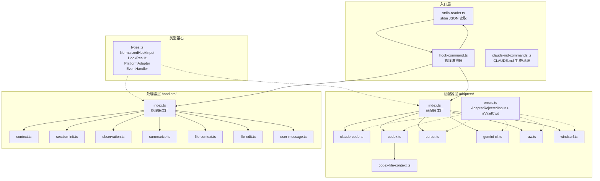

# cli 模块汇总

## 1. 模块职责总述

cli 模块是 claude-mem 的前端入口层，负责接收各 AI 编码助手平台（Claude Code、Codex、Cursor、Gemini CLI、Windsurf）通过 hook 系统传入的 JSON 数据，完成输入标准化、业务逻辑分发与输出格式化的全链路处理。模块采用"适配器-处理器"双层架构：平台适配器将异构输入归一化为统一的 `NormalizedHookInput`，事件处理器按生命周期阶段（会话初始化、上下文注入、工具观测、文件上下文、文件编辑、总结）执行具体业务逻辑并与后端 Worker 通信。此外，`claude-md-commands.ts` 提供独立的 CLAUDE.md 自动生成与清理功能，将历史观测以 Markdown 时间线形式注入项目文件夹。

## 2. 功能需求汇总

### stdin-reader.ts

| 编号 | 需求描述 | 来源 |
|------|----------|------|
| FR-STDIN-01 | 检测 stdin 是否可用，TTY 模式返回 undefined | stdin-reader.ts |
| FR-STDIN-02 | 流式解析 JSON 数据，不等 EOF | stdin-reader.ts |
| FR-STDIN-03 | 设置 30 秒安全超时保护 | stdin-reader.ts |
| FR-STDIN-04 | EOF 时进行最终解析 | stdin-reader.ts |
| FR-STDIN-05 | stdin 错误时静默返回 undefined | stdin-reader.ts |
| FR-STDIN-06 | 防止多次解析（resolved 标志位） | stdin-reader.ts |

### hook-command.ts

| 编号 | 需求描述 | 来源 |
|------|----------|------|
| FR-HC-01 | 编排完整 hook 处理管线（读取->适配->处理->格式化->输出->退出） | hook-command.ts |
| FR-HC-02 | 管线执行后注入平台标识 | hook-command.ts |
| FR-HC-03 | 最终输出以 JSON 写入 stdout | hook-command.ts |
| FR-HC-04 | 根据 HookResult.exitCode 退出进程 | hook-command.ts |
| FR-HC-05 | 适配器拒绝输入时非阻断处理 | hook-command.ts |
| FR-HC-06 | transcript 路径缺失时非阻断处理 | hook-command.ts |
| FR-HC-07 | Worker 连接失败时非阻断处理 | hook-command.ts |
| FR-HC-08 | 其他错误做阻断处理 | hook-command.ts |
| FR-HC-09 | 为 context 事件生成符合 Claude Code 协议的 no-op 结果 | hook-command.ts |
| FR-HC-10 | 抑制管线执行期间的 stderr 输出 | hook-command.ts |
| FR-HC-11 | 支持 skipExit 跳过 process.exit（测试用） | hook-command.ts |

### 适配器层（adapters/）

| 编号 | 需求描述 | 来源 |
|------|----------|------|
| FR-ADPIDX-01 | 根据平台标识返回对应适配器实例 | adapters/index.ts |
| FR-ADPIDX-02 | 支持 gemini/gemini-cli 双别名 | adapters/index.ts |
| FR-ADPIDX-03 | 未知平台回退到 raw 适配器 | adapters/index.ts |
| FR-ERR-01 | 提供 AdapterRejectedInput 异常类标识输入被拒绝 | adapters/errors.ts |
| FR-ERR-02 | 校验 cwd 为有效非空字符串 | adapters/errors.ts |
| FR-CCADP-01 | 将 Claude Code 的 session_id/id/sessionId 映射为统一 sessionId | adapters/claude-code.ts |
| FR-CCADP-02 | 验证 cwd 并拒绝无效输入 | adapters/claude-code.ts |
| FR-CCADP-03 | 限制 agentId/agentType 最大 128 字符 | adapters/claude-code.ts |
| FR-CCADP-04 | formatOutput 构建 hookSpecificOutput 输出 | adapters/claude-code.ts |
| FR-CCADP-05 | formatOutput 处理仅有 systemMessage 的情况 | adapters/claude-code.ts |
| FR-CXADP-01 | Codex 适配器要求 sessionId 必须存在 | adapters/codex.ts |
| FR-CXADP-02 | 校验 hook_event_name 为合法枚举值 | adapters/codex.ts |
| FR-CXADP-03 | PreToolUse 事件中提取并注入文件路径 | adapters/codex.ts |
| FR-CXADP-04 | 校验 sessionSource 为合法枚举值 | adapters/codex.ts |
| FR-CXADP-05 | 支持字符串/布尔转换辅助函数 | adapters/codex.ts |
| FR-CXADP-06 | 浅克隆 toolInput 避免污染原始数据 | adapters/codex.ts |
| FR-CXADP-07 | formatOutput 构建 Codex 专用 hookSpecificOutput | adapters/codex.ts |
| FR-CXADP-08 | formatOutput 透传 block 决策 | adapters/codex.ts |
| FR-CXADP-09 | Stop 事件不输出 hookSpecificOutput | adapters/codex.ts |
| FR-CFC-01 | 从 Bash 工具调用中提取文件读取路径 | adapters/codex-file-context.ts |
| FR-CFC-02 | 从 MCP 工具调用中提取文件路径 | adapters/codex-file-context.ts |
| FR-CFC-03 | 忽略管道操作符后的命令段 | adapters/codex-file-context.ts |
| FR-CFC-04 | 跳过带值标志的参数值 | adapters/codex-file-context.ts |
| FR-CFC-05 | 仅返回磁盘上实际存在的文件路径 | adapters/codex-file-context.ts |
| FR-CFC-06 | 结果去重并限制最大 10 个路径 | adapters/codex-file-context.ts |
| FR-CFC-07 | 非 Bash/MCP 工具名返回空数组 | adapters/codex-file-context.ts |
| FR-CUADP-01 | Cursor conversation_id/generation_id/id 映射为 sessionId | adapters/cursor.ts |
| FR-CUADP-02 | 从 workspace_roots 数组获取工作目录 | adapters/cursor.ts |
| FR-CUADP-03 | 智能识别 Shell 命令映射为 Bash 工具 | adapters/cursor.ts |
| FR-CUADP-04 | 推导 Cursor transcript 文件路径 | adapters/cursor.ts |
| FR-CUADP-05 | 对 sessionId 进行安全字符校验（防路径遍历） | adapters/cursor.ts |
| FR-CUADP-06 | 仅返回磁盘上实际存在的 transcript 路径 | adapters/cursor.ts |
| FR-CUADP-07 | 兼容多种 prompt 字段命名 | adapters/cursor.ts |
| FR-CUADP-08 | formatOutput 仅返回 continue 标志 | adapters/cursor.ts |
| FR-GCADP-01 | 支持从环境变量回退获取 cwd | adapters/gemini-cli.ts |
| FR-GCADP-02 | 支持从环境变量回退获取 sessionId | adapters/gemini-cli.ts |
| FR-GCADP-03 | AfterAgent 事件补充 GeminiProvider 工具信息 | adapters/gemini-cli.ts |
| FR-GCADP-04 | BeforeTool 事件标记预执行状态 | adapters/gemini-cli.ts |
| FR-GCADP-05 | Notification 事件构建通知记录 | adapters/gemini-cli.ts |
| FR-GCADP-06 | 多种扩展字段收集到 metadata 对象 | adapters/gemini-cli.ts |
| FR-GCADP-07 | formatOutput 过滤 ANSI 转义序列 | adapters/gemini-cli.ts |
| FR-GCADP-08 | formatOutput 支持 suppressOutput 透传 | adapters/gemini-cli.ts |
| FR-GCADP-09 | formatOutput 仅传递 additionalContext | adapters/gemini-cli.ts |
| FR-RAW-01 | 将 cwd 规范化，缺失时使用 process.cwd() | adapters/raw.ts |
| FR-RAW-02 | 兼容 sessionId 的 camelCase 和 snake_case 命名 | adapters/raw.ts |
| FR-RAW-03 | 兼容工具相关字段的两种命名风格 | adapters/raw.ts |
| FR-RAW-04 | 透传 transcriptPath、filePath、edits 字段 | adapters/raw.ts |
| FR-RAW-05 | formatOutput 直接透传结果不做转换 | adapters/raw.ts |
| FR-WSADP-01 | Windsurf trajectory_id/execution_id 映射为 sessionId | adapters/windsurf.ts |
| FR-WSADP-02 | 从 tool_info.cwd 获取工作目录并校验 | adapters/windsurf.ts |
| FR-WSADP-03 | pre_user_prompt 动作映射为用户提示事件 | adapters/windsurf.ts |
| FR-WSADP-04 | post_write_code 动作映射为文件写入事件 | adapters/windsurf.ts |
| FR-WSADP-05 | post_run_command 动作映射为 Bash 执行事件 | adapters/windsurf.ts |
| FR-WSADP-06 | post_mcp_tool_use 动作映射为 MCP 工具调用 | adapters/windsurf.ts |
| FR-WSADP-07 | post_cascade_response 动作映射为级联响应事件 | adapters/windsurf.ts |
| FR-WSADP-08 | 未知动作类型返回最小输入 | adapters/windsurf.ts |
| FR-WSADP-09 | formatOutput 仅返回 continue 标志 | adapters/windsurf.ts |

### 处理器层（handlers/）

| 编号 | 需求描述 | 来源 |
|------|----------|------|
| FR-HDLIDX-01 | 支持 7 种事件类型的路由 | handlers/index.ts |
| FR-HDLIDX-02 | 未知事件类型返回 no-op 处理器 | handlers/index.ts |
| FR-HDLIDX-03 | 未知事件类型时记录警告日志 | handlers/index.ts |
| FR-CTX-01 | 向 Worker 请求项目上下文注入内容 | handlers/context.ts |
| FR-CTX-02 | Worker 不可用时返回空 additionalContext | handlers/context.ts |
| FR-CTX-03 | 检测并处理过期 OAuth token 标记 | handlers/context.ts |
| FR-CTX-04 | 根据设置决定是否获取带颜色终端输出 | handlers/context.ts |
| FR-CTX-05 | Claude Code 平台使用带颜色的 API 路径 | handlers/context.ts |
| FR-CTX-06 | 通过 hookSpecificOutput 注入 SessionStart 事件上下文 | handlers/context.ts |
| FR-CTX-07 | 终端输出可配置时生成 systemMessage | handlers/context.ts |
| FR-CTX-08 | 优先使用带颜色终端输出，回退到纯文本 | handlers/context.ts |
| FR-SI-01 | 向 Worker 发送会话初始化请求 | handlers/session-init.ts |
| FR-SI-02 | 跳过无 sessionId 的事件 | handlers/session-init.ts |
| FR-SI-03 | 跳过不追踪的项目 | handlers/session-init.ts |
| FR-SI-04 | 跳过内部协议 payload | handlers/session-init.ts |
| FR-SI-05 | 空 prompt 替换为占位符 '[media prompt]' | handlers/session-init.ts |
| FR-SI-06 | 配置启用时执行语义上下文注入 | handlers/session-init.ts |
| FR-SI-07 | 跳过私有会话的语义注入 | handlers/session-init.ts |
| FR-SI-08 | 通过 UserPromptSubmit 事件注入语义上下文 | handlers/session-init.ts |
| FR-SI-09 | 支持 Server Beta 云端运行时 | handlers/session-init.ts |
| FR-SI-10 | 处理 Worker 返回的畸形响应 | handlers/session-init.ts |
| FR-OBS-01 | 将工具调用记录作为观测事件发送 | handlers/observation.ts |
| FR-OBS-02 | 跳过无工具名的事件 | handlers/observation.ts |
| FR-OBS-03 | cwd 缺失时抛出异常 | handlers/observation.ts |
| FR-OBS-04 | 跳过不在追踪范围内的项目 | handlers/observation.ts |
| FR-OBS-05 | 支持 Server Beta 运行时 | handlers/observation.ts |
| FR-OBS-06 | Server Beta 可回退时降级到 Worker | handlers/observation.ts |
| FR-OBS-07 | Server Beta 不可回退时静默跳过 | handlers/observation.ts |
| FR-OBS-08 | Worker 不可用时静默跳过 | handlers/observation.ts |
| FR-SUM-01 | 从 transcript 提取最后一条助手消息 | handlers/summarize.ts |
| FR-SUM-02 | 计算 per-turn 活跃度数据 | handlers/summarize.ts |
| FR-SUM-03 | 从 transcript 提取助手消息时间戳 | handlers/summarize.ts |
| FR-SUM-04 | 跳过 Stop hook 重入（Codex 防护） | handlers/summarize.ts |
| FR-SUM-05 | 跳过子代理上下文 | handlers/summarize.ts |
| FR-SUM-06 | 跳过无 transcript 且无直传消息的事件 | handlers/summarize.ts |
| FR-SUM-07 | 跳过无助手消息的事件 | handlers/summarize.ts |
| FR-SUM-08 | 向 Worker 发送总结请求 | handlers/summarize.ts |
| FR-SUM-09 | 支持 Server Beta 云端运行时 | handlers/summarize.ts |
| FR-SUM-10 | 助手消息中剥离 memory 标签 | handlers/summarize.ts |
| FR-FC-01 | 从 toolInput 提取候选文件路径 | handlers/file-context.ts |
| FR-FC-02 | 跳过文件大小低于 1.5KB 的文件 | handlers/file-context.ts |
| FR-FC-03 | 从 Worker 查询文件相关的历史观测 | handlers/file-context.ts |
| FR-FC-04 | 跳过文件修改时间晚于最新观测的文件 | handlers/file-context.ts |
| FR-FC-05 | 观测记录按会话去重 | handlers/file-context.ts |
| FR-FC-06 | 按相关性评分排序观测记录 | handlers/file-context.ts |
| FR-FC-07 | 以 PreToolUse 事件注入文件时间线上下文 | handlers/file-context.ts |
| FR-FC-08 | 按日期分组格式化时间线输出 | handlers/file-context.ts |
| FR-FC-09 | 并行处理多个候选文件路径 | handlers/file-context.ts |
| FR-FC-10 | 时间线中包含操作提示 | handlers/file-context.ts |
| FR-FE-01 | 将文件编辑记录为 write_file 类型观测 | handlers/file-edit.ts |
| FR-FE-02 | filePath 缺失时抛出异常 | handlers/file-edit.ts |
| FR-FE-03 | cwd 缺失时抛出异常 | handlers/file-edit.ts |
| FR-FE-04 | 跳过不在追踪范围内的项目 | handlers/file-edit.ts |
| FR-FE-05 | Worker 不可用时静默跳过 | handlers/file-edit.ts |
| FR-UM-01 | 向 Worker 请求项目上下文注入内容 | handlers/user-message.ts |
| FR-UM-02 | Worker 不可用时静默跳过 | handlers/user-message.ts |
| FR-UM-03 | 向 stderr 输出格式化的上下文加载提示 | handlers/user-message.ts |
| FR-UM-04 | 始终以成功退出码结束 | handlers/user-message.ts |

### claude-md-commands.ts

| 编号 | 需求描述 | 来源 |
|------|----------|------|
| FR-CMD-01 | 扫描项目下所有 git 跟踪的文件夹 | claude-md-commands.ts |
| FR-CMD-02 | git 不可用时回退到目录遍历 | claude-md-commands.ts |
| FR-CMD-03 | 为每个文件夹查询关联的历史观测 | claude-md-commands.ts |
| FR-CMD-04 | 校验路径安全性（防逃逸） | claude-md-commands.ts |
| FR-CMD-05 | 格式化观测记录为 Markdown 时间线 | claude-md-commands.ts |
| FR-CMD-06 | 将格式化内容注入 CLAUDE.md 标记区间 | claude-md-commands.ts |
| FR-CMD-07 | 使用原子写入防止文件损坏 | claude-md-commands.ts |
| FR-CMD-08 | 支持 dry-run 模式 | claude-md-commands.ts |
| FR-CMD-09 | 估算每条观测的 token 数 | claude-md-commands.ts |
| FR-CMD-10 | 提供 CLAUDE.md 清理功能 | claude-md-commands.ts |
| FR-CMD-11 | 清理后删除仅含自动生成内容的空文件 | claude-md-commands.ts |

## 3. 模块内部结构

**依赖关系说明：**

- `types.ts` 是模块最底层的类型定义，被适配器层和处理器层共同依赖。
- `hook-command.ts` 是核心编排器，串联 stdin-reader、适配器工厂和处理器工厂。
- 适配器层内部共享 `errors.ts`（错误类型和校验函数），`codex.ts` 额外依赖 `codex-file-context.ts`。
- 处理器层各处理器彼此独立，均通过 `index.ts` 工厂函数统一导出。
- `claude-md-commands.ts` 是独立子系统，不参与 hook 管线，直接访问 SQLite 数据库。

## 4. 对外接口

### 管线入口

| 导出 | 类型 | 所属文件 | 用途 |
|------|------|----------|------|
| `hookCommand` | `(platform, event, options?) => Promise<number>` | hook-command.ts | hook 命令主入口 |
| `buildNoOpResult` | `(event: string) => HookResult` | hook-command.ts | 构建 no-op 结果 |
| `isWorkerUnavailableError` | `(error: unknown) => boolean` | hook-command.ts | 判断 Worker 不可用错误 |
| `isNonBlockingHookInputError` | `(error: unknown) => boolean` | hook-command.ts | 判断非阻断输入错误 |
| `readJsonFromStdin` | `() => Promise<unknown>` | stdin-reader.ts | stdin JSON 读取 |

### 适配器工厂

| 导出 | 类型 | 所属文件 | 用途 |
|------|------|----------|------|
| `getPlatformAdapter` | `(platform: string) => PlatformAdapter` | adapters/index.ts | 按平台标识分发适配器 |
| `getEventHandler` | `(eventType: string) => EventHandler` | handlers/index.ts | 按事件类型分发处理器 |

### CLAUDE.md 子系统

| 导出 | 类型 | 所属文件 | 用途 |
|------|------|----------|------|
| `generateClaudeMd` | `(dryRun: boolean) => Promise<number>` | claude-md-commands.ts | 生成/更新 CLAUDE.md |
| `cleanClaudeMd` | `(dryRun: boolean) => Promise<number>` | claude-md-commands.ts | 清理 auto-generated 内容 |

### 核心类型

| 导出 | 类型 | 所属文件 | 用途 |
|------|------|----------|------|
| `NormalizedHookInput` | `interface` | types.ts | 适配器标准化输入格式 |
| `HookResult` | `interface` | types.ts | 处理器返回结果格式 |
| `PlatformAdapter` | `interface` | types.ts | 适配器契约 |
| `EventHandler` | `interface` | types.ts | 处理器契约 |
| `AdapterRejectedInput` | `class extends Error` | adapters/errors.ts | 输入拒绝异常 |
| `isValidCwd` | `(cwd: unknown) => cwd is string` | adapters/errors.ts | cwd 类型守卫 |
| `extractFilePaths` | `(toolName, toolInput, cwd) => string[]` | adapters/codex-file-context.ts | 文件路径提取 |
| `deriveCursorTranscriptPath` | `(cwd, sessionId) => string \| undefined` | adapters/cursor.ts | Cursor transcript 路径推导 |

## 5. 数据与外部资源

### 外部依赖

- **shell-quote**（npm 包）：Shell 命令解析，用于 `codex-file-context.ts` 提取 Bash 命令中的文件路径。
- **bun:sqlite**（Bun 内置）：`claude-md-commands.ts` 直接访问 SQLite 数据库查询历史观测。
- **Node.js 内置**：`fs`、`path`、`child_process`、`os`，用于文件系统操作、路径处理、git 命令执行和主目录获取。

### 内部跨模块依赖

- `../shared/hook-constants.js`：退出码常量（SUCCESS、BLOCKING_ERROR）。
- `../shared/worker-utils.js`：Worker 通信工具（executeWithWorkerFallback、isWorkerFallback、getWorkerPort）。
- `../shared/should-track-project.js`：项目追踪资格判断。
- `../shared/platform-source.js`：平台来源标准化。
- `../shared/transcript-parser.js`：transcript 解析（提取消息、计算活跃度）。
- `../shared/hook-settings.js`：设置加载。
- `../shared/query-utils.js`：API 路径构建。
- `../shared/oauth-token.js`：OAuth 过期标记读取。
- `../shared/timeline-formatting.js`：时间线格式化工具。
- `../shared/path-utils.js`：路径工具（isDirectChild）。
- `../shared/SettingsDefaultsManager.js`：默认设置管理。
- `../shared/paths.js`：路径配置。
- `../utils/logger.js`：日志。
- `../utils/project-name.js`：项目上下文解析。
- `../utils/tag-stripping.js`：标签剥离（memory 标签、内部协议检测）。
- `../services/hooks/runtime-selector.js`：Server Beta 运行时选择。
- `../services/hooks/server-beta-client.js`：Server Beta 客户端错误判断。

### Worker API 端点（由处理器调用）

- `GET /api/context`：获取项目上下文注入内容。
- `GET /api/context/semantic`：语义上下文检索。
- `GET /api/observations/by-file`：按文件路径查询历史观测。
- `POST /api/sessions/init`：会话初始化。
- `POST /api/sessions/observations`：发送工具调用观测记录。
- `POST /api/sessions/summarize`：发送会话总结请求。

## 6. 存疑与备注

1. **平台标识注入位置**：`NormalizedHookInput.platform` 不由适配器设置，而是在 `hook-command.ts` 中手动注入（`input.platform = platform`），但 Windsurf 适配器例外，其 normalizeInput 内部直接写入 `platform='windsurf'`。这一不一致可能是有意为之（Windsurf 需要平台标识参与后续逻辑），也可能是遗漏。

2. **Codex 双决策字段语义**：`HookResult` 同时包含 `decision`（block/approve，用于 Codex 阻断）和 `hookSpecificOutput.permissionDecision`（allow/deny，用于 Claude Code PreToolUse），两者语义相似但作用于不同平台层级，使用时需注意区分。

3. **Claude-mem Commands 独立性**：`claude-md-commands.ts` 直接使用 `bun:sqlite` 的 `Database` 而非通过 `SessionStore`，绕过了标准数据访问层。注释推断原因是 `SessionStore` 缺少按文件路径模糊查询观测的方法。这意味着 CLAUDE.md 生成逻辑与核心数据访问层耦合了 SQLite 实现细节。

4. **stderr 抑制机制**：`hook-command.ts` 在管线执行前临时替换 `process.stderr.write` 以抑制日志输出，防止干扰 Claude Code 对 stdout JSON 的解析。此行为仅针对 Claude Code 的已知问题（上游 #2972），其他平台可能不需要此处理。

5. **Server Beta 集成深度不均**：observation、session-init、summarize 三个处理器支持 Server Beta 云端运行时（含回退机制），但 file-edit 和 file-context 处理器未集成 Server Beta，user-message 处理器也不涉及。Server Beta 模式下 session-init 不执行语义注入（云端尚无 context endpoint）。

6. **file-edit 与 observation 的边界**：file-edit 专门处理文件写入事件（tool_name 固定为 write_file），observation 处理所有 PostToolUse 事件的通用工具调用记录。两者在 Codex 平台可能对同一事件产生重复记录，需关注去重策略。
