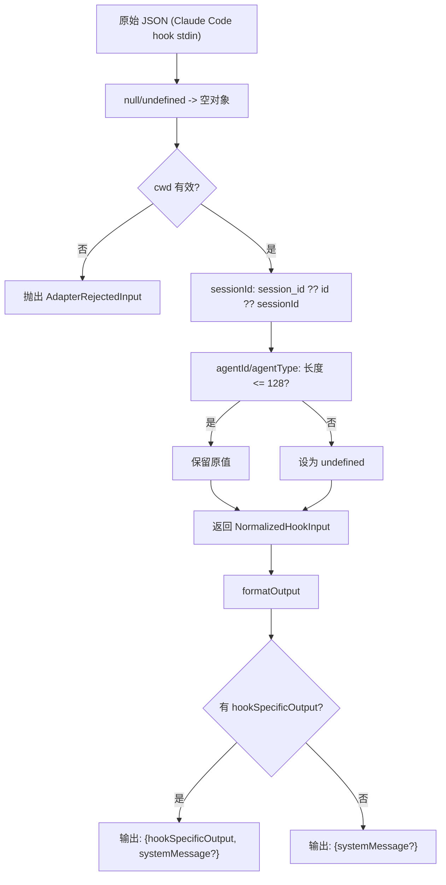

# claude-code.ts 需求说明

> 源文件：src/cli/adapters/claude-code.ts ｜ 类型：源码 ｜ 行数：42 ｜ 所属模块：cli/adapters ｜ 分析日期：2026-07-23

## 1. 文件定位总述

本文件导出 `claudeCodeAdapter` 平台适配器，专门处理 Claude Code hook 系统传入的 JSON 数据。其 normalizeInput 将 Claude Code 的 snake_case 风格输入映射为统一的 NormalizedHookInput，并限制 agentId/agentType 字段长度以防止异常大字段。formatOutput 根据 HookResult 是否包含 hookSpecificOutput 来决定输出结构，对 Claude Code 平台特有的 systemMessage 字段做特殊处理。

## 2. 功能需求

| 编号 | 需求描述（系统应当…） | 触发条件 / 输入 | 处理规则与输出 | 证据 |
|------|----------------------|----------------|---------------|------|
| FR-CCADP-01 | 系统应当将 Claude Code 的 session_id/id/sessionId 三个候选字段映射为统一 sessionId | normalizeInput 执行时 | 取值优先级: `r.session_id ?? r.id ?? r.sessionId` | `src/cli/adapters/claude-code.ts:16` |
| FR-CCADP-02 | 系统应当验证 cwd 并拒绝无效输入 | normalizeInput 执行时 | cwd 取 `r.cwd ?? process.cwd()`，经 isValidCwd 校验不合法则抛出 AdapterRejectedInput | `src/cli/adapters/claude-code.ts:11-14` |
| FR-CCADP-03 | 系统应当限制 agentId 和 agentType 字段最大长度为 128 字符 | normalizeInput 执行时 | 仅当字段为非空字符串且长度 <= 128 时保留，否则设为 undefined | `src/cli/adapters/claude-code.ts:4-6,23-24` |
| FR-CCADP-04 | 系统应当在 formatOutput 中构建包含 hookSpecificOutput 的输出 | HookResult 包含 hookSpecificOutput 时 | 输出对象包含 hookSpecificOutput 字段；若同时有 systemMessage 则一并包含 | `src/cli/adapters/claude-code.ts:29-35` |
| FR-CCADP-05 | 系统应当在 formatOutput 中处理仅有 systemMessage 的情况 | HookResult 无 hookSpecificOutput 但有 systemMessage 时 | 输出对象仅包含 systemMessage 字段 | `src/cli/adapters/claude-code.ts:36-39` |

## 3. 业务规则与约束

- agentId/agentType 的最大长度 `MAX_AGENT_FIELD_LEN = 128`，超出部分静默丢弃（设为 undefined），不会抛异常 `src/cli/adapters/claude-code.ts:4-6`
- Claude Code 输入使用 snake_case（session_id, tool_name 等），适配器统一映射后不再保留原始 snake_case 键 `src/cli/adapters/claude-code.ts:15-21`
- formatOutput 始终返回 Record 而非 HookResult 本身，因为 Claude Code hook 系统期望的输出格式与内部 HookResult 结构不同 `src/cli/adapters/claude-code.ts:27-41`

## 4. 对外暴露

| 导出名 | 类型 | 用途 |
|--------|------|------|
| `claudeCodeAdapter` | `PlatformAdapter` | Claude Code 平台适配器实例 |

## 5. 依赖关系

- **`../types.js`**：导入 `PlatformAdapter`, `NormalizedHookInput`, `HookResult` `src/cli/adapters/claude-code.ts:1`
- **`./errors.js`**：导入 `AdapterRejectedInput`, `isValidCwd` `src/cli/adapters/claude-code.ts:2`

## 6. 数据结构

```typescript
const MAX_AGENT_FIELD_LEN = 128;

// pickAgentField: 字符串长度校验函数
(v: unknown) => string | undefined
// 条件: typeof v === 'string' && v.length > 0 && v.length <= 128
```

## 7. 复杂逻辑图示



## 8. 逆向备注

- formatOutput 输出中 hookSpecificOutput 透传整个对象，但 systemMessage 被提升到顶层，说明 Claude Code hook 系统对 systemMessage 有独立的读取逻辑 `src/cli/adapters/claude-code.ts:31-32`
- 未在 normalizeInput 中设置 platform 字段，由上层 hook-command.ts:82 注入
