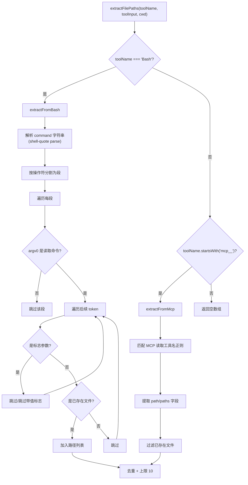

# codex-file-context.ts 需求说明

> 源文件：src/cli/adapters/codex-file-context.ts ｜ 类型：源码 ｜ 行数：137 ｜ 所属模块：cli/adapters ｜ 分析日期：2026-07-23

## 1. 文件定位总述

本文件导出 `extractFilePaths` 函数，用于从工具调用输入中提取被读取的文件路径列表。它是 Codex 适配器 file-context 功能的核心组件，支持从 Bash 命令（cat/head/tail 等读取命令）和 MCP 工具调用中解析文件路径。函数包含完整的 shell 命令解析能力，能正确处理管道符、标志参数值跳过、路径去重和上限控制。

## 2. 功能需求

| 编号 | 需求描述（系统应当…） | 触发条件 / 输入 | 处理规则与输出 | 证据 |
|------|----------------------|----------------|---------------|------|
| FR-CFC-01 | 系统应当从 Bash 工具调用中提取文件读取路径 | toolName === 'Bash' | 解析 command 字符串，识别 cat/head/tail/less/more/bat/view/nl/tac 命令，提取其中引用的已存在文件路径 | `src/cli/adapters/codex-file-context.ts:84-115` |
| FR-CFC-02 | 系统应当从 MCP 工具调用中提取文件路径 | toolName 以 'mcp__' 开头 | 匹配工具名正则 `mcp__.+__(read|view|cat)(?:_file|_files)?$`，从 toolInput 中提取 path/paths 字段 | `src/cli/adapters/codex-file-context.ts:117-131` |
| FR-CFC-03 | 系统应当忽略管道操作符后的命令段 | shell 命令中含 `|` 等操作符时 | 通过 shell-quote 的 parse 和 splitSegments 按操作符分割，每段独立分析 | `src/cli/adapters/codex-file-context.ts:17-34` |
| FR-CFC-04 | 系统应当跳过带值标志的参数值 | 命令含 `-n`, `-c`, `--lines`, `--bytes` 等标志时 | dropFlagValue 函数识别并跳过这些标志的值参数 | `src/cli/adapters/codex-file-context.ts:53-58` |
| FR-CFC-05 | 系统应当仅返回磁盘上实际存在的文件路径 | 提取候选路径后 | 通过 existsSync + statSync 验证文件存在且为文件（非目录） | `src/cli/adapters/codex-file-context.ts:60-68` |
| FR-CFC-06 | 系统应当对结果进行去重并限制最大数量 | 提取完成后 | 最多返回 10 个路径（MAX_FILE_PATHS），重复路径仅保留首次出现 | `src/cli/adapters/codex-file-context.ts:70-82` |
| FR-CFC-07 | 系统应当对非 Bash/MCP 工具名返回空数组 | toolName 不匹配条件时 | 直接返回 `[]` | `src/cli/adapters/codex-file-context.ts:133-137` |

## 3. 业务规则与约束

- 支持的读取命令列表固定为 10 种：cat, head, tail, less, more, bat, view, nl, tac `src/cli/adapters/codex-file-context.ts:6`
- head 和 tail 有额外的带值标志（`-n`, `-c`, `--lines`, `--bytes`），其他读取命令无特殊标志处理 `src/cli/adapters/codex-file-context.ts:7-11`
- 文件路径上限 MAX_FILE_PATHS = 10，防止 file-context 注入过多数据 `src/cli/adapters/codex-file-context.ts:5`
- command 字段支持字符串或字符串数组两种格式 `src/cli/adapters/codex-file-context.ts:36-43`

## 4. 对外暴露

| 导出名 | 签名 | 用途 |
|--------|------|------|
| `extractFilePaths` | `(toolName: string, toolInput: unknown, cwd: string) => string[]` | 从工具调用输入中提取文件路径列表 |

## 5. 依赖关系

- **`fs`**：`existsSync`, `statSync`（文件存在性校验） `src/cli/adapters/codex-file-context.ts:1`
- **`path`**：路径解析和规范化 `src/cli/adapters/codex-file-context.ts:2`
- **`shell-quote`**：`parse`, `ParsedToken`（Shell 命令解析） `src/cli/adapters/codex-file-context.ts:3`

## 6. 数据结构

```typescript
const MAX_FILE_PATHS = 10;
const READ_COMMANDS = Set<string>; // 10 种读取命令
const FLAGS_WITH_VALUES_BY_COMMAND: Record<string, Set<string>>; // head/tail 的带值标志
```

## 7. 复杂逻辑图示



## 8. 逆向备注

- 该文件被 `codex.ts` 适配器在 PreToolUse 事件中使用，将提取到的 filePaths 注入到 toolInput 中，供 file-context handler 使用 `src/cli/adapters/codex-file-context.ts:134` (imported by codex.ts)
- shell-quote 库的选择说明需要正确处理引号、转义等 shell 语法，不能用简单的空格分割 `src/cli/adapters/codex-file-context.ts:3`
