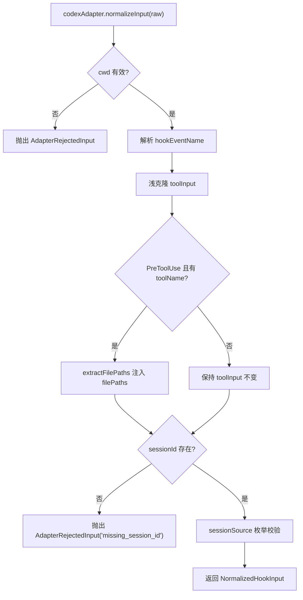
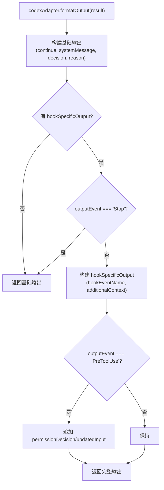

# codex.ts 需求说明

> 源文件：src/cli/adapters/codex.ts ｜ 类型：源码 ｜ 行数：138 ｜ 所属模块：cli/adapters ｜ 分析日期：2026-07-23

## 1. 文件定位总述

本文件导出 `codexAdapter` 平台适配器，专门处理 OpenAI Codex CLI 的 hook 输入。它是所有适配器中输入校验最严格的，要求 sessionId 必须存在（缺失时抛出 AdapterRejectedInput）。normalizeInput 具备两个特殊能力：在 PreToolUse 事件中自动从工具调用提取文件路径（通过 codex-file-context.ts），以及对 sessionSource 字段做枚举校验（仅允许 startup/resume/clear）。formatOutput 根据 hook 事件类型构建结构化输出，对 PreToolUse 的权限决策做专门处理。

## 2. 功能需求

| 编号 | 需求描述（系统应当…） | 触发条件 / 输入 | 处理规则与输出 | 证据 |
|------|----------------------|----------------|---------------|------|
| FR-CXADP-01 | 系统应当要求 sessionId 必须存在 | normalizeInput 执行时 | sessionId 为空时抛出 AdapterRejectedInput('missing_session_id') | `src/cli/adapters/codex.ts:84-86` |
| FR-CXADP-02 | 系统应当校验 hook_event_name 为合法枚举值 | normalizeInput 执行时 | 仅允许 PreToolUse, PermissionRequest, PostToolUse, SessionStart, UserPromptSubmit, Stop | `src/cli/adapters/codex.ts:13-26` |
| FR-CXADP-03 | 系统应当在 PreToolUse 事件中提取并注入文件路径 | hookEventName === 'PreToolUse' 且有 toolName | 调用 extractFilePaths 提取文件路径，注入到 toolInput.filePaths 中 | `src/cli/adapters/codex.ts:71-76` |
| FR-CXADP-04 | 系统应当校验 sessionSource 为合法枚举值 | source 字段存在时 | 仅当 source 为 'startup', 'resume', 'clear' 时保留，否则设为 undefined | `src/cli/adapters/codex.ts:79-82` |
| FR-CXADP-05 | 系统应当支持多种输入字段的字符串/布尔转换 | normalizeInput 执行时 | stringOrUndefined 和 booleanOrUndefined 辅助函数处理字段，booleanOrUndefined 还兼容 'true'/'false' 字符串 | `src/cli/adapters/codex.ts:28-37` |
| FR-CXADP-06 | 系统应当浅克隆 toolInput 以避免污染原始数据 | normalizeInput 执行时 | 对象类型的 toolInput 通过展开运算符 `{...}` 创建副本 | `src/cli/adapters/codex.ts:39-44` |
| FR-CXADP-07 | 系统应当在 formatOutput 中构建 Codex 专用的 hookSpecificOutput | HookResult 包含 hookSpecificOutput 时 | 根据 hookEventName 构建输出：PreToolUse 包含 permissionDecision/updatedInput，Stop 事件不输出 hookSpecificOutput | `src/cli/adapters/codex.ts:105-137` |
| FR-CXADP-08 | 系统应当在 formatOutput 中透传 block 决策 | result.decision === 'block' | 输出包含 `decision: 'block'` | `src/cli/adapters/codex.ts:50` |
| FR-CXADP-09 | 系统应当在 Stop 事件时不输出 hookSpecificOutput | outputEvent === 'Stop' | 跳过 hookSpecificOutput 构建，仅输出基础字段 | `src/cli/adapters/codex.ts:111` |

## 3. 业务规则与约束

- Codex 是唯一强制要求 sessionId 的适配器（其他平台使用兜底值如 'unknown'），说明 Codex CLI hook 系统总是传递有效的 session_id `src/cli/adapters/codex.ts:84-86`
- toolInput 的浅克隆确保 extractFilePaths 注入 filePaths 不会影响原始输入对象 `src/cli/adapters/codex.ts:69-76`
- formatOutput 中 PreToolUse 的 permissionDecision 仅在值为 'deny' 时输出，'allow' 不输出（推断 Codex 默认允许） `src/cli/adapters/codex.ts:124-129`
- Codex 使用 `last_assistant_message` 和 `turn_id` 字段名（snake_case），与其他平台的 camelCase 不同 `src/cli/adapters/codex.ts:97-98`

## 4. 对外暴露

| 导出名 | 类型 | 用途 |
|--------|------|------|
| `codexAdapter` | `PlatformAdapter` | Codex 平台适配器实例 |

## 5. 依赖关系

- **`../types.js`**：`HookResult`, `NormalizedHookInput`, `PlatformAdapter` `src/cli/adapters/codex.ts:1`
- **`./errors.js`**：`AdapterRejectedInput`, `isValidCwd` `src/cli/adapters/codex.ts:2`
- **`./codex-file-context.js`**：`extractFilePaths` `src/cli/adapters/codex.ts:3`

## 6. 数据结构

```typescript
type CodexEventName =
  | 'PreToolUse' | 'PermissionRequest' | 'PostToolUse'
  | 'SessionStart' | 'UserPromptSubmit' | 'Stop';
```

## 7. 复杂逻辑图示





## 8. 逆向备注

- Codex 是唯一在适配器层面集成 file-context 提取逻辑的平台，其他平台的 file-context 在 handler 层处理。推断 Codex 的 PreToolUse hook 允许修改 toolInput（通过 updatedInput），因此需要在适配器阶段就准备好 filePaths `src/cli/adapters/codex.ts:71-76`
- formatOutput 不支持 suppressOutput 透传（与 gemini-cli 不同），推断 Codex hook 系统不需要此字段
