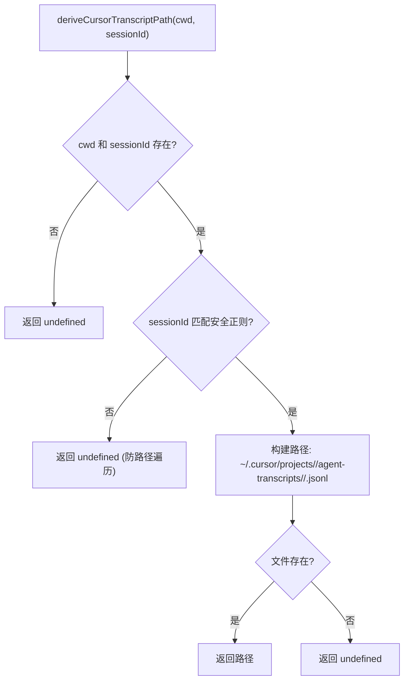
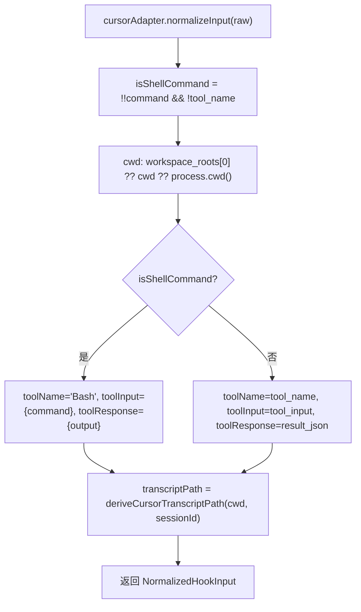

# cursor.ts 需求说明

> 源文件：src/cli/adapters/cursor.ts ｜ 类型：源码 ｜ 行数：57 ｜ 所属模块：cli/adapters ｜ 分析日期：2026-07-23

## 1. 文件定位总述

本文件导出 `cursorAdapter` 平台适配器和 `deriveCursorTranscriptPath` 辅助函数。适配器将 Cursor IDE 的 hook 输入映射为统一 NormalizedHookInput，并具备智能识别 Shell 命令的能力（将无 tool_name 但有 command 字段的输入识别为 Bash 工具调用）。辅助函数根据 cwd 和 sessionId 推导 Cursor 在磁盘上存储的 agent transcript JSONL 文件路径，并对 sessionId 进行安全校验以防止路径遍历攻击。

## 2. 功能需求

| 编号 | 需求描述（系统应当…） | 触发条件 / 输入 | 处理规则与输出 | 证据 |
|------|----------------------|----------------|---------------|------|
| FR-CUADP-01 | 系统应当将 Cursor 的 conversation_id/generation_id/id 映射为 sessionId | normalizeInput 执行时 | `r.conversation_id || r.generation_id || r.id` | `src/cli/adapters/cursor.ts:38` |
| FR-CUADP-02 | 系统应当从 workspace_roots 数组获取工作目录 | normalizeInput 执行时 | cwd 取 `r.workspace_roots?.[0] ?? r.cwd ?? process.cwd()` | `src/cli/adapters/cursor.ts:34` |
| FR-CUADP-03 | 系统应当智能识别 Shell 命令并将 toolName 映射为 Bash | 存在 `command` 字段且无 `tool_name` 时 | toolName 设为 'Bash'，toolInput 映射为 `{ command: r.command }`，toolResponse 映射为 `{ output: r.output }` | `src/cli/adapters/cursor.ts:33,43-45` |
| FR-CUADP-04 | 系统应当推导 Cursor 的 transcript 文件路径 | normalizeInput 执行时 | 调用 deriveCursorTranscriptPath(cwd, sessionId) | `src/cli/adapters/cursor.ts:49` |
| FR-CUADP-05 | 系统应当对 sessionId 进行安全字符校验 | deriveCursorTranscriptPath 执行时 | sessionId 必须匹配 `^[A-Za-z0-9_-]+$`，否则返回 undefined | `src/cli/adapters/cursor.ts:20,24` |
| FR-CUADP-06 | 系统应当仅返回磁盘上实际存在的 transcript 路径 | deriveCursorTranscriptPath 执行时 | 通过 existsSync 校验文件是否存在，不存在则返回 undefined | `src/cli/adapters/cursor.ts:27` |
| FR-CUADP-07 | 系统应当支持多种 prompt 字段命名兼容 | normalizeInput 执行时 | prompt 取 `r.prompt ?? r.query ?? r.input ?? r.message` | `src/cli/adapters/cursor.ts:42` |
| FR-CUADP-08 | 系统应当在 formatOutput 中仅返回 continue 标志 | formatOutput 被调用时 | 返回 `{ continue: result.continue ?? true }` | `src/cli/adapters/cursor.ts:54-56` |

## 3. 业务规则与约束

- Cursor 的 transcript 存储路径格式为 `~/.cursor/projects/<workspace-slug>/agent-transcripts/<sessionId>/<sessionId>.jsonl` `src/cli/adapters/cursor.ts:26`
- workspace-slug 由 cwd 去除前导 `/` 并将 `/` 和 `.` 替换为 `-` 生成 `src/cli/adapters/cursor.ts:25`
- sessionId 安全校验（PR #2282 安全审查）防止通过路径分隔符、`..` 段或 null 字节进行路径遍历攻击 `src/cli/adapters/cursor.ts:18-20`
- Cursor Shell 命令的 toolResponse 使用 `result_json` 而非 `tool_response`，与其他平台不同 `src/cli/adapters/cursor.ts:45`

## 4. 对外暴露

| 导出名 | 类型 | 用途 |
|--------|------|------|
| `cursorAdapter` | `PlatformAdapter` | Cursor 平台适配器实例 |
| `deriveCursorTranscriptPath` | `(cwd, sessionId) => string | undefined` | 推导 Cursor transcript 磁盘路径 |

## 5. 依赖关系

- **Node.js 内置模块**：`fs`（existsSync）、`os`（homedir）、`path`（join） `src/cli/adapters/cursor.ts:1-3`
- **`../types.js`**：`PlatformAdapter`, `NormalizedHookInput`, `HookResult` `src/cli/adapters/cursor.ts:4`
- **`./errors.js`**：`AdapterRejectedInput`, `isValidCwd` `src/cli/adapters/cursor.ts:5`

## 6. 数据结构

```typescript
const SAFE_SESSION_ID_RE = /^[A-Za-z0-9_-]+$/;
// 仅允许字母、数字、下划线和连字符，防止路径遍历
```

## 7. 复杂逻辑图示





## 8. 逆向备注

- 注释中提到 Cursor stop hook 不通过 stdin 传递 transcript 路径，而是写入磁盘 JSONL 文件，因此需要额外推导 `src/cli/adapters/cursor.ts:46-48`
- `workspace_roots` 为数组类型，适配器仅取第一个元素，推断 Cursor 支持多工作区但 claude-mem 仅关注主工作区 `src/cli/adapters/cursor.ts:34`
