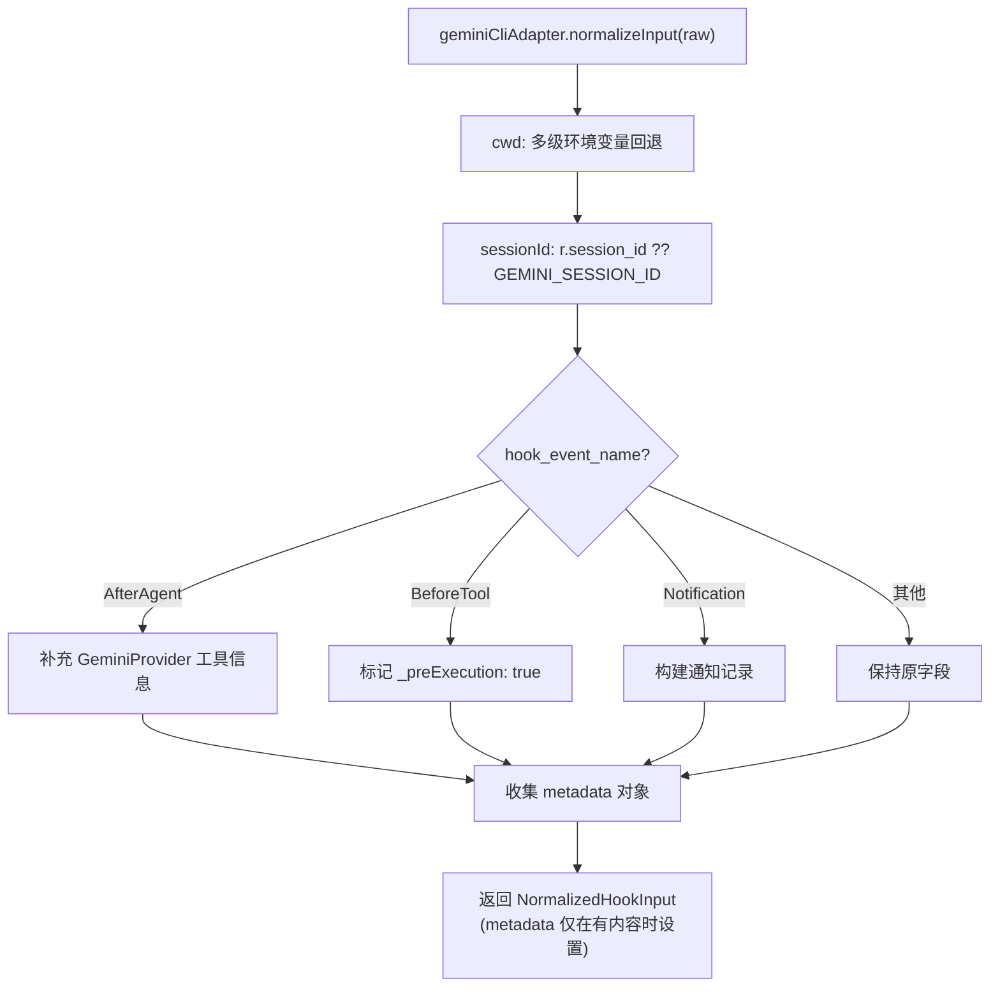

# gemini-cli.ts 需求说明

> 源文件：src/cli/adapters/gemini-cli.ts ｜ 类型：源码 ｜ 行数：90 ｜ 所属模块：cli/adapters ｜ 分析日期：2026-07-23

## 1. 文件定位总述

本文件导出 `geminiCliAdapter` 平台适配器，专门处理 Gemini CLI 的 hook 输入。它是所有适配器中最复杂的一个，normalizeInput 包含三层 hook 事件语义增强：对 AfterAgent 事件填充 GeminiProvider 工具信息、对 BeforeTool 事件标记预执行状态、对 Notification 事件构建通知记录。cwd 和 sessionId 支持从环境变量回退获取，大量元数据通过 metadata 字段透传。formatOutput 会过滤 systemMessage 中的 ANSI 转义序列。

## 2. 功能需求

| 编号 | 需求描述（系统应当…） | 触发条件 / 输入 | 处理规则与输出 | 证据 |
|------|----------------------|----------------|---------------|------|
| FR-GCADP-01 | 系统应当支持从环境变量回退获取 cwd | normalizeInput 执行时 | cwd 优先级: `r.cwd ?? GEMINI_CWD ?? GEMINI_PROJECT_DIR ?? CLAUDE_PROJECT_DIR ?? process.cwd()` | `src/cli/adapters/gemini-cli.ts:8-12` |
| FR-GCADP-02 | 系统应当支持从环境变量回退获取 sessionId | normalizeInput 执行时 | sessionId 取 `r.session_id ?? GEMINI_SESSION_ID` | `src/cli/adapters/gemini-cli.ts:17-19` |
| FR-GCADP-03 | 系统应当为 AfterAgent 事件补充 GeminiProvider 工具信息 | hook_event_name === 'AfterAgent' 且有 prompt_response | toolName 默认为 'GeminiProvider'，toolInput 包含 prompt，toolResponse 包含 response | `src/cli/adapters/gemini-cli.ts:27-31` |
| FR-GCADP-04 | 系统应当为 BeforeTool 事件标记预执行状态 | hook_event_name === 'BeforeTool' 且有 toolName 但无 toolResponse | toolResponse 设为 `{ _preExecution: true }` | `src/cli/adapters/gemini-cli.ts:33-35` |
| FR-GCADP-05 | 系统应当为 Notification 事件构建通知记录 | hook_event_name === 'Notification' | toolName 默认为 'GeminiNotification'，toolInput/toolResponse 包含通知相关字段 | `src/cli/adapters/gemini-cli.ts:37-44` |
| FR-GCADP-06 | 系统应当将多种扩展字段收集到 metadata 对象中 | normalizeInput 执行时 | 将 source, reason, trigger, mcp_context, notification_type, stop_hook_active, original_request_name, hook_event_name 收入 metadata | `src/cli/adapters/gemini-cli.ts:46-54` |
| FR-GCADP-07 | 系统应当在 formatOutput 中过滤 ANSI 转义序列 | result.systemMessage 包含 ANSI 代码时 | 使用正则 `/[›][[()#;?]*(?:[0-9]{1,4}(?:;[0-9]{0,4})*)?[0-9A-ORZcf-nqry=><]/g` 过滤 | `src/cli/adapters/gemini-cli.ts:78-79` |
| FR-GCADP-08 | 系统应当在 formatOutput 中支持 suppressOutput 透传 | result.suppressOutput 存在时 | 将 suppressOutput 字段包含在输出中 | `src/cli/adapters/gemini-cli.ts:73-75` |
| FR-GCADP-09 | 系统应当在 formatOutput 中仅传递 additionalContext | result.hookSpecificOutput 存在时 | 输出的 hookSpecificOutput 仅包含 additionalContext，丢弃其他字段 | `src/cli/adapters/gemini-cli.ts:82-86` |

## 3. 业务规则与约束

- cwd 支持四级环境变量回退链，兼容 Gemini CLI 和 Claude Code 的环境变量命名 `src/cli/adapters/gemini-cli.ts:8-12`
- metadata 仅在包含至少一个键时设置，空 metadata 不设为 undefined（通过 `Object.keys(metadata).length > 0` 判断） `src/cli/adapters/gemini-cli.ts:64`
- formatOutput 过滤 ANSI 的原因是 Gemini CLI 可能无法正确处理终端颜色代码 `src/cli/adapters/gemini-cli.ts:78-79`
- hook_event_name 事件增强仅在对应字段缺失时才填充（使用 `??` 操作符），不会覆盖已有值 `src/cli/adapters/gemini-cli.ts:28-44`

## 4. 对外暴露

| 导出名 | 类型 | 用途 |
|--------|------|------|
| `geminiCliAdapter` | `PlatformAdapter` | Gemini CLI 平台适配器实例 |

## 5. 依赖关系

- **`../types.js`**：`PlatformAdapter` `src/cli/adapters/gemini-cli.ts:1`
- **`./errors.js`**：`AdapterRejectedInput`, `isValidCwd` `src/cli/adapters/gemini-cli.ts:2`

## 6. 数据结构

不适用——使用标准类型，metadata 为 `Record<string, unknown>`。

## 7. 复杂逻辑图示

## 8. 逆向备注

- `_preExecution` 标记（带下划线前缀）说明这是一个内部约定的状态标记，用于下游处理器区分工具调用前和工具调用后的 hook 事件 `src/cli/adapters/gemini-cli.ts:34`
- metadata 收集了大量 Gemini CLI 特有字段（source, reason, trigger 等），这些字段不参与 NormalizedHookInput 的标准化映射，推断用于审计或调试目的
- formatOutput 中 hookSpecificOutput 只保留 additionalContext 而丢弃 permissionDecision 等字段，说明 Gemini CLI 的 hook 系统不支持这些高级特性 `src/cli/adapters/gemini-cli.ts:82-86`
