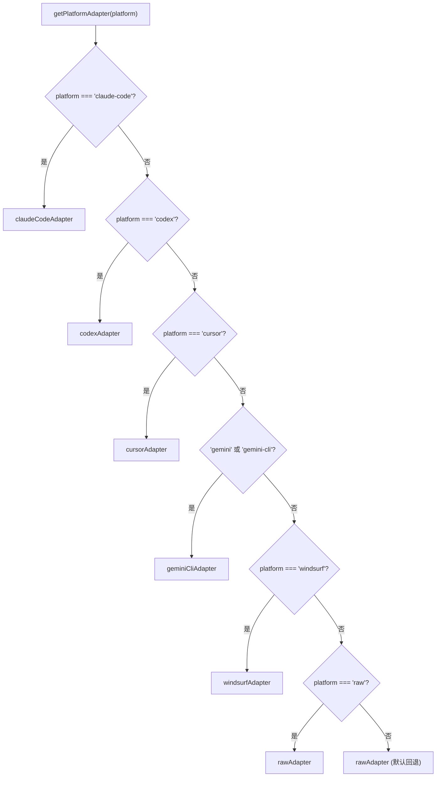

# index.ts 需求说明

> 源文件：src/cli/adapters/index.ts ｜ 类型：源码 ｜ 行数：22 ｜ 所属模块：cli/adapters ｜ 分析日期：2026-07-23

## 1. 文件定位总述

本文件是平台适配器的注册中心与路由入口。它导入所有已实现的具体平台适配器（claude-code、codex、cursor、gemini-cli、windsurf、raw），并提供 `getPlatformAdapter` 工厂函数根据平台标识字符串分发到对应的适配器实例。当平台标识无法匹配任何已知平台时，默认回退到 raw 通用适配器，确保不会出现适配器缺失的情况。

## 2. 功能需求

| 编号 | 需求描述（系统应当…） | 触发条件 / 输入 | 处理规则与输出 | 证据 |
|------|----------------------|----------------|---------------|------|
| FR-ADPIDX-01 | 系统应当根据平台标识字符串返回对应的适配器实例 | 调用 `getPlatformAdapter(platform)` | 平台标识 'claude-code' 返回 claudeCodeAdapter，'codex' 返回 codexAdapter，以此类推 | `src/cli/adapters/index.ts:9-20` |
| FR-ADPIDX-02 | 系统应当支持 gemini 平台标识的两种别名 | 传入 'gemini' 或 'gemini-cli' | 两者均返回 geminiCliAdapter | `src/cli/adapters/index.ts:14-15` |
| FR-ADPIDX-03 | 系统应当在平台标识未匹配时回退到 raw 适配器 | 传入无法识别的平台字符串 | default 分支返回 rawAdapter | `src/cli/adapters/index.ts:18` |

## 3. 业务规则与约束

- 工厂函数使用 `switch` 而非 Map，说明平台数量有限且编译时可枚举 `src/cli/adapters/index.ts:10-19`
- 所有适配器实例均为模块级单例，无需每次调用时创建新实例 `src/cli/adapters/index.ts:9-22`

## 4. 对外暴露

| 导出名 | 类型 | 用途 |
|--------|------|------|
| `getPlatformAdapter` | `(platform: string) => PlatformAdapter` | 平台适配器工厂函数 |
| `claudeCodeAdapter` | `PlatformAdapter` | Claude Code 适配器（re-export） |
| `codexAdapter` | `PlatformAdapter` | Codex 适配器（re-export） |
| `cursorAdapter` | `PlatformAdapter` | Cursor 适配器（re-export） |
| `geminiCliAdapter` | `PlatformAdapter` | Gemini CLI 适配器（re-export） |
| `rawAdapter` | `PlatformAdapter` | 通用适配器（re-export） |
| `windsurfAdapter` | `PlatformAdapter` | Windsurf 适配器（re-export） |

## 5. 依赖关系

- **`./claude-code.js`**：`claudeCodeAdapter` `src/cli/adapters/index.ts:2`
- **`./codex.js`**：`codexAdapter` `src/cli/adapters/index.ts:3`
- **`./cursor.js`**：`cursorAdapter` `src/cli/adapters/index.ts:4`
- **`./gemini-cli.js`**：`geminiCliAdapter` `src/cli/adapters/index.ts:5`
- **`./raw.js`**：`rawAdapter` `src/cli/adapters/index.ts:6`
- **`./windsurf.js`**：`windsurfAdapter` `src/cli/adapters/index.ts:7`

## 6. 数据结构

不适用。

## 7. 复杂逻辑图示

## 8. 逆向备注

- 平台列表硬编码在 switch 中，新增平台需修改本文件并导入对应适配器模块
- gemini 的双别名（`'gemini'` 和 `'gemini-cli'`）说明 Gemini 平台在不同上下文中使用不同标识 `src/cli/adapters/index.ts:14-15`
