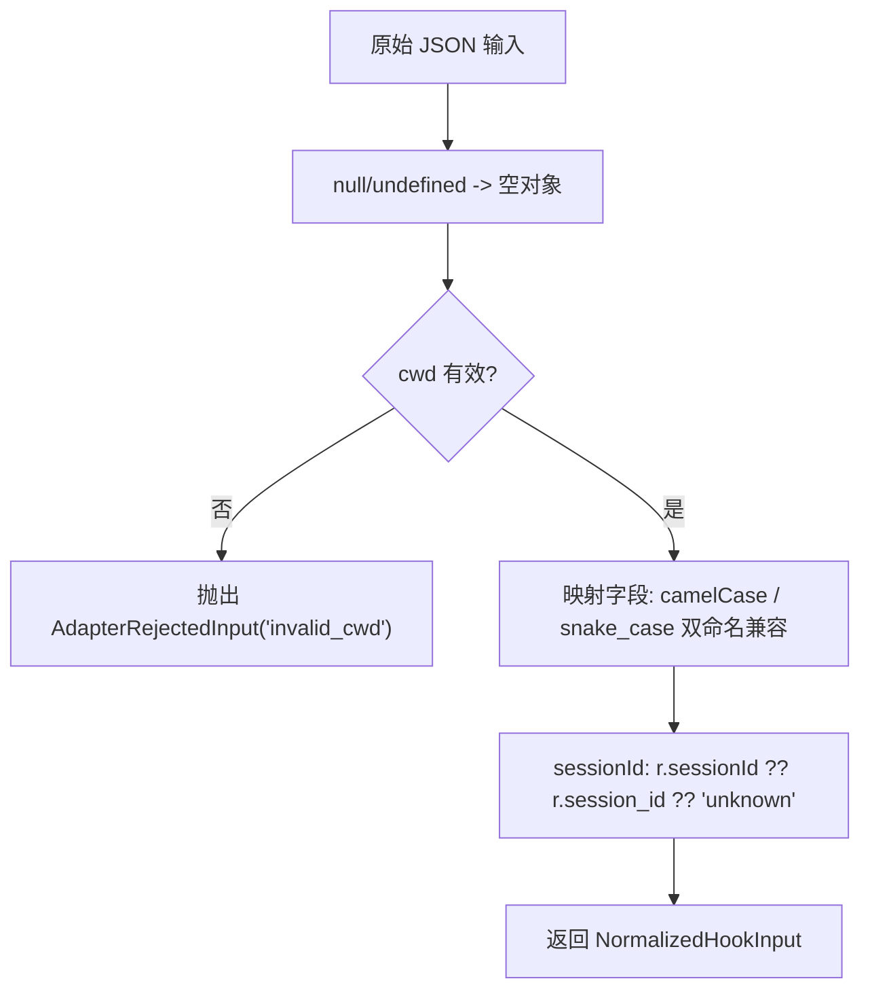

# raw.ts 需求说明

> 源文件：src/cli/adapters/raw.ts ｜ 类型：源码 ｜ 行数：26 ｜ 所属模块：cli/adapters ｜ 分析日期：2026-07-23

## 1. 文件定位总述

本文件导出 `rawAdapter` 平台适配器，作为通用/兜底适配器处理任意来源的 hook 输入。它将原始 JSON 数据映射到统一的 `NormalizedHookInput` 结构，支持 camelCase 和 snake_case 两种字段命名风格。当平台标识无法匹配到专用适配器时，adapter 索引模块将自动回退到此适配器。其 formatOutput 方法为透传，不做任何转换。

## 2. 功能需求

| 编号 | 需求描述（系统应当…） | 触发条件 / 输入 | 处理规则与输出 | 证据 |
|------|----------------------|----------------|---------------|------|
| FR-RAW-01 | 系统应当将原始输入的 cwd 字段规范化，缺失时使用 process.cwd() | 调用 normalizeInput 时 | cwd 取 `r.cwd ?? process.cwd()`，并经 isValidCwd 校验，不合法则抛出 AdapterRejectedInput | `src/cli/adapters/raw.ts:7-10` |
| FR-RAW-02 | 系统应当兼容 sessionId 的 camelCase 和 snake_case 命名 | normalizeInput 执行时 | sessionId 取 `r.sessionId ?? r.session_id ?? 'unknown'` | `src/cli/adapters/raw.ts:12` |
| FR-RAW-03 | 系统应当兼容工具相关字段的两种命名风格 | normalizeInput 执行时 | toolName 取 `r.toolName ?? r.tool_name`，toolInput/toolResponse 同理 | `src/cli/adapters/raw.ts:14-16` |
| FR-RAW-04 | 系统应当透传 transcriptPath、filePath、edits 字段 | normalizeInput 执行时 | transcriptPath 取 `r.transcriptPath ?? r.transcript_path`，filePath/edits 直接取值 | `src/cli/adapters/raw.ts:17-20` |
| FR-RAW-05 | 系统应当在 formatOutput 中直接透传结果 | formatOutput 被调用时 | 不做任何转换，原样返回 HookResult | `src/cli/adapters/raw.ts:23-25` |

## 3. 业务规则与约束

- 当原始输入为 null/undefined 时，默认为空对象 `{}`，避免属性访问报错 `src/cli/adapters/raw.ts:6`
- sessionId 的最终兜底值为 `'unknown'`，确保不会出现 undefined `src/cli/adapters/raw.ts:12`
- 本适配器不设置 `platform` 字段，推断平台信息由上层 hook-command 注入 `src/cli/adapters/raw.ts:11-21`

## 4. 对外暴露

| 导出名 | 类型 | 用途 |
|--------|------|------|
| `rawAdapter` | `PlatformAdapter` | 通用/兜底平台适配器实例 |

## 5. 依赖关系

- **`../types.js`**：导入 `PlatformAdapter`, `NormalizedHookInput`, `HookResult` 类型 `src/cli/adapters/raw.ts:1`
- **`./errors.js`**：导入 `AdapterRejectedInput`, `isValidCwd` `src/cli/adapters/raw.ts:2`

## 6. 数据结构

不适用——本文件使用标准 `NormalizedHookInput` 和 `HookResult` 类型。

## 7. 复杂逻辑图示

## 8. 逆向备注

- raw 适配器不注入 `platform` 字段，但 `NormalizedHookInput` 类型定义中 `platform` 为可选字段，推断上游 `hook-command.ts` 在调用 adapter 后手动设置 `input.platform = platform` `src/cli/adapters/raw.ts:11-21`
