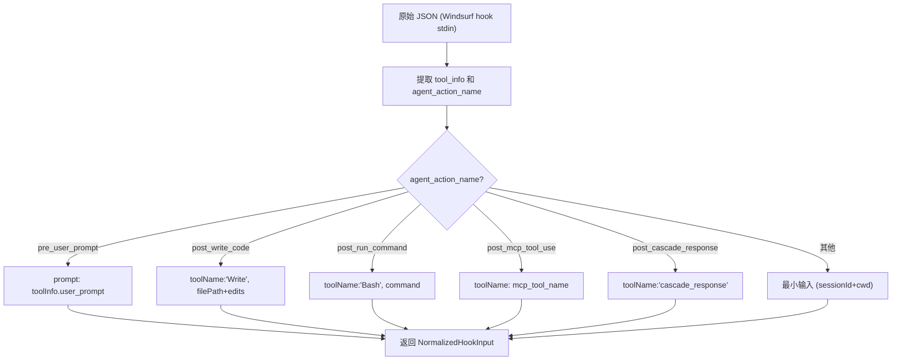

# windsurf.ts 需求说明

> 源文件：src/cli/adapters/windsurf.ts ｜ 类型：源码 ｜ 行数：71 ｜ 所属模块：cli/adapters ｜ 分析日期：2026-07-23

## 1. 文件定位总述

本文件导出 `windsurfAdapter` 平台适配器，专门处理 Windsurf IDE 的 hook 输入。其 normalizeInput 根据 `agent_action_name` 字段将不同类型的 Windsurf 事件映射为统一的 NormalizedHookInput，支持用户提示、代码写入、命令执行、MCP 工具调用和级联响应五种动作类型。formatOutput 仅返回 continue 标志。

## 2. 功能需求

| 编号 | 需求描述（系统应当…） | 触发条件 / 输入 | 处理规则与输出 | 证据 |
|------|----------------------|----------------|---------------|------|
| FR-WSADP-01 | 系统应当将 Windsurf 的 trajectory_id 或 execution_id 映射为 sessionId | normalizeInput 执行时 | `r.trajectory_id ?? r.execution_id` | `src/cli/adapters/windsurf.ts:16` |
| FR-WSADP-02 | 系统应当从 tool_info.cwd 获取工作目录并校验 | normalizeInput 执行时 | cwd 取 `toolInfo.cwd ?? process.cwd()`，经 isValidCwd 校验 | `src/cli/adapters/windsurf.ts:10-13` |
| FR-WSADP-03 | 系统应当将 pre_user_prompt 动作映射为用户提示事件 | agent_action_name === 'pre_user_prompt' | 提取 `toolInfo.user_prompt` 到 prompt 字段 | `src/cli/adapters/windsurf.ts:22-26` |
| FR-WSADP-04 | 系统应当将 post_write_code 动作映射为文件写入事件 | agent_action_name === 'post_write_code' | toolName 设为 'Write'，filePath 和 edits 从 tool_info 获取 | `src/cli/adapters/windsurf.ts:28-38` |
| FR-WSADP-05 | 系统应当将 post_run_command 动作映射为 Bash 执行事件 | agent_action_name === 'post_run_command' | toolName 设为 'Bash'，toolInput 为 `{ command: toolInfo.command_line }` | `src/cli/adapters/windsurf.ts:40-46` |
| FR-WSADP-06 | 系统应当将 post_mcp_tool_use 动作映射为 MCP 工具调用 | agent_action_name === 'post_mcp_tool_use' | toolName 取 `mcp_tool_name ?? 'mcp_tool'`，toolInput/toolResponse 对应 mcp 参数和结果 | `src/cli/adapters/windsurf.ts:48-54` |
| FR-WSADP-07 | 系统应当将 post_cascade_response 动作映射为级联响应事件 | agent_action_name === 'post_cascade_response' | toolName 设为 'cascade_response'，toolResponse 为响应内容 | `src/cli/adapters/windsurf.ts:56-61` |
| FR-WSADP-08 | 系统应当对未知动作类型返回仅含基础字段的输入 | agent_action_name 不匹配任何已知类型 | 返回仅含 sessionId、cwd、platform='windsurf' 的最小输入 | `src/cli/adapters/windsurf.ts:63-65` |
| FR-WSADP-09 | 系统应当在 formatOutput 中仅返回 continue 标志 | formatOutput 被调用时 | 返回 `{ continue: result.continue ?? true }` | `src/cli/adapters/windsurf.ts:68-70` |

## 3. 业务规则与约束

- 平台标识固定为 `'windsurf'`，在 normalizeInput 中直接写入 `src/cli/adapters/windsurf.ts:19`
- tool_info 为可选对象，当为 undefined 时默认为 `{}`，避免属性访问报错 `src/cli/adapters/windsurf.ts:7`

## 4. 对外暴露

| 导出名 | 类型 | 用途 |
|--------|------|------|
| `windsurfAdapter` | `PlatformAdapter` | Windsurf 平台适配器实例 |

## 5. 依赖关系

- **`../types.js`**：`PlatformAdapter`, `NormalizedHookInput`, `HookResult` `src/cli/adapters/windsurf.ts:1`
- **`./errors.js`**：`AdapterRejectedInput`, `isValidCwd` `src/cli/adapters/windsurf.ts:2`

## 6. 数据结构

不适用——使用标准类型。

## 7. 复杂逻辑图示

## 8. 逆向备注

- Windsurf 使用 `trajectory_id` 和 `execution_id` 作为会话标识，与其他平台的 sessionId/conversation_id 命名不同，说明 Windsurf 有自己的会话概念 `src/cli/adapters/windsurf.ts:16`
- 五种 agent_action_name 的映射说明 Windsurf 的 hook 系统覆盖了 AI 编码助手的完整工作流（提示、写代码、执行命令、MCP 调用、级联响应）
