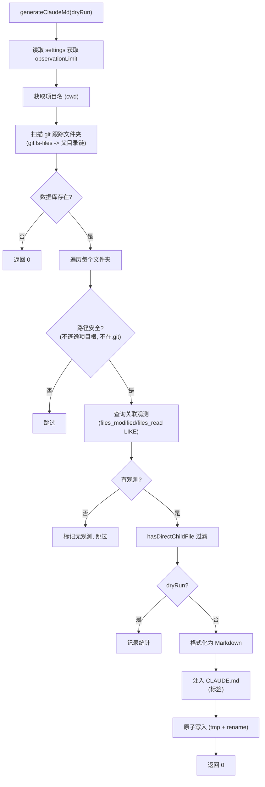

# claude-md-commands.ts 需求说明

> 源文件：src/cli/claude-md-commands.ts ｜ 类型：源码 ｜ 行数：523 ｜ 所属模块：cli ｜ 分析日期：2026-07-23

## 1. 文件定位总述

本文件实现了 CLAUDE.md 文件的自动生成与清理功能，是 claude-mem 的"代码记忆可视化"子系统。它通过扫描项目目录下的 git 跟踪文件夹，查询 SQLite 数据库中每个文件夹关联的历史观测记录，将最近的开发活动以 Markdown 格式注入到各文件夹的 CLAUDE.md 文件中（使用 `<claude-mem-context>` 标签隔离）。同时提供清理功能，移除所有 auto-generated 内容，必要时删除仅含自动生成内容的 CLAUDE.md 文件。

## 2. 功能需求

| 编号 | 需求描述（系统应当…） | 触发条件 / 输入 | 处理规则与输出 | 证据 |
|------|----------------------|----------------|---------------|------|
| FR-CMD-01 | 系统应当扫描项目下所有 git 跟踪的文件夹 | generateClaudeMd 调用时 | 执行 `git ls-files` 获取所有跟踪文件，提取其父目录链形成文件夹集合 | `src/cli/claude-md-commands.ts:61-91` |
| FR-CMD-02 | 系统应当在 git 不可用时回退到目录遍历 | git ls-files 执行失败时 | 使用 walkDirectoriesWithIgnore 递归遍历，排除 node_modules/.git/.next 等目录 | `src/cli/claude-md-commands.ts:72-76,93-116` |
| FR-CMD-03 | 系统应当为每个文件夹查询关联的历史观测 | 遍历文件夹时 | 按 project + 文件路径模糊匹配（LIKE `%"<folder>/%"`），筛选 files_modified/files_read 中包含该文件夹直系子文件的观测 | `src/cli/claude-md-commands.ts:135-152` |
| FR-CMD-04 | 系统应当校验路径安全性 | 处理每个文件夹时 | 拒绝逃逸项目根目录的路径（resolvedFolder 不以 resolvedWorkingDir + sep 开头）和 .git 目录 | `src/cli/claude-md-commands.ts:241,291-294` |
| FR-CMD-05 | 系统应当格式化观测记录为 Markdown 时间线 | 查询到观测后 | 按日期分组 -> 按文件分组 -> 显示 ID/时间/类型图标/标题/token 估算，生成表格 | `src/cli/claude-md-commands.ts:188-236` |
| FR-CMD-06 | 系统应当将格式化内容注入 CLAUDE.md 的标记区间 | 格式化完成后 | 使用 `<claude-mem-context>...</claude-mem-context>` 标签包裹，已存在则替换，不存在则追加 | `src/cli/claude-md-commands.ts:255-276` |
| FR-CMD-07 | 系统应当使用原子写入防止文件损坏 | 写入 CLAUDE.md 时 | 先写入 .tmp 文件，再 rename 到目标路径 | `src/cli/claude-md-commands.ts:274-275` |
| FR-CMD-08 | 系统应当支持 dry-run 模式 | dryRun 参数为 true 时 | 仅统计和记录日志，不实际写入任何文件 | `src/cli/claude-md-commands.ts:303-304` |
| FR-CMD-09 | 系统应当估算每条观测的 token 数 | 格式化时 | token 估算公式: `(title + subtitle + narrative + facts).length / 4`，向上取整 | `src/cli/claude-md-commands.ts:53-59` |
| FR-CMD-10 | 系统应当提供 CLAUDE.md 清理功能 | 调用 cleanClaudeMd 时 | 递归查找包含 `<claude-mem-context>` 标签的 CLAUDE.md 文件，移除标签及内容 | `src/cli/claude-md-commands.ts:463-523` |
| FR-CMD-11 | 系统应当在清理后删除仅含自动生成内容的空文件 | 清理后文件内容为空时 | 删除该 CLAUDE.md 文件 | `src/cli/claude-md-commands.ts:448-452` |

## 3. 业务规则与约束

- 每个文件夹的观测数量上限由 `CLAUDE_MEM_CONTEXT_OBSERVATIONS` 设置控制，默认 50 `src/cli/claude-md-commands.ts:377`
- 目录遍历深度限制为 10 层 `src/cli/claude-md-commands.ts:94`
- 排除目录列表包含 14 种常见开发目录（node_modules, .git, .next, dist, build 等） `src/cli/claude-md-commands.ts:96-99`
- 目录遍历中仅排除以 `.` 开头的目录（`.claude` 除外） `src/cli/claude-md-commands.ts:107`
- 类型图标映射覆盖 7 种类型：bugfix(🔴), feature(🟣), refactor(🔄), change(✅), discovery(🔵), decision(⚖️), session(🎯), prompt(💬) `src/cli/claude-md-commands.ts:38-47`
- hasDirectChildFile 使用 isDirectChild 工具函数判断文件路径是否为指定文件夹的直系子文件（非深层子文件） `src/cli/claude-md-commands.ts:118-133`
- 清理功能在 dry-run 模式下仅报告将要删除/清理的文件，不执行实际操作 `src/cli/claude-md-commands.ts:449,456`

## 4. 对外暴露

| 导出名 | 签名 | 用途 |
|--------|------|------|
| `generateClaudeMd` | `(dryRun: boolean) => Promise<number>` | 生成/更新所有文件夹的 CLAUDE.md 内容 |
| `cleanClaudeMd` | `(dryRun: boolean) => Promise<number>` | 清理所有 CLAUDE.md 中的 auto-generated 内容 |

## 5. 依赖关系

- **`bun:sqlite`**：`Database`（直接访问 SQLite 数据库） `src/cli/claude-md-commands.ts:2`
- **Node.js 内置模块**：`fs`, `path`, `child_process`（execSync 执行 git） `src/cli/claude-md-commands.ts:4-12`
- **`../shared/SettingsDefaultsManager.js`**：读取 CLAUDE_MEM_CONTEXT_OBSERVATIONS 设置 `src/cli/claude-md-commands.ts:13`
- **`../shared/timeline-formatting.js`**：`formatTime`, `groupByDate` `src/cli/claude-md-commands.ts:14`
- **`../shared/path-utils.js`**：`isDirectChild` `src/cli/claude-md-commands.ts:15`
- **`../utils/logger.js`**：`logger` `src/cli/claude-md-commands.ts:16`
- **`../utils/project-name.js`**：`getProjectContext` `src/cli/claude-md-commands.ts:17`
- **`../shared/paths.js`**：`paths`（获取 database 和 settings 路径） `src/cli/claude-md-commands.ts:18`

## 6. 数据结构

```typescript
interface ObservationRow {
  id: number;
  title: string | null;
  subtitle: string | null;
  narrative: string | null;
  facts: string | null;
  type: string;
  created_at: string;
  created_at_epoch: number;
  files_modified: string | null;
  files_read: string | null;
  project: string;
  discovery_tokens: number | null;
}

const TYPE_ICONS: Record<string, string>; // 7 种类型 -> emoji 映射
```

## 7. 复杂逻辑图示



## 8. 逆向备注

- 直接使用 `bun:sqlite` 的 `Database` 而非 SessionStore，说明 SessionStore 缺少按文件路径模糊查询观测的方法 `src/cli/claude-md-commands.ts:2,325`
- `isDirectChild` 检查确保只有直接属于该文件夹的文件被关联，深层子目录的文件不会被错误归属到父文件夹 `src/cli/claude-md-commands.ts:135-152`
- 注释 `<claude-mem-context>` 和 `</claude-mem-context>` 的选择说明需要一种可靠的边界标记，确保自动生成内容与用户手写内容隔离 `src/cli/claude-md-commands.ts:255-256`
- 使用 `execSync` 执行 `git ls-files` 是同步阻塞调用，但 CLAUDE.md 生成通常作为 CLI 命令一次性执行，不涉及性能敏感路径 `src/cli/claude-md-commands.ts:66`
