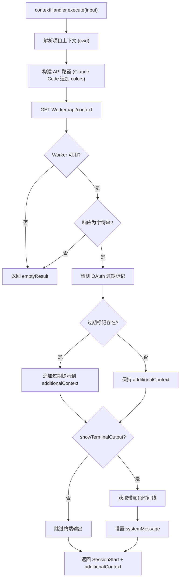

# context.ts 需求说明

> 源文件：src/cli/handlers/context.ts ｜ 类型：源码 ｜ 行数：82 ｜ 所属模块：cli/handlers ｜ 分析日期：2026-07-23

## 1. 文件定位总述

本文件实现 `contextHandler` 事件处理器，响应 `context` hook 事件（即 SessionStart 生命周期）。它负责从 Worker 获取项目历史上下文，注入到 agent 的会话启动阶段。处理器具备双重输出通道：通过 `hookSpecificOutput.additionalContext` 向 agent 注入结构化上下文，通过 `systemMessage` 向终端输出带颜色的时间线（可配置关闭）。还集成了 OAuth token 过期检测，当检测到过期标记时将提示信息追加到上下文中。

## 2. 功能需求

| 编号 | 需求描述（系统应当…） | 触发条件 / 输入 | 处理规则与输出 | 证据 |
|------|----------------------|----------------|---------------|------|
| FR-CTX-01 | 系统应当向 Worker 请求项目上下文注入内容 | context 事件触发时 | 通过 buildContextInjectPath 构建 API 路径，GET 请求获取上下文字符串 | `src/cli/handlers/context.ts:32` |
| FR-CTX-02 | 系统应当在 Worker 不可用时返回空的 additionalContext | Worker 请求返回 fallback | hookSpecificOutput 中 additionalContext 设为空字符串 | `src/cli/handlers/context.ts:33-35` |
| FR-CTX-03 | 系统应当检测并处理过期 OAuth token 标记 | Worker 返回上下文后 | 调用 readStaleMarker() 读取过期标记，存在时将提示信息追加到 additionalContext | `src/cli/handlers/context.ts:50-56` |
| FR-CTX-04 | 系统应当根据设置决定是否获取带颜色的终端输出 | CLAUDE_MEM_CONTEXT_SHOW_TERMINAL_OUTPUT === 'true' | 额外请求带 colors 参数的 API 获取带颜色格式的时间线 | `src/cli/handlers/context.ts:59-64` |
| FR-CTX-05 | 系统应当为 Claude Code 平台使用带颜色的 API 路径 | input.platform === 'claude-code' | API 路径追加 `&colors=true` 参数 | `src/cli/handlers/context.ts:25` |
| FR-CTX-06 | 系统应当通过 hookSpecificOutput 注入 SessionStart 事件上下文 | 处理完成后 | 返回 hookSpecificOutput.hookEventName='SessionStart'，additionalContext 为查询到的上下文 | `src/cli/handlers/context.ts:74-80` |
| FR-CTX-07 | 系统应当在终端输出可配置时生成 systemMessage | showTerminalOutput=true 且有显示内容时 | systemMessage 包含显示内容和实时查看链接 | `src/cli/handlers/context.ts:70-72` |
| FR-CTX-08 | 系统应当优先使用带颜色的终端输出，回退到纯文本 | 有颜色输出时优先使用 | displayContent = coloredTimeline || (gemini 平台时使用 additionalContext) | `src/cli/handlers/context.ts:68` |

## 3. 业务规则与约束

- 当 Worker 返回非字符串类型时（如 undefined 或意外类型），additionalContext 设为空字符串，不会导致异常 `src/cli/handlers/context.ts:38-45`
- OAuth token 过期提示信息使用 `[claude-mem]` 前缀标识来源 `src/cli/handlers/context.ts:52`
- Gemini/Gemini CLI 平台在没有终端颜色输出时，直接使用 additionalContext 作为 systemMessage 内容（推断 Gemini 不支持 additionalContext 注入） `src/cli/handlers/context.ts:68`
- 颜色参数对非 Claude Code 平台不追加，避免不支持 ANSI 的终端出现乱码 `src/cli/handlers/context.ts:25`

## 4. 对外暴露

| 导出名 | 类型 | 用途 |
|--------|------|------|
| `contextHandler` | `EventHandler` | context 事件处理器实例 |

## 5. 依赖关系

- **`../../shared/worker-utils.js`**：`executeWithWorkerFallback`, `isWorkerFallback`, `getWorkerPort` `src/cli/handlers/context.ts:3-7`
- **`../../utils/project-name.js`**：`getProjectContext` `src/cli/handlers/context.ts:8`
- **`../../shared/query-utils.js`**：`buildContextInjectPath` `src/cli/handlers/context.ts:9`
- **`../../shared/hook-constants.js`**：`HOOK_EXIT_CODES` `src/cli/handlers/context.ts:10`
- **`../../utils/logger.js`**：`logger` `src/cli/handlers/context.ts:11`
- **`../../shared/hook-settings.js`**：`loadFromFileOnce` `src/cli/handlers/context.ts:12`
- **`../../shared/oauth-token.js`**：`readStaleMarker` `src/cli/handlers/context.ts:13`

## 6. 数据结构

```typescript
// Worker 不可用时的空结果
const emptyResult: HookResult = {
  hookSpecificOutput: { hookEventName: 'SessionStart', additionalContext: '' },
  exitCode: HOOK_EXIT_CODES.SUCCESS,
};
```

## 7. 复杂逻辑图示



## 8. 逆向备注

- Issue #2215 的 OAuth token 过期检测是后加的逻辑，使用 EnvManager 在 Worker 启动时写入标记文件的方式实现跨进程通信 `src/cli/handlers/context.ts:47-49`
- Gemini 平台回退到使用 additionalContext 作为 systemMessage 内容，说明 Gemini CLI 的 SessionStart hook 不支持 additionalContext 注入机制 `src/cli/handlers/context.ts:68`
