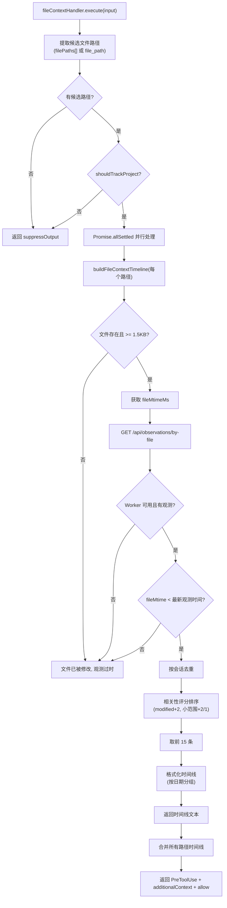

# file-context.ts 需求说明

> 源文件：src/cli/handlers/file-context.ts ｜ 类型：源码 ｜ 行数：249 ｜ 所属模块：cli/handlers ｜ 分析日期：2026-07-23

## 1. 文件定位总述

本文件实现 `fileContextHandler` 事件处理器，响应 `file-context` hook 事件（即 PreToolUse 生命周期）。它在 agent 读取文件时，自动检索该文件的历史观测记录并注入为 PreToolUse 的 additionalContext，让 agent 了解文件的历史修改背景。处理器具备多层过滤：文件大小阈值（小于 1.5KB 跳过）、文件修改时间检查（修改晚于最新观测则跳过）、按会话去重、按相关性评分排序。最终输出按日期分组的文件时间线。

## 2. 功能需求

| 编号 | 需求描述（系统应当…） | 触发条件 / 输入 | 处理规则与输出 | 证据 |
|------|----------------------|----------------|---------------|------|
| FR-FC-01 | 系统应当从 toolInput 中提取候选文件路径 | file-context 事件触发时 | 优先使用 toolInput.filePaths 数组（上限 10），回退到 toolInput.file_path | `src/cli/handlers/file-context.ts:139-143` |
| FR-FC-02 | 系统应当跳过文件大小低于阈值的文件 | statSync 文件大小 < 1500 字节 | 返回 null，不注入上下文 | `src/cli/handlers/file-context.ts:11,191` |
| FR-FC-03 | 系统应当从 Worker 查询文件相关的历史观测 | 候选文件通过大小检查后 | GET `/api/observations/by-file?path=...&projects=...&limit=40` | `src/cli/handlers/file-context.ts:214-217` |
| FR-FC-04 | 系统应当跳过文件修改时间晚于最新观测的文件 | fileMtimeMs >= newestObservationMs | 返回 null（文件被修改过，历史观测可能过时） | `src/cli/handlers/file-context.ts:231-241` |
| FR-FC-05 | 系统应当对观测记录按会话去重 | 同一会话有多条观测时 | 仅保留每个 memory_session_id 的第一条记录 | `src/cli/handlers/file-context.ts:51-64` |
| FR-FC-06 | 系统应当按相关性评分排序观测记录 | 去重完成后 | 评分规则: 文件在 modified 列表 +2，涉及文件总数 <= 3 时 +2，<= 8 时 +1；取前 15 条 | `src/cli/handlers/file-context.ts:66-84` |
| FR-FC-07 | 系统应当以 PreToolUse 事件注入文件时间线上下文 | 处理完成后 | 返回 hookSpecificOutput.hookEventName='PreToolUse'，additionalContext 为时间线文本，permissionDecision='allow' | `src/cli/handlers/file-context.ts:174-181` |
| FR-FC-08 | 系统应当按日期分组格式化时间线输出 | 观测记录确定后 | 按日期降序分组，每条记录显示 ID、时间、类型图标、标题 | `src/cli/handlers/file-context.ts:86-134` |
| FR-FC-09 | 系统应当并行处理多个候选文件路径 | 多个 filePaths 时 | 使用 Promise.allSettled 并行查询，单个失败不影响其他 | `src/cli/handlers/file-context.ts:154-168` |
| FR-FC-10 | 系统应当在时间线中包含操作提示 | 格式化时间线时 | 包含 get_observations([IDs]) 和 smart_outline(path) 的使用建议 | `src/cli/handlers/file-context.ts:119` |

## 3. 业务规则与约束

- 文件大小阈值 FILE_READ_GATE_MIN_BYTES = 1500，小于此值的文件（如空文件或极短配置文件）不注入上下文 `src/cli/handlers/file-context.ts:11`
- 查询上限 FETCH_LOOKAHEAD_LIMIT = 40，从 Worker 获取的原始观测数 `src/cli/handlers/file-context.ts:13`
- 显示上限 DISPLAY_LIMIT = 15，去重排序后最多显示的观测数 `src/cli/handlers/file-context.ts:15`
- 文件路径上限 MAX_FILE_CONTEXT_PATHS = 10，防止一次请求处理过多文件 `src/cli/handlers/file-context.ts:16`
- 类型图标映射：decision(⚖️), bugfix(🔴), feature(🟣), refactor(🔄), discovery(🔵), change(✅) `src/cli/handlers/file-context.ts:18-25`
- 时间线开头包含当前时间和操作提示，告知 agent 这是补充上下文而非文件内容 `src/cli/handlers/file-context.ts:115-120`

## 4. 对外暴露

| 导出名 | 类型 | 用途 |
|--------|------|------|
| `fileContextHandler` | `EventHandler` | file-context 事件处理器实例 |

## 5. 依赖关系

- **`../../shared/worker-utils.js`**：`executeWithWorkerFallback`, `isWorkerFallback` `src/cli/handlers/file-context.ts:3`
- **`../../utils/logger.js`**：`logger` `src/cli/handlers/file-context.ts:4`
- **`../../shared/timeline-formatting.js`**：`parseJsonArray` `src/cli/handlers/file-context.ts:5`
- **`fs`**：`statSync` `src/cli/handlers/file-context.ts:6`
- **`path`**：路径处理 `src/cli/handlers/file-context.ts:7`
- **`../../shared/should-track-project.js`**：`shouldTrackProject` `src/cli/handlers/file-context.ts:8`
- **`../../utils/project-name.js`**：`getProjectContext` `src/cli/handlers/file-context.ts:9`

## 6. 数据结构

```typescript
interface ObservationRow {
  id: number;
  memory_session_id: string;
  title: string | null;
  type: string;
  created_at_epoch: number;
  files_read: string | null;
  files_modified: string | null;
}

// 常量
FILE_READ_GATE_MIN_BYTES = 1500;
FETCH_LOOKAHEAD_LIMIT = 40;
DISPLAY_LIMIT = 15;
MAX_FILE_CONTEXT_PATHS = 10;
```

## 7. 复杂逻辑图示



## 8. 逆向备注

- 时间线中的操作提示（get_observations 和 smart_outline）是引导 agent 按需获取更多上下文的策略，避免一次性注入过多 token `src/cli/handlers/file-context.ts:119`
- 文件修改时间检查是关键优化：如果文件在最后一次观测后被修改过，历史观测可能不再准确，跳过注入避免误导 agent `src/cli/handlers/file-context.ts:231-241`
- 使用 `Promise.allSettled` 而非 `Promise.all`，确保单个文件查询失败不会阻塞其他文件的处理 `src/cli/handlers/file-context.ts:154`
