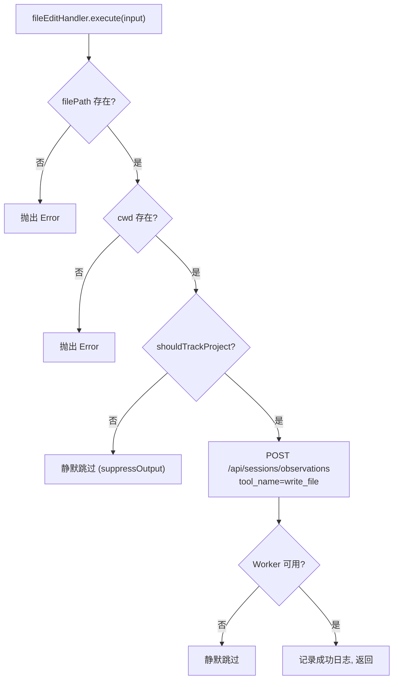

# file-edit.ts 需求说明

> 源文件：src/cli/handlers/file-edit.ts ｜ 类型：源码 ｜ 行数：51 ｜ 所属模块：cli/handlers ｜ 分析日期：2026-07-23

## 1. 文件定位总述

本文件实现 `fileEditHandler` 事件处理器，响应 `file-edit` hook 事件。它在检测到文件编辑操作时，将编辑记录作为 observation 发送到 Worker 进行持久化。处理器会校验输入的完整性和项目追踪资格，仅在满足条件时向 `/api/sessions/observations` POST 请求发送 write_file 类型的观测记录。

## 2. 功能需求

| 编号 | 需求描述（系统应当…） | 触发条件 / 输入 | 处理规则与输出 | 证据 |
|------|----------------------|----------------|---------------|------|
| FR-FE-01 | 系统应当将文件编辑记录为 write_file 类型的观测 | file-edit 事件触发且 filePath 非空时 | 向 Worker POST `/api/sessions/observations`，payload 包含 tool_name='write_file'、filePath、edits | `src/cli/handlers/file-edit.ts:31-43` |
| FR-FE-02 | 系统应当在校验 filePath 缺失时抛出异常 | filePath 为空或 undefined | 抛出 `Error('fileEditHandler requires filePath')` | `src/cli/handlers/file-edit.ts:14-16` |
| FR-FE-03 | 系统应当在校验 cwd 缺失时抛出异常 | cwd 为空或 undefined | 抛出异常并包含 sessionId 和 filePath 信息 | `src/cli/handlers/file-edit.ts:22-24` |
| FR-FE-04 | 系统应当跳过不在追踪范围内的项目 | shouldTrackProject(cwd) 返回 false | 返回 `{ continue: true, suppressOutput: true, exitCode: SUCCESS }` | `src/cli/handlers/file-edit.ts:26-29` |
| FR-FE-05 | 系统应当在 Worker 不可用时静默跳过 | Worker 请求返回 fallback | 返回 `{ continue: true, suppressOutput: true, exitCode: SUCCESS }` | `src/cli/handlers/file-edit.ts:44-46` |

## 3. 业务规则与约束

- filePath 为必需字段，缺失时直接抛出异常而非返回错误 HookResult，推断此为编程错误不应在运行时出现 `src/cli/handlers/file-edit.ts:14-16`
- cwd 为必需字段，缺失时直接抛出异常，同理 `src/cli/handlers/file-edit.ts:22-24`
- tool_response 固定为 `{ success: true }`，因为 file-edit hook 触发时编辑操作已成功执行 `src/cli/handlers/file-edit.ts:39`
- 输入日志使用 `logger.dataIn` 级别，记录文件路径和编辑数量 `src/cli/handlers/file-edit.ts:18-20`

## 4. 对外暴露

| 导出名 | 类型 | 用途 |
|--------|------|------|
| `fileEditHandler` | `EventHandler` | file-edit 事件处理器实例 |

## 5. 依赖关系

- **`../../shared/worker-utils.js`**：`executeWithWorkerFallback`, `isWorkerFallback` `src/cli/handlers/file-edit.ts:3`
- **`../../utils/logger.js`**：`logger` `src/cli/handlers/file-edit.ts:4`
- **`../../shared/hook-constants.js`**：`HOOK_EXIT_CODES` `src/cli/handlers/file-edit.ts:5`
- **`../../shared/platform-source.js`**：`normalizePlatformSource` `src/cli/handlers/file-edit.ts:6`
- **`../../shared/should-track-project.js`**：`shouldTrackProject` `src/cli/handlers/file-edit.ts:7`

## 6. 数据结构

不适用。

## 7. 复杂逻辑图示

## 8. 逆向备注

- file-edit 与 observation 处理器的区别在于：file-edit 专门处理文件写入事件（tool_name 固定为 'write_file'），而 observation 处理器处理所有 PostToolUse 事件的通用工具调用记录
- file-edit 处理器不包含 server-beta 运行时逻辑，推断 server-beta 尚未适配 file-edit 事件
