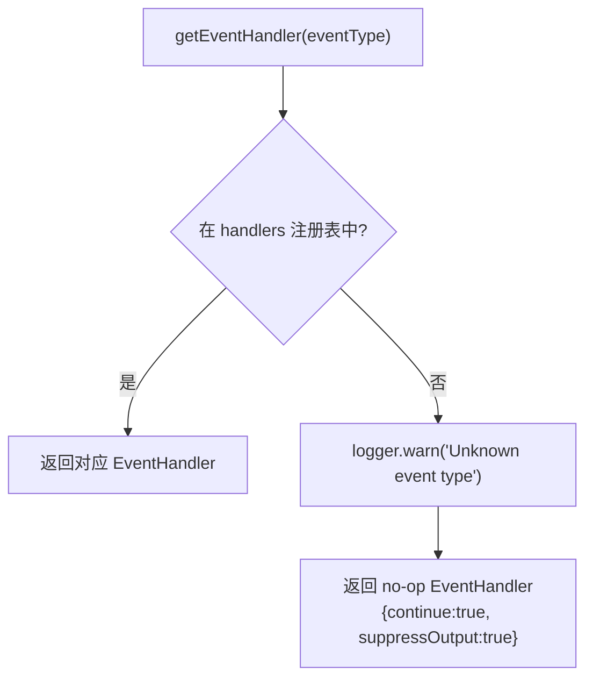

# index.ts 需求说明

> 源文件：src/cli/handlers/index.ts ｜ 类型：源码 ｜ 行数：51 ｜ 所属模块：cli/handlers ｜ 分析日期：2026-07-23

## 1. 文件定位总述

本文件是事件处理器的注册中心与路由入口。它导入所有已实现的事件处理器（context、session-init、observation、summarize、user-message、file-edit、file-context），通过 `getEventHandler` 工厂函数根据事件类型字符串分发到对应的处理器。当事件类型无法匹配时，返回一个 no-op 处理器（静默成功），确保不会因未知事件类型而阻断 hook 流程。

## 2. 功能需求

| 编号 | 需求描述（系统应当…） | 触发条件 / 输入 | 处理规则与输出 | 证据 |
|------|----------------------|----------------|---------------|------|
| FR-HDLIDX-01 | 系统应当支持 7 种事件类型的路由 | 调用 `getEventHandler(eventType)` | 支持: context, session-init, observation, summarize, user-message, file-edit, file-context | `src/cli/handlers/index.ts:22-30` |
| FR-HDLIDX-02 | 系统应当在事件类型未知时返回 no-op 处理器 | 传入未注册的事件类型字符串 | 返回一个 execute 方法返回 `{ continue: true, suppressOutput: true, exitCode: SUCCESS }` 的处理器 | `src/cli/handlers/index.ts:34-39` |
| FR-HDLIDX-03 | 系统应当在事件类型未知时记录警告日志 | 传入未注册的事件类型时 | 输出 warn 级别日志 `Unknown event type: {eventType}, returning no-op` | `src/cli/handlers/index.ts:35` |

## 3. 业务规则与约束

- EventType 联合类型枚举了所有合法事件类型，编译时可发现拼写错误 `src/cli/handlers/index.ts:13-20`
- no-op 处理器的 `suppressOutput: true` 确保未知事件不会向 hook 宿主输出任何内容 `src/cli/handlers/index.ts:38`
- 工厂函数使用 `as EventType` 强制转型，说明 TypeScript 类型检查在运行时不生效，需要日志兜底 `src/cli/handlers/index.ts:33`

## 4. 对外暴露

| 导出名 | 类型 | 用途 |
|--------|------|------|
| `getEventHandler` | `(eventType: string) => EventHandler` | 事件处理器工厂函数 |
| `EventType` | `type` | 合法事件类型联合类型 |
| `contextHandler` | `EventHandler`（re-export） | context 事件处理器 |
| `sessionInitHandler` | `EventHandler`（re-export） | session-init 事件处理器 |
| `observationHandler` | `EventHandler`（re-export） | observation 事件处理器 |
| `summarizeHandler` | `EventHandler`（re-export） | summarize 事件处理器 |
| `userMessageHandler` | `EventHandler`（re-export） | user-message 事件处理器 |
| `fileEditHandler` | `EventHandler`（re-export） | file-edit 事件处理器 |
| `fileContextHandler` | `EventHandler`（re-export） | file-context 事件处理器 |

## 5. 依赖关系

- **`./context.js`**：`contextHandler` `src/cli/handlers/index.ts:5`
- **`./session-init.js`**：`sessionInitHandler` `src/cli/handlers/index.ts:6`
- **`./observation.js`**：`observationHandler` `src/cli/handlers/index.ts:7`
- **`./summarize.js`**：`summarizeHandler` `src/cli/handlers/index.ts:8`
- **`./user-message.js`**：`userMessageHandler` `src/cli/handlers/index.ts:9`
- **`./file-edit.js`**：`fileEditHandler` `src/cli/handlers/index.ts:10`
- **`./file-context.js`**：`fileContextHandler` `src/cli/handlers/index.ts:11`
- **`../../shared/hook-constants.js`**：`HOOK_EXIT_CODES` `src/cli/handlers/index.ts:3`
- **`../../utils/logger.js`**：`logger` `src/cli/handlers/index.ts:4`

## 6. 数据结构

不适用。

## 7. 复杂逻辑图示

## 8. 逆向备注

- 不适用。
