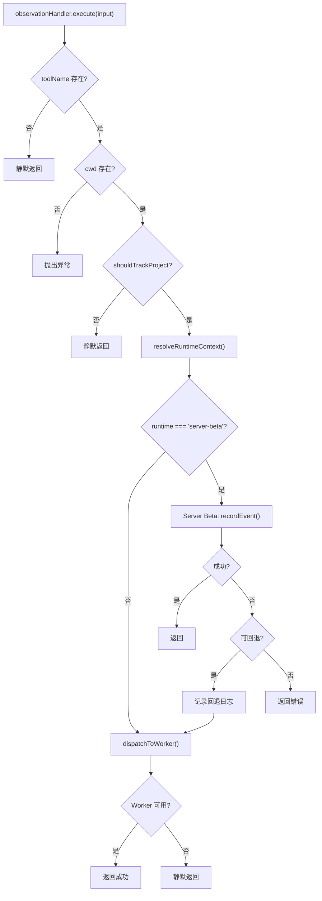

# observation.ts 需求说明

> 源文件：src/cli/handlers/observation.ts ｜ 类型：源码 ｜ 行数：96 ｜ 所属模块：cli/handlers ｜ 分析日期：2026-07-23

## 1. 文件定位总述

本文件实现 `observationHandler` 事件处理器，响应 `observation` hook 事件（即 PostToolUse 生命周期）。它将工具调用记录发送到后端进行持久化，支持两种运行时后端：本地 Worker（默认）和 Server Beta（云端）。处理器包含完整的过滤逻辑：跳过无工具名、无 cwd、不在追踪范围内的项目。Server Beta 模式支持失败回退到 Worker。

## 2. 功能需求

| 编号 | 需求描述（系统应当…） | 触发条件 / 输入 | 处理规则与输出 | 证据 |
|------|----------------------|----------------|---------------|------|
| FR-OBS-01 | 系统应当将工具调用记录作为观测事件发送 | observation 事件触发且 toolName 非空时 | 通过 POST `/api/sessions/observations` 发送包含 contentSessionId, platformSource, tool_name, tool_input, tool_response, cwd, agentId, agentType 的 payload | `src/cli/handlers/observation.ts:15-28` |
| FR-OBS-02 | 系统应当跳过无工具名的事件 | toolName 为 undefined 或空 | 直接返回 suppressOutput+SUCCESS，不发送任何数据 | `src/cli/handlers/observation.ts:43-45` |
| FR-OBS-03 | 系统应当在 cwd 缺失时抛出异常 | cwd 为空或 undefined | 抛出包含 sessionId 和 toolName 信息的异常 | `src/cli/handlers/observation.ts:51-53` |
| FR-OBS-04 | 系统应当跳过不在追踪范围内的项目 | shouldTrackProject(cwd) 返回 false | 返回 suppressOutput+SUCCESS | `src/cli/handlers/observation.ts:55-58` |
| FR-OBS-05 | 系统应当支持 Server Beta 运行时 | resolveRuntimeContext() 返回 runtime === 'server-beta' | 调用 runtime.client.recordEvent() 发送事件到云端 | `src/cli/handlers/observation.ts:60-91` |
| FR-OBS-06 | 系统应当在 Server Beta 可回退时降级到 Worker | Server Beta 请求失败且 isFallbackEligible() | 记录回退日志，继续执行 Worker 路径 | `src/cli/handlers/observation.ts:82-84` |
| FR-OBS-07 | 系统应当在 Server Beta 不可回退时静默跳过 | Server Beta 请求失败且不可回退 | 记录错误日志，返回 suppressOutput+SUCCESS | `src/cli/handlers/observation.ts:86-89` |
| FR-OBS-08 | 系统应当在 Worker 不可用时静默跳过 | Worker 请求返回 fallback | 返回 suppressOutput+SUCCESS | `src/cli/handlers/observation.ts:30-32` |

## 3. 业务规则与约束

- Server Beta 模式下事件的 sourceType 固定为 `'hook'`，eventType 为 `'tool_use'` `src/cli/handlers/observation.ts:67-68`
- occurredAtEpoch 使用 `Date.now()` 记录当前时间作为事件发生时间 `src/cli/handlers/observation.ts:69`
- platformSource 通过 `normalizePlatformSource(input.platform)` 标准化 `src/cli/handlers/observation.ts:41`
- agentId/agentType 直接从 input 透传，由适配器层负责校验 `src/cli/handlers/observation.ts:25-26`

## 4. 对外暴露

| 导出名 | 类型 | 用途 |
|--------|------|------|
| `observationHandler` | `EventHandler` | observation 事件处理器实例 |

## 5. 依赖关系

- **`../../shared/worker-utils.js`**：`executeWithWorkerFallback`, `isWorkerFallback` `src/cli/handlers/observation.ts:3`
- **`../../utils/logger.js`**：`logger` `src/cli/handlers/observation.ts:4`
- **`../../shared/hook-constants.js`**：`HOOK_EXIT_CODES` `src/cli/handlers/observation.ts:5`
- **`../../shared/should-track-project.js`**：`shouldTrackProject` `src/cli/handlers/observation.ts:6`
- **`../../shared/platform-source.js`**：`normalizePlatformSource` `src/cli/handlers/observation.ts:7`
- **`../../services/hooks/runtime-selector.js`**：`resolveRuntimeContext`, `logServerBetaFallback` `src/cli/handlers/observation.ts:8`
- **`../../services/hooks/server-beta-client.js`**：`isServerBetaClientError` `src/cli/handlers/observation.ts:9`

## 6. 数据结构

不适用。

## 7. 复杂逻辑图示

## 8. 逆向备注

- `dispatchToWorker` 被提取为独立的私有函数，说明 Worker 发送逻辑可能被多个代码路径复用 `src/cli/handlers/observation.ts:11-36`
- Server Beta 和 Worker 使用不同的 API 结构：Server Beta 通过 `recordEvent` 发送结构化事件，Worker 通过 REST POST 发送扁平化 payload `src/cli/handlers/observation.ts:63-78,15-28`
