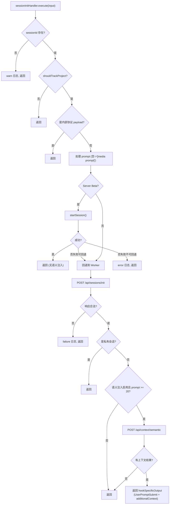

# session-init.ts 需求说明

> 源文件：src/cli/handlers/session-init.ts ｜ 类型：源码 ｜ 行数：162 ｜ 所属模块：cli/handlers ｜ 分析日期：2026-07-23

## 1. 文件定位总述

本文件实现 `sessionInitHandler` 事件处理器，响应 `session-init` hook 事件（即 UserPromptSubmit 生命周期）。它在每次用户提交新提示时初始化或续接会话上下文，完成三件事：向 Worker 发送会话初始化请求获取 sessionDbId 和 promptNumber、可选地进行语义上下文注入（根据配置从历史观测中检索与当前 prompt 相关的上下文）、以及支持 Server Beta 云端运行时。处理器具备多层过滤：跳过无 sessionId、跳过不追踪的项目、跳过内部协议 payload、跳过私有会话。

## 2. 功能需求

| 编号 | 需求描述（系统应当…） | 触发条件 / 输入 | 处理规则与输出 | 证据 |
|------|----------------------|----------------|---------------|------|
| FR-SI-01 | 系统应当向 Worker 发送会话初始化请求 | session-init 事件触发且满足前置条件 | POST `/api/sessions/init`，包含 contentSessionId, project, prompt, platformSource | `src/cli/handlers/session-init.ts:93-102` |
| FR-SI-02 | 系统应当跳过无 sessionId 的事件 | sessionId 为空 | 返回 suppressOutput+SUCCESS，记录 warn 日志 | `src/cli/handlers/session-init.ts:32-35` |
| FR-SI-03 | 系统应当跳过不追踪的项目 | shouldTrackProject(cwd) 返回 false | 返回 suppressOutput+SUCCESS | `src/cli/handlers/session-init.ts:37-39` |
| FR-SI-04 | 系统应当跳过内部协议 payload | prompt 匹配 isInternalProtocolPayload | 返回 suppressOutput+SUCCESS | `src/cli/handlers/session-init.ts:42-47` |
| FR-SI-05 | 系统应当将空 prompt 替换为占位符 | prompt 为空或仅空白 | 替换为 `'[media prompt]'` | `src/cli/handlers/session-init.ts:49` |
| FR-SI-06 | 系统应当在配置启用时执行语义上下文注入 | CLAUDE_MEM_SEMANTIC_INJECT='true' 且 prompt 长度 >= 20 且不是媒体 prompt | POST `/api/context/semantic`，传入 prompt 和 limit，将返回的上下文设为 additionalContext | `src/cli/handlers/session-init.ts:128-143` |
| FR-SI-07 | 系统应当跳过私有会话的语义注入 | initResult.skipped && reason === 'private' | 不执行语义注入，直接返回 | `src/cli/handlers/session-init.ts:120-125` |
| FR-SI-08 | 系统应当通过 UserPromptSubmit 事件注入语义上下文 | 语义注入成功时 | 返回 hookSpecificOutput.hookEventName='UserPromptSubmit'，包含 additionalContext | `src/cli/handlers/session-init.ts:149-158` |
| FR-SI-09 | 系统应当支持 Server Beta 运行时 | resolveRuntimeContext() 返回 server-beta | 调用 runtime.client.startSession() 初始化云端会话，失败可回退 | `src/cli/handlers/session-init.ts:54-89` |
| FR-SI-10 | 系统应当处理 Worker 返回的畸形响应 | initResult.sessionDbId 不是 number | 记录 failure 日志，返回 suppressOutput+SUCCESS | `src/cli/handlers/session-init.ts:108-111` |

## 3. 业务规则与约束

- 语义注入的 prompt 最小长度为 20 字符，避免对过短的无意义输入执行检索 `src/cli/handlers/session-init.ts:132`
- 媒体 prompt（被替换为 `'[media prompt]'` 的输入）不触发语义注入，推断媒体内容不适合文本语义检索 `src/cli/handlers/session-init.ts:132`
- 语义注入的默认 limit 从 `CLAUDE_MEM_SEMANTIC_INJECT_LIMIT` 设置读取，默认为 5 `src/cli/handlers/session-init.ts:133`
- Server Beta 模式下不执行语义注入（注释说明云端尚无 context endpoint） `src/cli/handlers/session-init.ts:71-72`
- 私有会话由 Worker 在 init 响应中标记（skipped=true, reason='private'），hook 层仅负责跳过后续注入 `src/cli/handlers/session-init.ts:120-121`

## 4. 对外暴露

| 导出名 | 类型 | 用途 |
|--------|------|------|
| `sessionInitHandler` | `EventHandler` | session-init 事件处理器实例 |

## 5. 依赖关系

- **`../../shared/worker-utils.js`**：`executeWithWorkerFallback`, `isWorkerFallback` `src/cli/handlers/session-init.ts:3`
- **`../../utils/project-name.js`**：`getProjectContext` `src/cli/handlers/session-init.ts:5`
- **`../../utils/logger.js`**：`logger` `src/cli/handlers/session-init.ts:6`
- **`../../shared/hook-constants.js`**：`HOOK_EXIT_CODES` `src/cli/handlers/session-init.ts:7`
- **`../../shared/should-track-project.js`**：`shouldTrackProject` `src/cli/handlers/session-init.ts:8`
- **`../../shared/hook-settings.js`**：`loadFromFileOnce` `src/cli/handlers/session-init.ts:9`
- **`../../shared/platform-source.js`**：`normalizePlatformSource` `src/cli/handlers/session-init.ts:10`
- **`../../utils/tag-stripping.js`**：`isInternalProtocolPayload` `src/cli/handlers/session-init.ts:11`
- **`../../services/hooks/runtime-selector.js`**：`resolveRuntimeContext`, `logServerBetaFallback` `src/cli/handlers/session-init.ts:12`
- **`../../services/hooks/server-beta-client.js`**：`isServerBetaClientError` `src/cli/handlers/session-init.ts:13`

## 6. 数据结构

```typescript
interface SessionInitResponse {
  sessionDbId: number;
  promptNumber: number;
  skipped?: boolean;
  reason?: string;
  contextInjected?: boolean;
}

interface SemanticContextResponse {
  context: string;
  count: number;
}
```

## 7. 复杂逻辑图示



## 8. 逆向备注

- 内部协议 payload（isInternalProtocolPayload）的检查在 shouldTrackProject 之后，说明即使项目不在追踪范围也可能需要检查是否为内部协议 `src/cli/handlers/session-init.ts:42`
- sessionDbId 和 promptNumber 被记录在日志中用于对齐追踪（注释引用 ALIGNMENT），但未在 HookResult 中返回，推断它们仅供调试使用 `src/cli/handlers/session-init.ts:118`
