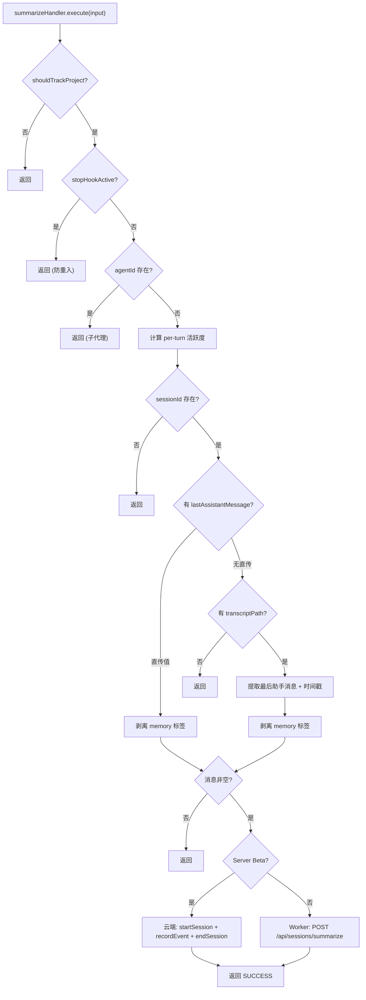

# summarize.ts 需求说明

> 源文件：src/cli/handlers/summarize.ts ｜ 类型：源码 ｜ 行数：172 ｜ 所属模块：cli/handlers ｜ 分析日期：2026-07-23

## 1. 文件定位总述

本文件实现 `summarizeHandler` 事件处理器，响应 `summarize` hook 事件（即 Stop 生命周期）。它在会话结束时从 transcript 中提取最后一条助手消息，连同项目上下文、用户提示、per-turn 活跃度数据等发送给后端进行会话总结。处理器包含多种跳过条件：Stop hook 重入（Codex 场景）、子代理上下文、无 transcript 路径、无助手消息等。支持 Server Beta 云端运行时，并在云端模式下额外记录助手消息事件。

## 2. 功能需求

| 编号 | 需求描述（系统应当…） | 触发条件 / 输入 | 处理规则与输出 | 证据 |
|------|----------------------|----------------|---------------|------|
| FR-SUM-01 | 系统应当从 transcript 提取最后一条助手消息 | summarize 事件触发时 | 优先使用 input.lastAssistantMessage 直传值；回退到从 transcriptPath 提取 `src/cli/handlers/summarize.ts:60-84` |
| FR-SUM-02 | 系统应当计算 per-turn 活跃度数据 | transcriptPath 存在时 | 调用 computePerTurnActivity，静默阈值 15 分钟（900000ms） | `src/cli/handlers/summarize.ts:41-49` |
| FR-SUM-03 | 系统应当从 transcript 提取助手消息的时间戳 | transcriptPath 存在时 | 通过 extractLastAssistantEntry 获取 timestampEpoch 作为 completed_at 主源 | `src/cli/handlers/summarize.ts:57-79` |
| FR-SUM-04 | 系统应当跳过 Stop hook 重入 | stopHookActive === true | 返回 suppressOutput+SUCCESS（Codex Stop hook 重入防护） | `src/cli/handlers/summarize.ts:20-25` |
| FR-SUM-05 | 系统应当跳过子代理上下文 | agentId 存在时 | 返回 suppressOutput+SUCCESS，避免子代理会话触发总结 | `src/cli/handlers/summarize.ts:27-34` |
| FR-SUM-06 | 系统应当跳过无 transcript 路径且无直传消息的事件 | transcriptPath 和 lastAssistantMessage 均为空 | 返回 suppressOutput+SUCCESS | `src/cli/handlers/summarize.ts:69-72` |
| FR-SUM-07 | 系统应当跳过无助手消息的事件 | 提取到的 lastAssistantMessage 为空 | 返回 suppressOutput+SUCCESS | `src/cli/handlers/summarize.ts:86-92` |
| FR-SUM-08 | 系统应当向 Worker 发送总结请求 | 满足所有前置条件 | POST `/api/sessions/summarize`，包含 last_assistant_message, platformSource, project, user_prompt, transcript_completed_at_epoch, turn_activities | `src/cli/handlers/summarize.ts:152-164` |
| FR-SUM-09 | 系统应当支持 Server Beta 云端运行时 | resolveRuntimeContext() 返回 server-beta | 调用 startSession + recordEvent(assistant_message) + endSession 完整生命周期 | `src/cli/handlers/summarize.ts:100-145` |
| FR-SUM-10 | 系统应当在助手消息中剥离 memory 标签 | 提取到 lastAssistantMessage 后 | 调用 stripMemoryTagsFromPrompt 清除内部标签 | `src/cli/handlers/summarize.ts:61,77` |

## 3. 业务规则与约束

- 静默阈值 IDLE_THRESHOLD_MS = 15 * 60 * 1000（15 分钟），用于标定对话轮次间的时间间隔 `src/cli/handlers/summarize.ts:41`
- transcriptCompletedAtEpoch 独立于助手消息提取，使用 extractLastAssistantEntry（需要 time+isSidechain 过滤），而文本提取使用 extractLastMessage（不依赖 timestamp） `src/cli/handlers/summarize.ts:57-79`
- Server Beta 模式下额外记录 `assistant_message` 事件，确保助手消息进入云端生成管线 `src/cli/handlers/summarize.ts:115-126`
- 子代理检测基于 agentId 存在性（非 agentType），说明子代理通过 agentId 标识 `src/cli/handlers/summarize.ts:27`

## 4. 对外暴露

| 导出名 | 类型 | 用途 |
|--------|------|------|
| `summarizeHandler` | `EventHandler` | summarize 事件处理器实例 |

## 5. 依赖关系

- **`../../shared/worker-utils.js`**：`executeWithWorkerFallback`, `isWorkerFallback` `src/cli/handlers/summarize.ts:3`
- **`../../utils/logger.js`**：`logger` `src/cli/handlers/summarize.ts:4`
- **`../../shared/transcript-parser.js`**：`extractLastMessage`, `extractLastAssistantEntry`, `computePerTurnActivity`, `TurnActivity` `src/cli/handlers/summarize.ts:5`
- **`../../utils/tag-stripping.js`**：`stripMemoryTagsFromPrompt` `src/cli/handlers/summarize.ts:6`
- **`../../shared/hook-constants.js`**：`HOOK_EXIT_CODES` `src/cli/handlers/summarize.ts:7`
- **`../../shared/platform-source.js`**：`normalizePlatformSource` `src/cli/handlers/summarize.ts:8`
- **`../../shared/should-track-project.js`**：`shouldTrackProject` `src/cli/handlers/summarize.ts:9`
- **`../../utils/project-name.js`**：`getProjectContext` `src/cli/handlers/summarize.ts:10`
- **`../../services/hooks/runtime-selector.js`**：`resolveRuntimeContext`, `logServerBetaFallback` `src/cli/handlers/summarize.ts:11`
- **`../../services/hooks/server-beta-client.js`**：`isServerBetaClientError` `src/cli/handlers/summarize.ts:12`

## 6. 数据结构

```typescript
// TurnActivity 类型来自 transcript-parser.js
// IDLE_THRESHOLD_MS = 15 * 60 * 1000
// Worker 请求 payload:
{
  contentSessionId, last_assistant_message, platformSource,
  project, user_prompt, transcript_completed_at_epoch,
  turn_activities: TurnActivity[]
}
```

## 7. 复杂逻辑图示



## 8. 逆向备注

- per-turn 活跃度计算的注释说明其目的是"替代绝对时长 cap"，通过 transcript 逐行时间戳计算每轮活跃度，避免误杀合法长任务 `src/cli/handlers/summarize.ts:38-39`
- 注释使用中英混合风格（如 `// ── liveness 活跃/挂起时长`），推断主要开发者使用中文思考 `src/cli/handlers/summarize.ts:38`
- 超时时间 15 分钟的"标定"引用了 `gap-dist-result.txt` 文件，推断该值经过数据分析确定 `src/cli/handlers/summarize.ts:41`
