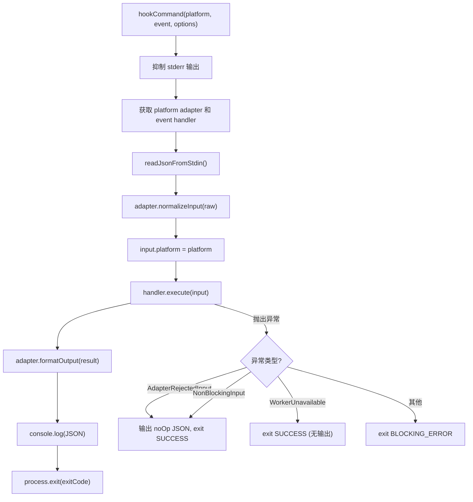

# hook-command.ts 需求说明

> 源文件：src/cli/hook-command.ts ｜ 类型：源码 ｜ 行数：136 ｜ 所属模块：cli ｜ 分析日期：2026-07-23

## 1. 文件定位总述

本文件是 CLI hook 命令的核心编排器，实现了完整的 hook 处理管线。它串联了三个关键阶段：从 stdin 读取 JSON 输入 -> 通过平台适配器标准化 -> 通过事件处理器执行业务逻辑 -> 通过适配器格式化输出。该管线具备三级错误分类处理机制：适配器拒绝输入（非阻断）、Worker 不可用（非阻断）、以及其他运行时错误（阻断）。它还负责在 context 事件需要 no-op 时生成符合 Claude Code 协议的特殊输出结构。

## 2. 功能需求

| 编号 | 需求描述（系统应当…） | 触发条件 / 输入 | 处理规则与输出 | 证据 |
|------|----------------------|----------------|---------------|------|
| FR-HC-01 | 系统应当编排完整的 hook 处理管线 | 调用 hookCommand(platform, event) 时 | 顺序执行: readJsonFromStdin -> adapter.normalizeInput -> handler.execute -> adapter.formatOutput -> console.log(JSON) -> process.exit | `src/cli/hook-command.ts:74-92` |
| FR-HC-02 | 系统应当在管线执行后注入平台标识 | adapter.normalizeInput 完成后 | 强制设置 `input.platform = platform`，覆盖适配器可能未设置的值 | `src/cli/hook-command.ts:82` |
| FR-HC-03 | 系统应当将最终输出以 JSON 格式写入 stdout | formatOutput 完成后 | `console.log(JSON.stringify(output))` | `src/cli/hook-command.ts:86` |
| FR-HC-04 | 系统应当根据 HookResult 中的 exitCode 退出进程 | 管线完成后 | 使用 `process.exit(exitCode)`，默认为 SUCCESS | `src/cli/hook-command.ts:87-91` |
| FR-HC-05 | 系统应当对适配器拒绝输入做非阻断处理 | 抛出 AdapterRejectedInput 时 | 输出 noOpResult 的格式化 JSON，以 SUCCESS 退出 | `src/cli/hook-command.ts:104-111` |
| FR-HC-06 | 系统应当对 transcript 路径缺失做非阻断处理 | 错误信息包含 'transcript path' + 'missing'/'does not exist' 时 | 同 FR-HC-05 处理 | `src/cli/hook-command.ts:112-119` |
| FR-HC-07 | 系统应当对 Worker 连接失败做非阻断处理 | isWorkerUnavailableError 返回 true 时 | 以 SUCCESS 退出，不输出 JSON | `src/cli/hook-command.ts:120-126` |
| FR-HC-08 | 系统应当对其他错误做阻断处理 | 错误不匹配上述分类时 | 以 BLOCKING_ERROR 退出码退出 | `src/cli/hook-command.ts:128-132` |
| FR-HC-09 | 系统应当为 context 事件生成符合 Claude Code 协议的 no-op 结果 | 构建无操作结果时 | context 事件的 noOpResult 包含 `hookSpecificOutput: { hookEventName: 'SessionStart', additionalContext: '' }` | `src/cli/hook-command.ts:24-30` |
| FR-HC-10 | 系统应当抑制管线执行期间的 stderr 输出 | 管线执行前 | 临时替换 `process.stderr.write` 为空函数，管线结束后恢复（注释引用上游 #2972） | `src/cli/hook-command.ts:95-96,133-134` |
| FR-HC-11 | 系统应当支持跳过 process.exit 用于测试 | skipExit 选项为 true 时 | 返回 exitCode 而不调用 process.exit | `src/cli/hook-command.ts:88-91` |

## 3. 业务规则与约束

- Worker 不可用的判断覆盖网络层（ECONNREFUSED/EPIPE/ETIMEDOUT 等）、超时（timeout）、服务端错误（5xx）、限流（429），但不包括客户端错误（4xx，排除 429） `src/cli/hook-command.ts:36-57`
- TypeError/ReferenceError/SyntaxError 被明确排除在 Worker 不可用判断之外，说明这些是编程错误而非基础设施问题 `src/cli/hook-command.ts:59-61`
- transcript 路径缺失错误通过字符串匹配识别（而非异常类型），说明此错误可能以不同方式抛出 `src/cli/hook-command.ts:70-72`
- stderr 抑制的目的是避免日志干扰 Claude Code hook 系统对 stdout JSON 的解析（上游 issue #2972） `src/cli/hook-command.ts:13-19`

## 4. 对外暴露

| 导出名 | 类型 | 用途 |
|--------|------|------|
| `hookCommand` | `(platform, event, options?) => Promise<number>` | hook 命令入口函数 |
| `HookCommandOptions` | `interface { skipExit?: boolean }` | 选项类型 |
| `buildNoOpResult` | `(event: string) => HookResult` | 构建无操作结果 |
| `isWorkerUnavailableError` | `(error: unknown) => boolean` | 判断是否为 Worker 不可用错误 |
| `isNonBlockingHookInputError` | `(error: unknown) => boolean` | 判断是否为非阻断输入错误 |

## 5. 依赖关系

- **`./stdin-reader.js`**：`readJsonFromStdin` `src/cli/hook-command.ts:1`
- **`./adapters/index.js`**：`getPlatformAdapter` `src/cli/hook-command.ts:2`
- **`./adapters/errors.js`**：`AdapterRejectedInput` `src/cli/hook-command.ts:3`
- **`./handlers/index.js`**：`getEventHandler` `src/cli/hook-command.ts:4`
- **`../shared/hook-constants.js`**：`HOOK_EXIT_CODES` `src/cli/hook-command.ts:5`
- **`../utils/logger.js`**：`logger` `src/cli/hook-command.ts:6`

## 6. 数据结构

```typescript
interface HookCommandOptions {
  skipExit?: boolean; // 测试用，跳过 process.exit
}
```

## 7. 复杂逻辑图示



## 8. 逆向备注

- stderr 抑制和恢复的 finally 块确保即使异常发生也能恢复原始 stderr.write，防止后续调用意外丢失日志 `src/cli/hook-command.ts:133-134`
- `buildNoOpResult` 中对 context 事件特殊处理的原因在注释中说明：Claude Code 对 SessionStart 事件要求 `hookSpecificOutput` 信封格式，否则将 JSON 行视为无效（上游 #2972） `src/cli/hook-command.ts:13-19`
