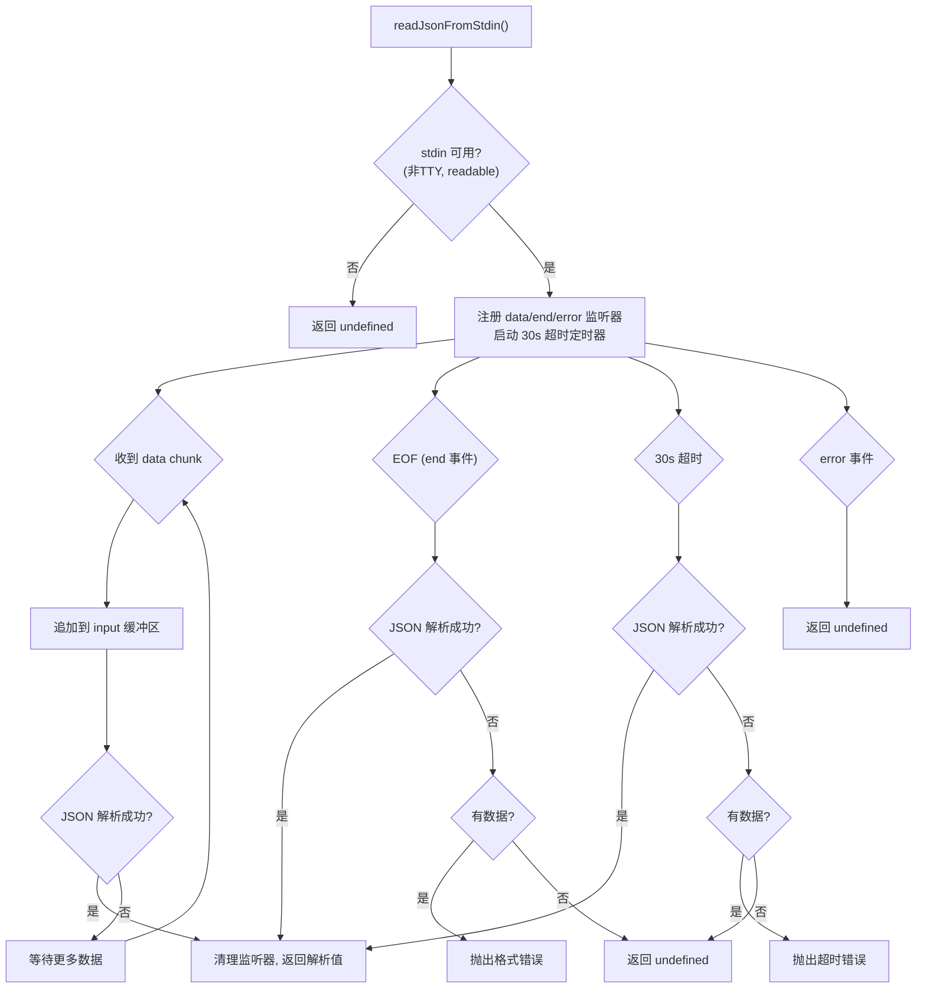

# stdin-reader.ts 需求说明

> 源文件：src/cli/stdin-reader.ts ｜ 类型：源码 ｜ 行数：132 ｜ 所属模块：cli ｜ 分析日期：2026-07-23

## 1. 文件定位总述

本文件导出 `readJsonFromStdin` 异步函数，负责从 stdin 读取并解析 JSON 数据。它是 hook 命令管线的入口数据源，Claude Code hook 系统通过 stdin 向 hook 脚本传递 JSON payload。该函数具备流式 JSON 解析能力（在接收数据过程中逐步尝试解析，无需等待 EOF）、30 秒安全超时保护、以及多种异常处理策略。当 stdin 不可用（TTY 模式或管道断开）时，静默返回 undefined。

## 2. 功能需求

| 编号 | 需求描述（系统应当…） | 触发条件 / 输入 | 处理规则与输出 | 证据 |
|------|----------------------|----------------|---------------|------|
| FR-STDIN-01 | 系统应当检测 stdin 是否可用 | readJsonFromStdin 调用时 | 当 stdin 为 TTY 时返回 undefined（TTY 模式下无管道输入）；监听 readable 事件确认可用性 | `src/cli/stdin-reader.ts:4-19` |
| FR-STDIN-02 | 系统应当流式解析 JSON 数据 | stdin 有数据流入时 | 每收到一个 data chunk 就尝试解析已累积的输入，解析成功即立即返回（不等 EOF） | `src/cli/stdin-reader.ts:94-99` |
| FR-STDIN-03 | 系统应当设置 30 秒安全超时 | 数据开始流入后 | 超时后尝试最后解析一次；失败时若有数据则抛出超时异常，无数据则返回 undefined | `src/cli/stdin-reader.ts:36,82-92` |
| FR-STDIN-04 | 系统应当在 EOF 时进行最终解析 | stdin 触发 end 事件时 | 尝试解析已累积的输入；失败时若有数据则抛出格式错误异常，无数据则返回 undefined | `src/cli/stdin-reader.ts:102-111` |
| FR-STDIN-05 | 系统应当在 stdin 错误时静默返回 undefined | stdin 触发 error 事件时 | 不抛出异常，返回 undefined | `src/cli/stdin-reader.ts:114-118` |
| FR-STDIN-06 | 系统应当防止多次解析 | 解析成功后 | 通过 `resolved` 标志位防止重复 resolve，并清理所有 stdin 监听器和超时定时器 | `src/cli/stdin-reader.ts:57-72` |

## 3. 业务规则与约束

- 超时时间固定为 30000ms（30 秒），未通过配置项暴露 `src/cli/stdin-reader.ts:36`
- 错误信息截断为前 100 字符，防止大段无效 JSON 污染日志 `src/cli/stdin-reader.ts:86,106`
- cleanup 操作在 try-catch 中执行，确保监听器移除失败不会影响主流程 `src/cli/stdin-reader.ts:47-55`
- stdin 监听器附加失败时捕获异常并返回 undefined，兼容不支持 stdin 事件的运行时（如某些打包环境） `src/cli/stdin-reader.ts:120-130`

## 4. 对外暴露

| 导出名 | 类型 | 用途 |
|--------|------|------|
| `readJsonFromStdin` | `() => Promise<unknown>` | 从 stdin 读取并解析 JSON，返回解析结果或 undefined |

## 5. 依赖关系

- **`../utils/logger.js`**：`logger`（调试日志） `src/cli/stdin-reader.ts:2`

## 6. 数据结构

```typescript
// JSON 解析结果封装
type ParseResult =
  | { success: true; value: unknown }
  | { success: false };
```

## 7. 复杂逻辑图示



## 8. 逆向备注

- 流式 JSON 解析（不等 EOF 就尝试解析）是关键设计决策，说明 Claude Code hook 系统通过 stdin 传递的 JSON 是一次性写入的完整对象，但 EOF 事件在某些运行时可能延迟触发 `src/cli/stdin-reader.ts:94-99`
- `readable` 事件访问（第 13 行注释标记为 unused expression）实际用于触发 stdin 流的打开，这是 Node.js 的已知模式 `src/cli/stdin-reader.ts:13-14`
- 安全超时的设计意图是防止某些运行时下 stdin 流既不 end 也不 error 的"悬挂"状态 `src/cli/stdin-reader.ts:82`
