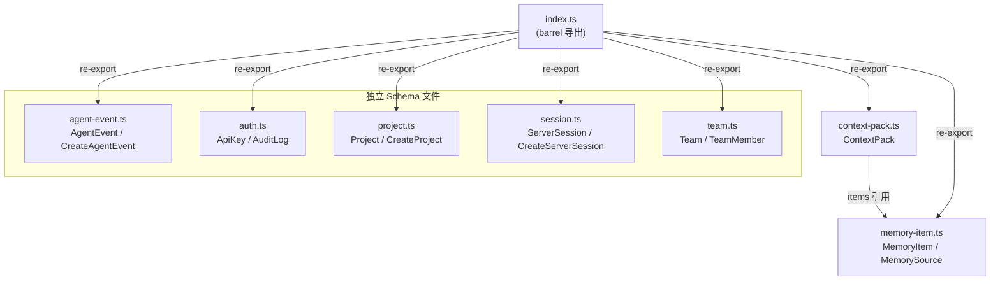

# CORE/SCHEMAS 模块汇总

> 来源文件（8 篇）：agent-event.ts.md、auth.ts.md、context-pack.ts.md、index.ts.md、memory-item.ts.md、project.ts.md、session.ts.md、team.ts.md

## 1. 模块职责总述

`core/schemas` 是 claude-mem 的领域模型 Schema 层，负责以 Zod Schema 形式定义系统中全部核心实体（Project、ServerSession、AgentEvent、MemoryItem、MemorySource、ContextPack、ApiKey、AuditLog、Team、TeamMember）及其创建专用输入 Schema，同时推导对应的 TypeScript 类型。该模块不包含业务逻辑或数据持久化代码，作为整个系统的类型契约基础，向上游服务层、API 层和 hook 层提供统一的校验与类型保障。barrel 文件 `index.ts` 将七个子模块全部 re-export，构成一站式导入入口。

## 2. 功能需求汇总

| 编号 | 需求描述（系统应当…） | 触发条件 / 输入 | 处理规则与输出 | 来源文档 |
|------|----------------------|----------------|---------------|----------|
| FR-AE-01 | 定义 AgentEventSourceType 枚举 Schema，限定事件来源为 hook、worker、provider、server、api | 事件创建/校验 | 仅接受五种枚举值 | [agent-event.ts.md](schemas/agent-event.ts.md) |
| FR-AE-02 | 定义 AgentEvent 完整 Schema，含 id、projectId、serverSessionId、sourceType、eventType、payload、contentSessionId、memorySessionId、occurredAtEpoch、createdAtEpoch | 事件记录 | id、projectId、sourceType、eventType、occurredAtEpoch、createdAtEpoch 必填；其余可选有默认值 | [agent-event.ts.md](schemas/agent-event.ts.md) |
| FR-AE-03 | 定义 CreateAgentEvent Schema，排除 id 和 createdAtEpoch，将 serverSessionId、payload、contentSessionId、memorySessionId 设为可选 | 创建新事件时校验输入 | 必填字段为 projectId、sourceType、eventType、occurredAtEpoch | [agent-event.ts.md](schemas/agent-event.ts.md) |
| FR-AE-04 | 推导 AgentEventSourceType、AgentEvent、CreateAgentEvent 三个 TypeScript 类型 | 外部模块导入 | 从各自 Schema 推导 | [agent-event.ts.md](schemas/agent-event.ts.md) |
| FR-AUTH-01 | 定义 ApiKeyStatus 枚举 Schema，限定密钥状态为 active、revoked | API 密钥状态管理 | 仅接受两种枚举值 | [auth.ts.md](schemas/auth.ts.md) |
| FR-AUTH-02 | 定义 AuditActorType 枚举 Schema，限定操作者类型为 user、api_key、system | 审计日志记录 | 仅接受三种枚举值 | [auth.ts.md](schemas/auth.ts.md) |
| FR-AUTH-03 | 定义 ApiKey 完整 Schema，含 id、teamId、projectId、name、keyHash、prefix、scopes、status、lastUsedAtEpoch、expiresAtEpoch、metadata、createdAtEpoch、updatedAtEpoch | 创建/校验 ApiKey 对象 | id、name、keyHash 必填；teamId、projectId、prefix、scopes、status 可选有默认值；时间戳必填 | [auth.ts.md](schemas/auth.ts.md) |
| FR-AUTH-04 | 定义 CreateApiKey Schema，排除系统字段（id、status、lastUsedAtEpoch、createdAtEpoch、updatedAtEpoch），将 teamId、projectId、prefix、scopes、expiresAtEpoch、metadata 设为可选 | 创建新密钥时校验输入 | 必填字段仅为 name、keyHash | [auth.ts.md](schemas/auth.ts.md) |
| FR-AUTH-05 | 定义 AuditLog 完整 Schema，含 id、teamId、projectId、actorType、actorId、action、targetType、targetId、metadata、createdAtEpoch | 记录审计日志 | id、actorType、action 必填；其余可选有默认值 | [auth.ts.md](schemas/auth.ts.md) |
| FR-AUTH-06 | 定义 CreateAuditLog Schema，排除 id 和 createdAtEpoch，将 teamId、projectId、actorId、targetType、targetId、metadata 设为可选 | 创建审计日志时校验输入 | 必填字段为 actorType、action | [auth.ts.md](schemas/auth.ts.md) |
| FR-AUTH-07 | 推导 ApiKeyStatus、ApiKey、CreateApiKey、AuditActorType、AuditLog、CreateAuditLog 六个 TypeScript 类型 | 外部模块导入 | 从各自 Schema 推导 | [auth.ts.md](schemas/auth.ts.md) |
| FR-CP-01 | 定义 ContextPack 校验 Schema，含 projectId、serverSessionId、generatedAtEpoch、tokenBudget、items、metadata | 创建/校验 ContextPack 对象 | projectId 非空字符串必填；serverSessionId 默认 null；generatedAtEpoch 非负整数必填；tokenBudget 默认 null；items 默认空数组；metadata 默认空对象 | [context-pack.ts.md](schemas/context-pack.ts.md) |
| FR-CP-02 | 推导 ContextPack TypeScript 类型 | 导入 Schema 的模块 | 从 ContextPackSchema 推导出 ContextPack 类型 | [context-pack.ts.md](schemas/context-pack.ts.md) |
| FR-BARREL-01 | 将 agent-event、auth、context-pack、memory-item、project、session、team 七个 Schema 模块统一导出 | 外部模块 import core/schemas | 逐个 re-export 各子模块的全部导出项 | [index.ts.md](schemas/index.ts.md) |
| FR-MI-01 | 定义 MemoryItemKind 枚举 Schema，限定记忆类型为 observation、summary、prompt、manual | 记忆条目创建/分类 | 仅接受四种枚举值 | [memory-item.ts.md](schemas/memory-item.ts.md) |
| FR-MI-02 | 定义 MemorySourceType 枚举 Schema，限定来源类型为 observation、session_summary、user_prompt、manual、import | 记忆溯源记录 | 仅接受五种枚举值 | [memory-item.ts.md](schemas/memory-item.ts.md) |
| FR-MI-03 | 定义 MemoryItem 完整 Schema，含 id、projectId、serverSessionId、legacyObservationId、kind、type、title、subtitle、text、narrative、facts、concepts、filesRead、filesModified、metadata、createdAtEpoch、updatedAtEpoch | 创建/校验记忆条目 | id、projectId、kind、type 必填；其余大多可选有默认值 | [memory-item.ts.md](schemas/memory-item.ts.md) |
| FR-MI-04 | 定义 CreateMemoryItem Schema，排除 id、createdAtEpoch、updatedAtEpoch，将 serverSessionId、legacyObservationId、title、subtitle、text、narrative、facts、concepts、filesRead、filesModified、metadata 设为可选 | 创建新记忆条目时校验输入 | 必填字段为 projectId、kind、type | [memory-item.ts.md](schemas/memory-item.ts.md) |
| FR-MI-05 | 定义 MemorySource 完整 Schema，含 id、memoryItemId、sourceType、legacyTable、legacyId、sourceUri、metadata、createdAtEpoch | 创建/校验记忆来源 | id、memoryItemId、sourceType 必填；其余可选 | [memory-item.ts.md](schemas/memory-item.ts.md) |
| FR-MI-06 | 定义 CreateMemorySource Schema，排除 id、createdAtEpoch，将 legacyTable、legacyId、sourceUri、metadata 设为可选 | 创建新记忆来源时校验输入 | 必填字段为 memoryItemId、sourceType | [memory-item.ts.md](schemas/memory-item.ts.md) |
| FR-MI-07 | 推导 MemoryItemKind、MemoryItem、CreateMemoryItem、MemorySourceType、MemorySource、CreateMemorySource 六个 TypeScript 类型 | 外部模块导入 | 从各自 Schema 推导 | [memory-item.ts.md](schemas/memory-item.ts.md) |
| FR-PROJ-01 | 定义 Project 完整 Schema，含 id、name、slug、rootPath、metadata、createdAtEpoch、updatedAtEpoch | 创建/校验 Project 对象 | id 和 name 必填非空；slug、rootPath、metadata 可选有默认值；时间戳必填非负整数 | [project.ts.md](schemas/project.ts.md) |
| FR-PROJ-02 | 定义 CreateProject Schema，排除系统生成字段（id、createdAtEpoch、updatedAtEpoch），将 slug、rootPath、metadata 设为可选 | 创建新项目时校验输入 | 仅需传入 name（必填），其余字段可选 | [project.ts.md](schemas/project.ts.md) |
| FR-PROJ-03 | 推导 Project 和 CreateProject 两个 TypeScript 类型 | 外部模块导入 | 从各自 Schema 推导类型 | [project.ts.md](schemas/project.ts.md) |
| FR-SESS-01 | 定义 ServerSessionStatus 枚举 Schema，限定会话状态为 active、completed、failed | 会话创建/状态变更校验 | 仅接受三种枚举值 | [session.ts.md](schemas/session.ts.md) |
| FR-SESS-02 | 定义 ServerSession 完整 Schema，含 id、projectId、contentSessionId、memorySessionId、platformSource、title、status、metadata、startedAtEpoch、completedAtEpoch、updatedAtEpoch | 创建/校验 ServerSession 对象 | id、projectId、startedAtEpoch、updatedAtEpoch 必填；其余可选有默认值；status 默认 active | [session.ts.md](schemas/session.ts.md) |
| FR-SESS-03 | 定义 CreateServerSession Schema，排除系统字段（id、startedAtEpoch、status、completedAtEpoch、updatedAtEpoch），将其余多个字段设为可选 | 创建新会话时校验输入 | 必填字段仅为 projectId | [session.ts.md](schemas/session.ts.md) |
| FR-SESS-04 | 推导 ServerSessionStatus、ServerSession、CreateServerSession 三个 TypeScript 类型 | 外部模块导入 | 从各自 Schema 推导 | [session.ts.md](schemas/session.ts.md) |
| FR-TEAM-01 | 定义 TeamRole 枚举 Schema，限定角色为 owner、admin、member、viewer 四种 | 创建团队/成员时校验角色 | 仅接受四种枚举值 | [team.ts.md](schemas/team.ts.md) |
| FR-TEAM-02 | 定义 Team 完整 Schema，含 id、name、slug、metadata、createdAtEpoch、updatedAtEpoch | 创建/校验 Team 对象 | id、name 必填；slug、metadata 可选有默认值；时间戳必填 | [team.ts.md](schemas/team.ts.md) |
| FR-TEAM-03 | 定义 CreateTeam Schema，排除系统字段（id、createdAtEpoch、updatedAtEpoch），将 slug、metadata 设为可选 | 创建新团队时校验输入 | 仅需传入 name（必填） | [team.ts.md](schemas/team.ts.md) |
| FR-TEAM-04 | 定义 TeamMember 完整 Schema，含 id、teamId、userId、role、metadata、createdAtEpoch | 创建/校验团队成员 | id、teamId、userId、role 必填；metadata 可选 | [team.ts.md](schemas/team.ts.md) |
| FR-TEAM-05 | 定义 CreateTeamMember Schema，排除 id 和 createdAtEpoch，将 metadata 设为可选 | 添加团队成员时校验输入 | 必填字段为 teamId、userId、role | [team.ts.md](schemas/team.ts.md) |
| FR-TEAM-06 | 推导 TeamRole、Team、CreateTeam、TeamMember、CreateTeamMember 五个 TypeScript 类型 | 外部模块导入 | 从各自 Schema 推导 | [team.ts.md](schemas/team.ts.md) |

共 32 条功能需求。

## 3. 模块内部结构

该模块由 8 个文件组成，其中 7 个为实体 Schema 定义文件，1 个为 barrel 导出文件。文件间依赖关系极简：仅 `context-pack.ts` 内部依赖 `memory-item.ts`（引用 MemoryItemSchema 作为 items 数组元素校验），其余文件互相独立，均仅依赖外部库 `zod`。

## 4. 对外接口

模块通过 `index.ts` barrel 导出全部 52 个公开符号（含 Schema 对象与推导类型）。按实体维度分类如下：

| 实体 | 导出的 Schema | 导出的 TypeScript 类型 |
|------|---------------|----------------------|
| AgentEvent | `AgentEventSourceTypeSchema`、`AgentEventSchema`、`CreateAgentEventSchema` | `AgentEventSourceType`、`AgentEvent`、`CreateAgentEvent` |
| ApiKey / AuditLog | `ApiKeyStatusSchema`、`ApiKeySchema`、`CreateApiKeySchema`、`AuditActorTypeSchema`、`AuditLogSchema`、`CreateAuditLogSchema` | `ApiKeyStatus`、`ApiKey`、`CreateApiKey`、`AuditActorType`、`AuditLog`、`CreateAuditLog` |
| ContextPack | `ContextPackSchema` | `ContextPack` |
| MemoryItem / MemorySource | `MemoryItemKindSchema`、`MemorySourceTypeSchema`、`MemoryItemSchema`、`CreateMemoryItemSchema`、`MemorySourceSchema`、`CreateMemorySourceSchema` | `MemoryItemKind`、`MemoryItem`、`CreateMemoryItem`、`MemorySourceType`、`MemorySource`、`CreateMemorySource` |
| Project | `ProjectSchema`、`CreateProjectSchema` | `Project`、`CreateProject` |
| ServerSession | `ServerSessionStatusSchema`、`ServerSessionSchema`、`CreateServerSessionSchema` | `ServerSessionStatus`、`ServerSession`、`CreateServerSession` |
| Team / TeamMember | `TeamRoleSchema`、`TeamSchema`、`CreateTeamSchema`、`TeamMemberSchema`、`CreateTeamMemberSchema` | `TeamRole`、`Team`、`CreateTeam`、`TeamMember`、`CreateTeamMember` |

外部消费者通过 `import { ProjectSchema, MemoryItem, ... } from '../core/schemas'` 一次性获取所有类型定义。

## 5. 数据与外部资源

该模块为纯 Schema 定义层，不直接涉及数据库表、缓存、消息队列或外部服务调用。其数据结构对应以下业务实体（最终映射到 SQLite 数据库，但映射逻辑不在本模块内）：

| 实体 | 用途 | 关键字段 |
|------|------|----------|
| **Project** | 顶层聚合根，代表一个 AI 编程项目 | id, name, slug, rootPath |
| **ServerSession** | 会话生命周期管理，与 Project 多对一关联 | id, projectId, status(active/completed/failed), contentSessionId, memorySessionId |
| **AgentEvent** | 记录 Agent 执行事件（工具调用、prompt 提交等） | id, projectId, sourceType, eventType, payload, occurredAtEpoch |
| **MemoryItem** | 记忆系统的核心数据模型，AI 压缩或用户手动创建的记忆单元 | id, projectId, kind(observation/summary/prompt/manual), type, facts, concepts, filesRead, filesModified |
| **MemorySource** | 记忆条目的溯源信息 | id, memoryItemId, sourceType, sourceUri |
| **ContextPack** | MemoryItem 的上层容器，携带 token 预算的上下文注入包 | id, projectId, tokenBudget, items(MemoryItem[]) |
| **ApiKey** | API 密钥管理，支持多团队/多项目范围限定 | id, teamId, projectId, keyHash, scopes, status(active/revoked), expiresAtEpoch |
| **AuditLog** | 系统操作审计轨迹 | id, actorType(user/api_key/system), action, targetType, targetId |
| **Team** | 多租户/团队协作的团队实体 | id, name, slug |
| **TeamMember** | 团队成员关联及角色管理 | id, teamId, userId, role(owner/admin/member/viewer) |

外部依赖：仅 `zod`（Schema 校验库）。

## 6. 存疑与备注

所有 8 篇来源文档的"逆向备注"部分均为"无"，无未证实项或推断性结论。
