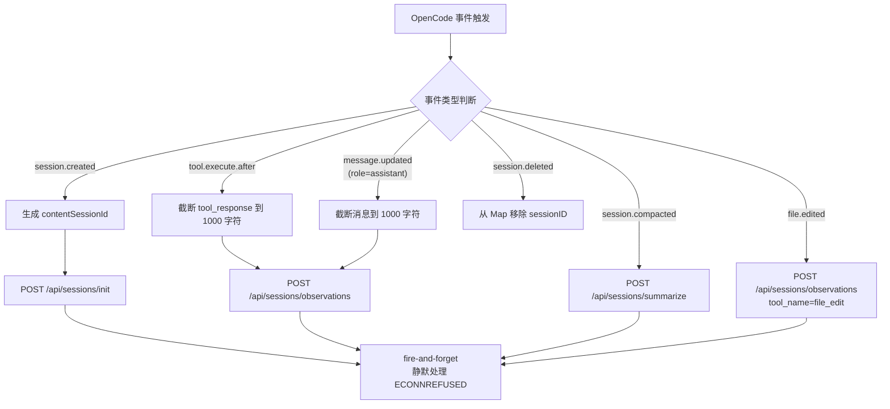

# index.ts (OpenCode Plugin) 需求说明

> 源文件：src/integrations/opencode-plugin/index.ts ｜ 类型：源码 ｜ 行数：298 ｜ 所属模块：integrations/opencode-plugin ｜ 分析日期：2026-07-23

## 1. 文件定位总述

本文件是 claude-mem 对 OpenCode（开源 AI 编码助手）的插件适配层，以 ClaudeMemPlugin 工厂函数形式导出。它通过 OpenCode 的 hooks 和 events 机制，将会话创建、工具执行后、助手消息、会话压缩、文件编辑、会话删除等事件实时上报给本地 Worker 服务，同时注册一个 `claude_mem_search` 工具供 OpenCode 内搜索历史记忆。该文件是 claude-mem 多 IDE 集成架构中面向 OpenCode 的唯一适配入口。

## 2. 功能需求

| 编号 | 需求描述（系统应当…） | 触发条件 / 输入 | 处理规则与输出 | 证据 |
|------|----------------------|----------------|---------------|------|
| FR-OC-01 | 系统应当自动解析 Worker 服务端口 | 插件加载时 | 优先读取 `CLAUDE_MEM_WORKER_PORT` 环境变量（1~65535 有效）；未设置时按 `37700 + (uid % 100)` 计算 | `index.ts:74-82` |
| FR-OC-02 | 系统应当在工具执行后（after hook）将工具调用信息上报到 Worker | OpenCode 执行任意工具后 | 构建 contentSessionId，截断 tool_response 到 1000 字符，POST 到 `/api/sessions/observations`，fire-and-forget | `index.ts:153-171` |
| FR-OC-03 | 系统应当在会话创建事件（session.created）时初始化会话 | OpenCode 创建新会话 | 构建 contentSessionId，POST 到 `/api/sessions/init`，fire-and-forget | `index.ts:179-188` |
| FR-OC-04 | 系统应当在助手消息更新事件（message.updated）且角色为 assistant 时上报 | OpenCode 助手回复消息后 | 仅处理 role=assistant 的消息，截断到 1000 字符，以 `assistant_message` 为 tool_name POST 到 `/api/sessions/observations` | `index.ts:190-209` |
| FR-OC-05 | 系统应当在会话压缩事件（session.compacted）时触发摘要请求 | OpenCode 压缩会话上下文 | POST 到 `/api/sessions/summarize`，fire-and-forget | `index.ts:211-220` |
| FR-OC-06 | 系统应当在文件编辑事件（file.edited）时上报编辑信息 | OpenCode 编辑文件后 | 以 `file_edit` 为 tool_name，path 为 tool_input，diff 截断到 1000 字符 | `index.ts:222-237` |
| FR-OC-07 | 系统应当在会话删除事件（session.deleted）时清理本地 session 映射 | OpenCode 删除会话 | 从 `contentSessionIdsByOpenCodeSessionId` Map 中移除该 sessionID | `index.ts:239-242` |
| FR-OC-08 | 系统应当维护 OpenCode sessionID 到 contentSessionId 的映射 | 首次遇到某 OpenCode sessionID | 生成 `opencode-{sessionID}-{timestamp}` 格式的 contentSessionId，Map 容量上限 1000 条，超出时淘汰最早条目 | `index.ts:126-142` |
| FR-OC-09 | 系统应当提供 `claude_mem_search` 工具供 OpenCode 内搜索记忆 | 用户在 OpenCode 中调用该工具 | 向 Worker GET `/api/search/observations?query=...&limit=10`，返回最多 10 条格式化的标题列表 | `index.ts:248-292` |
| FR-OC-10 | 系统应当在 Worker 不可达时静默降级（fire-and-forget 模式不中断主流程） | Worker 服务未启动或连接失败 | 对 POST 请求忽略 ECONNREFUSED 错误，其他错误输出 console.warn；对 GET 请求返回 null 或错误提示 | `index.ts:89-120` |

## 3. 业务规则与约束

- 所有向 Worker 发送的事件上报均采用 fire-and-forget 策略，不阻塞 OpenCode 主流程。`index.ts:89-103`
- Worker 连接失败时，ECONNREFUSED 错误静默吞掉，避免日志噪音。`index.ts:99-100`
- 内容截断阈值统一为 `MAX_TOOL_RESPONSE_LENGTH = 1000` 字符。`index.ts:85`
- Session 映射 Map 最大容量 `MAX_SESSION_MAP_ENTRIES = 1000`，超出时按插入顺序淘汰最早条目（FIFO）。`index.ts:124,128`
- 搜索工具返回空结果时给出明确的 "No results found" 提示。`index.ts:279`
- Worker 不可达时搜索工具返回明确的 "worker is not running" 提示并建议启动命令。`index.ts:267`

## 4. 对外暴露

| 导出名 | 类型 | 说明 |
|--------|------|------|
| `ClaudeMemPlugin` | `(ctx: OpenCodePluginContext) => Promise<PluginDefinition>` | 插件工厂函数（default export） |

共 1 个公开导出。

## 5. 依赖关系

- 外部依赖：`zod`
- 内部依赖：无（直接通过 HTTP 调用 Worker API）
- 运行时依赖：Worker 服务运行于 `127.0.0.1:<worker-port>`

## 6. 数据结构

```
OpenCodePluginContext {
  client: unknown
  project: { name?: string; path?: string }
  directory: string
  worktree: string
  serverUrl: URL
  $: unknown
}

contentSessionIdsByOpenCodeSessionId: Map<string, string>
// key = OpenCode sessionID
// value = "opencode-{sessionID}-{timestamp}"
```

## 7. 复杂逻辑图示



上图展示了 OpenCode 插件对六种事件的处理分支。所有事件上报均采用 fire-and-forget 策略，Worker 不可达时不中断 OpenCode 主流程。

## 8. 逆向备注

- 接口类型（OpenCodePluginContext、ToolExecuteAfterInput 等）为本地定义的 TypeScript interface，非从 OpenCode SDK 导入。推断：这些接口可能是手写匹配 OpenCode 的插件契约。`index.ts:3-67`
