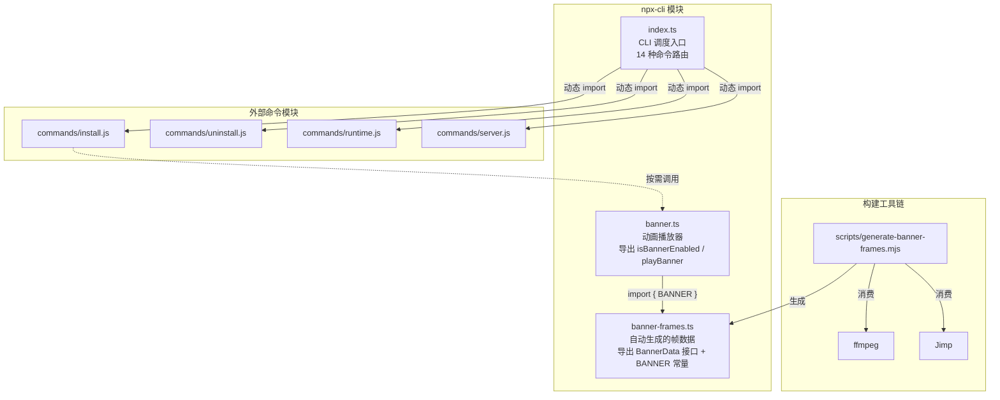

# NPX-CLI 模块汇总

> 分析日期：2026-07-23 ｜ 来源文档：banner-frames.ts.md、banner.ts.md、index.ts.md

## 1. 模块职责总述

npx-cli 模块是 claude-mem 项目的命令行入口层，通过 `npx claude-mem` 命令对外暴露。它在系统架构中承担两大职责：一是作为 CLI 调度中枢，解析 14 种命令（install/uninstall/start/stop/search 等）并路由到对应命令处理模块；二是负责 CLI 启动时的品牌视觉呈现——播放基于 ASCII 帧动画的品牌横幅。模块由三个源文件组成，其中 `index.ts` 为入口调度器，`banner.ts` 为动画播放器，`banner-frames.ts` 为自动生成的帧数据源。

## 2. 功能需求汇总

| 编号 | 需求描述（系统应当…） | 来源文档 |
|------|----------------------|---------|
| FR-CLI-01 | 系统应当将以 `-` 开头的非 help/version flag 自动视为 install 命令，参数透传到 runInstallCommand | [index.ts.md](index.ts.md) |
| FR-CLI-02 | 系统应当路由 install 命令，动态导入 install.js，解析 --ide/--provider/--model/--no-auto-start 参数后执行 | [index.ts.md](index.ts.md) |
| FR-CLI-03 | 系统应当路由 repair 命令，动态导入 install.js 的 runRepairCommand | [index.ts.md](index.ts.md) |
| FR-CLI-04 | 系统应当路由 update/upgrade 命令，动态导入 install.js 的 runInstallCommand（无参数，执行更新） | [index.ts.md](index.ts.md) |
| FR-CLI-05 | 系统应当路由 uninstall/remove 命令，动态导入 uninstall.js | [index.ts.md](index.ts.md) |
| FR-CLI-06 | 系统应当路由 version/--version/-v 命令，输出 readPluginVersion() 结果 | [index.ts.md](index.ts.md) |
| FR-CLI-07 | 系统应当路由 help/--help/-h 命令，调用 printHelp() 输出完整帮助信息 | [index.ts.md](index.ts.md) |
| FR-CLI-08 | 系统应当路由 start/stop/restart/status 命令，动态导入 runtime.js 对应函数 | [index.ts.md](index.ts.md) |
| FR-CLI-09 | 系统应当路由 server 命令，动态导入 server.js，透传参数 | [index.ts.md](index.ts.md) |
| FR-CLI-10 | 系统应当路由 worker 命令，动态导入 server.js 的 runWorkerAliasCommand | [index.ts.md](index.ts.md) |
| FR-CLI-11 | 系统应当路由 search 命令，动态导入 runtime.js 的 runSearchCommand | [index.ts.md](index.ts.md) |
| FR-CLI-12 | 系统应当路由 adopt 命令，动态导入 runtime.js 的 runAdoptCommand | [index.ts.md](index.ts.md) |
| FR-CLI-13 | 系统应当路由 cleanup 命令，动态导入 runtime.js 的 runCleanupCommand | [index.ts.md](index.ts.md) |
| FR-CLI-14 | 系统应当路由 transcript watch 命令，动态导入 runtime.js 的 runTranscriptWatchCommand | [index.ts.md](index.ts.md) |
| FR-CLI-15 | 系统应当拒绝未知命令，打印错误提示和帮助引用后 exit(1) | [index.ts.md](index.ts.md) |
| FR-CLI-16 | 系统应当解析 --provider flag 并校验合法值（仅接受 claude/gemini/openrouter） | [index.ts.md](index.ts.md) |
| FR-CLI-17 | 系统应当解析 --ide flag 支持逗号分隔多值 | [index.ts.md](index.ts.md) |
| FR-CLI-18 | 系统应当捕获 main() 的未处理异常，打印错误信息后 exit(1) | [index.ts.md](index.ts.md) |
| FR-DATA-01 | 系统应当通过 `BannerData` 接口约束横幅数据结构（compressed、frameCount、width、height、frameDelay） | [banner-frames.ts.md](banner-frames.ts.md) |
| FR-DATA-02 | 系统应当通过 `BANNER` 常量提供预编码的 192 帧 ASCII 动画数据 | [banner-frames.ts.md](banner-frames.ts.md) |
| FR-DATA-03 | 系统应当将帧数据以 raw-deflate 压缩后 base64 编码存储，帧间以 `\x01` 分隔 | [banner-frames.ts.md](banner-frames.ts.md) |
| FR-BAN-01 | 系统应当判断是否启用 banner 动画（非 TTY / CI / NO_BANNER / NO_COLOR / 终端宽度不足则禁用） | [banner.ts.md](banner.ts.md) |
| FR-BAN-02 | 系统应当解码压缩帧数据（base64 解码 → inflateRawSync → `\x01` 分隔） | [banner.ts.md](banner.ts.md) |
| FR-BAN-03 | 系统应当应用 ANSI 颜色着色（主色 RGB(230,115,70)，强调色 RGB(255,180,122)，支持 truecolor 及 256 色降级） | [banner.ts.md](banner.ts.md) |
| FR-BAN-04 | 系统应当播放完整四阶段动画序列（logo 帧 → wordmark 逐列揭示 → 标语渐入 → 亮度渐变收尾） | [banner.ts.md](banner.ts.md) |
| FR-BAN-05 | 系统应当在终端 resize 时中止动画 | [banner.ts.md](banner.ts.md) |
| FR-BAN-06 | 系统应当在帧解码失败时 fail-open（空帧列表直接跳过，不阻塞 CLI） | [banner.ts.md](banner.ts.md) |
| FR-BAN-07 | 系统应当在动画结束后恢复终端状态（移除监听、重置颜色、恢复光标） | [banner.ts.md](banner.ts.md) |

## 3. 模块内部结构

模块由三个文件组成，职责分明：`index.ts` 为 CLI 入口调度器，`banner.ts` 为动画播放器，`banner-frames.ts` 为自动生成的帧数据源。`index.ts` 通过动态 import 延迟加载外部命令模块（install.js、uninstall.js、runtime.js、server.js），不直接依赖 banner 相关文件——banner 播放由命令处理模块按需调用。`banner.ts` 是 `banner-frames.ts` 的唯一消费方。



## 4. 对外接口

### index.ts

无导出——本文件为 CLI 进程入口，执行 main() 后退出，不导出任何函数。

### banner.ts

| 导出名 | 类型 | 说明 |
|--------|------|------|
| `isBannerEnabled` | `() => boolean` | 判断当前终端环境是否应启用 banner 动画 |
| `playBanner` | `() => Promise<void>` | 异步播放品牌 ASCII 动画横幅（四阶段序列） |

### banner-frames.ts

| 导出名 | 类型 | 说明 |
|--------|------|------|
| `BannerData` | `interface` | 横幅数据结构类型定义（compressed、frameCount、width、height、frameDelay） |
| `BANNER` | `BannerData` 常量 | 预编码的 192 帧 ASCII 动画横幅数据实例 |

## 5. 数据与外部资源

### 环境变量

| 变量名 | 用途 | 来源文件 |
|--------|------|---------|
| `CLAUDE_MEM_NO_BANNER` | 禁用 banner 动画 | banner.ts |
| `NO_COLOR` | 标准变量，禁用 banner 动画 | banner.ts |
| `COLORTERM` | 检测 truecolor 支持（值为 `truecolor` 或 `24bit`） | banner.ts |

### 外部文件路径

| 路径 | 用途 | 来源文件 |
|------|------|---------|
| `./commands/install.js` | install/repair/update 命令实现 | index.ts |
| `./commands/uninstall.js` | uninstall/remove 命令实现 | index.ts |
| `./commands/runtime.js` | start/stop/restart/status/search/adopt/cleanup/transcript 命令实现 | index.ts |
| `./commands/server.js` | server/worker 命令实现 | index.ts |
| `./utils/paths.js` | readPluginVersion() 函数 | index.ts |
| `scripts/generate-banner-frames.mjs` | banner-frames.ts 的生成脚本 | banner-frames.ts |
| `/tmp/cmem-banner-frames/` | 生成脚本使用的临时帧目录 | banner-frames.ts |

### 外部依赖

| 依赖 | 用途 | 来源文件 |
|------|------|---------|
| Node.js `zlib` | inflateRawSync 解压帧数据 | banner.ts |
| `picocolors` | 终端彩色输出 | index.ts |
| `ffmpeg`（构建时） | 将 webm 视频拆分为逐帧 PNG | banner-frames.ts |
| `Jimp`（构建时） | 图像缩放与像素亮度提取 | banner-frames.ts |

### 帧数据编码格式

```
base64( raw-deflate( frame1 + "\x01" + frame2 + "\x01" + ... + frame192 ) )
```

每帧为 128 列 x 36 行的 ASCII 字符串，帧内可包含 `<span>` / `</span>` 高亮区间标记。

## 6. 存疑与备注

| 编号 | 备注 | 来源文档 |
|------|------|---------|
| NOTE-01 | banner-frames.ts 虽仅 21 行代码，但实际体积约 134KB（99%+ 内容为 base64 编码的压缩帧数据） | banner-frames.ts.md |
| NOTE-02 | banner-frames.ts 无运行时逻辑，是纯粹的声明式数据模块，无函数、无副作用、无控制流 | banner-frames.ts.md |
| NOTE-03 | 重新生成 banner-frames.ts 需准备 128x36 比例的视频帧 PNG 序列到 `/tmp/cmem-banner-frames/`，然后运行 `node scripts/generate-banner-frames.mjs` | banner-frames.ts.md |
| NOTE-04 | banner.ts 中对解压操作做了 try-catch 保护，解压失败时返回空帧数组、动画静默跳过，确保 CLI 不因横幅数据损坏而中断 | banner-frames.ts.md |
| NOTE-05 | `<span>` / `</span>` 并非 HTML，是自定义的高亮区间标记，由 banner.ts 的 `styleFrame()` 解析并替换为终端颜色转义序列；标记逻辑在生成脚本中基于亮度区间（70-175）判定 | banner-frames.ts.md |
| NOTE-06 | transcript 命令仅支持 `watch` 子命令，其他子命令会被拒绝 | index.ts.md |
| NOTE-07 | **未在代码中证实/推断**：数据体积约 134KB 的结论基于文件实际大小 134668 字节推断（banner-frames.ts.md BR-07 原标注为"推断"） | banner-frames.ts.md |
