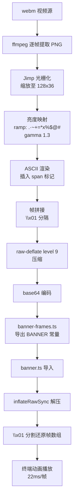

# banner-frames.ts 需求说明

> 源文件：src/npx-cli/banner-frames.ts ｜ 类型：源码（自动生成的数据常量模块） ｜ 行数：21 ｜ 所属模块：npx-cli ｜ 分析日期：2026-07-23

## 1. 文件定位总述

本文件是 claude-mem npx-cli 模块的启动横幅（Banner）动画帧数据源，属于**自动生成的纯数据文件**。它由构建脚本 `scripts/generate-banner-frames.mjs` 从 webm 视频经逐帧光栅化、ASCII 亮度映射后压缩生成，内容为 192 帧 128x36 的 ASCII 动画帧，经 raw-deflate 压缩后以 base64 编码存储。唯一消费方是同目录下的 `banner.ts`，后者负责解压、着色、动画播放。本文件不包含任何业务逻辑，仅对外导出一个 TypeScript 接口 `BannerData` 和一个常量 `BANNER`。

## 2. 功能需求

本文件为纯数据常量模块，不承载可执行功能。以下为其作为数据源必须满足的数据规格需求：

| 编号 | 需求描述（系统应当…） | 触发条件 / 输入 | 处理规则与输出 | 证据 |
|------|----------------------|----------------|---------------|------|
| FR-DATA-01 | 系统应当通过 `BannerData` 接口约束横幅数据的结构，包含压缩帧数据、帧数、宽度、高度、帧延迟五个字段 | 模块被导入时 | 导出 `BannerData` 接口类型定义 | `banner-frames.ts:5-13` |
| FR-DATA-02 | 系统应当通过 `BANNER` 常量提供预编码的 ASCII 动画帧数据，包含 192 帧、128 列宽、36 行高、每帧 22ms 延迟 | 消费方导入 `BANNER` | 返回符合 `BannerData` 类型的对象，`compressed` 字段为 raw-deflate + base64 编码的全量帧数据 | `banner-frames.ts:15-21` |
| FR-DATA-03 | 系统应当将所有帧数据以 raw-deflate 压缩后 base64 编码存储于 `compressed` 字段，帧之间以 `\x01` 分隔 | 构建时由 `generate-banner-frames.mjs` 生成 | 消费方（banner.ts）通过 `inflateRawSync` + `base64` 解码 + `\x01` 分割还原帧数组 | `banner-frames.ts:7`（注释）, `banner.ts:34` |

## 3. 业务规则与约束

| 编号 | 规则描述 | 证据 |
|------|---------|------|
| BR-01 | **自动生成保护**：文件头部标记 `@strip-comments-keep`，注释声明"auto-generated, do not edit by hand"，禁止人工修改 | `banner-frames.ts:1` |
| BR-02 | **生成源头唯一**：数据仅由 `scripts/generate-banner-frames.mjs` 从视频帧生成，生成流程为 webm -> ffmpeg 提取 PNG 帧 -> Jimp 光栅化 -> 亮度 ASCII 映射 -> raw-deflate(level 9) 压缩 -> base64 编码 | `banner-frames.ts:2`, `generate-banner-frames.mjs:98-100` |
| BR-03 | **帧尺寸固定**：动画固定为 128 列 x 36 行（由 9:16 纵横比、128 列宽推导得出 `Math.round(128 * (9/16) / 2) = 36`） | `generate-banner-frames.mjs:14-16`, `banner-frames.ts:18-19` |
| BR-04 | **ASCII 字符映射表**：亮度到字符的映射使用固定 ramp ` .·~+=*x%$@#`，黑场阈值 50、白场阈值 160，中间采用 gamma 1.3 校正 | `generate-banner-frames.mjs:20-24,40-47` |
| BR-05 | **高亮区间标记**：帧内容中使用 `<span>` / `</span>` 标记"高光"区域（亮度在 70-175 之间的非空像素），供消费方着色为强调色 | `generate-banner-frames.mjs:58-63` |
| BR-06 | **帧延迟固定**：每帧播放间隔为 22ms（约 45fps） | `banner-frames.ts:12`, `generate-banner-frames.mjs:102` |
| BR-07 | **数据体积**：原始帧数据经 level 9 raw-deflate 压缩后约 134KB（base64），实现大量重复空白字符的高压缩比 | 推断：（文件实际大小 134668 字节） |

## 4. 对外暴露

| 编号 | 导出项 | 类型 | 说明 | 证据 |
|------|--------|------|------|------|
| EXP-01 | `BannerData` | `interface` | 横幅数据结构类型定义，含 `compressed`(string)、`frameCount`(number)、`width`(number)、`height`(number)、`frameDelay`(number) 五个字段 | `banner-frames.ts:5-13` |
| EXP-02 | `BANNER` | `BannerData` 常量 | 预编码的 ASCII 动画横幅数据实例 | `banner-frames.ts:15` |

## 5. 依赖关系

### 上游（生成依赖）
- **`scripts/generate-banner-frames.mjs`**：本文件的唯一生成源，消费 ffmpeg 提取的视频帧和 Jimp 图像处理库
- **ffmpeg**：将 webm 视频拆分为逐帧 PNG
- **Jimp**：图像缩放与像素亮度提取

### 下游（消费方）
- **`src/npx-cli/banner.ts`**：唯一消费方，导入 `BANNER` 常量进行解压、着色、终端动画播放
  - `banner.ts:2` — `import { BANNER } from './banner-frames.js'`
  - `banner.ts:34` — 解压 `BANNER.compressed`
  - `banner.ts:83,87,94,105,125,146` — 读取 `BANNER.height`、`BANNER.width`、`BANNER.frameDelay`

### 运行时依赖
- 无（纯数据文件，运行时不依赖任何库）

## 6. 数据结构

### 6.1 BannerData 接口

```typescript
export interface BannerData {
  /** Base64-encoded raw deflate of all frames joined by \x01 */
  compressed: string;
  frameCount: number;   // 帧总数
  width: number;        // 每帧列数（字符宽度）
  height: number;       // 每帧行数（字符高度）
  /** Milliseconds per frame */
  frameDelay: number;   // 帧间延迟（毫秒）
}
```

### 6.2 BANNER 常量实际值

| 字段 | 值 | 说明 |
|------|------|------|
| `compressed` | base64 字符串（约 134KB） | 192 帧 raw-deflate 压缩后的 base64 编码 |
| `frameCount` | `192` | 动画总帧数 |
| `width` | `128` | 终端列宽要求 |
| `height` | `36` | ASCII 画布行数（视频区域） |
| `frameDelay` | `22` | 每帧播放间隔 22ms |

### 6.3 帧数据编码格式

```
base64( raw-deflate( frame1 + "\x01" + frame2 + "\x01" + ... + frame192 ) )
```

其中每帧（frame）是一个多行字符串，行以 `\n` 分隔，总行数为 `height`（36 行）。帧内可包含 `<span>` / `</span>` 标记用于高亮区间着色。

## 7. 复杂逻辑图示

本文件为纯数据文件，不包含可执行逻辑。以下展示其数据生命周期流程：



图示说明：从 webm 视频源到终端动画播放的完整数据流水线。`banner-frames.ts` 处于流水线中间位置，是生成脚本（上游）与播放器（下游）之间的数据桥梁。

## 8. 逆向备注

| 编号 | 备注 | 证据 |
|------|------|------|
| NOTE-01 | **文件性质**：21 行代码但 134KB 体积，99%+ 内容为第 16 行 `compressed` 字段的 base64 字符串数据 | 文件实际大小 134668 字节 |
| NOTE-02 | **无运行时逻辑**：文件无函数、无副作用、无控制流，是纯粹的声明式数据模块 | 全文扫描确认 |
| NOTE-03 | **重新生成流程**：需准备 128x36 比例的视频帧 PNG 序列到 `/tmp/cmem-banner-frames/`，然后运行 `node scripts/generate-banner-frames.mjs` | `generate-banner-frames.mjs:11,70-73` |
| NOTE-04 | **消费方容错设计**：`banner.ts` 中对解压操作做了 try-catch 保护，解压失败时返回空帧数组、动画静默跳过，确保 CLI 不因横幅数据损坏而中断 | `banner.ts:30-38` |
| NOTE-05 | **span 标记约定**：`<span>` / `</span>` 并非 HTML，是自定义的高亮区间标记，由 `banner.ts` 的 `styleFrame()` 函数解析并替换为终端颜色转义序列。标记逻辑在生成脚本中基于亮度区间（70-175）判定 | `generate-banner-frames.mjs:58-63`, `banner.ts:54-60` |
