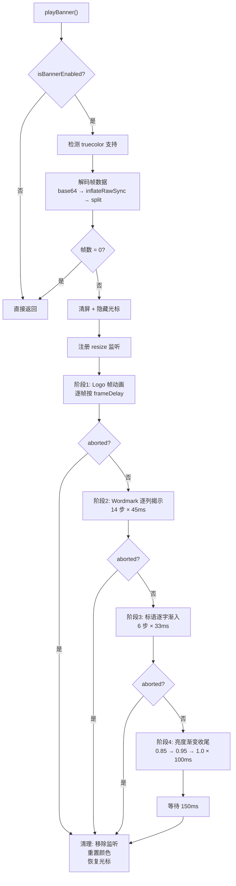

# banner.ts 需求说明

> 源文件：src/npx-cli/banner.ts ｜ 类型：源码 ｜ 行数：181 ｜ 所属模块：npx-cli ｜ 分析日期：2026-07-23

## 1. 文件定位总述

本文件负责在 CLI 启动时播放 claude-mem 的品牌 ASCII 动画横幅。它从 base64 编码的 zlib 压缩帧数据中解码动画帧，应用主色/强调色 ANSI 着色（支持 truecolor 和 256 色降级），逐步渲染 logo 动画、逐列揭示文字 wordmark、"persistent memory across sessions" 标语渐入、以及亮度渐变收尾。播放过程中监听终端 resize 事件以提前中止，并在异常时 fail-open（空帧列表直接跳过），确保 banner 不会阻塞 CLI 正常使用。

## 2. 功能需求

| 编号 | 需求描述（系统应当…） | 触发条件 / 输入 | 处理规则与输出 | 证据 |
|------|----------------------|----------------|---------------|------|
| FR-BAN-01 | 系统应当判断是否启用 banner 动画 | 调用 isBannerEnabled() | 不启用条件：非 TTY / CI 环境 / CLAUDE_MEM_NO_BANNER 设置 / NO_COLOR 设置 / 终端宽度小于 BANNER.width；否则启用 | `banner.ts:99-106` |
| FR-BAN-02 | 系统应当解码压缩帧数据 | 调用 playBanner() / getFrames() | 从 banner-frames.js 导入 BANNER.compressed，base64 解码后 zlib inflateRawSync 解压，按 `\x01` 分隔符拆分为帧数组 | `banner.ts:28-39` |
| FR-BAN-03 | 系统应当应用 ANSI 颜色着色 | 每帧渲染时 | 主色用于 logo 文本，强调色用于 `<span>` 标记内的文本；自动检测 truecolor 支持（COLORTERM=truecolor/24bit），不支持时降级为 256 色 | `banner.ts:11-25,42-66,68-70` |
| FR-BAN-04 | 系统应当播放完整动画序列 | 调用 playBanner() | 依次播放：logo 帧动画（逐帧按 frameDelay 间隔）→ wordmark 逐列揭示（14 步，每步 45ms）→ 标语逐字渐入（6 步，每步 33ms）→ 亮度渐变收尾（3 步，每步 100ms） | `banner.ts:110-180` |
| FR-BAN-05 | 系统应当在终端 resize 时中止动画 | 播放过程中用户调整终端窗口 | 监听 `resize` 事件，设置 aborted 标志，在每帧/每步前检查并提前退出 | `banner.ts:116,144,154,160,167` |
| FR-BAN-06 | 系统应当在帧解码失败时 fail-open | BANNER.compressed 数据损坏或 zlib 不匹配 | 捕获异常，设置 frames 为空数组，playBanner 在空帧时直接返回不报错 | `banner.ts:31-39,114` |
| FR-BAN-07 | 系统应当在动画结束后恢复终端状态 | 动画播放完成或中止 | 移除 resize 监听，重置 ANSI 颜色，恢复光标显示 | `banner.ts:174-179` |

## 3. 业务规则与约束

- Banner 在非交互环境（非 TTY、CI）中自动禁用，不输出任何内容。`banner.ts:100-102`
- 用户可通过 `CLAUDE_MEM_NO_BANNER` 环境变量或 `NO_COLOR` 标准变量禁用 banner。`banner.ts:102-103`
- 主色（primaryColor）基于 RGB(230, 115, 70) 的橙色系，强调色（accentColor）基于 RGB(255, 180, 122) 的暖黄色系。`banner.ts:11-25`
- Wordmark 文字为 "claude-mem" ASCII 艺术字，标语为 "persistent memory across sessions"。`banner.ts:72-78,150`
- 动画使用 ANSI 转义序列控制光标隐藏/显示、清屏、光标定位，保证全屏覆盖。`banner.ts:4-7,118-123`

## 4. 对外暴露

| 导出名 | 类型 | 说明 |
|--------|------|------|
| `isBannerEnabled` | `() => boolean` | 判断 banner 是否应在当前终端启用 |
| `playBanner` | `() => Promise<void>` | 异步播放品牌动画横幅 |

共 2 个公开导出。

## 5. 依赖关系

- 内部依赖：`./banner-frames.js`（BANNER 常量：compressed、height、width、frameDelay）
- 外部依赖：Node.js 内置模块 `zlib`

## 6. 数据结构

```
帧数据：BANNER.compressed (base64 + zlib)
分隔符：\x01 (SOH 控制字符)

WORDMARK_BUBBLE: 5 行 ASCII 字符串数组
BUBBLE_WIDTH: 第 0 行长度
BUBBLE_HEIGHT: 5
TAGLINE_GAP: 1 (wordmark 与标语之间的空行)
TOTAL_ROWS: BANNER.height + BUBBLE_HEIGHT + TAGLINE_GAP + 1
```

## 7. 复杂逻辑图示



上图展示了 banner 动画的四阶段播放流程，每个阶段之间均有 aborted 中断检查。

## 8. 逆向备注

无。
