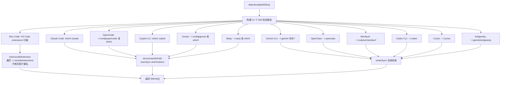

# ide-detection.ts 需求说明

> 源文件：src/npx-cli/commands/ide-detection.ts ｜ 类型：源码 ｜ 行数：130 ｜ 所属模块：npx-cli/commands ｜ 分析日期：2026-07-23

## 1. 文件定位总述

本文件提供 IDE/工具链的自动检测能力，能够探测用户系统中已安装的 12 种 AI 编码助手（Claude Code、Gemini CLI、OpenCode、OpenClaw、Windsurf、Codex CLI、Cursor、Copilot CLI、Antigravity、Goose、Roo Code、Warp）。每种 IDE 使用特定的检测策略：命令行 PATH 查找、配置目录存在性检查、VS Code 扩展目录扫描等。检测结果以统一的 `IDEInfo` 接口返回，供安装流程中的 IDE 选择步骤使用。

## 2. 功能需求

| 编号 | 需求描述（系统应当…） | 触发条件 / 输入 | 处理规则与输出 | 证据 |
|------|----------------------|----------------|---------------|------|
| FR-IDE-01 | 系统应当检测 Claude Code 是否安装 | 调用 detectInstalledIDEs() | 通过 `which claude` 命令检测 | `ide-detection.ts:45-50` |
| FR-IDE-02 | 系统应当检测 Gemini CLI 是否安装 | 调用 detectInstalledIDEs() | 检查 `~/.gemini` 目录是否存在 | `ide-detection.ts:51-56` |
| FR-IDE-03 | 系统应当检测 OpenCode 是否安装 | 调用 detectInstalledIDEs() | 检查 `~/.config/opencode` 目录或 `which opencode` 命令 | `ide-detection.ts:57-63` |
| FR-IDE-04 | 系统应当检测 OpenClaw 是否安装 | 调用 detectInstalledIDEs() | 检查 `~/.openclaw` 目录是否存在 | `ide-detection.ts:64-70` |
| FR-IDE-05 | 系统应当检测 Windsurf 是否安装 | 调用 detectInstalledIDEs() | 检查 `~/.codeium/windsurf` 目录是否存在 | `ide-detection.ts:71-76` |
| FR-IDE-06 | 系统应当检测 Codex CLI 是否安装 | 调用 detectInstalledIDEs() | 检查 `~/.codex` 目录是否存在 | `ide-detection.ts:77-83` |
| FR-IDE-07 | 系统应当检测 Cursor 是否安装 | 调用 detectInstalledIDEs() | 检查 `~/.cursor` 目录是否存在 | `ide-detection.ts:84-90` |
| FR-IDE-08 | 系统应当检测 Copilot CLI 是否安装 | 调用 detectInstalledIDEs() | 通过 `which copilot` 命令检测 | `ide-detection.ts:91-97` |
| FR-IDE-09 | 系统应当检测 Antigravity 是否安装 | 调用 detectInstalledIDEs() | 检查 `~/.gemini/antigravity` 目录是否存在 | `ide-detection.ts:98-104` |
| FR-IDE-10 | 系统应当检测 Goose 是否安装 | 调用 detectInstalledIDEs() | 检查 `~/.config/goose` 目录或 `which goose` 命令 | `ide-detection.ts:105-112` |
| FR-IDE-11 | 系统应当检测 Roo Code 是否安装 | 调用 detectInstalledIDEs() | 扫描 `~/.vscode/extensions` 目录查找包含 `roo-code` 的扩展名 | `ide-detection.ts:113-120` |
| FR-IDE-12 | 系统应当检测 Warp 是否安装 | 调用 detectInstalledIDEs() | 检查 `~/.warp` 目录或 `which warp` 命令 | `ide-detection.ts:121-128` |
| FR-IDE-13 | 系统应当对 VS Code 扩展进行名称匹配检测 | 传入扩展名称片段 | 读取 `~/.vscode/extensions` 目录条目，进行大小写不敏感的子串匹配 | `ide-detection.ts:28-38` |

## 3. 业务规则与约束

- 所有 12 种 IDE 的 `supported` 字段均硬编码为 `true`，即检测到的任何 IDE 都被标记为支持集成。`ide-detection.ts:44-128`
- `hint` 字段提供集成方式提示（如 "recommended"、"plugin-based integration"、"native hooks integration" 等），仅供 UI 展示使用。`ide-detection.ts:49,63,69,83,90,97`
- 检测策略因 IDE 而异：有的依赖 PATH 命令查找，有的依赖配置目录存在性，Roo Code 依赖 VS Code 扩展目录扫描。`ide-detection.ts:15-38`
- 命令查找使用 `execSync`，非 Windows 用 `which`，Windows 用 `where`。`ide-detection.ts:17-18`

## 4. 对外暴露

| 导出名 | 类型 | 说明 |
|--------|------|------|
| `IDEInfo` | interface | IDE 检测结果结构 |
| `detectInstalledIDEs` | `() => IDEInfo[]` | 执行 IDE 检测，返回所有 IDE 的检测结果数组 |

共 2 个公开导出（1 interface + 1 function）。

## 5. 依赖关系

- 内部依赖：`../utils/paths.js`（IS_WINDOWS）
- 外部依赖：Node.js 内置模块 `child_process`、`fs`、`os`、`path`

## 6. 数据结构

```
IDEInfo {
  id: string          // IDE 标识符（如 "claude-code"、"cursor"）
  label: string       // 显示名称
  detected: boolean   // 是否检测到已安装
  supported: boolean  // 是否支持集成（始终 true）
  hint?: string       // 集成方式提示
}
```

## 7. 复杂逻辑图示



上图展示了 12 种 IDE 的三种检测策略分类：命令行查找、目录存在性检查、VS Code 扩展目录扫描。

## 8. 逆向备注

无。
