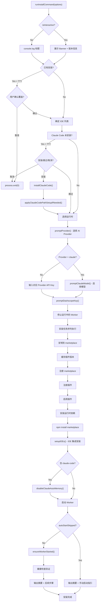
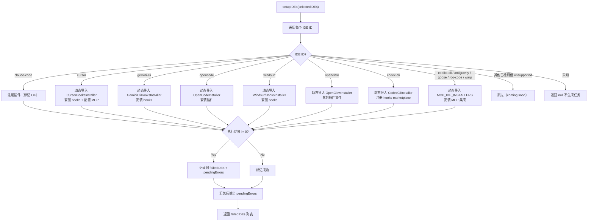
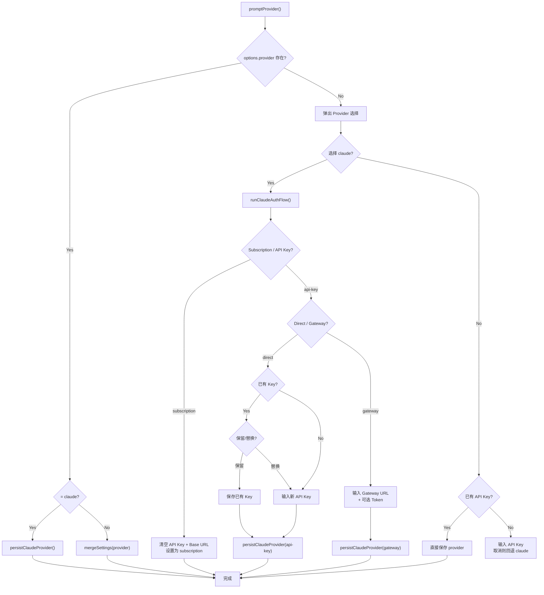

# install.ts 需求说明

> 源文件：src/npx-cli/commands/install.ts ｜ 类型：源码 ｜ 行数：1499 ｜ 所属模块：npx-cli/commands ｜ 分析日期：2026-07-23

## 1. 文件定位总述

本文件是 claude-mem 的安装命令核心实现，承担 `npx claude-mem install` 和 `npx claude-mem repair` 两个顶层子命令的完整业务流程编排。作为 npx-cli 的入口级命令模块，它向上对接 CLI 参数解析层（`InstallOptions`），向下协调运行时环境准备、插件文件部署、marketplace 注册、多 IDE 集成、AI Provider 凭证配置、Worker 守护进程启动、健康检查验证等多个子系统。文件同时导出 `disableClaudeAutoMemory` 供外部调用，是安装流程中唯一对外暴露的独立功能点。

## 2. 功能需求

### 2.1 安装主流程

| 编号 | 需求描述（系统应当…） | 触发条件 / 输入 | 处理规则与输出 | 证据 |
|------|----------------------|----------------|---------------|------|
| FR-INSTALL-01 | 系统应当在交互模式下展示 Banner 标题并显示当前版本与已安装版本对比信息 | `runInstallCommand()` 被调用，TTY 为 true | 打印带背景色的 intro，展示 `v{version}` 及 `installed v{oldVersion}` 或 `reinstall` 标识 | `install.ts:1082-1113` |
| FR-INSTALL-02 | 系统应当在检测到已有安装时提示用户确认是否覆盖，用户取消则终止安装 | `marketplaceDir/plugin/.claude-plugin/plugin.json` 存在，TTY 为 true | 弹出 confirm 提示，取消则 `process.exit(0)` | `install.ts:1092-1127` |
| FR-INSTALL-03 | 系统应当根据交互/非交互/命令行参数三种场景确定目标 IDE 列表 | 交互模式 TTY：弹出 IDE 多选；非交互 + `options.ide` 非空：使用传入列表并校验；非交互无参数：默认 `['claude-code']` | 校验不支持/未知的 IDE 时 `process.exit(1)`，返回 `string[]` | `install.ts:1129-1149` |
| FR-INSTALL-04 | 系统应当在 Claude Code 未安装时，在交互模式下提示用户选择安装、跳过或取消 | `detectInstalledIDEs()` 返回 claude-code 未检测到，TTY 为 true | 选择安装则执行 `installClaudeCode()`，成功后重新检测 IDE 列表；选择取消则退出 | `install.ts:490-512` |
| FR-INSTALL-05 | 系统应当自动安装 Claude Code 二进制文件 | 用户选择安装 Claude Code | Windows 执行 PowerShell 脚本，macOS/Linux 执行 curl bash 脚本；安装成功后自动配置 PATH | `install.ts:440-486` |
| FR-INSTALL-06 | 系统应当在安装 Claude Code 后自动将其 bin 目录加入 PATH | Claude Code 安装成功且非 Windows | 检测 `~/.local/bin/claude`，查找对应 shell 配置文件（zsh/bash/fish），追加 export 行，同时更新当前进程 PATH | `install.ts:390-438` |
| FR-INSTALL-07 | 系统应当为每个选定的 IDE 执行对应的集成安装任务 | IDE 列表确定后 | 按顺序执行：注册 Claude Code 插件、安装 Cursor hooks+MCP、安装 Gemini CLI hooks、安装 OpenCode 插件、安装 Windsurf hooks、安装 OpenClaw 插件、注册 Codex CLI hooks marketplace、安装其他 IDE 的 MCP 集成 | `install.ts:187-371` |
| FR-INSTALL-08 | 系统应当在安装完成后禁用 Claude Code 内置的自动记忆功能 | 目标 IDE 列表包含 `claude-code` | 在 `~/.claude/settings.json` 的 `env` 块中写入 `CLAUDE_CODE_DISABLE_AUTO_MEMORY=1`，已设置则跳过 | `install.ts:1277-1291`, `install.ts:174-185` |

### 2.2 运行时与 Provider 配置

| 编号 | 需求描述（系统应当…） | 触发条件 / 输入 | 处理规则与输出 | 证据 |
|------|----------------------|----------------|---------------|------|
| FR-RUNTIME-01 | 系统应当提示用户选择运行时（worker 或 server-beta）并持久化到 settings.json | 安装流程中，IDE 确定后 | 交互模式弹出 select，非交互模式默认 worker；选择 server-beta 时触发 API Key 引导流程 | `install.ts:669-697` |
| FR-RUNTIME-02 | 系统应当提示用户选择 AI Provider（claude/gemini/openrouter） | 安装流程中，运行时选择后 | 交互模式弹出 select；非交互模式使用 `options.provider` 或默认 claude | `install.ts:731-961` |
| FR-RUNTIME-03 | 系统应当为 Claude Provider 提供三种认证方式的配置流程 | 用户选择 claude 作为 Provider | 依次选择：subscription（使用登录账户）、api-key（输入 Anthropic API Key）、gateway（输入代理 URL + 可选 token） | `install.ts:859-901` |
| FR-RUNTIME-04 | 系统应当在用户选择 Claude 模型时提供白名单选择，gateway 模式允许自定义模型 | Provider 为 claude | 白名单：`claude-haiku-4-5-20251001`、`claude-sonnet-4-6`、`claude-opus-4-7`；gateway 模式使用 text 输入允许任意模型名 | `install.ts:998-1073` |
| FR-RUNTIME-05 | 系统应当引导用户配置 DashScope（Qwen）API Key 用于周报 AI | Provider 和模型配置完成后 | 显示当前值作为默认，回车沿用、留空跳过、输入新值则写入 settings.json；非交互模式下从 env 持久化现有值 | `install.ts:969-996` |

### 2.3 插件部署

| 编号 | 需求描述（系统应当…） | 触发条件 / 输入 | 处理规则与输出 | 证据 |
|------|----------------------|----------------|---------------|------|
| FR-DEPLOY-01 | 系统应当将 npm 包中指定的顶层条目复制到 marketplace 目录 | 需要安装 marketplace（有 IDE 选中） | 复制白名单目录：`.agents`、`.codex-plugin`、`plugin`、`package.json`、`package-lock.json`、`openclaw`、`dist`、`LICENSE`、`README.md`、`CHANGELOG.md` | `install.ts:545-577` |
| FR-DEPLOY-02 | 系统应当将 plugin 目录复制到版本化的缓存目录 | 安装任务执行 | 删除旧缓存后递归复制 plugin 目录到 `~/.claude/plugins/cache/claude-mem@{version}` | `install.ts:579-586` |
| FR-DEPLOY-03 | 系统应当在 marketplace 目录执行 npm install 安装生产依赖 | marketplace 文件复制完成 | 执行 `npm install --omit=dev --legacy-peer-deps`，异常不中断安装 | `install.ts:588-604` |
| FR-DEPLOY-04 | 系统应当注册 marketplace 信息到 known-marketplaces | marketplace 文件就位 | 在 `~/.claude/plugins/known-marketplaces.json` 中写入 `thedotmack` 条目，source 为 github，autoUpdate 为 true | `install.ts:114-129` |
| FR-DEPLOY-05 | 系统应当注册插件信息到 installed-plugins | 缓存就位 | 在 `~/.claude/plugins/installed.json` 中写入 `claude-mem@thedotmack` 条目，scope 为 user | `install.ts:131-151` |
| FR-DEPLOY-06 | 系统应当在 Claude Code settings.json 中启用插件 | 插件注册完成 | 在 `~/.claude/settings.json` 的 `enabledPlugins` 中设置 `claude-mem@thedotmack: true` | `install.ts:153-160` |

### 2.4 运行时准备与 Worker 启动

| 编号 | 需求描述（系统应当…） | 触发条件 / 输入 | 处理规则与输出 | 证据 |
|------|----------------------|----------------|---------------|------|
| FR-WORKER-01 | 系统应当确保 Bun 和 uv 运行时可用 | 安装/修复任务执行 | 自动检测或安装 Bun 与 uv，首次安装时通过 bun install 安装插件依赖，写入安装标记文件 | `install.ts:1222-1238` |
| FR-WORKER-02 | 系统应当在安装前停止正在运行的 Worker 进程 | 需要 marketplace 安装且 Worker 可能运行中 | 调用 `shutdownWorkerAndWait()`，超时 10 秒，停止失败不阻塞安装 | `install.ts:1165-1189` |
| FR-WORKER-03 | 系统应当在安装完成后自动启动 Worker 守护进程 | 非交互模式（非 TTY）或 `--no-auto-start` 未设置时跳过 | 优先使用 marketplace 目录的脚本，回退到缓存目录脚本，调用 `ensureWorkerStarted()` | `install.ts:1293-1320` |
| FR-WORKER-04 | 系统应当在安装完成后验证 Worker 健康状态 | Worker 启动未被跳过 | 向 `http://127.0.0.1:{port}/api/health` 发起 GET 请求（3 秒超时），解析返回的 port 字段 | `install.ts:1354-1380` |

### 2.5 修复命令

| 编号 | 需求描述（系统应当…） | 触发条件 / 输入 | 处理规则与输出 | 证据 |
|------|----------------------|----------------|---------------|------|
| FR-REPAIR-01 | 系统应当重新安装运行时依赖并更新安装标记 | `runRepairCommand()` 被调用 | 确保 Bun/uv 可用，检查缓存是否存在，缺失则从 npm 包重新复制，强制重装依赖并写入新标记 | `install.ts:1458-1498` |

### 2.6 输出与总结

| 编号 | 需求描述（系统应当…） | 触发条件 / 输入 | 处理规则与输出 | 证据 |
|------|----------------------|----------------|---------------|------|
| FR-SUMMARY-01 | 系统应当在安装完成后输出包含版本、插件目录、IDE 列表、自动记忆状态、失败项的摘要 | 安装流程末尾 | 交互模式使用 clack note 展示，非交互模式逐行 console.log；有失败 IDE 时设置 `process.exitCode = 1` | `install.ts:1322-1455` |
| FR-SUMMARY-02 | 系统应当根据 Worker 启动状态和是否自动启动，输出差异化的后续步骤指引 | 安装流程末尾 | 三种分支：自动启动跳过、Worker 已就绪、Worker 仍在启动；各分支展示不同的 URL 和操作建议 | `install.ts:1382-1455` |

## 3. 业务规则与约束

**3.1 交互模式双轨输出**：系统通过 `isInteractive`（`process.stdin.isTTY === true`）判断交互模式，交互模式使用 `@clack/prompts` 组件（spinner、select、multiselect、confirm、password、note、intro/outro），非交互模式回退到 `console.log` 并在关键取消点直接 `process.exit()`。`install.ts:25`

**3.2 安装幂等性**：marketplace 注册、插件注册、Claude Code 设置启用、自动记忆禁用均采用读取-判断-写入模式，已存在相同配置时不重复写入。`install.ts:114-185`

**3.3 失败不阻断原则**：IDE 集成安装失败不中断整体安装流程，仅收集到 `failedIDEs` 列表中，最终在摘要中报告；marketplace npm install 异常降级为警告；Worker 停止失败降级为警告。`install.ts:352-371`, `install.ts:1253-1260`, `install.ts:1181-1188`

**3.4 Claude 模型白名单**：直接 API 模式下仅允许三个模型 ID；gateway 模式允许自定义模型名（通过 text 输入而非 select）。`install.ts:999-1049`

**3.5 settings.json 合并写入**：`mergeSettings()` 函数读取已有 settings.json，优先取 `env` 子对象作为合并基底，逐 key 覆盖后写回，保证不丢失已有配置。`install.ts:606-640`

**3.6 PATH 配置检测**：在为 Claude Code 配置 PATH 时，先检查二进制是否存在、PATH 中是否已包含、shell 配置文件中是否已有相关条目，三者任一满足则跳过写入。`install.ts:390-438`

**3.7 环境变量优先级**：Provider 认证方式解析顺序为：已存储的 `CLAUDE_MEM_CLAUDE_AUTH_METHOD` → 环境变量 `ANTHROPIC_BASE_URL`（推断 gateway）→ `ANTHROPIC_API_KEY`（推断 api-key）→ 默认 subscription。`install.ts:660-667`

## 4. 对外暴露

| 导出项 | 类型 | 说明 |
|--------|------|------|
| `runInstallCommand(options?: InstallOptions)` | async function | 安装主命令入口 |
| `runRepairCommand()` | async function | 修复命令入口 |
| `disableClaudeAutoMemory()` | function | 禁用 Claude Code 内置自动记忆，返回 boolean 表示是否执行了写入 |
| `InstallOptions` | interface | CLI 参数类型：`ide?: string[]`、`provider?: 'claude' \| 'gemini' \| 'openrouter'`、`model?: string`、`noAutoStart?: boolean` |

## 5. 依赖关系

**5.1 内部模块依赖**

| 依赖模块 | 路径 | 用途 |
|----------|------|------|
| `SettingsDefaultsManager` | `src/shared/SettingsDefaultsManager.js` | 读取 settings.json 中的配置项 |
| `USER_SETTINGS_PATH` | `src/shared/paths.js` | 用户 settings.json 路径常量 |
| `EnvManager` | `src/shared/EnvManager.js` | 加载/保存 `.env` 文件中的 API Key |
| `ensureWorkerStarted` | `src/services/worker-spawner.js` | 启动 Worker 守护进程 |
| `setup-runtime` | `src/npx-cli/install/setup-runtime.js` | Bun/uv 检测安装、插件依赖安装、安装标记管理 |
| `banner` | `src/npx-cli/banner.js` | 播放安装 Banner |
| `paths` (npx-cli) | `src/npx-cli/utils/paths.js` | Claude Code 配置路径、marketplace/缓存/插件目录常量 |
| `json-utils` | `src/utils/json-utils.js` | 安全 JSON 读取 |
| `shutdown-helper` | `src/services/install/shutdown-helper.js` | 停止运行中的 Worker |
| `ide-detection` | `src/npx-cli/commands/ide-detection.js` | 检测已安装 IDE |
| `spawn.js` | `src/shared/spawn.js` | 隐藏式子进程生成 |
| CursorHooksInstaller | `src/services/integrations/CursorHooksInstaller.js` | Cursor IDE 集成（动态导入） |
| GeminiCliHooksInstaller | `src/services/integrations/GeminiCliHooksInstaller.js` | Gemini CLI 集成（动态导入） |
| OpenCodeInstaller | `src/services/integrations/OpenCodeInstaller.js` | OpenCode 集成（动态导入） |
| WindsurfHooksInstaller | `src/services/integrations/WindsurfHooksInstaller.js` | Windsurf 集成（动态导入） |
| OpenClawInstaller | `src/services/integrations/OpenClawInstaller.js` | OpenClaw 集成（动态导入） |
| CodexCliInstaller | `src/services/integrations/CodexCliInstaller.js` | Codex CLI 集成（动态导入） |
| McpIntegrations | `src/services/integrations/McpIntegrations.js` | 通用 MCP IDE 集成（动态导入） |
| server-beta-bootstrap | `src/services/hooks/server-beta-bootstrap.js` | Server beta API Key 引导（动态导入） |

**5.2 外部依赖**

| 包名 | 用途 |
|------|------|
| `@clack/prompts` | 交互式 CLI 组件（select、multiselect、confirm、password、spinner 等） |
| `picocolors` | 终端颜色输出 |

**5.3 Node.js 内置依赖**

`child_process`（execSync、spawnHidden）、`fs`（cpSync、existsSync、mkdirSync、readFileSync、rmSync、writeFileSync）、`os`（homedir、networkInterfaces）、`path`（dirname、join）

## 6. 数据结构

**6.1 TaskDescriptor**

任务描述器，用于 `runTasks()` 统一执行交互式/非交互式任务。`install.ts:51-54`

```typescript
interface TaskDescriptor {
  title: string;                                          // 任务标题
  task: (message: (msg: string) => void) => Promise<string>; // 任务执行函数，返回结果字符串
}
```

**6.2 InstallOptions**

安装命令 CLI 参数接口。`install.ts:1075-1080`

```typescript
interface InstallOptions {
  ide?: string[];                    // 指定目标 IDE 列表
  provider?: 'claude' | 'gemini' | 'openrouter'; // 指定 AI Provider
  model?: string;                    // 指定 Claude 模型名
  noAutoStart?: boolean;             // 是否跳过 Worker 自动启动
}
```

**6.3 类型别名**

```typescript
type ProviderId = 'claude' | 'gemini' | 'openrouter';   // install.ts:642
type ClaudeAccessMode = 'subscription' | 'api-key';       // install.ts:643
type ClaudeApiMode = 'direct' | 'gateway';               // install.ts:644
type RuntimeId = 'worker' | 'server-beta';                // install.ts:645
```

**6.4 Marketplace 注册结构（写入 known-marketplaces.json）**

推断（依据 `install.ts:115-128` 写入逻辑）：

```json
{
  "thedotmack": {
    "source": { "source": "github", "repo": "thedotmack/claude-mem" },
    "installLocation": "<marketplaceDirectory>",
    "lastUpdated": "<ISO date>",
    "autoUpdate": true
  }
}
```

**6.5 插件注册结构（写入 installed.json）**

推断（依据 `install.ts:131-151` 写入逻辑）：

```json
{
  "version": 2,
  "plugins": {
    "claude-mem@thedotmack": [{
      "scope": "user",
      "installPath": "<pluginCacheDirectory>",
      "version": "<version>",
      "installedAt": "<ISO date>",
      "lastUpdated": "<ISO date>"
    }]
  }
}
```

## 7. 复杂逻辑图示

### 7.1 安装主流程



### 7.2 IDE 集成任务分派



### 7.3 Claude Provider 认证配置流程



## 8. 逆向备注

1. **注释与代码一致性**：`install.ts:163-172` 的 JSDoc 注释引用了 `anthropics/claude-code#23544` issue，但代码中实际设置的环境变量为 `CLAUDE_CODE_DISABLE_AUTO_MEMORY`（行 178、182），注释描述与代码实现一致，未发现偏差。

2. **已废弃的 `getSetting` 函数**：`getSetting<K>()` 函数（行 21-23）通过 `SettingsDefaultsManager.loadFromFile()` 加载完整 settings 后按键取值，但文件大部分场景已改用 `mergeSettings()` 直接写入。该函数仍被 `promptProvider`、`promptDashscopeKey`、`promptClaudeModel` 等配置引导流程使用。

3. **`bufferConsole` 的副作用**：`bufferConsole()` 函数（行 67-88）临时替换 `console.log/error/warn` 以捕获子安装器的输出。此方式在并发场景下不安全，但由于 `runTasks` 按顺序执行任务，当前不存在竞态风险。

4. **Windows 特殊处理**：多处通过 `IS_WINDOWS` 常量（从 `paths.js` 导入）区分 Windows 与 Unix 行为，包括 Claude Code 安装脚本选择、npm install 的 shell 配置、PATH 配置跳过逻辑。`install.ts:441-443`, `install.ts:476-482`, `install.ts:598-603`

5. **动态导入模式**：所有 IDE 集成安装器（Cursor、Gemini CLI、OpenCode、Windsurf、OpenClaw、Codex CLI、MCP IDE）均使用动态 `import()` 按需加载（行 208、230、247、264、281、298、322），推断目的是减少非必要 IDE 场景下的启动时间和内存占用。

6. **推断：server-beta API Key 引导流程**：`maybeBootstrapServerBetaApiKey()`（行 699-729）在 `CLAUDE_MEM_SERVER_DATABASE_URL` 环境变量未设置时跳过，推断 server-beta 运行时需要 Postgres 数据库支持才能运行，但此约束未在代码中明确文档化。

7. **推断：marketplace 白名单硬编码**：`copyPluginToMarketplace()` 中的 `allowedTopLevelEntries`（行 551-562）为硬编码数组，推断新增顶层目录（如新增的集成模块）需要手动更新此列表。
