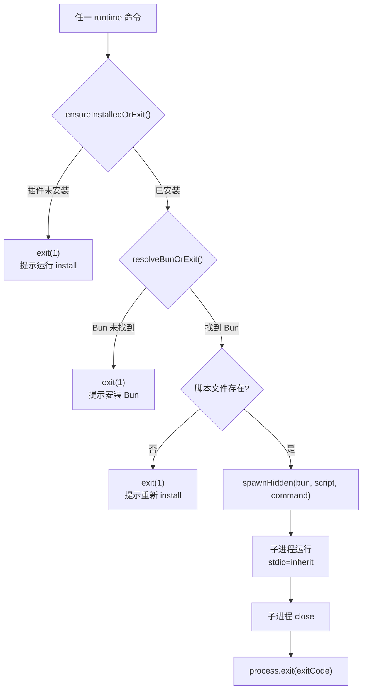

# runtime.ts 需求说明

> 源文件：src/npx-cli/commands/runtime.ts ｜ 类型：源码 ｜ 行数：253 ｜ 所属模块：npx-cli/commands ｜ 分析日期：2026-07-23

## 1. 文件定位总述

本文件是 claude-mem CLI 的运行时命令执行层，负责通过 Bun 进程启动/停止/重启/状态查询本地 Worker 服务和 Server-Beta 服务，以及提供搜索、adopt（worktree 归属管理）、cleanup（数据清理）、transcript watch（转录监听）等功能命令。每个命令都先执行前置检查（插件是否已安装、Bun 是否可用、脚本是否存在），然后通过 `spawnHidden` 启动 Bun 子进程执行对应的脚本。搜索命令则直接通过 HTTP 调用 Worker API 获取结果。

## 2. 功能需求

| 编号 | 需求描述（系统应当…） | 触发条件 / 输入 | 处理规则与输出 | 证据 |
|------|----------------------|----------------|---------------|------|
| FR-RT-01 | 系统应当启动 Worker 服务 | 输入 `start` 命令 | 前置检查（安装状态、Bun 路径、worker-service.cjs 存在）通过后，Bun 启动 worker-service.cjs start | `runtime.ts:115-117` |
| FR-RT-02 | 系统应当停止 Worker 服务 | 输入 `stop` 命令 | 前置检查通过后，Bun 启动 worker-service.cjs stop | `runtime.ts:119-121` |
| FR-RT-03 | 系统应当重启 Worker 服务 | 输入 `restart` 命令 | 前置检查通过后，Bun 启动 worker-service.cjs restart | `runtime.ts:123-125` |
| FR-RT-04 | 系统应当查询 Worker 状态 | 输入 `status` 命令 | 前置检查通过后，Bun 启动 worker-service.cjs status | `runtime.ts:127-129` |
| FR-RT-05 | 系统应当启动 Server-Beta 服务 | 调用 runServerBetaStartCommand() | 前置检查通过后，Bun 启动 server-beta-service.cjs start | `runtime.ts:92-94` |
| FR-RT-06 | 系统应当停止 Server-Beta 服务 | 调用 runServerBetaStopCommand() | 前置检查通过后，Bun 启动 server-beta-service.cjs stop | `runtime.ts:96-98` |
| FR-RT-07 | 系统应当重启 Server-Beta 服务 | 调用 runServerBetaRestartCommand() | 前置检查通过后，Bun 启动 server-beta-service.cjs restart | `runtime.ts:100-102` |
| FR-RT-08 | 系统应当查询 Server-Beta 状态 | 调用 runServerBetaStatusCommand() | 前置检查通过后，Bun 启动 server-beta-service.cjs status | `runtime.ts:104-106` |
| FR-RT-09 | 系统应当启动 BullMQ Worker | 调用 runServerBetaWorkerStartCommand() | 前置检查通过后，Bun 启动 server-beta-service.cjs worker start | `runtime.ts:111-113` |
| FR-RT-10 | 系统应当管理 API Key | 调用 runServerApiKeyCommand(extraArgs) | 前置检查通过后，Bun 启动 worker-service.cjs server api-key {extraArgs} | `runtime.ts:131-133` |
| FR-RT-11 | 系统应当执行 adopt（worktree 归属标记） | 输入 `adopt [--dry-run] [--branch <name>]` | 前置检查通过后，Bun 启动 worker-service.cjs adopt --cwd {userCwd} {extraArgs} | `runtime.ts:135-163` |
| FR-RT-12 | 系统应当执行 cleanup（数据清理） | 输入 `cleanup [--dry-run]` | 前置检查通过后，Bun 启动 worker-service.cjs cleanup {extraArgs} | `runtime.ts:165-167` |
| FR-RT-13 | 系统应当执行搜索查询 | 输入 `search <query>` | 前置检查通过后，HTTP GET Worker `/api/search?query=...`，处理连接拒绝和 JSON 解析错误 | `runtime.ts:169-220` |
| FR-RT-14 | 系统应当启动 transcript watcher | 调用 runTranscriptWatchCommand() | 优先使用独立 transcript-watcher.cjs 脚本；不存在时降级使用 worker-service.cjs transcript watch | `runtime.ts:222-252` |

## 3. 业务规则与约束

- 所有 Bun 进程启动命令共享 `ensureInstalledOrExit()` 和 `resolveBunOrExit()` 两个前置守卫。`runtime.ts:9-26`
- 子进程使用 `spawnHidden` 启动，stdio 设为 inherit（继承父进程的 IO）。`runtime.ts:49-53`
- 子进程的 cwd 设为 marketplaceDirectory，env 透传 process.env。`runtime.ts:51-53`
- Worker 脚本路径为 `{marketplaceDir}/plugin/scripts/worker-service.cjs`。`runtime.ts:28-30`
- Server-Beta 脚本路径为 `{marketplaceDir}/plugin/scripts/server-beta-service.cjs`。`runtime.ts:32-34`
- 搜索功能要求 Worker 正在运行，ECONNREFUSED 时给出明确的启动提示。`runtime.ts:187-190`
- adopt 命令自动传入当前工作目录（`process.cwd()`）作为 `--cwd` 参数。`runtime.ts:147`
- 子进程的 exit code 会透传到父进程（`process.exit(exitCode ?? 0)`）。`runtime.ts:61-63`

## 4. 对外暴露

| 导出名 | 类型 | 说明 |
|--------|------|------|
| `runServerBetaStartCommand` | `() => void` | 启动 Server-Beta |
| `runServerBetaStopCommand` | `() => void` | 停止 Server-Beta |
| `runServerBetaRestartCommand` | `() => void` | 重启 Server-Beta |
| `runServerBetaStatusCommand` | `() => void` | 查询 Server-Beta 状态 |
| `runServerBetaWorkerStartCommand` | `() => void` | 启动 BullMQ Worker |
| `runStartCommand` | `() => void` | 启动 Worker |
| `runStopCommand` | `() => void` | 停止 Worker |
| `runRestartCommand` | `() => void` | 重启 Worker |
| `runStatusCommand` | `() => void` | 查询 Worker 状态 |
| `runServerApiKeyCommand` | `(extraArgs: string[]) => void` | API Key 管理 |
| `runAdoptCommand` | `(extraArgs: string[]) => void` | Worktree 归属标记 |
| `runCleanupCommand` | `(extraArgs: string[]) => void` | 数据清理 |
| `runSearchCommand` | `(queryParts: string[]) => Promise<void>` | 搜索记忆 |
| `runTranscriptWatchCommand` | `() => void` | 转录监听 |

共 14 个公开导出。

## 5. 依赖关系

- 内部依赖：`../utils/bun-resolver.js`（resolveBunBinaryPath）、`../utils/paths.js`（isPluginInstalled、marketplaceDirectory）、`../../shared/SettingsDefaultsManager.js`、`../../shared/spawn.js`（spawnHidden）
- 外部依赖：`picocolors`

## 6. 数据结构

不适用——纯命令执行文件。

## 7. 复杂逻辑图示

上图展示了所有 Bun 进程启动命令的统一前置检查和执行流程。搜索命令（runSearchCommand）走 HTTP 路径，不经过此流程。

## 8. 逆向备注

- `runTranscriptWatchCommand` 存在优先级降级：优先使用独立的 `transcript-watcher.cjs` 脚本，不存在时回退到 `worker-service.cjs transcript watch`。推断：transcript-watcher 可能是后续版本拆分出的独立工具。`runtime.ts:233-236`
