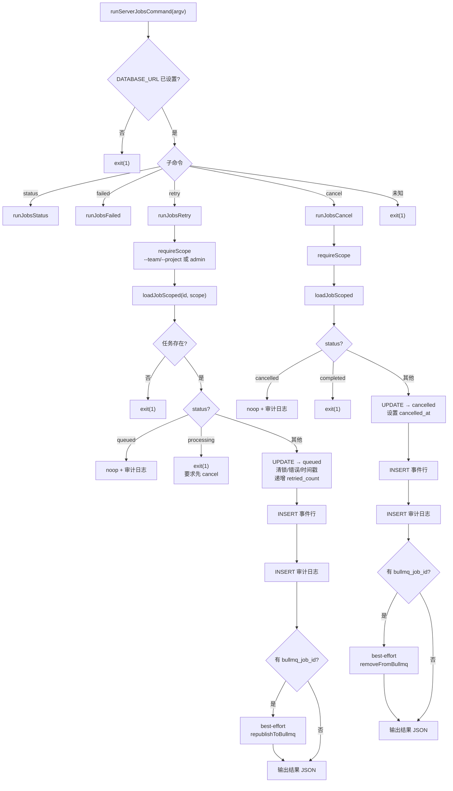

# server-jobs.ts 需求说明

> 源文件：src/npx-cli/commands/server-jobs.ts ｜ 类型：源码 ｜ 行数：577 ｜ 所属模块：npx-cli/commands ｜ 分析日期：2026-07-23

## 1. 文件定位总述

本文件是 `npx claude-mem server jobs` 命令的实现，提供 Postgres-backed 观察生成队列的运维控制台。它直接操作 Postgres 数据库（observation_generation_jobs 表）和 BullMQ 队列，绕过 HTTP API。支持四个子命令：status（队列计数）、failed（失败任务列表）、retry（重入队失败/取消任务）、cancel（取消排队/处理中任务）。所有写操作（retry/cancel）均写入 audit_log 审计轨迹，且操作前必须指定 --team/--project 范围（或设置 CLAUDE_MEM_SERVER_ADMIN=1 提升权限）。retry 操作设计为幂等（已 queued 状态的任务为 no-op），cancel 操作通过状态标记确保生成器在锁检查时中止。

## 2. 功能需求

| 编号 | 需求描述（系统应当…） | 触发条件 / 输入 | 处理规则与输出 | 证据 |
|------|----------------------|----------------|---------------|------|
| FR-SJ-01 | 系统应当要求 CLAUDE_MEM_SERVER_DATABASE_URL 环境变量 | 执行任何 jobs 子命令 | 未设置时打印错误并 exit(1) | `server-jobs.ts:52-56` |
| FR-SJ-02 | 系统应当查询队列状态（status） | 输入 `jobs status [--team X] [--project Y]` | 从 Postgres observation_generation_jobs 按 status 分组计数；best-effort 获取 BullMQ 各 lane 计数；检测 Postgres 与 BullMQ 之间的计数偏差 | `server-jobs.ts:130-170` |
| FR-SJ-03 | 系统应当列出失败任务（failed） | 输入 `jobs failed [--limit N] [--team X] [--project Y]` | 查询 status='failed' 的行，按 failed_at DESC 排序，默认限制 20 条 | `server-jobs.ts:172-213` |
| FR-SJ-04 | 系统应当重试失败/取消任务（retry） | 输入 `jobs retry <id> [--team X] [--project Y]` | 状态校验：queued=noop（幂等）、processing=拒绝；更新为 queued 状态，清空锁/错误/时间戳字段，递增 retried_count，写入事件行和审计日志，best-effort 重新发布到 BullMQ | `server-jobs.ts:215-318` |
| FR-SJ-05 | 系统应当取消任务（cancel） | 输入 `jobs cancel <id> [--team X] [--project Y]` | 状态校验：cancelled=noop（幂等）、completed=拒绝；更新为 cancelled 状态，设置 cancelled_at，写入事件行和审计日志，best-effort 从 BullMQ 移除 | `server-jobs.ts:320-394` |
| FR-SJ-06 | 系统应当强制操作范围限定（scope guard） | 未传 --team 和 --project 且无 admin 权限 | 要求传入 --team 和/或 --project，或设置 CLAUDE_MEM_SERVER_ADMIN=1 | `server-jobs.ts:122-128` |
| FR-SJ-07 | 系统应当写入操作者审计日志 | 执行 retry 或 cancel 操作 | 向 audit_log 表插入操作记录，含 team_id、project_id、action、resource_type、resource_id、details（JSON） | `server-jobs.ts:430-449` |
| FR-SJ-08 | 系统应当解析支持多种 flag 格式 | 输入参数解析 | 支持 `--team X`、`--team=X` 两种格式；支持位置参数作为 task ID | `server-jobs.ts:88-118` |
| FR-SJ-09 | 系统应当提供测试接缝（test seams） | 单元测试中 | 通过 __setServerJobsTestSeams 注入自定义 pool 工厂和 BullMQ 操作函数 | `server-jobs.ts:483-501` |

## 3. 业务规则与约束

- Postgres 是权威数据源（canonical），BullMQ 计数仅作参考。`server-jobs.ts:141,464`
- retry 的幂等性保证：status='queued' 的任务直接返回 noop，不修改。`server-jobs.ts:232-244`
- retry 不允许对 status='processing' 的任务执行，要求先 cancel 或等待。`server-jobs.ts:245-248`
- cancel 不允许对 status='completed' 的任务执行。`server-jobs.ts:339-342`
- retry 时 attempts 重置为 `LEAST(attempts, max_attempts - 1)`，确保不超最大尝试次数。`server-jobs.ts:267`
- BullMQ 操作为 best-effort：失败时仅输出警告日志，不影响 Postgres 更新的成功。`server-jobs.ts:299-305,375-383`
- 审计日志的 actor 为 NULL（CLI 操作无登录态），action 命名为 `generation_job.retried_by_operator` / `generation_job.cancelled_by_operator`。`server-jobs.ts:239,368,437-441`
- 所有写操作同时写入 observation_generation_job_events 表作为生命周期事件。`server-jobs.ts:283-287,362-366`
- 失败任务列表默认限制 20 条，可通过 --limit 调整。`server-jobs.ts:43`

## 4. 对外暴露

| 导出名 | 类型 | 说明 |
|--------|------|------|
| `runServerJobsCommand` | `(argv: string[]) => Promise<void>` | jobs 子命令路由入口 |
| `ServerJobsTestSeams` | interface | 测试接缝类型定义 |
| `__setServerJobsTestSeams` | `(seams: ServerJobsTestSeams) => void` | 注入测试接缝（测试用） |
| `__clearServerJobsTestSeams` | `() => void` | 清除测试接缝（测试用） |

共 4 个公开导出（2 运行时 + 2 测试辅助）。

## 5. 依赖关系

- 内部依赖：`../../utils/logger.js`（logger）
- 运行时延迟导入：`../../storage/postgres/index.js`（getSharedPostgresPool）、`../../server/queue/redis-config.js`（getRedisQueueConfig）、`../../server/jobs/types.js`（SERVER_JOB_QUEUE_NAMES）、`bullmq`（Queue）
- 外部依赖：`picocolors`

## 6. 数据结构

```
ParsedArgs {
  team: string | null     // --team 过滤
  project: string | null  // --project 过滤
  limit: number           // --limit，默认 20
  positional: string[]    // 位置参数（如 task ID）
}

JobStatusRow {
  status: string
  count: number
}

FailedJobRow {
  id: string
  source_type: string
  source_id: string
  attempts: number
  failed_at: Date | null
  last_error: unknown
  team_id: string
  project_id: string
}

JobLookup {
  id: string
  team_id: string
  project_id: string
  status: string
  attempts: number
  bullmq_job_id: string | null
  source_type: string
  payload: Record<string, unknown> | null
}
```

## 7. 复杂逻辑图示



上图展示了 retry 和 cancel 两个写操作的完整流程，包括状态校验、Postgres 更新、事件记录、审计日志和 BullMQ 同步。

## 8. 逆向备注

- BullMQ lane 选择逻辑：`sourceType === 'session_summary'` 时使用 `SERVER_JOB_QUEUE_NAMES.summary`，否则使用 `SERVER_JOB_QUEUE_NAMES.event`。推断：队列按摘要和事件两种类型分流。`server-jobs.ts:553,569`
- `PoolLike` 接口（第 426-428 行）为轻量抽象，仅包含 `query` 方法，用于支持测试接缝注入。`server-jobs.ts:426-428`
