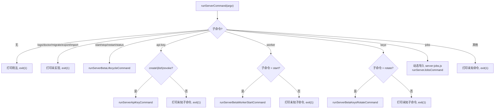

# server.ts 需求说明

> 源文件：src/npx-cli/commands/server.ts ｜ 类型：源码 ｜ 行数：203 ｜ 所属模块：npx-cli/commands ｜ 分析日期：2026-07-23

## 1. 文件定位总述

本文件是 `npx claude-mem server` 命令的路由调度层，负责将 server 子命令分发到对应的执行函数。它管理三类子命令路由：server-beta 生命周期命令（start/stop/restart/status）、worker 别名命令（start/stop/restart/status，与顶层命令等效）、以及运维命令（api-key、worker start、keys rotate、jobs）。此外还包含 API Key 轮换功能（直接操作 Postgres 数据库），以及 `runWorkerAliasCommand` 作为 `npx claude-mem worker` 的入口。

## 2. 功能需求

| 编号 | 需求描述（系统应当…） | 触发条件 / 输入 | 处理规则与输出 | 证据 |
|------|----------------------|----------------|---------------|------|
| FR-SRV-01 | 系统应当调度 server-beta 生命周期命令 | 输入 `server start\|stop\|restart\|status` | 分别调用 runServerBetaStartCommand / Stop / Restart / StatusCommand | `server.ts:53-70,84-86` |
| FR-SRV-02 | 系统应当调度 server api-key 子命令 | 输入 `server api-key create\|list\|revoke` | 调用 runServerApiKeyCommand 并透传参数 | `server.ts:88-97` |
| FR-SRV-03 | 系统应当调度 server worker start 子命令 | 输入 `server worker start` | 调用 runServerBetaWorkerStartCommand | `server.ts:99-108` |
| FR-SRV-04 | 系统应当调度 server keys rotate 子命令 | 输入 `server keys rotate` | 调用 runServerBetaKeysRotateCommand 执行 API Key 轮换 | `server.ts:110-119` |
| FR-SRV-05 | 系统应当调度 server jobs 子命令 | 输入 `server jobs <subcommand>` | 动态导入 server-jobs.js 并调用 runServerJobsCommand | `server.ts:121-127` |
| FR-SRV-06 | 系统应当拒绝未实现的 server 子命令 | 输入 logs/doctor/migrate/export/import | 打印未实现提示并以 exit code 1 退出 | `server.ts:15-21,80-82` |
| FR-SRV-07 | 系统应当拒绝无子命令的 server 调用 | 输入 `server` 无参数 | 打印用法说明并以 exit code 1 退出 | `server.ts:75-78` |
| FR-SRV-08 | 系统应当调度 worker 别名命令 | 输入 `worker start\|stop\|restart\|status` | 调用对应的 runStartCommand / runStopCommand / runRestartCommand / runStatusCommand | `server.ts:194-202` |
| FR-SRV-09 | 系统应当执行 API Key 轮换（keys rotate） | 输入 `server keys rotate` 且 CLAUDE_MEM_SERVER_DATABASE_URL 已设置 | 读取现有 settings 中的旧 Key，通过 Postgres 查询旧 Key ID，调用 rotateServerBetaApiKey 生成新 Key，持久化到 settings.json，输出 JSON 结果 | `server.ts:134-174` |

## 3. 业务规则与约束

- `UNSUPPORTED_SERVER_COMMANDS` 集合包含 `logs`、`doctor`、`migrate`、`export`、`import`，这些命令被保留路由但实际未实现。`server.ts:15-21`
- API Key 轮换功能要求 `CLAUDE_MEM_SERVER_DATABASE_URL` 环境变量已设置，否则退出并提示配置 Postgres。`server.ts:135-139`
- worker 别名命令（`npx claude-mem worker`）与 server 命令共享同一执行函数，只是入口不同。`server.ts:194-202`
- server jobs 命令使用动态 `import()` 延迟加载，避免未安装 Postgres 依赖时启动报错。`server.ts:124`
- 子命令匹配不区分大小写（`toLowerCase()`）。`server.ts:73`

## 4. 对外暴露

| 导出名 | 类型 | 说明 |
|--------|------|------|
| `runServerCommand` | `(argv?: string[]) => Promise<void>` | server 子命令路由入口 |
| `runWorkerAliasCommand` | `(argv?: string[]) => void` | worker 别名命令入口 |

共 2 个公开导出。

## 5. 依赖关系

- 内部依赖：`./runtime.js`（runServerBeta*Command、runStartCommand、runStopCommand 等）
- 运行时延迟导入：`./server-jobs.js`、`../../services/hooks/server-beta-bootstrap.js`、`../../shared/SettingsDefaultsManager.js`、`../../storage/postgres/pool.js`、`../../storage/postgres/config.js`
- 外部依赖：`picocolors`

## 6. 数据结构

```
UNSUPPORTED_SERVER_COMMANDS: Set<string>
// 包含: "logs", "doctor", "migrate", "export", "import"
```

## 7. 复杂逻辑图示



上图展示了 server 命令的完整路由分支，包括已实现路由、未实现路由和错误处理。

## 8. 逆向备注

- `lookupApiKeyIdByPlaintext` 函数通过 Postgres 查询明文 Key 的哈希来定位旧 Key ID，推断 Key 在数据库中仅存储哈希值（与 auth.ts Schema 中的 keyHash 字段一致）。`server.ts:176-192`
