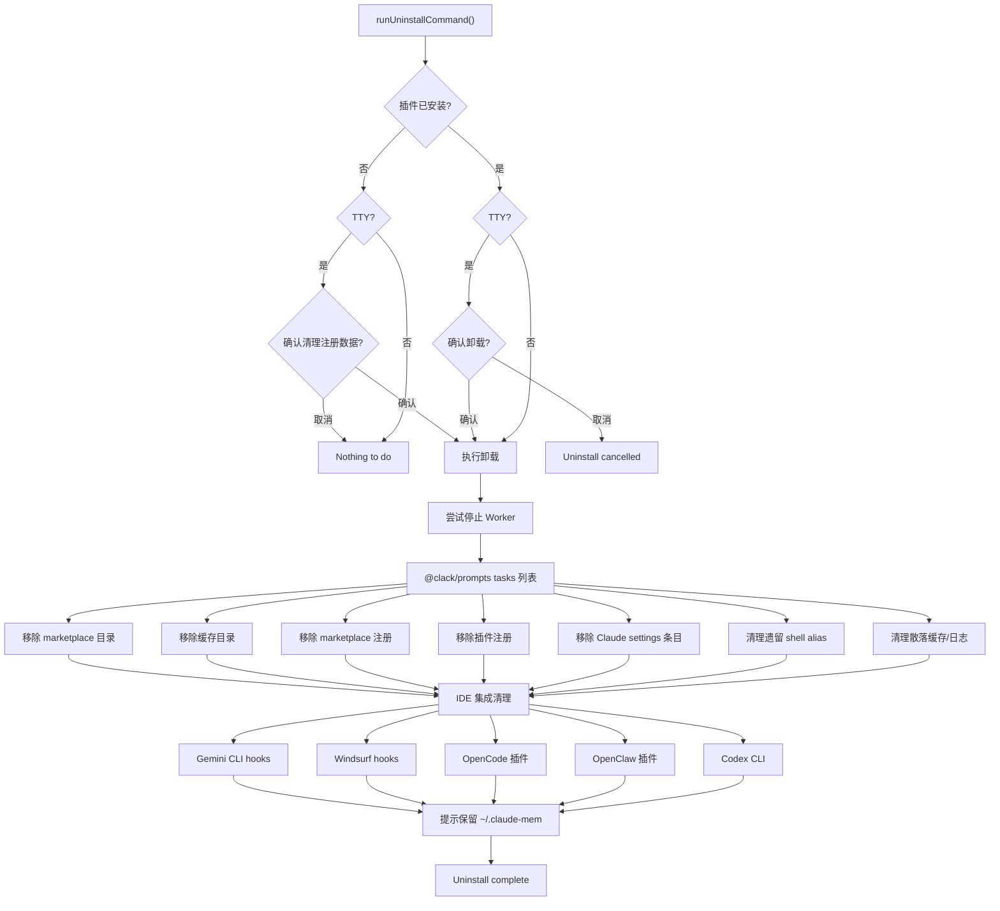

# uninstall.ts 需求说明

> 源文件：src/npx-cli/commands/uninstall.ts ｜ 类型：源码 ｜ 行数：303 ｜ 所属模块：npx-cli/commands ｜ 分析日期：2026-07-23

## 1. 文件定位总述

本文件实现 `npx claude-mem uninstall` 命令的完整卸载流程。它通过交互式确认（TTY 环境）或静默模式（非 TTY）控制执行，依次移除 marketplace 目录、缓存目录、marketplace 注册、插件注册、Claude settings 条目、遗留 shell alias、以及散落的缓存和日志文件，最后逐个清理各 IDE 特定的集成（Gemini CLI hooks、Windsurf hooks、OpenCode 插件、OpenClaw 插件、Codex CLI）。卸载完成后保留数据目录 `~/.claude-mem` 并提示用户手动删除。

## 2. 功能需求

| 编号 | 需求描述（系统应当…） | 触发条件 / 输入 | 处理规则与输出 | 证据 |
|------|----------------------|----------------|---------------|------|
| FR-UN-01 | 系统应当在 TTY 环境中要求用户确认卸载 | 插件已安装且 stdin.isTTY | 弹出确认提示，用户取消则中止卸载 | `uninstall.ts:179-189` |
| FR-UN-02 | 系统应当在插件未安装时询问是否仍清理注册数据 | 插件未安装且 stdin.isTTY | 弹出确认提示，用户取消则显示 "Nothing to do" | `uninstall.ts:162-178` |
| FR-UN-03 | 系统应当在卸载前尝试停止 Worker 服务 | 卸载流程开始 | 通过 shutdownWorkerAndWait 发送停止请求（10 秒超时） | `uninstall.ts:191-199` |
| FR-UN-04 | 系统应当移除 marketplace 安装目录 | 卸载任务执行 | 删除 `{pluginsDir}/marketplaces/thedotmack` 整个目录树 | `uninstall.ts:19-26` |
| FR-UN-05 | 系统应当移除版本化缓存目录 | 卸载任务执行 | 删除 `{pluginsDir}/cache/thedotmack/claude-mem` 整个目录树 | `uninstall.ts:28-35` |
| FR-UN-06 | 系统应当从 known_marketplaces.json 中移除 thedotmack 条目 | 卸载任务执行 | 原子读取-删除-写回 known_marketplaces.json | `uninstall.ts:37-43` |
| FR-UN-07 | 系统应当从 installed_plugins.json 中移除 claude-mem@thedotmack 条目 | 卸载任务执行 | 原子读取-删除-写回 installed_plugins.json | `uninstall.ts:45-51` |
| FR-UN-08 | 系统应当从 Claude settings.json 中移除 enabledPlugins 条目 | 卸载任务执行 | 原子读取-删除-写回 claude settings.json | `uninstall.ts:84-90` |
| FR-UN-09 | 系统应当清理遗留的 claude-mem shell alias | 卸载任务执行 | 扫描 ~/.bashrc、~/.zshrc、PowerShell profile，移除匹配 `alias claude-mem=` 的行 | `uninstall.ts:53-82` |
| FR-UN-10 | 系统应当清理散落的缓存和日志文件 | 卸载任务执行 | 扫描 ~/.npm/_npx 下的 claude-mem 目录、~/.cache/claude-cli-nodejs 下的 MCP 日志、~/.claude/plugins/data/claude-mem-thedotmack | `uninstall.ts:92-157` |
| FR-UN-11 | 系统应当清理各 IDE 特定集成 | 注册数据清理后 | 依次卸载：Gemini CLI hooks、Windsurf hooks、OpenCode 插件、OpenClaw 插件、Codex CLI | `uninstall.ts:259-291` |
| FR-UN-12 | 系统应当在卸载完成后保留数据目录并提示用户 | 卸载任务全部完成 | 输出提示：`~/.claude-mem` 已保留，手动删除命令 `rm -rf ~/.claude-mem` | `uninstall.ts:293-299` |

## 3. 业务规则与约束

- 卸载采用 @clack/prompts 的 tasks 列表展示执行进度。`uninstall.ts:201-257`
- 非 TTY 环境下跳过所有交互确认（插件未安装时直接退出，已安装时直接执行）。`uninstall.ts:176,179`
- 所有 JSON 文件写回操作使用 `writeJsonFileAtomic`（崩溃安全）。`uninstall.ts:41,49,88`
- Shell alias 清理仅处理 `alias claude-mem=` 开头的行，不影响其他 alias。`uninstall.ts:61`
- IDE 集成清理使用动态 `import()` 延迟加载，每个 IDE 清理独立捕获错误不影响其他。`uninstall.ts:261-276`
- Worker 停止失败仅输出警告，不阻塞后续卸载步骤。`uninstall.ts:198`
- 数据目录 `~/.claude-mem` 始终保留，不自动删除。`uninstall.ts:294-297`

## 4. 对外暴露

| 导出名 | 类型 | 说明 |
|--------|------|------|
| `runUninstallCommand` | `() => Promise<void>` | 执行完整卸载流程 |

共 1 个公开导出。

## 5. 依赖关系

- 内部依赖：`../utils/paths.js`（claudeSettingsPath、installedPluginsPath、isPluginInstalled、knownMarketplacesPath、marketplaceDirectory、pluginsDirectory、writeJsonFileAtomic）、`../../utils/json-utils.js`（readJsonSafe）、`../../shared/SettingsDefaultsManager.js`、`../../services/install/shutdown-helper.js`（shutdownWorkerAndWait）
- 运行时延迟导入：各 IDE 卸载模块（GeminiCliHooksInstaller、WindsurfHooksInstaller、OpenCodeInstaller、OpenClawInstaller、CodexCliInstaller）
- 外部依赖：`@clack/prompts`、`picocolors`

## 6. 数据结构

不适用——纯命令执行文件。

## 7. 复杂逻辑图示

上图展示了 uninstall 命令的完整流程，包括交互确认、前置检查、并行任务列表和 IDE 集成逐个清理。

## 8. 逆向备注

- `removeStrayClaudeMemPaths` 扫描的 `~/.cache/claude-cli-nodejs` 路径下的 `mcp-logs-plugin-claude-mem-*` 日志条目，推断这些是 Claude Code 自动生成的 MCP 插件日志，claude-mem 卸载时一并清理。`uninstall.ts:117-144`
