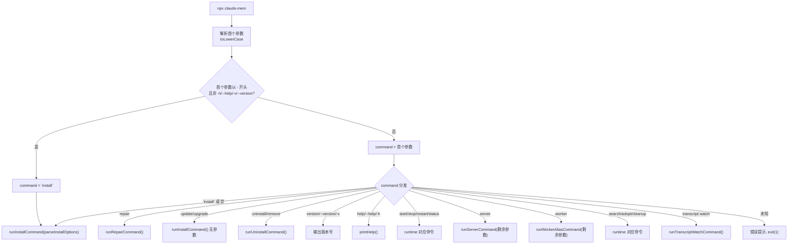

# index.ts (npx-cli) 需求说明

> 源文件：src/npx-cli/index.ts ｜ 类型：源码 ｜ 行数：218 ｜ 所属模块：npx-cli ｜ 分析日期：2026-07-23

## 1. 文件定位总述

本文件是 `npx claude-mem` CLI 的主入口点，负责解析命令行参数并路由到对应的命令处理模块。它是整个 CLI 的调度中枢，支持 14 种主要命令（install、repair、update、uninstall、version、help、start、stop、restart、status、server、worker、search、adopt、cleanup、transcript），并提供帮助信息输出、flag 解析等辅助功能。当首个参数以 `-` 开头（非 help/version flag）时，自动将其视为 `install` 命令的 flag 透传。

## 2. 功能需求

| 编号 | 需求描述（系统应当…） | 触发条件 / 输入 | 处理规则与输出 | 证据 |
|------|----------------------|----------------|---------------|------|
| FR-CLI-01 | 系统应当将以 `-` 开头的非 help/version flag 自动视为 install 命令 | 输入如 `npx claude-mem --provider claude` | command 解析为 `install`，参数透传到 runInstallCommand | `index.ts:11-14` |
| FR-CLI-02 | 系统应当路由 install 命令 | 输入 `install` 或空命令 | 动态导入 install.js，解析 --ide/--provider/--model/--no-auto-start 参数后执行 | `index.ts:101-106,85-97` |
| FR-CLI-03 | 系统应当路由 repair 命令 | 输入 `repair` | 动态导入 install.js 的 runRepairCommand | `index.ts:108-111` |
| FR-CLI-04 | 系统应当路由 update/upgrade 命令 | 输入 `update` 或 `upgrade` | 动态导入 install.js 的 runInstallCommand（无参数，执行更新） | `index.ts:113-119` |
| FR-CLI-05 | 系统应当路由 uninstall/remove 命令 | 输入 `uninstall` 或 `remove` | 动态导入 uninstall.js | `index.ts:121-126` |
| FR-CLI-06 | 系统应当路由 version/--version/-v 命令 | 输入 version 相关命令 | 输出 readPluginVersion() 结果 | `index.ts:128-134` |
| FR-CLI-07 | 系统应当路由 help/--help/-h 命令 | 输入 help 相关命令 | 调用 printHelp() 输出完整帮助信息 | `index.ts:135-140` |
| FR-CLI-08 | 系统应当路由 start/stop/restart/status 命令 | 输入 runtime 命令 | 动态导入 runtime.js 对应函数 | `index.ts:142-161` |
| FR-CLI-09 | 系统应当路由 server 命令 | 输入 `server <subcommand>` | 动态导入 server.js，透传参数 | `index.ts:163-167` |
| FR-CLI-10 | 系统应当路由 worker 命令 | 输入 `worker <subcommand>` | 动态导入 server.js 的 runWorkerAliasCommand | `index.ts:169-173` |
| FR-CLI-11 | 系统应当路由 search 命令 | 输入 `search <query>` | 动态导入 runtime.js 的 runSearchCommand | `index.ts:175-179` |
| FR-CLI-12 | 系统应当路由 adopt 命令 | 输入 `adopt [--dry-run] [--branch <name>]` | 动态导入 runtime.js 的 runAdoptCommand | `index.ts:181-185` |
| FR-CLI-13 | 系统应当路由 cleanup 命令 | 输入 `cleanup [--dry-run]` | 动态导入 runtime.js 的 runCleanupCommand | `index.ts:187-191` |
| FR-CLI-14 | 系统应当路由 transcript watch 命令 | 输入 `transcript watch` | 动态导入 runtime.js 的 runTranscriptWatchCommand | `index.ts:193-204` |
| FR-CLI-15 | 系统应当拒绝未知命令 | 输入无法识别的命令名 | 打印错误提示和帮助引用，exit(1) | `index.ts:206-210` |
| FR-CLI-16 | 系统应当解析 --provider flag 并校验合法值 | 输入 --provider | 仅接受 claude/gemini/openrouter，否则报错退出 | `index.ts:86-89` |
| FR-CLI-17 | 系统应当解析 --ide flag 支持逗号分隔多值 | 输入 --ide claude-code,codex-cli | 按 `,` 分割为字符串数组 | `index.ts:79-83` |
| FR-CLI-18 | 系统应当捕获 main() 的未处理异常 | main() 抛出错误 | 打印错误信息后 exit(1) | `index.ts:214-217` |

## 3. 业务规则与约束

- help 和 version flag（`-h`、`--help`、`-v`、`--version`）不触发 install 自动路由。`index.ts:10-14`
- `update` 和 `upgrade` 作为同义词，均执行 install 命令（无参数模式）。`index.ts:114-115,121`
- `uninstall` 和 `remove` 作为同义词。`index.ts:122-123`
- `--provider` flag 的值域为 `{claude, gemini, openrouter}`，输入不合法值时 exit(1)。`index.ts:86-89`
- flag 解析拒绝缺失值和 flag 形状值（如 `--model --no-auto-start` 不会把 `--no-auto-start` 当作 model 值）。`index.ts:68-69`
- 命令匹配不区分大小写（`toLowerCase()`）。`index.ts:6`
- 所有命令模块使用动态 `import()` 延迟加载。`index.ts:103-204`

## 4. 对外暴露

无——本文件为 CLI 入口，执行 main() 后退出进程，不导出任何函数。

## 5. 依赖关系

- 内部依赖：`./utils/paths.js`（readPluginVersion）、`./commands/install.js`（InstallOptions 类型）
- 运行时延迟导入：`./commands/install.js`、`./commands/uninstall.js`、`./commands/runtime.js`、`./commands/server.js`
- 外部依赖：`picocolors`

## 6. 数据结构

```
InstallOptions (type import):
{
  ide?: string[]              // --ide 的逗号分隔多值
  provider?: 'claude' | 'gemini' | 'openrouter'
  model?: string              // --model
  noAutoStart?: boolean       // --no-auto-start
}
```

## 7. 复杂逻辑图示



上图展示了 CLI 入口的完整命令路由分发逻辑。

## 8. 逆向备注

- transcript 命令仅支持 `watch` 子命令，其他子命令会被拒绝。`index.ts:194-204`
