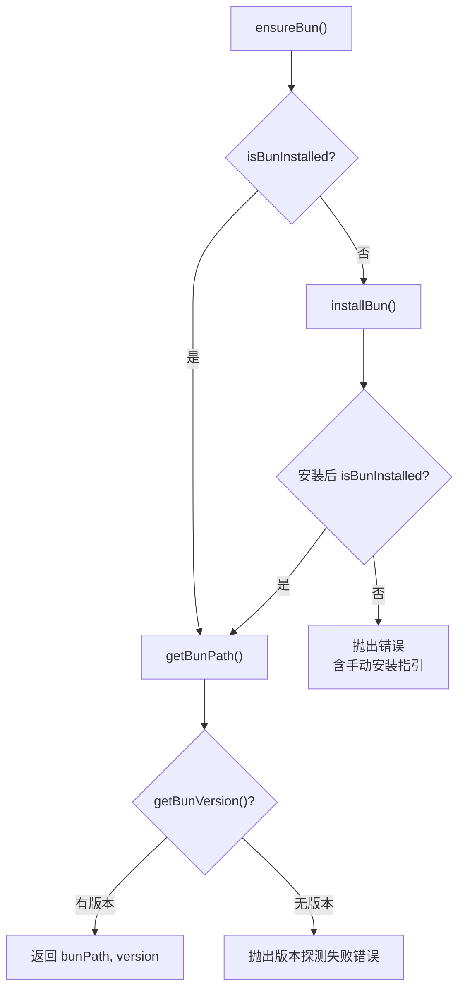
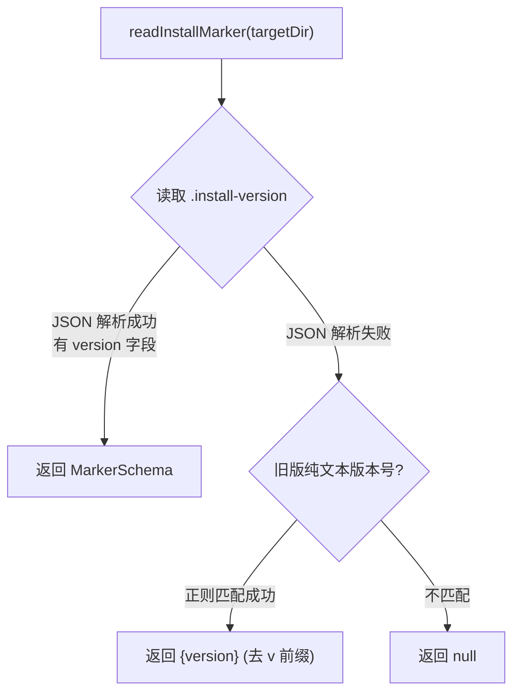

# setup-runtime.ts 需求说明

> 源文件：src/npx-cli/install/setup-runtime.ts ｜ 类型：源码 ｜ 行数：288 ｜ 所属模块：npx-cli/install ｜ 分析日期：2026-07-23

## 1. 文件定位总述

本文件是 claude-mem 安装流程的运行时环境准备模块，负责自动检测和安装 Bun 与 uv 两个运行时依赖、执行插件依赖安装、以及管理安装版本标记（install marker）。它在安装和修复流程中被调用，确保目标环境中具备运行 claude-mem Worker 所需的全部工具链。安装标记机制支持从旧版纯文本格式自动迁移到 JSON 格式。

## 2. 功能需求

| 编号 | 需求描述（系统应当…） | 触发条件 / 输入 | 处理规则与输出 | 证据 |
|------|----------------------|----------------|---------------|------|
| FR-SR-01 | 系统应当确保 Bun 可用（未安装则自动安装） | 调用 ensureBun() | 先检测 PATH 和候选路径；未找到时执行官方安装脚本（Windows: PowerShell / 非Windows: curl bash）；安装后再验证；返回 {bunPath, version} | `setup-runtime.ts:191-204` |
| FR-SR-02 | 系统应当确保 uv 可用（未安装则自动安装） | 调用 ensureUv() | 检测逻辑与 Bun 类似；使用 astral.sh 官方安装脚本；返回 {uvPath, version} | `setup-runtime.ts:206-219` |
| FR-SR-03 | 系统应当安装插件 npm 依赖 | 调用 installPluginDependencies(targetDir, bunPath) | 在 targetDir 下执行 `bun install`，安装后校验所有 dependencies 中的模块是否存在于 node_modules | `setup-runtime.ts:221-239` |
| FR-SR-04 | 系统应当读取安装版本标记 | 调用 readInstallMarker(targetDir) | 优先解析 JSON 格式的 MarkerSchema（含 version/bun/uv/installedAt）；失败则尝试旧版纯文本版本号格式（正则匹配） | `setup-runtime.ts:241-260` |
| FR-SR-05 | 系统应当写入安装版本标记 | 调用 writeInstallMarker(targetDir, version, bunVersion, uvVersion) | 写入 JSON 格式的 MarkerSchema 到 `.install-version` 文件 | `setup-runtime.ts:262-275` |
| FR-SR-06 | 系统应当判断安装是否为最新 | 调用 isInstallCurrent(targetDir, expectedVersion) | 检查 node_modules 存在、标记版本匹配、Bun 版本一致 | `setup-runtime.ts:277-287` |
| FR-SR-07 | 系统应当验证关键模块完整性 | installPluginDependencies 安装后 | 遍历 package.json 的 dependencies，检查每个模块在 node_modules 中是否存在 | `setup-runtime.ts:174-189` |

## 3. 业务规则与约束

- Bun 安装脚本：Windows 使用 `powershell -c "irm bun.sh/install.ps1 \| iex"`，非 Windows 使用 `curl -fsSL https://bun.sh/install \| bash`。`setup-runtime.ts:116-122`
- uv 安装脚本：Windows 使用 `powershell -c "irm https://astral.sh/uv/install.ps1 \| iex"`，非 Windows 使用 `curl -LsSf https://astral.sh/uv/install.sh \| sh`。`setup-runtime.ts:144-156`
- 安装失败时提供手动安装指引（winget/brew/curl 命令）。`setup-runtime.ts:134-141,164-171`
- 安装标记文件名固定为 `.install-version`，位于目标目录下。`setup-runtime.ts:26-28`
- 旧版标记格式为纯文本版本号（如 `1.0.0` 或 `v1.0.0`），新版为 JSON（含 version/bun/uv/installedAt 字段）。`setup-runtime.ts:241-260`
- `isInstallCurrent` 判断逻辑：node_modules 必须存在、标记版本必须匹配、Bun 版本存在性必须与标记一致（标记有 Bun 版本但当前无 Bun，或反之，均视为过期）。`setup-runtime.ts:277-287`
- Bun 和 uv 的候选路径按平台区分（Windows vs 非 Windows）。`setup-runtime.ts:8-14`

## 4. 对外暴露

| 导出名 | 类型 | 说明 |
|--------|------|------|
| `ensureBun` | `() => Promise<{ bunPath: string; version: string }>` | 确保 Bun 可用并返回路径和版本 |
| `ensureUv` | `() => Promise<{ uvPath: string; version: string }>` | 确保 uv 可用并返回路径和版本 |
| `installPluginDependencies` | `(targetDir: string, bunPath: string) => Promise<void>` | 在目标目录执行 bun install |
| `readInstallMarker` | `(targetDir: string) => MarkerSchema \| null` | 读取安装版本标记 |
| `writeInstallMarker` | `(targetDir: string, version: string, bunVersion: string, uvVersion: string) => void` | 写入安装版本标记 |
| `isInstallCurrent` | `(targetDir: string, expectedVersion: string) => boolean` | 判断安装是否为最新 |

共 6 个公开导出。

## 5. 依赖关系

- 无内部依赖
- 外部依赖：Node.js 内置模块 `fs`、`child_process`、`path`、`os`

## 6. 数据结构

```
MarkerSchema {
  version: string         // 安装的 claude-mem 版本
  bun?: string            // 安装时的 Bun 版本
  uv?: string             // 安装时的 uv 版本
  installedAt?: string    // ISO 格式安装时间
}

BUN_COMMON_PATHS: string[]  // Bun 候选安装路径列表（按平台）
UV_COMMON_PATHS: string[]   // uv 候选安装路径列表（按平台）
```

## 7. 复杂逻辑图示





上图分别展示了 ensureBun 的安装保证流程和 readInstallMarker 的格式兼容读取逻辑。

## 8. 逆向备注

- `MarkerSchema` 接口为本地定义，未使用 Zod Schema 校验，推断：安装标记的读写发生在 CLI 层，不需要 Schema 层的严格校验。`setup-runtime.ts:16-21`
