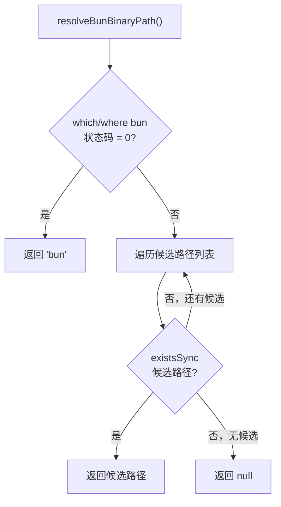

# bun-resolver.ts 需求说明

> 源文件：src/npx-cli/utils/bun-resolver.ts ｜ 类型：源码 ｜ 行数：44 ｜ 所属模块：npx-cli/utils ｜ 分析日期：2026-07-23

## 1. 文件定位总述

本文件提供 Bun 运行时二进制文件的路径解析能力。它先尝试通过系统 `which`/`where` 命令查找全局可用的 Bun，若失败则按平台特定候选路径列表依次探测文件系统。该工具函数被 runtime.ts 等上层模块调用，用于在 CLI 命令执行前定位 Bun 可执行文件路径，是 claude-mem 运行时启动链的基础依赖。

## 2. 功能需求

| 编号 | 需求描述（系统应当…） | 触发条件 / 输入 | 处理规则与输出 | 证据 |
|------|----------------------|----------------|---------------|------|
| FR-BR-01 | 系统应当解析 Bun 二进制路径，优先使用系统 PATH 查找 | 调用 resolveBunBinaryPath() | Windows 用 `where bun`，非 Windows 用 `which bun`；成功时返回字符串 `"bun"` | `bun-resolver.ts:23-33` |
| FR-BR-02 | 系统应当在 PATH 查找失败时按候选路径列表探测文件系统 | `which`/`where` 返回非零或空输出 | Windows 候选：`~/.bun/bin/bun.exe`（USERPROFILE 和 homedir）；非 Windows 候选：`~/.bun/bin/bun`、`/usr/local/bin/bun`、`/opt/homebrew/bin/bun`、`/home/linuxbrew/.linuxbrew/bin/bun` | `bun-resolver.ts:7-21, 35-41` |
| FR-BR-03 | 系统应当在所有探测方式均失败时返回 null | Bun 未安装或不在候选路径 | 返回 `null` | `bun-resolver.ts:42` |

## 3. 业务规则与约束

- Windows 与非 Windows 使用不同的 shell 命令（`where` vs `which`）和不同的候选路径。`bun-resolver.ts:25,8-21`
- `spawnSync` 使用 `shell: IS_WINDOWS` 确保跨平台兼容性。`bun-resolver.ts:28`

## 4. 对外暴露

| 导出名 | 类型 | 说明 |
|--------|------|------|
| `resolveBunBinaryPath` | `() => string \| null` | 解析 Bun 二进制路径，返回路径字符串或 null |

共 1 个公开导出。

## 5. 依赖关系

- 内部依赖：`./paths.js`（IS_WINDOWS）
- 外部依赖：Node.js 内置模块 `child_process`、`fs`、`os`、`path`

## 6. 数据结构

不适用。

## 7. 复杂逻辑图示

上图展示了两级查找策略：先查系统 PATH，再按固定候选路径列表探测。

## 8. 逆向备注

无。
