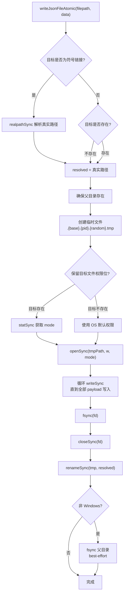

# paths.ts 需求说明

> 源文件：src/npx-cli/utils/paths.ts ｜ 类型：源码 ｜ 行数：206 ｜ 所属模块：npx-cli/utils ｜ 分析日期：2026-07-23

## 1. 文件定位总述

本文件是 npx-cli 模块的路径管理核心，提供 Claude Code 插件生态系统相关的所有关键路径解析函数，以及一个崩溃安全的原子 JSON 写入工具。它负责确定插件安装目录、marketplace 目录、配置文件路径、缓存目录、npm 包根目录等，并为这些路径提供读取和写入能力。`writeJsonFileAtomic` 函数采用 tmp+rename+fsync 三步策略，确保即使在写入过程中系统崩溃，目标文件也不会出现截断或损坏。

## 2. 功能需求

| 编号 | 需求描述（系统应当…） | 触发条件 / 输入 | 处理规则与输出 | 证据 |
|------|----------------------|----------------|---------------|------|
| FR-PATH-01 | 系统应当解析 Claude 配置目录路径 | 调用 claudeConfigDirectory() | 优先使用 `CLAUDE_CONFIG_DIR` 环境变量；否则默认 `~/.claude` | `paths.ts:23-25` |
| FR-PATH-02 | 系统应当解析 marketplace 安装目录 | 调用 marketplaceDirectory() | 返回 `{claudeConfigDir}/plugins/marketplaces/thedotmack` | `paths.ts:27-29` |
| FR-PATH-03 | 系统应当解析 plugins 根目录 | 调用 pluginsDirectory() | 返回 `{claudeConfigDir}/plugins` | `paths.ts:31-33` |
| FR-PATH-04 | 系统应当解析已知 marketplace 注册文件路径 | 调用 knownMarketplacesPath() | 返回 `{pluginsDir}/known_marketplaces.json` | `paths.ts:35-37` |
| FR-PATH-05 | 系统应当解析已安装插件注册文件路径 | 调用 installedPluginsPath() | 返回 `{pluginsDir}/installed_plugins.json` | `paths.ts:39-41` |
| FR-PATH-06 | 系统应当解析 Claude settings.json 路径 | 调用 claudeSettingsPath() | 返回 `{claudeConfigDir}/settings.json` | `paths.ts:43-45` |
| FR-PATH-07 | 系统应当解析插件版本化缓存目录 | 调用 pluginCacheDirectory(version) | 返回 `{pluginsDir}/cache/thedotmack/claude-mem/{version}` | `paths.ts:47-49` |
| FR-PATH-08 | 系统应当解析 npm 包根目录 | 调用 npmPackageRootDirectory() | 基于 import.meta.url 向上两级目录定位，验证 package.json 存在，不存在则抛出错误 | `paths.ts:51-61` |
| FR-PATH-09 | 系统应当解析 npm 包内的 plugin 子目录 | 调用 npmPackagePluginDirectory() | 返回 `{npmPackageRoot}/plugin` | `paths.ts:63-65` |
| FR-PATH-10 | 系统应当读取插件版本号 | 调用 readPluginVersion() | 优先从 plugin/.claude-plugin/plugin.json 读取 version；其次从 package.json 读取；均失败返回 "0.0.0" | `paths.ts:67-89` |
| FR-PATH-11 | 系统应当判断插件是否已安装 | 调用 isPluginInstalled() | 检查 marketplace 目录下是否存在 `plugin/.claude-plugin/plugin.json` | `paths.ts:91-94` |
| FR-PATH-12 | 系统应当确保目录存在（递归创建） | 调用 ensureDirectoryExists(path) | 目录不存在时 mkdirSync 递归创建 | `paths.ts:96-100` |
| FR-PATH-13 | 系统应当以原子写入方式写 JSON 文件 | 调用 writeJsonFileAtomic(filepath, data) | 解析符号链接 → 创建临时文件 → 循环 writeSync → fsync → close → rename → fsync 父目录（POSIX）；保留目标文件权限位 | `paths.ts:124-205` |

## 3. 业务规则与约束

- 原子写入使用 `.{base}.{pid}.{random}.tmp` 命名临时文件，保证并发安全。`paths.ts:150`
- 写入前必须解析符号链接，因为 POSIX rename(2) 会替换符号链接本身而非写入链接目标。`paths.ts:128-144`
- 保留目标文件的原有权限位（`statSync(resolved).mode & 0o777`），防止意外放宽权限。`paths.ts:155-160`
- Windows 上不执行父目录 fsync（不支持），其他平台尽可能执行以获得崩溃持久性。`paths.ts:185-196`
- 写入过程中异常时清理临时文件。`paths.ts:199-203`
- `readJsonSafe` 从 `../../utils/json-utils.js` 重导出。`paths.ts:102`

## 4. 对外暴露

| 导出名 | 类型 | 说明 |
|--------|------|------|
| `IS_WINDOWS` | `boolean` (常量) | 当前平台是否为 Windows |
| `claudeConfigDirectory` | `() => string` | Claude 配置目录路径 |
| `marketplaceDirectory` | `() => string` | Marketplace 安装目录 |
| `pluginsDirectory` | `() => string` | Plugins 根目录 |
| `knownMarketplacesPath` | `() => string` | 已知 marketplace 注册文件路径 |
| `installedPluginsPath` | `() => string` | 已安装插件注册文件路径 |
| `claudeSettingsPath` | `() => string` | Claude settings.json 路径 |
| `pluginCacheDirectory` | `(version: string) => string` | 版本化缓存目录 |
| `npmPackageRootDirectory` | `() => string` | npm 包根目录 |
| `npmPackagePluginDirectory` | `() => string` | npm 包内 plugin 子目录 |
| `readPluginVersion` | `() => string` | 读取插件版本号 |
| `isPluginInstalled` | `() => boolean` | 判断插件是否已安装 |
| `ensureDirectoryExists` | `(dir: string) => void` | 递归创建目录 |
| `writeJsonFileAtomic` | `(filepath: string, data: any) => void` | 原子写入 JSON 文件 |
| `readJsonSafe` | 重导出 | 安全读取 JSON 文件 |

共 15 个公开导出（13 函数 + 1 常量 + 1 重导出）。

## 5. 依赖关系

- 内部依赖：`../../utils/json-utils.js`（readJsonSafe）
- 外部依赖：Node.js 内置模块 `fs`、`os`、`path`、`url`、`crypto`

## 6. 数据结构

不适用——纯工具函数文件。

## 7. 复杂逻辑图示

上图展示了原子 JSON 写入的完整流程：符号链接解析、临时文件创建、完整写入 + fsync、原子 rename、父目录 fsync。

## 8. 逆向备注

无。
