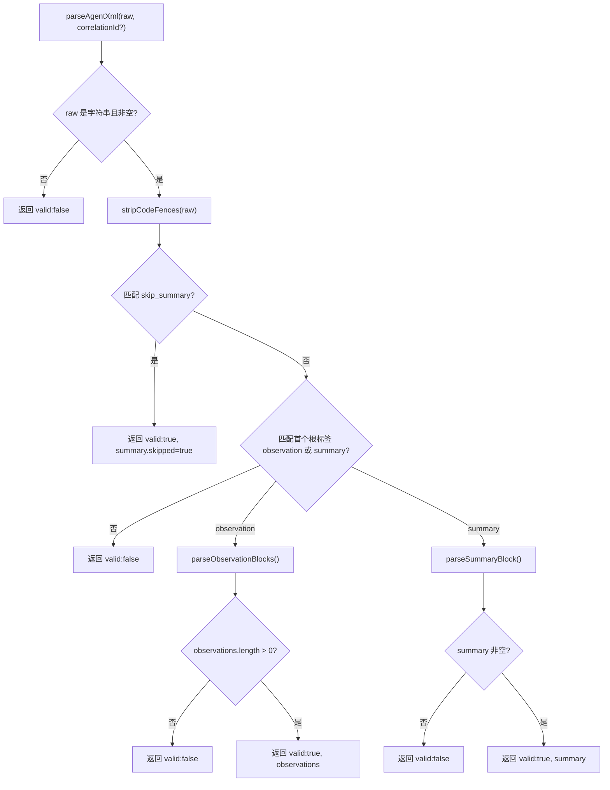

# parser.ts 需求说明

> 源文件：src/sdk/parser.ts ｜ 类型：源码 ｜ 行数：213 ｜ 所属模块：sdk ｜ 分析日期：2026-07-23

## 1. 文件定位总述

parser.ts 是 Claude-Mem SDK 层的 XML 响应解析器，负责将 AI 观察者模型（observer model）返回的原始文本转换为结构化的 `ParsedObservation` 或 `ParsedSummary` 数据。它是 SDK prompt 构建链路的下游消费者：prompts.ts 构建的 XML 模板引导 AI 输出特定格式的 XML，而本文件负责逆向解析这些输出。该文件同时承担空内容过滤、观察类型校验与降级、概念去重等数据清洗职责，是 AI 非确定性输出到确定性存储之间的关键桥梁。

## 2. 功能需求

| 编号 | 需求描述（系统应当…） | 触发条件 / 输入 | 处理规则与输出 | 证据 |
|------|----------------------|----------------|---------------|------|
| FR-PARSE-01 | 系统应当能解析 AI 模型返回的原始文本，从中提取结构化的观察记录或摘要 | 调用 `parseAgentXml(raw, correlationId?)`，传入原始文本 | 返回 `ParseResult` 联合类型：`{valid:true, observations, summary}` 或 `{valid:false}` | `parser.ts:41` |
| FR-PARSE-02 | 系统应当在解析前自动剥离整个文本外层的 Markdown 代码围栏（`` ```xml `` 或 `` ``` ``），仅当围栏包裹全部内容时 | 原始文本首行以 `` ``` `` 开头、末行以 `` ``` `` 结尾，中间全部为内容 | 正则匹配 `^\s*```(?:xml)?\s*\n([\s\S]*?)\n```\s*$`，提取内部内容 | `parser.ts:10-13` |
| FR-PARSE-03 | 系统应当识别 `<skip_summary>` 自闭合标签并返回跳过状态的摘要结果 | 文本中包含 `<skip_summary reason="..."/>` | 返回 `valid:true`，`summary.skipped=true`，`summary.skip_reason` 为 reason 属性值（可为 null） | `parser.ts:48-64` |
| FR-PARSE-04 | 系统应当从文本中提取一个或多个 `<observation>` 块，解析其中 type、title、subtitle、narrative、facts、concepts、files_read、files_modified 字段 | 文本中包含至少一个完整的 `<observation>...</observation>` 块 | 每个块提取为一个 `ParsedObservation` 对象，空字段为 null，数组字段为 string[] | `parser.ts:87-151` |
| FR-PARSE-05 | 系统应当从文本中提取单个 `<summary>` 块，解析 request、investigated、learned、completed、next_steps、notes 字段 | 文本中包含一个 `<summary>...</summary>` 块，且至少有一个子标签有值 | 返回 `ParsedSummary` 对象；若所有子标签均为空则视为误判拒绝 | `parser.ts:153-180` |
| FR-PARSE-06 | 系统应当根据当前活跃模式的合法观察类型列表对每个 observation 的 type 进行校验，非法类型降级为列表首项 | 解析 observation 块时调用 `ModeManager.getInstance().getActiveMode()` 获取合法类型 | type 不在合法列表中时使用 `fallbackType`，并记录 ERROR 日志 | `parser.ts:105-117` |
| FR-PARSE-07 | 系统应当将与 observation type 重复的 concept 从 concepts 数组中移除 | concepts 数组中包含与最终 type 值相同的元素 | 过滤掉等于 `finalType` 的 concept，记录 DEBUG 日志 | `parser.ts:119-128` |
| FR-PARSE-08 | 系统应当跳过所有内容字段均为空的 observation（title、narrative、facts、concepts 全部为空/null） | 解析完成后，title 为 null 且 narrative 为 null 且 facts 和 concepts 均为空 | 跳过该 observation，记录 WARN 日志 | `parser.ts:130-136` |
| FR-PARSE-09 | 系统应当在输入为非字符串或空白时、无有效根标签时、observations 解析为零条时、summary 无有效子标签时返回 `{valid:false}` | 各种无效输入场景 | 返回 `{valid: false}` | `parser.ts:42-44,67-69,74-76,167-169` |

## 3. 业务规则与约束

1. **代码围栏剥离策略**：仅当整个 payload 是单个围栏块时才剥离，避免破坏包含内嵌围栏示例或前后散文的内容（`parser.ts:6-8`）
2. **观察类型校验依赖运行时模式**：type 校验不是静态的，而是动态读取当前 `ModeManager` 活跃模式（`parser.ts:105-107`）
3. **概念去重方向**：从 concepts 中移除与 type 相同的值，而非从 type 中移除（`parser.ts:119`）
4. **摘要块的空值判定**：notes 字段不参与"有效子标签"判定，仅 request/investigated/learned/completed/next_steps 五个字段参与（`parser.ts:167`）

## 4. 对外暴露

| 导出项 | 类型 | 说明 |
|--------|------|------|
| `ParsedObservation` | interface | 解析后的观察记录结构 |
| `ParsedSummary` | interface | 解析后的摘要结构（含 skipped/skip_reason） |
| `ParseResult` | type | 联合类型，区分有效/无效解析结果 |
| `parseAgentXml` | function | 主入口，接受原始文本和可选 correlationId，返回 ParseResult |

## 5. 依赖关系

- **上游**：`../utils/logger.js`（日志）、`../services/domain/ModeManager.js`（获取活跃模式及合法观察类型）
- **下游**：被 SDK 层调用，将 AI 模型的 XML 输出转为结构化数据供持久化

## 6. 数据结构

```typescript
interface ParsedObservation {
  type: string;          // 校验后的合法观察类型
  title: string | null;
  subtitle: string | null;
  facts: string[];
  narrative: string | null;
  concepts: string[];   // 已去除与 type 重复的值
  files_read: string[];
  files_modified: string[];
}

interface ParsedSummary {
  request: string | null;
  investigated: string | null;
  learned: string | null;
  completed: string | null;
  next_steps: string | null;
  notes: string | null;
  skipped?: boolean;
  skip_reason?: string | null;
}
```

## 7. 复杂逻辑图示



## 8. 逆向备注

1. TODO 注释表明当前 XML 文本路径是过渡方案，计划迁移到 Anthropic tool-use API 实现确定性 JSON 输出（`parser.ts:5`）
2. 代码围栏剥离的注释引用了 CodeRabbit 在 PR #2282 中的 review，说明此前存在剥离位置不当的 bug（`parser.ts:6-8`）
