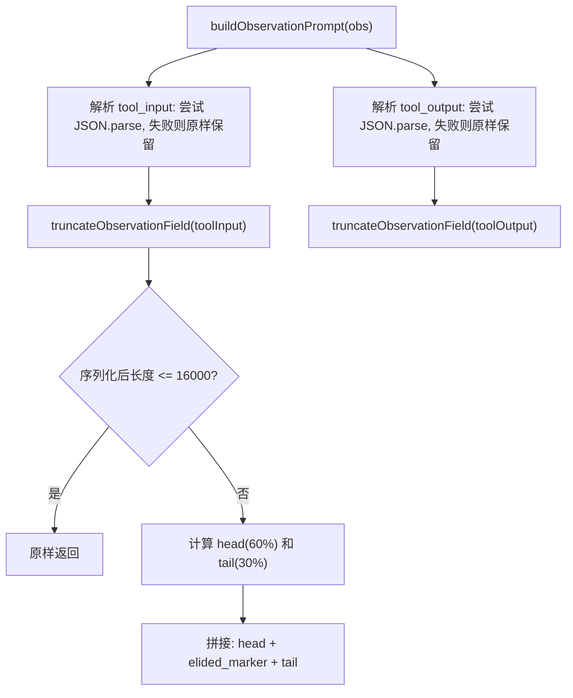

# prompts.ts 需求说明

> 源文件：src/sdk/prompts.ts ｜ 类型：源码 ｜ 行数：246 ｜ 所属模块：sdk ｜ 分析日期：2026-07-23

## 1. 文件定位总述

prompts.ts 是 Claude-Mem SDK 层的 prompt 工程模块，负责构建发送给 AI 观察者模型（observer model）的全部 prompt 文本。它提供四类 prompt 构建函数：初始化 prompt（`buildInitPrompt`）、观察 prompt（`buildObservationPrompt`）、摘要 prompt（`buildSummaryPrompt`）和续接 prompt（`buildContinuationPrompt`）。所有 prompt 都基于当前活跃模式的配置（`ModeConfig`）动态组装，包括系统身份、观察者角色、空间感知、录制焦点、跳过引导、输出格式模板等段落。该模块还包含对超长工具输入/输出的截断机制，防止单个超大文件撑爆观察者的上下文窗口。

## 2. 功能需求

| 编号 | 需求描述（系统应当…） | 触发条件 / 输入 | 处理规则与输出 | 证据 |
|------|----------------------|----------------|---------------|------|
| FR-PRM-01 | 系统应当能构建观察者会话的初始化 prompt，包含系统身份、用户请求、观察者角色、格式模板和输出示例 | 调用 `buildInitPrompt(project, sessionId, userPrompt, mode)` | 返回完整 prompt 字符串，包含 `<observed_from_primary_session>` 包裹的用户请求和完整的 `<observation>` XML 模板 | `prompts.ts:24-79` |
| FR-PRM-02 | 系统应当能构建单次工具使用的观察 prompt，包含工具名称、时间戳、工作目录、参数和结果 | 调用 `buildObservationPrompt(obs: Observation)` | 返回 `<observed_from_primary_session>` 包裹的 prompt，指示 AI 返回一个或多个 `<observation>` 块或空响应 | `prompts.ts:117-151` |
| FR-PRM-03 | 系统应当对观察 prompt 中的工具输入和输出字段进行截断，防止单个超大值撑爆观察者上下文窗口 | tool_input 或 tool_output 序列化后超过 16000 字符 | 采用 head(60%)+tail(30%)+elision_marker(10%) 策略截断，保留首尾关键信息，中间标注省略字符数 | `prompts.ts:99-115` |
| FR-PRM-04 | 系统应当能构建会话摘要 prompt，强制 AI 仅使用 `<summary>` 根标签 | 调用 `buildSummaryPrompt(session, mode)` | prompt 中包含多重警告禁止使用 `<observation>` 标签，提供 `<summary>` XML 模板，注入 last_assistant_message 作为摘要上下文 | `prompts.ts:153-185` |
| FR-PRM-05 | 系统应当能构建续接 prompt，用于观察者在同一会话中继续处理后续工具调用 | 调用 `buildContinuationPrompt(userPrompt, promptNumber, contentSessionId, mode)` | 返回包含续接指令和观察格式模板的 prompt，末尾使用 `header_memory_continued` 而非 `header_memory_start` | `prompts.ts:187-246` |

## 3. 业务规则与约束

1. **字段截断参数**：单字段最大 16000 字符（约 4k tokens），head 占 60%，tail 占 30%，elision marker 占 10%（`prompts.ts:99-101`）
2. **截断标记语义**：截断后显式插入 `<elided chars="..." original_size_chars="..." reason="oversize" />`，让观察者模型知道截断发生，不虚构被省略的内容（`prompts.ts:114`）
3. **摘要模式标记**：使用常量 `MODE SWITCH: PROGRESS SUMMARY` 作为摘要 prompt 的显式标记（`prompts.ts:5`）
4. **缺失 last_assistant_message 的处理**：摘要 prompt 构建时若 session 缺少 last_assistant_message，记录 ERROR 日志后降级为空字符串（`prompts.ts:154-159`）
5. **工具输入/输出的 JSON 解析**：尝试将字符串 parse 为 JSON；失败则保留原始字符串，记录 DEBUG 日志（`prompts.ts:121-137`）
6. **所有 prompt 均由 ModeConfig 驱动**：prompt 的各段落（system_identity、observer_role、skip_guidance 等）全部来自 mode 配置，不硬编码（`prompts.ts:25-78`）

## 4. 对外暴露

| 导出项 | 类型 | 说明 |
|--------|------|------|
| `SUMMARY_MODE_MARKER` | const string | 摘要模式标记常量 `'MODE SWITCH: PROGRESS SUMMARY'` |
| `Observation` | interface | 观察数据输入结构（id, tool_name, tool_input, tool_output, created_at_epoch, cwd?） |
| `SDKSession` | interface | 会话数据结构（id, memory_session_id, project, user_prompt, last_assistant_message?） |
| `buildInitPrompt` | function | 构建初始化 prompt |
| `buildObservationPrompt` | function | 构建单次观察 prompt |
| `buildSummaryPrompt` | function | 构建摘要 prompt |
| `buildContinuationPrompt` | function | 构建续接 prompt |

## 5. 依赖关系

- **上游**：`../utils/logger.js`（日志）、`../services/domain/types.js`（ModeConfig 类型）
- **下游**：被 SDK 层的观察者和摘要流程调用，构建的 prompt 发送给 AI 模型

## 6. 数据结构

```typescript
const OBS_PROMPT_FIELD_MAX_CHARS = 16_000;   // 单字段最大字符数
const OBS_PROMPT_FIELD_HEAD_RATIO = 0.6;      // 头部保留比例
const OBS_PROMPT_FIELD_TAIL_RATIO = 0.3;      // 尾部保留比例
```

截断输出格式：`{head}\n... <elided chars="N" original_size_chars="M" reason="oversize" /> ...\n{tail}`

## 7. 复杂逻辑图示



## 8. 逆向备注

1. 截断机制的注释明确引用了 issue #2468（130k 字符的文件导致 SDK 会话因 prompt 过长而中止），说明该机制是为解决具体生产问题而引入的（`prompts.ts:91-93`）
2. `truncateObservationField` 对 undefined/function/symbol 的 JSON.stringify 返回 undefined 的边界情况做了防护（`prompts.ts:104-106`）
