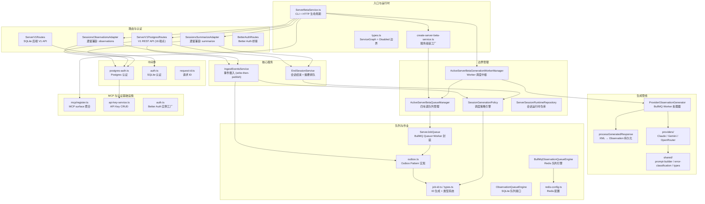

# SERVER 模块汇总

> 基于 doc/src/server/ 下 36 份文件级需求文档（*.md）汇总，忽略 _ 开头文件。
> 分析日期：2026-07-23

## 1. 模块职责总述

Server 模块是 Claude-mem 的"多租户云端记忆服务"后端，承担从 HTTP 路由、认证鉴权、事件摄入、AI 观测生成到持久化存储的全链路职责。它在架构上刻意与本地 worker-service 解耦（不依赖 SessionStore / ActiveSession / WorkerRef），以 Postgres 为权威数据源、BullMQ 为传输层，通过 Outbox Pattern 保证事件写入与队列发布的最终一致性。模块对外暴露 REST API（V1 规范端点 + 遗留兼容端点）、MCP 协议表面和 CLI 管理工具，支持 daemon 模式、独立 worker 进程和容器化水平扩展。

## 2. 功能需求汇总

### 2.1 认证与鉴权（auth / middleware）

| 编号 | 需求描述 | 来源文档 |
|------|---------|---------|
| FR-AKSV-01 | 创建 API Key，生成 `cmem_` 前缀密钥，SHA-256 哈希存储 | auth/api-key-service.ts.md |
| FR-AKSV-02 | 验证 API Key（哈希匹配、状态活跃、未过期、scope 充分） | auth/api-key-service.ts.md |
| FR-AKSV-03 | 列出所有 API Key | auth/api-key-service.ts.md |
| FR-AKSV-04 | 吊销 API Key 并记录审计日志 | auth/api-key-service.ts.md |
| FR-AKSV-05 | API Key 绑定 sync user_label | auth/api-key-service.ts.md |
| FR-AKSV-06 | 创建/吊销时自动生成审计日志 | auth/api-key-service.ts.md |
| FR-BAUTH-01 | 创建 Better Auth 实例（bun:sqlite 后端） | auth/auth.ts.md |
| FR-BAUTH-02 | 启用 API Key 插件 | auth/auth.ts.md |
| FR-BAUTH-03 | 启用 Organization 插件（teams 功能） | auth/auth.ts.md |
| FR-BAUTHR-01 | 将 `/api/auth/*splat` 委托给 Better Auth handler | auth/BetterAuthRoutes.ts.md |
| FR-BAUTHR-02 | WeakMap 缓存 handler 实例（以 Database 为键） | auth/BetterAuthRoutes.ts.md |
| FR-BAUTHR-03 | handler 失败时传递给 Express next | auth/BetterAuthRoutes.ts.md |
| FR-AUTHMW-01 | 从 Authorization 头提取 Bearer Token | middleware/auth.ts.md |
| FR-AUTHMW-02 | local-dev 模式下允许 loopback 请求绕过认证 | middleware/auth.ts.md |
| FR-AUTHMW-03 | 缺少 Bearer Token 返回 401 | middleware/auth.ts.md |
| FR-AUTHMW-04 | API Key 验证失败返回 403 | middleware/auth.ts.md |
| FR-AUTHMW-05 | 认证成功后注入 req.authContext | middleware/auth.ts.md |
| FR-PGAUTH-01 | 从 Authorization 头提取 Bearer Token（Postgres 版） | middleware/postgres-auth.ts.md |
| FR-PGAUTH-02 | local-dev 绕过，支持 localDevTeamId | middleware/postgres-auth.ts.md |
| FR-PGAUTH-03 | 直接查询 Postgres api_keys 表验证（SHA-256 哈希） | middleware/postgres-auth.ts.md |
| FR-PGAUTH-04 | 缺少 Token 返回 401 | middleware/postgres-auth.ts.md |
| FR-PGAUTH-05 | 验证失败返回 403 | middleware/postgres-auth.ts.md |
| FR-PGAUTH-06 | 内部错误传递给 Express next | middleware/postgres-auth.ts.md |
| FR-REQID-01 | 为每个请求分配唯一请求 ID（优先透传 X-Request-Id） | middleware/request-id.ts.md |
| FR-REQID-02 | 通过 X-Request-Id 响应头返回给客户端 | middleware/request-id.ts.md |
| FR-REQID-03 | 入站 X-Request-Id 格式校验（长度 1-64，白名单字符） | middleware/request-id.ts.md |

### 2.2 路由层（routes）

| 编号 | 需求描述 | 来源文档 |
|------|---------|---------|
| FR-INFRA-01 | 所有 `/v1` 路由前注入请求 ID 中间件 | routes/v1/ServerV1PostgresRoutes.md |
| FR-INFRA-02 | 写操作和读操作分别建立 memories:write / memories:read 鉴权 | routes/v1/ServerV1PostgresRoutes.md |
| FR-EVT-01 | 单条事件 POST（含 generate/wait 参数控制） | routes/v1/ServerV1PostgresRoutes.md |
| FR-EVT-02 | 批量事件 POST（1-500 条，原子插入） | routes/v1/ServerV1PostgresRoutes.md |
| FR-EVT-03 | 支持 `?generate=false` 跳过异步生成 | routes/v1/ServerV1PostgresRoutes.md |
| FR-EVT-04 | 支持 `?wait=true` 同步等待生成完成（30s 超时） | routes/v1/ServerV1PostgresRoutes.md |
| FR-EVTQRY-01 | 按 ID 查询单条事件（强制租户隔离） | routes/v1/ServerV1PostgresRoutes.md |
| FR-EVTQRY-02 | 查询事件关联的观测（通过 observation_sources） | routes/v1/ServerV1PostgresRoutes.md |
| FR-JOB-01 | 按团队列出生成作业（支持状态过滤与分页） | routes/v1/ServerV1PostgresRoutes.md |
| FR-JOB-02 | 按项目列出生成作业 | routes/v1/ServerV1PostgresRoutes.md |
| FR-JOB-03 | 通用作业列表（默认屏蔽 payload，admin 可选返回） | routes/v1/ServerV1PostgresRoutes.md |
| FR-JOB-04 | 按 ID 查询单条生成作业详情 | routes/v1/ServerV1PostgresRoutes.md |
| FR-JOB-05 | 操作员重试作业（幂等安全，状态机规则） | routes/v1/ServerV1PostgresRoutes.md |
| FR-JOB-06 | 操作员取消作业（幂等安全） | routes/v1/ServerV1PostgresRoutes.md |
| FR-SES-01 | 创建/查找服务器会话（幂等，唯一约束） | routes/v1/ServerV1PostgresRoutes.md |
| FR-SES-02 | 按 ID 查询会话详情 | routes/v1/ServerV1PostgresRoutes.md |
| FR-SES-03 | 结束会话（自动创建摘要生成作业） | routes/v1/ServerV1PostgresRoutes.md |
| FR-MEM-01 | 手动插入观测（不触发生成器） | routes/v1/ServerV1PostgresRoutes.md |
| FR-SRCH-01 | 全文搜索观测（GIN tsvector 索引） | routes/v1/ServerV1PostgresRoutes.md |
| FR-SRCH-02 | 上下文打包（搜索 + 文本拼接） | routes/v1/ServerV1PostgresRoutes.md |
| FR-routes-01 | 健康检查端点 `/healthz`（无需认证） | routes/v1/ServerV1Routes.md |
| FR-routes-02 | 服务器信息端点 `/v1/info`（无需认证） | routes/v1/ServerV1Routes.md |
| FR-routes-03 | 项目列表（按 API Key 作用域过滤） | routes/v1/ServerV1Routes.md |
| FR-routes-04 | 创建项目（项目级 Key 禁止） | routes/v1/ServerV1Routes.md |
| FR-routes-05-18 | 项目/会话/事件/记忆 CRUD、搜索、上下文、审计查询（SQLite 后端） | routes/v1/ServerV1Routes.md |

### 2.3 兼容适配器（compat）

| 编号 | 需求描述 | 来源文档 |
|------|---------|---------|
| FR-compat-01 | 注册 `POST /api/sessions/observations`（memories:write） | compat/SessionsObservationsAdapter.ts.md |
| FR-compat-02 | Zod 校验遗留载荷，失败返回 400 | compat/SessionsObservationsAdapter.ts.md |
| FR-compat-03 | API Key 必须绑定团队，否则 403 | compat/SessionsObservationsAdapter.ts.md |
| FR-compat-04 | API Key 必须是项目级别，否则 400 | compat/SessionsObservationsAdapter.ts.md |
| FR-compat-05 | contentSessionId 映射为 external_session_id（幂等创建） | compat/SessionsObservationsAdapter.ts.md |
| FR-compat-06 | 遗留 tool-use 载荷转换为 agent_event 格式 | compat/SessionsObservationsAdapter.ts.md |
| FR-compat-07 | 委托 IngestEventsService 写入和投递 | compat/SessionsObservationsAdapter.ts.md |
| FR-compat-08 | 返回遗留兼容响应格式 | compat/SessionsObservationsAdapter.ts.md |
| FR-compat-09 | 兼容 tool_use_id 和 toolUseId 两种字段名 | compat/SessionsObservationsAdapter.ts.md |
| FR-compat-10 | 并发竞态处理（23505 唯一约束捕获） | compat/SessionsObservationsAdapter.ts.md |
| FR-COMPAT-01 | 提供 `/api/sessions/summarize` 兼容端点 | compat/SessionsSummarizeAdapter.ts.md |
| FR-COMPAT-02 | 使用 memories:write Postgres 认证 | compat/SessionsSummarizeAdapter.ts.md |
| FR-COMPAT-03 | Zod 校验请求体 | compat/SessionsSummarizeAdapter.ts.md |
| FR-COMPAT-04-05 | 要求 teamId 和 projectId 非空 | compat/SessionsSummarizeAdapter.ts.md |
| FR-COMPAT-06 | subagent 上下文返回 skipped | compat/SessionsSummarizeAdapter.ts.md |
| FR-COMPAT-07 | session 未找到返回 404 | compat/SessionsSummarizeAdapter.ts.md |
| FR-COMPAT-08 | 成功返回 queued 状态 | compat/SessionsSummarizeAdapter.ts.md |

### 2.4 AI 生成管线（generation）

| 编号 | 需求描述 | 来源文档 |
|------|---------|---------|
| FR-PROC-01 | BullMQ Worker 处理器，编排端到端观测生成 | generation/ProviderObservationGenerator.ts.md |
| FR-VAL-01 | Zod payload 校验（拒绝不合法载荷） | generation/ProviderObservationGenerator.ts.md |
| FR-KND-01 | 仅接受 event/event-batch/summary 三种 kind | generation/ProviderObservationGenerator.ts.md |
| FR-SCP-01 | scope mismatch 检测（重载 Postgres 行对比） | generation/ProviderObservationGenerator.ts.md |
| FR-REV-01 | API Key 撤销/过期检查 | generation/ProviderObservationGenerator.ts.md |
| FR-LCK-01 | outbox 行锁定为 processing（防止重复执行） | generation/ProviderObservationGenerator.ts.md |
| FR-LDC-01 | 按 job kind 加载关联 agent_events | generation/ProviderObservationGenerator.ts.md |
| FR-LPR-01 | 加载项目信息 | generation/ProviderObservationGenerator.ts.md |
| FR-GEN-01 | 调用 AI Provider 执行生成 | generation/ProviderObservationGenerator.ts.md |
| FR-ROT-01 | 根据 sourceType 路由到不同响应处理函数 | generation/ProviderObservationGenerator.ts.md |
| FR-PER-01 | 处理开始时写入审计日志 | generation/ProviderObservationGenerator.ts.md |
| FR-ERR-01 | 错误分类决定是否重试 | generation/ProviderObservationGenerator.ts.md |
| FR-AUD-01 | scope 违规和 key 撤销记录审计日志 | generation/ProviderObservationGenerator.ts.md |
| FR-IDL-01 | job 不存在时幂等返回 completed | generation/ProviderObservationGenerator.ts.md |
| FR-PGR-01 | 解析 XML → 批量持久化 Observation（Postgres 事务） | generation/processGeneratedResponse.ts.md |
| FR-PRV-01 | 检测隐私内容，跳过标记为 private/空内容的 observation | generation/processGeneratedResponse.ts.md |
| FR-IDM-01 | generation_key UNIQUE 约束保证幂等性 | generation/processGeneratedResponse.ts.md |
| FR-SRC-01 | 为每条 observation 建立 source 链接 | generation/processGeneratedResponse.ts.md |
| FR-AUD-01 | 为每条 observation 写入审计日志 | generation/processGeneratedResponse.ts.md |
| FR-JCF-01 | job 状态推进到 completed 并追加事件日志 | generation/processGeneratedResponse.ts.md |
| FR-JCA-01 | job 完成写入审计日志 | generation/processGeneratedResponse.ts.md |
| FR-TSC-01 | 事务内重新加载 job，终态则跳过 | generation/processGeneratedResponse.ts.md |
| FR-MGF-01 | 失败 job 标记为 queued（可重试）或 failed | generation/processGeneratedResponse.ts.md |
| FR-SSM-01 | 会话摘要解析为 kind='summary' 的 observation | generation/processGeneratedResponse.ts.md |
| FR-RND-01 | 指数退避重试策略（5s 基数，10min 上限） | generation/processGeneratedResponse.ts.md |
| FR-build-01 | 根据事件列表构建单轮生成提示词 | generation/providers/shared/prompt-builder.ts.md |
| FR-build-02 | 对每个事件执行隐私标签剥离 | generation/providers/shared/prompt-builder.ts.md |
| FR-build-03 | 载荷文本截断至 16KB 上限 | generation/providers/shared/prompt-builder.ts.md |
| FR-build-04 | 全部事件剥离后为空则标记跳过 | generation/providers/shared/prompt-builder.ts.md |
| FR-build-05 | 基于 Mode 配置生成观测输出 XML Schema | generation/providers/shared/prompt-builder.ts.md |
| FR-build-06 | Mode 加载失败回退到四种预定义观测类型 | generation/providers/shared/prompt-builder.ts.md |
| FR-build-07 | XML 实体转义 | generation/providers/shared/prompt-builder.ts.md |
| FR-build-08 | 每个事件构建标准化 XML 块 | generation/providers/shared/prompt-builder.ts.md |
| FR-ERRCLS-01 | HTTP 错误分类为 6 种标准化类别 | generation/providers/shared/error-classification.ts.md |
| FR-ERRCLS-02-07 | 配额耗尽、429、401/403、400/404、5xx、网络错误的分类规则 | generation/providers/shared/error-classification.ts.md |
| FR-ERRCLS-08 | Retry-After 头解析（秒数和 HTTP-date 两种格式） | generation/providers/shared/error-classification.ts.md |
| FR-claude-01 | 全部事件为私有时返回合成跳过响应 | generation/providers/ClaudeObservationProvider.ts.md |
| FR-claude-02 | POST Anthropic Messages API（temperature=0.3） | generation/providers/ClaudeObservationProvider.ts.md |
| FR-claude-03-12 | AbortSignal 取消、响应解析、token 用量、错误分类等 | generation/providers/ClaudeObservationProvider.ts.md |
| FR-GEMINI-01-07 | Gemini API 生成、apiKey 校验、skip、错误分类等 | generation/providers/GeminiObservationProvider.ts.md |
| FR-OR-01-06 | OpenRouter API 生成、apiKey 校验、skip、错误分类等 | generation/providers/OpenRouterObservationProvider.ts.md |

### 2.5 作业与队列（jobs / queue）

| 编号 | 需求描述 | 来源文档 |
|------|---------|---------|
| FR-JOBID-01 | 基于多维标识构建确定性 jobId（kind + SHA-256） | jobs/job-id.ts.md |
| FR-JOBID-02 | jobId 不包含冒号（BullMQ 分隔符冲突防护） | jobs/job-id.ts.md |
| FR-outbox-01 | 先写 Postgres outbox 行再发布到 BullMQ | jobs/outbox.ts.md |
| FR-outbox-02 | BullMQ 发布失败时将行标记为 failed | jobs/outbox.ts.md |
| FR-outbox-03 | 入队前验证 BullMQ 载荷结构完整性 | jobs/outbox.ts.md |
| FR-outbox-04 | 三种作业类型映射为数据库 job_type | jobs/outbox.ts.md |
| FR-outbox-05 | 每个操作追加状态变更事件日志 | jobs/outbox.ts.md |
| FR-outbox-06 | 启动协调重新发布 queued/processing 残留作业 | jobs/outbox.ts.md |
| FR-outbox-07 | 跳过已达最大重试次数的作业 | jobs/outbox.ts.md |
| FR-outbox-08 | 标记作业完成 | jobs/outbox.ts.md |
| FR-outbox-09 | 标记作业失败或安排重试 | jobs/outbox.ts.md |
| FR-outbox-10 | processing 行回退到 queued 后重新发布 | jobs/outbox.ts.md |
| FR-outbox-11 | 提取 agentEventId/serverSessionId 持久化到 outbox 行 | jobs/outbox.ts.md |
| FR-outbox-12 | 未知 job_type 转换时抛出错误 | jobs/outbox.ts.md |
| FR-queue-01 | 使用确定性 jobId 入队 | jobs/ServerJobQueue.ts.md |
| FR-queue-02-04 | 查询/移除作业、获取队列计数 | jobs/ServerJobQueue.ts.md |
| FR-queue-05 | 启动 BullMQ Worker 并注册六种事件监听器 | jobs/ServerJobQueue.ts.md |
| FR-queue-06-09 | error、completed/failed、stalled 事件监听与处理 | jobs/ServerJobQueue.ts.md |
| FR-queue-10 | observe() 注册生命周期观察者 | jobs/ServerJobQueue.ts.md |
| FR-queue-11 | per-process 生命周期计数器 | jobs/ServerJobQueue.ts.md |
| FR-queue-12 | 防止重复启动 | jobs/ServerJobQueue.ts.md |
| FR-queue-13 | close() 按顺序关闭 QueueEvents/Worker/Queue | jobs/ServerJobQueue.ts.md |
| FR-queue-14 | Redis 不可用错误统一包装 | jobs/ServerJobQueue.ts.md |
| FR-queue-15 | queueFactory/workerFactory 注入支持（测试用） | jobs/ServerJobQueue.ts.md |
| FR-queue-16 | jobId 冒号校验 | jobs/ServerJobQueue.ts.md |
| FR-JOBTYPES-01 | 定义四种生成任务类型的接口 | jobs/types.ts.md |
| FR-JOBTYPES-02 | 队列名称映射表 | jobs/types.ts.md |
| FR-JOBTYPES-03 | kind 前缀映射表 | jobs/types.ts.md |
| FR-JOBTYPES-04 | Zod 鉴别联合校验 BullMQ payload | jobs/types.ts.md |
| FR-JOBTYPES-05 | base schema 要求所有审计字段必须存在 | jobs/types.ts.md |
| FR-ENQ-01 | BullMQ 入队（per-session 隔离，SHA-256 幂等 jobId） | queue/BullMqObservationQueueEngine.ts.md |
| FR-ITR-01 | per-session 异步迭代器（轮询 + 事件驱动混合） | queue/BullMqObservationQueueEngine.ts.md |
| FR-CFM-01 | 确认处理完毕，moveToCompleted | queue/BullMqObservationQueueEngine.ts.md |
| FR-CLR-01 | 清空指定 session 队列 | queue/BullMqObservationQueueEngine.ts.md |
| FR-RST-01 | 重置 processing 状态为等待 | queue/BullMqObservationQueueEngine.ts.md |
| FR-PCNT-01 / FR-TDEP-01 | pendingCount / totalQueueDepth | queue/BullMqObservationQueueEngine.ts.md |
| FR-PEEK-01 | 窥视待处理 job 类型 | queue/BullMqObservationQueueEngine.ts.md |
| FR-HLT-01 / FR-AHL-01 | 健康检查 / assertHealthy | queue/BullMqObservationQueueEngine.ts.md |
| FR-CLS-01 | 关闭时释放所有资源 | queue/BullMqObservationQueueEngine.ts.md |
| FR-SJID-01 | 确定性幂等 jobId 生成 | queue/BullMqObservationQueueEngine.ts.md |
| FR-LOCK-01 | 已认领 job 持续锁续约 | queue/BullMqObservationQueueEngine.ts.md |
| FR-OQE-01-08 | SQLite 队列引擎接口定义与实现 | queue/ObservationQueueEngine.ts.md |
| FR-REDIS-01 | 读取并校验队列引擎名称（sqlite/bullmq） | queue/redis-config.ts.md |
| FR-REDIS-02 | 构建完整 Redis 队列配置 | queue/redis-config.ts.md |
| FR-REDIS-03 | URL 方式配置 Redis（redis:// / rediss://） | queue/redis-config.ts.md |
| FR-REDIS-04 | Redis key 前缀安全过滤 | queue/redis-config.ts.md |

### 2.6 MCP 协议层（mcp）

| 编号 | 需求描述 | 来源文档 |
|------|---------|---------|
| FR-MCPPRM-01 | 声明 record_decision prompt | mcp/prompts.ts.md |
| FR-MCPRSC-01 | 声明 projects resource | mcp/resources.ts.md |
| FR-MCPRSC-02 | 声明 recent memories resource | mcp/resources.ts.md |
| FR-MCPTL-01-06 | 声明 6 个 MCP 工具（memory_add/search/context/forget/list_recent/record_decision） | mcp/tools.ts.md |
| FR-REG-01 | 聚合 tools/resources/prompts 为统一 surface | mcp/register.ts.md |

### 2.7 运行时（runtime）

| 编号 | 需求描述 | 来源文档 |
|------|---------|---------|
| FR-factory-01 | 创建完整 ServerBetaService 实例 | runtime/create-server-beta-service.ts.md |
| FR-factory-02 | 启动时加载 Mode（默认 code） | runtime/create-server-beta-service.ts.md |
| FR-factory-03 | 启动时环境验证（生产环境阻断启动） | runtime/create-server-beta-service.ts.md |
| FR-factory-04 | Docker 环境检测 | runtime/create-server-beta-service.ts.md |
| FR-factory-05 | 根据 QUEUE_ENGINE 选择队列管理器 | runtime/create-server-beta-service.ts.md |
| FR-factory-06 | 根据 SERVER_PROVIDER 选择 AI Provider | runtime/create-server-beta-service.ts.md |
| FR-factory-07 | 无 Provider 时使用 Disabled WorkerManager | runtime/create-server-beta-service.ts.md |
| FR-factory-08 | GENERATION_DISABLED 环境变量禁用生成 | runtime/create-server-beta-service.ts.md |
| FR-factory-09 | Active WorkerManager 自动启动 | runtime/create-server-beta-service.ts.md |
| FR-factory-10 | 初始化 Postgres Schema | runtime/create-server-beta-service.ts.md |
| FR-factory-11 | 构建 ServiceGraph | runtime/create-server-beta-service.ts.md |
| FR-factory-12 | 未识别 authMode 回退为 api-key | runtime/create-server-beta-service.ts.md |
| FR-STR-01 | 启动 HTTP 服务，注册路由，持久化运行时状态 | runtime/ServerBetaService.ts.md |
| FR-STP-01 | 停止服务，关闭所有边界组件和 Postgres | runtime/ServerBetaService.ts.md |
| FR-RTS-01 | 返回运行时状态快照 | runtime/ServerBetaService.ts.md |
| FR-HPZ-01 | `/healthz` 端点 | runtime/ServerBetaService.ts.md |
| FR-INF-01 | `/v1/info` 端点（含队列 lane 指标） | runtime/ServerBetaService.ts.md |
| FR-QRY-01 | `/api/health` 暴露 BullMQ 健康状态 | runtime/ServerBetaService.ts.md |
| FR-REG-01 | 注册 V1 路由和两个兼容适配器 | runtime/ServerBetaService.ts.md |
| FR-CLI-01 | CLI 入口（start/stop/restart/status/--daemon） | runtime/ServerBetaService.ts.md |
| FR-WRK-01 | 独立 generation worker 模式（无 HTTP） | runtime/ServerBetaService.ts.md |
| FR-APK-01-03 | API Key CLI 子命令（create/list/revoke） | runtime/ServerBetaService.ts.md |
| FR-LND-01 | daemon 启动前检测端口占用 | runtime/ServerBetaService.ts.md |
| FR-PRC-01 | UID 取模计算默认端口号 | runtime/ServerBetaService.ts.md |
| FR-wkmgr-01 | 绑定 event 车道到 BullMQ Worker | runtime/ActiveServerBetaGenerationWorkerManager.ts.md |
| FR-wkmgr-02 | 绑定 summary 车道 | runtime/ActiveServerBetaGenerationWorkerManager.ts.md |
| FR-wkmgr-03 | 双车道注册停滞任务观察器 | runtime/ActiveServerBetaGenerationWorkerManager.ts.md |
| FR-wkmgr-04 | 分发器失败时 warn 日志 + re-throw | runtime/ActiveServerBetaGenerationWorkerManager.ts.md |
| FR-wkmgr-05 | 停滞作业审计（反查 outbox 表） | runtime/ActiveServerBetaGenerationWorkerManager.ts.md |
| FR-wkmgr-06-09 | generatorFactory 注入、健康状态、防重复启动/关闭 | runtime/ActiveServerBetaGenerationWorkerManager.ts.md |
| FR-AQM-01 | 为四种任务类型各创建 BullMQ 队列 | runtime/ActiveServerBetaQueueManager.ts.md |
| FR-AQM-02 | 拒绝非 bullmq 引擎模式 | runtime/ActiveServerBetaQueueManager.ts.md |
| FR-AQM-03-07 | 获取队列、启动处理器、健康状态、lane 指标、关闭 | runtime/ActiveServerBetaQueueManager.ts.md |
| FR-SSRR-01 | 查找或创建会话（幂等） | runtime/ServerSessionRuntimeRepository.ts.md |
| FR-SSRR-02-07 | 按 ID/externalId 查找、列出未处理事件、结束会话、标记生成状态 | runtime/ServerSessionRuntimeRepository.ts.md |
| FR-policy-01 | 解析生成调度策略（per-event/debounce/end-of-session） | runtime/SessionGenerationPolicy.ts.md |
| FR-policy-02-04 | 三种策略的入队决策规则 | runtime/SessionGenerationPolicy.ts.md |
| FR-policy-05 | 解析防抖窗口时长 | runtime/SessionGenerationPolicy.ts.md |
| FR-policy-06 | 确定性 BullMQ Job ID 生成 | runtime/SessionGenerationPolicy.ts.md |
| FR-policy-07 | 身份上下文嵌入 BullMQ 载荷 | runtime/SessionGenerationPolicy.ts.md |
| FR-policy-08 | 防抖"先删再加"替换逻辑 | runtime/SessionGenerationPolicy.ts.md |
| FR-policy-09-10 | 摘要作业 Job ID 生成和载荷构建 | runtime/SessionGenerationPolicy.ts.md |
| FR-RTTYPE-01 | ServiceGraph 类型定义 | runtime/types.ts.md |
| FR-RTTYPE-02 | 四种禁用态边界实现 | runtime/types.ts.md |
| FR-RTTYPE-03 | 队列通道指标类型 | runtime/types.ts.md |

### 2.8 核心服务（services）

| 编号 | 需求描述 | 来源文档 |
|------|---------|---------|
| FR-ingest-01 | Postgres 事务中原子写入 event + outbox + 事件日志 | services/IngestEventsService.ts.md |
| FR-ingest-02 | 事务提交后根据策略决定是否发布到 BullMQ | services/IngestEventsService.ts.md |
| FR-ingest-03 | 批量摄入（同一事务中多组写入） | services/IngestEventsService.ts.md |
| FR-ingest-04 | 支持跳过生成（generate=false） | services/IngestEventsService.ts.md |
| FR-ingest-05 | 队列不可用时保留 queued 状态 | services/IngestEventsService.ts.md |
| FR-ingest-06 | 身份上下文注入 BullMQ 载荷 | services/IngestEventsService.ts.md |
| FR-ingest-07 | BullMQ 发布失败不回滚事务 | services/IngestEventsService.ts.md |
| FR-ingest-08 | 预生成 UUID 确保载荷引用正确 outbox ID | services/IngestEventsService.ts.md |
| FR-ingest-09 | 批量摄入中每个事件独立处理发布结果 | services/IngestEventsService.ts.md |
| FR-ingest-10 | 事件来源标识记录到事件日志 | services/IngestEventsService.ts.md |
| FR-ENDSVC-01 | Postgres 事务中原子结束会话 + 创建 outbox + 事件日志 | services/EndSessionService.ts.md |
| FR-ENDSVC-02 | outbox 行中持久化 BullMQ payload | services/EndSessionService.ts.md |
| FR-ENDSVC-03 | 事务成功后尝试发布到 BullMQ | services/EndSessionService.ts.md |
| FR-ENDSVC-04 | BullMQ 发布失败降级为 queued_only | services/EndSessionService.ts.md |
| FR-ENDSVC-05 | 队列不可用降级为 queued_only | services/EndSessionService.ts.md |
| FR-ENDSVC-06 | 会话不存在返回空 | services/EndSessionService.ts.md |
| FR-ENDSVC-07 | 身份上下文传播到摘要 payload | services/EndSessionService.ts.md |

## 3. 模块内部结构

Server 模块由 11 个子目录组成，按职责划分为七个层级。上层通过接口调用下层，同级模块间通过共享服务类交互。

**关键调用关系：**

- `ServerBetaService` → `create-server-beta-service` → 组装 `ServerBetaServiceGraph` → 实例化所有边界组件
- `ServerV1PostgresRoutes` → `IngestEventsService`（事件摄入）→ `outbox.ts`（写 Postgres + 发 BullMQ）
- `ProviderObservationGenerator` → `processGeneratedResponse`（事务内持久化 Observation）
- `ProviderObservationGenerator` → `providers/*.ts`（调用 AI Provider API）
- `ActiveServerBetaQueueManager` → `ServerJobQueue`（封装 BullMQ Queue + Worker）
- `IngestEventsService` / `EndSessionService` → `SessionGenerationPolicy`（策略决策）
- 兼容适配器 → 复用 V1 路由的 `getIngestEventsService()` / `getEndSessionService()`

## 4. 对外接口

### 4.1 HTTP 端点

| 方法 | 路径 | 认证 | 用途 |
|------|------|------|------|
| GET | `/healthz` | 无 | 简单健康检查 |
| GET | `/v1/info` | 无 | 服务信息（含队列 lane 指标） |
| GET | `/api/health` | 无 | BullMQ/Valkey 健康状态 |
| POST | `/v1/events` | write | 单条事件摄入 |
| POST | `/v1/events/batch` | write | 批量事件摄入（1-500） |
| GET | `/v1/events/:id` | read | 查询事件 |
| GET | `/v1/events/:id/observations` | read | 查询事件关联观测 |
| GET | `/v1/teams/:teamId/jobs` | read | 按团队列出生成作业 |
| GET | `/v1/projects/:projectId/jobs` | read | 按项目列出生成作业 |
| GET | `/v1/jobs` | read | 通用作业列表 |
| GET | `/v1/jobs/:id` | read | 查询作业详情 |
| POST | `/v1/jobs/:id/retry` | write | 重试作业 |
| POST | `/v1/jobs/:id/cancel` | write | 取消作业 |
| POST | `/v1/sessions/start` | write | 创建/查找会话 |
| GET | `/v1/sessions/:id` | read | 查询会话 |
| POST | `/v1/sessions/:id/end` | write | 结束会话 + 摘要生成 |
| POST | `/v1/memories` | write | 手动插入观测 |
| POST | `/v1/search` | read | 全文搜索 |
| POST | `/v1/context` | read | 搜索 + 上下文打包 |
| POST | `/api/sessions/observations` | write | 遗留兼容：观察摄入 |
| POST | `/api/sessions/summarize` | write | 遗留兼容：会话摘要 |
| * | `/api/auth/*splat` | Better Auth | 用户认证/注册 |

### 4.2 MCP 协议表面

| 类别 | 名称 | 用途 |
|------|------|------|
| Tool | memory_add | 添加记忆 |
| Tool | memory_search | 搜索记忆 |
| Tool | memory_context | 构建上下文包 |
| Tool | memory_forget | 遗忘/归档记忆 |
| Tool | memory_list_recent | 列出近期记忆 |
| Tool | memory_record_decision | 记录架构决策 |
| Resource | claude-mem://server/projects | 项目列表 |
| Resource | claude-mem://server/memories/recent | 近期记忆 |
| Prompt | record_decision | 引导捕获项目决策 |

### 4.3 CLI 子命令

| 命令 | 用途 |
|------|------|
| `start` | 以 daemon 模式启动 HTTP 服务 |
| `stop` | 停止 daemon 进程 |
| `restart` | 重启 daemon |
| `status` | 查看运行状态 |
| `worker start` | 启动独立 generation worker（无 HTTP） |
| `server api-key create` | 创建 API Key |
| `server api-key list` | 列出 API Key |
| `server api-key revoke <id>` | 撤销 API Key |

### 4.4 关键导出类型

| 类型 | 所属模块 | 用途 |
|------|---------|------|
| `ServerBetaServiceGraph` | runtime/types.ts | 顶层服务聚合图 |
| `ServerGenerationContext` / `ServerGenerationResult` / `ServerGenerationProvider` | generation/providers/shared/types.ts | AI Provider 契约 |
| `ServerClassifiedProviderError` / `ServerProviderErrorClass` | generation/providers/shared/error-classification.ts | 统一错误模型 |
| `ServerGenerationJobPayload` | jobs/types.ts | BullMQ payload 联合类型 |
| `AuthContext` | middleware/auth.ts | Express 请求认证上下文 |
| `EnqueueEventDecision` / `EnqueueOutcome` | runtime/SessionGenerationPolicy.ts | 事件入队决策 |

## 5. 数据与外部资源

### 5.1 Postgres 数据库表

| 表名 | 用途 | 涉及模块 |
|------|------|---------|
| `agent_events` | Agent 事件存储 | routes/v1, services/IngestEventsService, generation |
| `observations` | 观测/记忆持久化 | generation/processGeneratedResponse, routes/v1 |
| `observation_sources` | 观测来源链接 | generation/processGeneratedResponse |
| `observation_generation_jobs` | Outbox 行（作业权威记录） | jobs/outbox, generation, services |
| `observation_generation_job_events` | 作业生命周期事件日志 | jobs/outbox, generation |
| `server_sessions` | 服务器会话 | runtime/ServerSessionRuntimeRepository, routes/v1 |
| `api_keys` | API Key 存储（SHA-256 哈希） | auth/api-key-service, middleware/postgres-auth |
| `audit_log` | 审计日志 | 所有模块 |
| `projects` | 项目/团队 | routes/v1 |
| `server_beta_schema_migrations` | Schema 迁移版本 | runtime/create-server-beta-service |

### 5.2 BullMQ 队列

| 队列名 | 用途 | 对应 Job Kind |
|--------|------|--------------|
| `server_beta_generate_event` | 单事件生成 | event |
| `server_beta_generate_event_batch` | 批量事件生成 | event-batch |
| `server_beta_generate_summary` | 会话摘要生成 | summary |
| `server_beta_reindex` | 观测重索引 | reindex |

### 5.3 Redis/Valkey

| 用途 | 说明 |
|------|------|
| BullMQ 传输层 | 任务队列的执行传输 |
| 会话注册表 | Redis Set 维护活跃会话（`BullMqObservationQueueEngine`） |
| 健康检查连接 | 独立 Redis 客户端（`BullMqObservationQueueEngine`） |

### 5.4 外部 AI Provider API

| Provider | API 端点 | 认证方式 |
|----------|---------|---------|
| Claude (Anthropic) | `https://api.anthropic.com/v1/messages` | `x-api-key` Header |
| Gemini (Google) | `https://generativelanguage.googleapis.com/v1/models/{model}:generateContent` | URL query `key` |
| OpenRouter | `https://openrouter.ai/api/v1/chat/completions` | `Authorization: Bearer` Header |

### 5.5 文件路径

| 路径 | 用途 |
|------|------|
| PID 文件（`~/.claude-mem/server-beta.pid`） | daemon 进程标识 |
| 端口文件（`~/.claude-mem/server-beta.port`） | 实际绑定端口 |
| 运行时状态文件（`~/.claude-mem/server-beta-state.json`） | 启动时写入，停止时删除 |
| `/.dockerenv` | Docker 环境检测标记 |

### 5.6 环境变量

| 环境变量 | 用途 | 默认值 |
|---------|------|--------|
| `CLAUDE_MEM_SERVER_DATABASE_URL` | Postgres 连接字符串 | - |
| `CLAUDE_MEM_REDIS_URL` | Redis 连接字符串 | - |
| `CLAUDE_MEM_QUEUE_ENGINE` | 队列引擎选择 | `sqlite` |
| `CLAUDE_MEM_AUTH_MODE` | 认证模式 | `api-key` |
| `CLAUDE_MEM_SERVER_PROVIDER` | AI Provider 选择 | - |
| `CLAUDE_MEM_SERVER_MODEL` | AI 模型 | Provider 各自默认 |
| `ANTHROPIC_API_KEY` / `CLAUDE_MEM_ANTHROPIC_API_KEY` | Claude API Key | - |
| `CLAUDE_MEM_SERVER_PORT` | HTTP 监听端口 | `37877 + uid%100` |
| `CLAUDE_MEM_SERVER_HOST` | HTTP 监听地址 | `127.0.0.1` |
| `CLAUDE_MEM_GENERATION_DISABLED` | 禁用生成 | - |
| `CLAUDE_MEM_DOCKER` | Docker 环境标记 | - |
| `CLAUDE_MEM_ALLOW_LOCAL_DEV_BYPASS` | 允许本地开发绕过 | - |
| `CLAUDE_MEM_SERVER_SESSION_POLICY` | 生成调度策略 | `per-event` |
| `CLAUDE_MEM_SERVER_SESSION_DEBOUNCE_MS` | 防抖窗口 | `5000` |
| `BETTER_AUTH_URL` | Better Auth URL | `CLAUDE_MEM_SERVER_URL` > `http://127.0.0.1:37777` |

## 6. 存疑与备注

### 6.1 架构解耦相关

- `processGeneratedResponse` 明确声明"NEVER touches worker SessionStore tables, NEVER assumes a Claude Code transcript shape, and ALWAYS reloads the job before mutating"。Server Beta 架构刻意与本地 worker-service 的 SessionStore 模型解耦。来源：generation/processGeneratedResponse.ts.md 逆向备注 1
- `error-classification.ts` 为 server-beta 本地副本，注释明确说明不得从 `src/services/worker/*` 导入（Phase 5 反模式防护）。来源：generation/providers/shared/error-classification.ts.md 业务规则 5
- `IngestEventsService` 和 `EndSessionService` 均声明不得从 `src/services/worker/*` 导入（Phase 9 隔离约束）。来源：services/IngestEventsService.ts.md、services/EndSessionService.ts.md 业务规则

### 6.2 未在代码中证实/推断项

- `processSessionSummaryResponse` 与 `processGeneratedResponse` 存在大量代码重复，推断是有意为之以便未来独立演进。来源：generation/processGeneratedResponse.ts.md 逆向备注 2
- 审计表可能缺少 `metadata` 列（旧 schema 兼容），所有审计写入采用 try-catch 容错。来源：generation/processGeneratedResponse.ts.md 逆向备注 3
- `retryDelayMs` 指数退避基数为 5（非更常见的 2），导致延迟增长激进（5s -> 25s -> 125s），上限 10min。来源：generation/processGeneratedResponse.ts.md 逆向备注 4
- `loadCanonicalOutbox` 手写 SQL 而非复用 Repository，推断需在 scope 校验前获取完整行数据且绕过 scope 限制进行安全对比。来源：generation/ProviderObservationGenerator.ts.md 逆向备注 1
- `isApiKeyRevoked` 直接查询 api_keys 表而非使用 Repository，推断因查询极其简单且仅用于布尔判断。来源：generation/ProviderObservationGenerator.ts.md 逆向备注 3
- `safeReadBody` 在错误处理路径中响应体读取失败时静默返回空字符串，避免掩盖原始 HTTP 错误。来源：generation/providers/ClaudeObservationProvider.ts.md、GeminiObservationProvider.ts.md、OpenRouterObservationProvider.ts.md 逆向备注
- `classifyClaudeServerError` 被导出为公共函数，推断可能被其他模块复用。来源：generation/providers/ClaudeObservationProvider.ts.md 逆向备注
- `resolveEventQueue` 设计为回调函数而非直接注入队列实例，推断为避免循环依赖（IngestEventsService 可能早于队列管理器创建）。来源：services/IngestEventsService.ts.md 逆向备注 1
- 批量摄入使用 `queue as never` 类型断言，推断 `EventQueueLike.add` 与 `DebounceableEventQueue.add` 签名结构兼容但泛型约束不同。来源：services/IngestEventsService.ts.md 逆向备注 2
- `providerRegistry` 和 `eventBroadcaster` 在 ServiceGraph 中均使用 Disabled 占位对象，推断为未来 Phase 预留接口。来源：runtime/create-server-beta-service.ts.md 逆向备注 1
- Provider 构造失败（如无效 API Key）时静默返回 null 降级为 Disabled。来源：runtime/create-server-beta-service.ts.md 逆向备注 2
- `runServerBetaGenerationWorker` 通过 `await new Promise<void>(() => {})` 永久阻塞主线程保持 BullMQ Worker 运行。来源：runtime/ServerBetaService.ts.md 逆向备注 3
- `collectQueueLaneMetrics` 在 ActiveServerBetaQueueManager 实例检查失败时返回空数组而非抛出异常，注释说明健康端点"MUST never throw on a queue blip"。来源：runtime/ServerBetaService.ts.md 逆向备注 2
- `BullMqObservationQueueEngine` 的 `attempts: 1000000` 极值设置，推断让 BullMQ 内置重试"永不真正耗尽"，实际重试由 `markGenerationFailed` 管理。来源：queue/BullMqObservationQueueEngine.ts.md 逆向备注 1
- `BullMqQueue` 和 `BullMqWorker` 类型通过 `Pick` 截取子集，推断为限制对 BullMQ API 的使用范围便于 mock 替代。来源：queue/BullMqObservationQueueEngine.ts.md 逆向备注 2
- `stableMessageFingerprint` 排除 `last_assistant_message` 等字段，推断有意在内容相似时仍识别为同一条消息。来源：queue/BullMqObservationQueueEngine.ts.md 逆向备注 3
- SQLite 版本 V1 路由的 `/v1/events` 端点直接写入 SQLite 不触发 BullMQ，推断面向本地存储模式。来源：routes/v1/ServerV1Routes.md 逆向备注 1
- `resolveServerSession` 注释中 `(project_id, idempotency_key)` 被 ON CONFLICT 覆盖但 `(project_id, external_session_id)` 未被覆盖，推断 `idempotency_key` 约束在直接 API 路径使用。来源：compat/SessionsObservationsAdapter.ts.md 逆向备注 1
- Zod schema `.passthrough()` 允许额外字段通过，推断旧客户端可能发送未知字段。来源：compat/SessionsObservationsAdapter.ts.md 逆向备注 2
- `actorId` 在 `ingestOne` 调用时硬编码为 null，推断兼容路径无法从遗留载荷中提取 actor 信息。来源：compat/SessionsObservationsAdapter.ts.md 逆向备注 3
- `scheduleDebouncedEventJob` 移除作业失败采用 best-effort 策略，推断作业可能已从 delayed 移动到 active。来源：runtime/SessionGenerationPolicy.ts.md 逆向备注 1
- `observationCount` 在兼容响应中硬编码为 1，推断旧客户端仅检查 status 字段。来源：compat/SessionsObservationsAdapter.ts.md 业务规则
- postgres-auth 与 auth.ts 的辅助函数完全重复，推断是 Phase 4 架构隔离要求所致。来源：middleware/postgres-auth.ts.md 逆向备注 2
- `reconcileOnStartup` 的 remove 操作 try-catch 静默处理失败，推断 Redis 中可能已不存在该 jobId。来源：jobs/outbox.ts.md 逆向备注 2
- `FALLBACK_OBSERVATION_TYPES` 类型断言 `as unknown as ModeConfig` 是弱类型兼容处理，推断回退模式仅使用 `observation_types` 字段。来源：generation/providers/shared/prompt-builder.ts.md 逆向备注 2
- `SessionGenerationPolicy` 中 `end-of-session` 跳过入队时 outbox 行保持 queued 状态，由 `reconcileOnStartup` 兜底。来源：runtime/SessionGenerationPolicy.ts.md 业务规则
- `QueueEvents` 仅在非测试模式下创建，推断测试用的 workerFactory 不提供真实 Redis 连接。来源：jobs/ServerJobQueue.ts.md 逆向备注 2
- `getCounts()` 不包含 stalled 计数，因 BullMQ 不暴露可靠 stalled 计数器。来源：jobs/ServerJobQueue.ts.md 逆向备注 3
- `buildServerGenerationPrompt` 注释中提到 `processGeneratedResponse` 也执行隐私过滤（"belt-and-suspenders"），但该函数不在本文件中，未在本文件中证实具体实现。来源：generation/providers/shared/prompt-builder.ts.md 逆向备注 1
- `server api-key` 子命令的 `sourceEventId` 通过非类型安全的 `Record<string, unknown>` 访问，表明 `CreateAgentEventSchema` 中该字段可能未被 Zod schema 定义。来源：routes/v1/ServerV1PostgresRoutes.md 逆向备注 2
- 批量端点 `sourceAdapter` 显式传入 null 以保留每条事件的独立适配器标识。来源：routes/v1/ServerV1PostgresRoutes.md 逆向备注 3
- 事件查询 `GET /v1/events/:id` 首次查询使用原生 SQL 而非 repo 方法，因 repo 的 `getByIdForScope` 需要 `projectId`。来源：routes/v1/ServerV1PostgresRoutes.md 逆向备注 5
