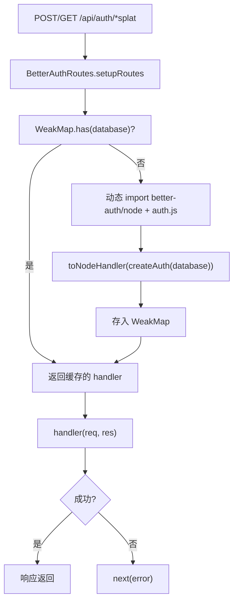

# BetterAuthRoutes.ts 需求说明

> 源文件：src/server/auth/BetterAuthRoutes.ts ｜ 类型：源码 ｜ 行数：40 ｜ 所属模块：server/auth ｜ 分析日期：2026-07-23

## 1. 文件定位总述

BetterAuthRoutes.ts 是将 Better Auth 框架的请求处理器桥接到 Express 应用的路由适配器。它实现了 `RouteHandler` 接口，将所有 `/api/auth/*` 路径的请求委托给 Better Auth 的 Node.js handler。该文件采用懒加载和 WeakMap 缓存策略，避免重复创建 handler 实例，同时在数据库连接变化时正确失效缓存。

## 2. 功能需求

| 编号 | 需求描述（系统应当…） | 触发条件 / 输入 | 处理规则与输出 | 证据 |
|------|----------------------|----------------|---------------|------|
| FR-BAUTHR-01 | 系统应当将所有 `/api/auth/*splat` 路径的请求委托给 Better Auth 的 Node.js handler 处理 | 任意 HTTP 方法请求 `/api/auth/` 下的路径 | 通过 `toNodeHandler(createAuth(database))` 处理请求并返回响应 | `BetterAuthRoutes.ts:30-37` |
| FR-BAUTHR-02 | 系统应当为每个 Database 实例缓存 Better Auth handler，避免重复创建 | handler 请求时 | 使用 WeakMap 以 Database 对象为键缓存 handler，相同 Database 直接返回缓存 | `BetterAuthRoutes.ts:11-24` |
| FR-BAUTHR-03 | 系统应当在 Better Auth handler 处理请求失败时将错误传递给 Express 的 next 中间件 | handler 抛出异常时 | catch 块调用 `next(error)` 进入 Express 错误处理链 | `BetterAuthRoutes.ts:35` |

## 3. 业务规则与约束

1. **WeakMap 缓存策略**：以 Database 实例为 key，Database 被 GC 时缓存自动释放（`BetterAuthRoutes.ts:9`）
2. **懒加载**：`toNodeHandler` 和 `createAuth` 通过动态 `import()` 按需加载，减少启动时依赖（`BetterAuthRoutes.ts:17-19`）
3. **splat 路由**：使用 Express 的 `*splat` 通配符捕获所有子路径（`BetterAuthRoutes.ts:30`）

## 4. 对外暴露

| 导出项 | 类型 | 说明 |
|--------|------|------|
| `BetterAuthRoutes` | class | 实现 RouteHandler 接口，构造函数接受 `getDatabase: () => Database` |

## 5. 依赖关系

- **上游**：`better-auth/node`（toNodeHandler）、`./auth.js`（createAuth）、`../../services/server/Server.js`（RouteHandler 接口）
- **下游**：被 Server 主路由注册消费，将 Better Auth 端点挂载到 Express 应用

## 6. 数据结构

不适用。

## 7. 复杂逻辑图示

## 8. 逆向备注

无特殊备注。
