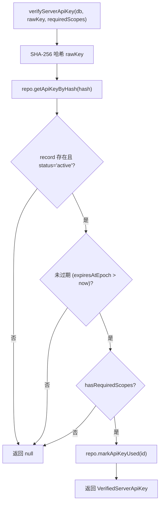

# api-key-service.ts 需求说明

> 源文件：src/server/auth/api-key-service.ts ｜ 类型：源码 ｜ 行数：132 ｜ 所属模块：server/auth ｜ 分析日期：2026-07-23

## 1. 文件定位总述

api-key-service.ts 是基于 bun:sqlite 的 API Key 全生命周期管理服务，提供密钥创建、验证、列出和吊销四个核心能力。它使用 SHA-256 哈希存储密钥（仅存储哈希值和前缀），支持团队/项目级 scope 绑定、过期时间、元数据和 sync user_label 绑定。每次验证通过后会标记密钥为已使用状态，创建和吊销操作均产生审计日志。

## 2. 功能需求

| 编号 | 需求描述（系统应当…） | 触发条件 / 输入 | 处理规则与输出 | 证据 |
|------|----------------------|----------------|---------------|------|
| FR-AKSV-01 | 系统应当能创建新的 API Key，生成 `cmem_` 前缀的原始密钥，SHA-256 哈希后存储 | 调用 `createServerApiKey(db, input)` | 生成 32 字节 base64url 编码的密钥，存储哈希值、前 10 字符前缀、scope、过期时间等，返回 rawKey 和 record | `api-key-service.ts:40-75` |
| FR-AKSV-02 | 系统应当能验证 API Key，校验哈希匹配、状态活跃、未过期、scope 充分 | 调用 `verifyServerApiKey(db, rawKey, requiredScopes)` | 对 rawKey 做 SHA-256 哈希后查库，校验 status='active'、expiresAtEpoch > now、scope 覆盖 requiredScopes，通过后标记已使用 | `api-key-service.ts:77-102` |
| FR-AKSV-03 | 系统应当能列出所有 API Key | 调用 `listServerApiKeys(db)` | 返回 ApiKey[] 数组 | `api-key-service.ts:104-107` |
| FR-AKSV-04 | 系统应当能吊销 API Key 并记录审计日志 | 调用 `revokeServerApiKey(db, id)` | 调用 repo.revokeApiKey(id) 后创建 'api_key.revoke' 审计日志，返回被吊销的 record 或 null | `api-key-service.ts:109-124` |
| FR-AKSV-05 | 系统应当支持将 API Key 绑定到 sync user_label | 创建 API Key 时传入 boundUserLabel | 调用 normalizeUserLabel 规范化后写入 api_keys.bound_user_label 列 | `api-key-service.ts:58-63` |
| FR-AKSV-06 | 系统应当在创建和吊销 API Key 时自动生成审计日志 | createServerApiKey / revokeServerApiKey 执行时 | 调用 repo.createAuditLog 记录 action='api_key.create' 或 'api_key.revoke' | `api-key-service.ts:65-73,114-122` |

## 3. 业务规则与约束

1. **密钥格式**：`cmem_` 前缀 + 32 字节 base64url 编码（共 37 字符含前缀）（`api-key-service.ts:37`）
2. **哈希算法**：SHA-256，64 字符十六进制（`api-key-service.ts:32-34`）
3. **前缀存储**：存储原始密钥前 10 字符用于快速识别（`api-key-service.ts:49`）
4. **过期校验**：`expiresAtEpoch` 不为 null 且 <= Date.now() 时视为过期（`api-key-service.ts:88`）
5. **scope 通配符**：grantedScopes 包含 `'*'` 时满足所有 scope 要求；requiredScopes 为空时也视为通过（`api-key-service.ts:127-129`）
6. **user_label 规范化**：通过 `normalizeUserLabel` 转为大写存储，确保与 ApiKeyAuth 的不区分大小写比较一致（`api-key-service.ts:57`）
7. **验证副作用**：每次 verify 成功后调用 `markApiKeyUsed(record.id)` 记录使用（`api-key-service.ts:95`）

## 4. 对外暴露

| 导出项 | 类型 | 说明 |
|--------|------|------|
| `CreatedServerApiKey` | interface | 创建结果（rawKey + record） |
| `VerifiedServerApiKey` | interface | 验证结果（record + teamId + projectId + scopes） |
| `CreateServerApiKeyInput` | interface | 创建输入（name, teamId?, projectId?, scopes?, expiresAtEpoch?, metadata?, boundUserLabel?） |
| `hashServerApiKey` | function | SHA-256 哈希原始密钥 |
| `createRawServerApiKey` | function | 生成原始密钥字符串 |
| `createServerApiKey` | function | 创建 API Key |
| `verifyServerApiKey` | function | 验证 API Key |
| `listServerApiKeys` | function | 列出所有 API Key |
| `revokeServerApiKey` | function | 吊销 API Key |

## 5. 依赖关系

- **上游**：`crypto`（createHash, randomBytes）、`bun:sqlite`（Database）、`../../storage/sqlite/index.js`（AuthRepository, ensureServerStorageSchema）、`../../shared/user-label.js`（normalizeUserLabel）、`../../core/schemas/auth.js`（ApiKey 类型）
- **下游**：被 `requireServerAuth` 中间件调用进行 API Key 验证

## 6. 数据结构

```typescript
interface CreateServerApiKeyInput {
  name: string;
  teamId?: string | null;
  projectId?: string | null;
  scopes?: string[];
  expiresAtEpoch?: number | null;
  metadata?: Record<string, unknown>;
  boundUserLabel?: string | null;
}
```

## 7. 复杂逻辑图示



## 8. 逆向备注

注释中"T-29"标记表明 boundUserLabel 功能是在 T-29 任务中引入的同步用户标签绑定能力（`api-key-service.ts:28,55`）。
