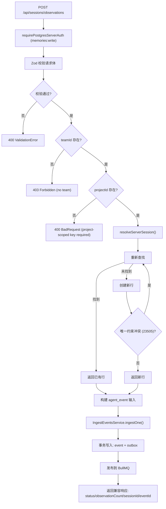

# SessionsObservationsAdapter.ts 需求说明

> 源文件：src/server/compat/SessionsObservationsAdapter.ts ｜ 类型：源码 ｜ 行数：213 ｜ 所属模块：compat ｜ 分析日期：2026-07-23

## 1. 文件定位总述

SessionsObservationsAdapter 是旧版 worker 载荷到 server-beta 事件模型的兼容翻译层，将遗留的 `POST /api/sessions/observations` 端点接收的 tool-use 格式数据转换为 server-beta 的 `agent_event` + `observation_generation_job` 模型，并委托 `IngestEventsService` 完成后续的事务写入和队列投递。它是旧客户端平滑迁移到新 API 的桥梁，绝不直接操作队列或写入 worker 层类型。

## 2. 功能需求

| 编号 | 需求描述（系统应当…） | 触发条件 / 输入 | 处理规则与输出 | 证据 |
|------|----------------------|----------------|---------------|------|
| FR-compat-01 | 系统应当注册 `POST /api/sessions/observations` 路由，要求 `memories:write` 权限 | HTTP POST 请求到达 `/api/sessions/observations` | 通过 `requirePostgresServerAuth` 中间件验证 API Key 权限 | `SessionsObservationsAdapter.ts:57-63` |
| FR-compat-02 | 系统应当对遗留载荷进行 Zod 校验，校验失败返回 400 | 请求 body 不符合 `observationsSchema` | 返回 `{ error: 'ValidationError', issues: [...] }`，HTTP 400 | `SessionsObservationsAdapter.ts:64-68` |
| FR-compat-03 | 系统应当验证 API Key 必须绑定团队，否则返回 403 | `req.authContext.teamId` 为空 | 返回 `{ error: 'Forbidden', message: 'API key is not bound to a team' }`，HTTP 403 | `SessionsObservationsAdapter.ts:71-74` |
| FR-compat-04 | 系统应当验证 API Key 必须是项目级别的（project-scoped），否则返回 400 | `req.authContext.projectId` 为空 | 返回 `{ error: 'BadRequest', message: '...requires a project-scoped API key' }`，HTTP 400；因遗留载荷不含 projectId，无作用域则无法定位租户 | `SessionsObservationsAdapter.ts:76-84` |
| FR-compat-05 | 系统应当将 `contentSessionId` 映射为 server_session 的 `external_session_id`，实现会话的幂等创建或查找 | 请求包含有效的 contentSessionId | 调用 `resolveServerSession()` 按 (project, team, externalSessionId) 查找或创建 `server_sessions` 行；并发竞态通过捕获 `23505` 唯一约束违反后重新查询解决 | `SessionsObservationsAdapter.ts:87-95` |
| FR-compat-06 | 系统应当将遗留 tool-use 载荷转换为 agent_event 格式并委托 IngestEventsService 写入 | 校验通过且认证通过 | 构建 `CreatePostgresAgentEventInput`：sourceAdapter='claude-code-compat'、eventType='tool_use'、payload 保留原始字段（tool_name/tool_input/tool_response/toolUseId/cwd 等）；metadata 标记 compat 来源 | `SessionsObservationsAdapter.ts:101-121` |
| FR-compat-07 | 系统应当通过 IngestEventsService 完成事件写入和队列投递 | 构建 agent_event 输入后 | 调用 `ingestEvents.ingestOne(input, opts)`，source 标记为 `http_post_api_sessions_observations` | `SessionsObservationsAdapter.ts:123-128` |
| FR-compat-08 | 系统应当返回遗留兼容的响应格式 | 处理成功 | 返回 `{ status: 'queued', observationCount: 1, sessionId, serverSessionId, eventId, generationJobId, transport }` | `SessionsObservationsAdapter.ts:130-138` |
| FR-compat-09 | 系统应当处理兼容 `tool_use_id` 和 `toolUseId` 两种字段名 | 请求 body 中任一字段有值 | 优先取 `tool_use_id`（下划线形式），其次取 `toolUseId`（驼峰形式）作为 sourceEventId | `SessionsObservationsAdapter.ts:97-99` |
| FR-compat-10 | 系统应当在会话查找/创建过程中处理并发竞态 | 多个并发请求同时为同一 (project, externalSessionId) 创建会话 | 捕获 Postgres `23505` 唯一约束违反错误码，重新查询并返回已有行；若重新查询也失败则向上抛出原始错误 | `SessionsObservationsAdapter.ts:196-211` |

## 3. 业务规则与约束

- **兼容适配器定位**：适配器绝不触碰 worker 代码、不直接排队 observations、不使用 `src/services/worker/*` 类型。`SessionsObservationsAdapter.ts:7-8`
- **项目作用域强制**：兼容模式要求 API Key 必须是项目级别的，因为遗留载荷不携带 server-beta 的 projectId。`SessionsObservationsAdapter.ts:77-78`
- **sourceAdapter 标识**：所有经此适配器的事件均标记为 `claude-code-compat`，与直接 API 写入（标记为 `api`）区分。`SessionsObservationsAdapter.ts:30`
- **遗留响应格式**：`observationCount` 硬编码为 1（每次请求仅处理一个 tool-use 事件），`status` 固定为 `queued`。推断：旧客户端仅检查 status 字段。`SessionsObservationsAdapter.ts:130-131`
- **跨项目兼容禁止**：兼容流量不得绕过项目作用域，无项目作用域的请求直接返回 400。`SessionsObservationsAdapter.ts:17-18`

## 4. 对外暴露

| 导出项 | 类型 | 说明 |
|--------|------|------|
| `SessionsObservationsAdapter` | 类 | 实现 `RouteHandler` 接口 |
| `SessionsObservationsAdapterOptions` | 接口 | 构造选项：pool、ingestEvents、authMode、allowLocalDevBypass |
| `resolveServerSession(input)` | 函数（导出） | 按外部会话 ID 幂等查找或创建 server_session |
| `COMPAT_SOURCE_ADAPTER` | 常量（导出） | 固定值 `'claude-code-compat'` |

## 5. 依赖关系

- **上游**：`IngestEventsService`（核心事件摄入）、`PostgresServerSessionsRepository`（会话管理）、`requirePostgresServerAuth`（认证中间件）、Zod（校验）
- **下游**：被 Express 应用通过 `RouteHandler.setupRoutes(app)` 注册路由
- **类型依赖**：`RouteHandler`、`CreatePostgresAgentEventInput`、`PostgresPool`

## 6. 数据结构

### observationsSchema（Zod 校验）
```typescript
const observationsSchema = z.object({
  contentSessionId: z.string().min(1),   // 必需
  tool_name: z.string().min(1),            // 必需
  tool_input: z.unknown().optional(),
  tool_response: z.unknown().optional(),
  cwd: z.string().optional(),
  agentId: z.string().optional(),
  agentType: z.string().optional(),
  platformSource: z.string().optional(),
  tool_use_id: z.string().optional(),      // 下划线形式
  toolUseId: z.string().optional(),        // 驼峰形式
}).passthrough();
```

## 7. 复杂逻辑图示



上图展示了遗留请求从认证、校验、会话解析到事件写入的完整处理流程。会话解析的幂等创建通过唯一约束冲突捕获实现并发安全。

## 8. 逆向备注

- `resolveServerSession` 注释中提到 `(project_id, idempotency_key)` 被 `ON CONFLICT` 覆盖，但 `(project_id, external_session_id)` 唯一约束"NOT covered"。推断：`idempotency_key` 约束可能在其他路径（如直接 API）使用，兼容路径依赖 `external_session_id` 约束并通过 catch 处理竞态。`SessionsObservationsAdapter.ts:162-165`
- Zod schema 使用 `.passthrough()` 允许额外字段通过，推断：旧客户端可能发送未知字段，适配器不应拒绝。
- `actorId` 在 `ingestOne` 调用时硬编码为 `null`，推断：兼容路径无法从遗留载荷中提取 actor 信息。
