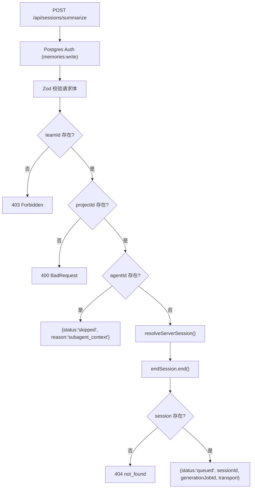

# SessionsSummarizeAdapter.ts 需求说明

> 源文件：src/server/compat/SessionsSummarizeAdapter.ts ｜ 类型：源码 ｜ 行数：128 ｜ 所属模块：server/compat ｜ 分析日期：2026-07-23

## 1. 文件定位总述

SessionsSummarizeAdapter.ts 是遗留兼容层，将旧版 `/api/sessions/summarize` 端点翻译为对 `EndSessionService` 的调用。新客户端应直接使用 `POST /v1/sessions/:id/end`。该适配器接收 contentSessionId 和可选的 last_assistant_message，解析为 server_session 后结束会话并排队摘要任务。它处理 subagent 上下文的跳过语义、API Key 的 team/project scope 校验和请求体 Zod 校验。

## 2. 功能需求

| 编号 | 需求描述（系统应当…） | 触发条件 / 输入 | 处理规则与输出 | 证据 |
|------|----------------------|----------------|---------------|------|
| FR-COMPAT-01 | 系统应当提供 `/api/sessions/summarize` POST 端点，翻译为 EndSessionService 调用 | POST 请求到达该端点 | 通过 Postgres 认证中间件，Zod 校验请求体，解析 server_session 后调用 endSession | `SessionsSummarizeAdapter.ts:49-115` |
| FR-COMPAT-02 | 系统应当使用 `memories:write` scope 的 Postgres 认证中间件保护该端点 | 每个请求到达时 | `requirePostgresServerAuth(pool, {requiredScopes:['memories:write']})` | `SessionsSummarizeAdapter.ts:43-47` |
| FR-COMPAT-03 | 系统应当使用 Zod 校验请求体，要求 contentSessionId 必填 | 请求到达路由处理器时 | `summarizeSchema.safeParse(req.body)` 校验，失败返回 400 + issues | `SessionsSummarizeAdapter.ts:51-54` |
| FR-COMPAT-04 | 系统应当要求 API Key 绑定到 team（teamId 不为 null） | 校验 req.authContext.teamId | teamId 为 null 时返回 403 "API key is not bound to a team" | `SessionsSummarizeAdapter.ts:57-60` |
| FR-COMPAT-05 | 系统应当要求 API Key 绑定到 project（projectId 不为 null） | 校验 req.authContext.projectId | projectId 为 null 时返回 400 "requires a project-scoped API key" | `SessionsSummarizeAdapter.ts:62-67` |
| FR-COMPAT-06 | 系统应当在请求体包含 agentId 时返回 skipped 状态（subagent 上下文） | parsed.data.agentId 存在时 | 返回 `{status:'skipped', reason:'subagent_context'}` | `SessionsSummarizeAdapter.ts:72-75` |
| FR-COMPAT-07 | 系统应当在 session 未找到时返回 404 | resolveServerSession 返回 null 时 | 返回 `{status:'not_found', reason:'session_not_found'}`（推断：由 endSession 的 null 结果判断） | `SessionsSummarizeAdapter.ts:97-100` |
| FR-COMPAT-08 | 系统应当在成功时返回 queued 状态，包含 sessionId、generationJobId 和 transport 信息 | endSession 成功时 | 返回 `{status:'queued', sessionId, serverSessionId, generationJobId, transport}` | `SessionsSummarizeAdapter.ts:101-107` |

## 3. 业务规则与约束

1. **幂等性**：重复摘要同一 session 因 UNIQUE 约束 `(team_id, project_id, source_type='session_summary', source_id)` 折叠为同一 outbox 行（`SessionsSummarizeAdapter.ts:11-13`）
2. **subagent 跳过语义**：遗留代码中 subagent 上下文的摘要调用被跳过，保留此行为以兼容旧客户端（`SessionsSummarizeAdapter.ts:70-75`）
3. **异步错误处理**：`asyncHandler` 将异步错误传递给 Express 的 next 中间件（`SessionsSummarizeAdapter.ts:118-122`）
4. **Passthrough schema**：`.passthrough()` 允许请求体携带额外字段而不报错（`SessionsSummarizeAdapter.ts:30`）
5. **sourceAdapter 标记**：标记为 `'claude-code-compat'` 用于路由和审计（`SessionsSummarizeAdapter.ts:96`）

## 4. 对外暴露

| 导出项 | 类型 | 说明 |
|--------|------|------|
| `SessionsSummarizeAdapterOptions` | interface | 构造选项（pool, endSession, authMode?, allowLocalDevBypass?） |
| `SessionsSummarizeAdapter` | class | 实现 RouteHandler 接口的兼容适配器 |

## 5. 依赖关系

- **上游**：`zod`（请求体校验）、`../middleware/postgres-auth.js`（认证）、`../services/EndSessionService.js`（会话结束）、`./SessionsObservationsAdapter.js`（resolveServerSession）、`../../storage/postgres/server-sessions.js`、`../../storage/postgres/pool.js`
- **下游**：被 Server 主路由注册消费

## 6. 数据结构

```typescript
const summarizeSchema = z.object({
  contentSessionId: z.string().min(1),
  last_assistant_message: z.string().optional(),
  agentId: z.string().optional(),
  platformSource: z.string().optional(),
}).passthrough();
```

## 7. 复杂逻辑图示



## 8. 逆向备注

1. 文件末尾的 `void PostgresServerSessionsRepository` 是 tree-shaking 防护，确保该符号在打包时可达（`SessionsSummarizeAdapter.ts:127`）
2. 注释明确说明新客户端应使用 `POST /v1/sessions/:id/end`（`SessionsSummarizeAdapter.ts:3-4`）
