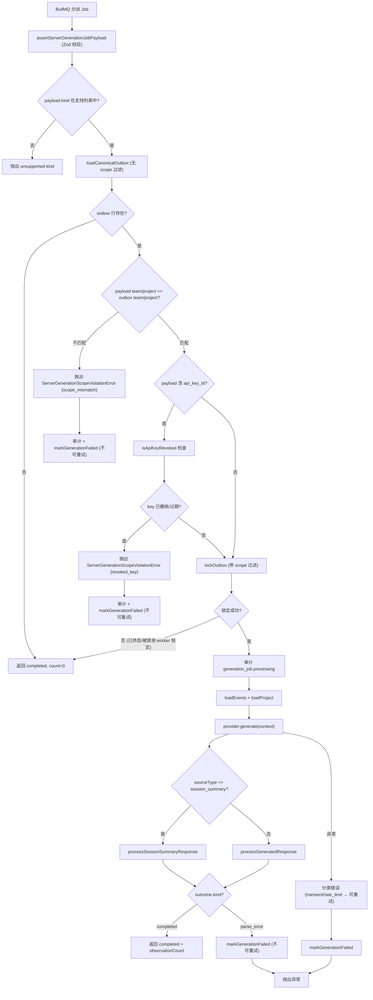
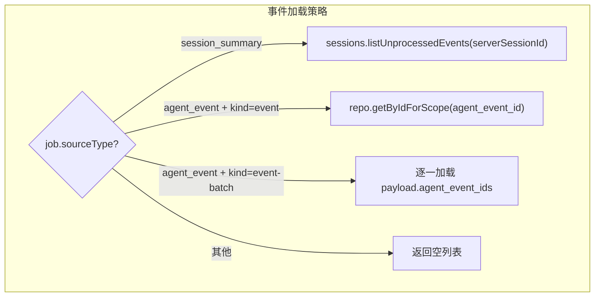

# ProviderObservationGenerator.ts 需求说明

> 源文件：src/server/generation/ProviderObservationGenerator.ts ｜ 类型：源码 ｜ 行数：539 ｜ 所属模块：server/generation ｜ 分析日期：2026-07-23

## 1. 文件定位总述

ProviderObservationGenerator 是 Server Beta 架构中 BullMQ Worker 的处理器类，负责消费队列中的 generation job 并驱动端到端的观察生成流程。它是整个 server-beta 生成管线的编排者：对每个 job 执行载荷验证 → outbox 行重载与作用域校验 → API Key 撤销检查 → 状态锁定 → 加载关联事件和项目信息 → 调用 AI Provider 生成内容 → 将原始文本交给 `processGeneratedResponse` 持久化。该类包含多层安全防线（payload 校验、scope mismatch 检测、key 撤销检测、duplicate worker 检测），并将所有安全事件记录到审计日志。该类明确不依赖 worker-service 的 SessionStore/ActiveSession/WorkerRef，实现了 server-beta 与本地 worker 的完全解耦。

## 2. 功能需求

| 编号 | 需求描述（系统应当…） | 触发条件 / 输入 | 处理规则与输出 | 证据 |
|------|----------------------|----------------|---------------|------|
| FR-PROC-01 | 系统应当作为 BullMQ Worker 的处理器执行 observation generation 的完整编排流程 | BullMQ 分派 job（类型为 `Job<ServerGenerationJobPayload>`） | 返回 `{ jobId, status: 'completed', observationCount }` 的 JSON 摘要。Postgres 行为权威。 | `src/server/generation/ProviderObservationGenerator.ts:69-71` |
| FR-VAL-01 | 系统应当在执行任何副作用之前，先对 BullMQ payload 执行 Zod schema 校验，拒绝不合法的载荷 | job 被分派到 worker | 调用 `assertServerGenerationJobPayload(job.data)` 校验，失败时记录错误日志并抛出 `ServerGenerationJobPayloadValidationError`。 | `src/server/generation/ProviderObservationGenerator.ts:84-94` |
| FR-KND-01 | 系统应当仅接受 event、event-batch、summary 三种 job kind，拒绝其他类型 | payload 校验通过后 | 检查 `payload.kind`，若不在三者之中则抛出 Error。 | `src/server/generation/ProviderObservationGenerator.ts:96-102` |
| FR-SCP-01 | 系统应当通过重载 Postgres outbox 行并与 payload 中的 team_id/project_id 对比来检测作用域篡改 | 载荷校验通过后 | 先不带 scope 过滤加载 outbox 行（`loadCanonicalOutbox`），比较其 teamId/projectId 与 payload 是否一致。不一致则抛出 `ServerGenerationScopeViolationError(reason: 'scope_mismatch')`，审计并标记 job 为失败（不可重试）。 | `src/server/generation/ProviderObservationGenerator.ts:109-133` |
| FR-REV-01 | 系统应当在执行前检查发起 job 的 API key 是否已被撤销或过期，若是则拒绝执行 | payload 含 api_key_id | 查询 `api_keys` 表的 `revoked_at` 和 `expires_at` 字段。若 key 已删除（行不存在）、已撤销（revoked_at 非空）或已过期（expires_at <= now），则拒绝执行并标记 job 为失败（不可重试）。 | `src/server/generation/ProviderObservationGenerator.ts:138-156` |
| FR-KEY-01 | 系统应当判定 API key 的撤销状态：已删除视为已撤销，revoked_at 非空视为已撤销，expires_at 已过视为已撤销 | `isApiKeyRevoked(apiKeyId)` 内部逻辑 | 依次检查行存在性、revoked_at 字段、expires_at 过期时间。 | `src/server/generation/ProviderObservationGenerator.ts:338-351` |
| FR-LCK-01 | 系统应当将 outbox job 从 queued 状态锁定为 processing 状态，并拒绝已被其他 worker 锁定的 job 的重复执行 | 载荷校验和作用域检查通过后 | 通过 `lockOutbox` 在 scope 内重新加载 job 并尝试 transitionStatus(processing)。若 job 已是 processing 状态（另一 worker 持有锁），直接返回 null 跳过执行，防止重复调用付费 Provider API。 | `src/server/generation/ProviderObservationGenerator.ts:158-165, 443-481` |
| FR-LDC-01 | 系统应当根据 job kind 和 sourceType 加载关联的 agent_events 数据 | job 锁定成功后 | event 类型：加载单个 agent_event。event-batch 类型：逐一加载多个 agent_event。session_summary 类型：加载该 server_session 下所有未处理的 agent_events。其他类型返回空。所有加载都带 scope 过滤（projectId + teamId）。 | `src/server/generation/ProviderObservationGenerator.ts:483-532` |
| FR-LPR-01 | 系统应当加载 job 所属的项目信息 | job 锁定成功后 | 通过 `PostgresProjectsRepository.getByIdForTeam` 加载项目名称等元数据。 | `src/server/generation/ProviderObservationGenerator.ts:534-537` |
| FR-GEN-01 | 系统应当调用 AI Provider 执行生成，将重载的 job、事件和项目信息传入 Provider | 数据加载完毕后 | 调用 `provider.generate(context)` 获取包含 rawText、providerLabel、modelId 的结果。 | `src/server/generation/ProviderObservationGenerator.ts:200-209` |
| FR-ROT-01 | 系统应当根据 job 的 sourceType 路由到不同的响应处理函数 | Provider 返回结果后 | 若 sourceType 为 session_summary 则调用 `processSessionSummaryResponse`，否则调用 `processGeneratedResponse`。 | `src/server/generation/ProviderObservationGenerator.ts:225-227` |
| FR-PER-01 | 系统应当在处理开始时写入审计日志（action='generation_job.processing'），携带 correlationId、requestId 等关联信息 | job 锁定成功后 | 调用 `auditEvent` 记录处理开始事件，便于即使 Provider 崩溃也能追溯到处理已启动。 | `src/server/generation/ProviderObservationGenerator.ts:179-194` |
| FR-ERR-01 | 系统应当在 Provider 错误时根据错误分类决定是否重试：transient 和 rate_limit 类型可重试，其他类型不可重试 | Provider.generate 抛出异常 | 捕获异常，检查是否为 `ServerClassifiedProviderError`，根据 kind 判断 retryable，调用 `markGenerationFailed` 标记 job 状态后重新抛出异常。parse_error 类型的失败也不可重试。 | `src/server/generation/ProviderObservationGenerator.ts:229-269` |
| FR-AUD-01 | 系统应当将作用域违规和 key 撤销事件记录到审计日志，分别使用 action='generation_job.scope_violation' 和 'generation_job.revoked_key' | 检测到安全违规时 | 调用 `auditScopeViolation` 和 `auditRevokedKey`，携带 payload 与 canonical 行的 team/project 对比详情。 | `src/server/generation/ProviderObservationGenerator.ts:353-412` |
| FR-IDL-01 | 系统应当在 job 行不存在（已被删除或处理）时直接返回 completed 状态，observationCount 为 0 | 加载 canonical outbox 返回 null 或 lockOutbox 返回 null | 幂等处理：不做任何副作用，返回 `{ jobId, status: 'completed', observationCount: 0 }`。 | `src/server/generation/ProviderObservationGenerator.ts:110-116, 159-165` |

## 3. 业务规则与约束

| 编号 | 规则描述 | 证据 |
|------|---------|------|
| BR-01 | **payload 不信任原则**：BullMQ payload 中的 team_id 和 project_id 仅为参考值，权威数据来自 Postgres outbox 行的重新加载。两者的对比是篡改检测器而非鉴权网关。 | `src/server/generation/ProviderObservationGenerator.ts:104-108, 272-275` |
| BR-02 | **安全违规不重试**：scope_mismatch 和 revoked_key 错误被标记为 `retryable: false`，推断认为篡改或撤销的 job 不应被反复尝试。 | `src/server/generation/ProviderObservationGenerator.ts:128-131, 148-153` |
| BR-03 | **duplicate worker 防护**：当 job 已处于 processing 状态时（另一 worker 正在处理），当前 worker 直接跳过而非等待或竞争。注释说明若第一个 worker 真正死亡，reconcileOnStartup 和 BullMQ retry 会恢复该 job。 | `src/server/generation/ProviderObservationGenerator.ts:456-464` |
| BR-04 | **不依赖 worker-service**：代码注释明确声明 no imports from src/services/worker/*，不使用 WorkerRef / ActiveSession / SessionStore。 | `src/server/generation/ProviderObservationGenerator.ts:51-53` |
| BR-05 | **correlationId 与 requestId 贯穿**：每个 job 处理开始时从 BullMQ job.id 构造 correlationId（`bullmq:{jobId}`），从 payload 提取 requestId（HTTP middleware 传入），贯穿所有日志和审计记录。 | `src/server/generation/ProviderObservationGenerator.ts:72-76` |
| BR-06 | **审计日志容错**：`auditEvent` 方法内使用 try-catch，审计失败仅记 warning 不阻塞主流程。 | `src/server/generation/ProviderObservationGenerator.ts:423-441` |
| BR-07 | **lockOutbox 作用域过滤**：锁定操作带 projectId + teamId 过滤，与无过滤的 loadCanonicalOutbox 形成互补——前者确保授权范围内操作，后者用于安全对比。 | `src/server/generation/ProviderObservationGenerator.ts:443-449` |
| BR-08 | **loadCanonicalOutbox 直接查询 SQL**：该私有方法绕过 Repository 直接执行 `SELECT * FROM observation_generation_jobs WHERE id = $1`，不带任何 scope 过滤。推断原因：需要获取完整行用于安全对比，且在 scope 校验通过前不应依赖 scope 限制。 | `src/server/generation/ProviderObservationGenerator.ts:276-336` |
| BR-09 | **identity context 传播**：api_key_id、actor_id、source_adapter 从 BullMQ payload 一路传播到持久化层和审计日志，实现端到端可追溯。 | `src/server/generation/ProviderObservationGenerator.ts:217-224` |

## 4. 对外暴露

| 类型 | 名称 | 说明 |
|------|------|------|
| 类 | `ProviderObservationGenerator` | BullMQ Worker 处理器，核心公开方法为 `process(job)` |
| 类 | `ServerGenerationScopeViolationError` | 安全违规异常类，携带 reason 字段（'scope_mismatch' 或 'revoked_key'） |
| 接口 | `ProviderObservationGeneratorOptions` | 构造选项：pool（PostgresPool）、provider（ServerGenerationProvider）、workerId（可选） |

## 5. 依赖关系

| 方向 | 依赖项 | 说明 |
|------|--------|------|
| 上游（调用方） | BullMQ Worker 框架 | 通过 Worker 配置将 `process` 方法注册为 job 处理器 |
| 内部 | `processGeneratedResponse.ts` | 调用 processGeneratedResponse 和 processSessionSummaryResponse |
| 内部 | `providers/shared/types.ts` | ServerGenerationProvider 接口 |
| 内部 | `providers/shared/error-classification.ts` | ServerClassifiedProviderError 异常类 |
| 内部 | `jobs/types.ts` | assertServerGenerationJobPayload、ServerGenerationJobPayload 等类型 |
| 内部 | `storage/postgres/generation-jobs.ts` | PostgresObservationGenerationJobRepository |
| 内部 | `storage/postgres/agent-events.ts` | PostgresAgentEventsRepository |
| 内部 | `storage/postgres/server-sessions.ts` | PostgresServerSessionsRepository（加载未处理事件） |
| 内部 | `storage/postgres/projects.ts` | PostgresProjectsRepository |
| 内部 | `storage/postgres/auth.ts` | PostgresAuthRepository（审计日志） |
| 内部 | `storage/postgres/pool.ts` | PostgresPool |
| 外部库 | `bullmq` | Job 类型 |

## 6. 数据结构

### ServerGenerationScopeViolationError

| 字段 | 类型 | 说明 |
|------|------|------|
| reason | 'scope_mismatch' \| 'revoked_key' | 违规原因分类 |
| message | string (inherited) | 详细错误信息 |

### process 方法的返回值

| 字段 | 类型 | 说明 |
|------|------|------|
| jobId | string | generation job ID |
| status | 'completed' | 始终为 completed（异常情况通过 throw 传播） |
| observationCount | number | 成功持久化的 observation 数量 |

## 7. 复杂逻辑图示

上图展示了 ProviderObservationGenerator.process 方法的完整执行路径，包含三层安全防线（payload 校验、scope 检测、key 撤销检测）和端到端的生成管线。

上图展示了根据 job 类型动态选择事件加载策略的逻辑。

## 8. 逆向备注

1. `loadCanonicalOutbox` 方法（第 276-336 行）手写了完整的 SQL 查询和行到对象的映射，而非复用 Repository 的 `getByIdForScope`。推断原因如上所述——需要在 scope 校验前获取完整行数据，且绕过 scope 限制以进行安全对比。
2. 该文件定义了独立的 `ServerGenerationScopeViolationError` 异常类（第 30-36 行），而非复用通用的 Error，推断是为了让 BullMQ Worker 层能精确区分安全违规和普通处理错误。
3. `isApiKeyRevoked` 方法（第 338-351 行）直接查询 `api_keys` 表而非使用 Repository，推断是因为该查询极其简单且仅用于布尔判断，不值得抽象为 Repository 方法。
4. 当 `lockOutbox` 发现 job 已处于 processing 状态时，选择跳过而非等待。注释明确说明了原因（避免重复调用付费 API），并指出恢复机制依赖 `reconcileOnStartup` 和 BullMQ retry，体现了"宁可跳过也不重复"的设计哲学。
